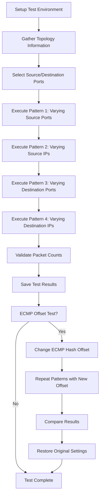

# Test Plan for  ECMP balance test

## Overview

This test plan validates ECMP (Equal-Cost Multi-Path) load balancing functionality in SONiC network devices by verifying packet distribution across multiple equal-cost paths using different traffic patterns and hash tuple variations.

## Test Objectives

- Verify ECMP load balancing distributes traffic evenly across available paths
- Validate hash tuple calculations using different packet field variations
- Confirm ECMP hash offset changes impact packet distribution
- Ensure packet forwarding accuracy

## Test Scope

### Current Scope

- UDP packet forwarding with ECMP load balancing
- IPv4 and IPv6 traffic patterns
- Hash tuple variations (source IP, destination IP, source port, destination port)
- ECMP hash offset configuration changes impact packet distribution
- Packet distribution analysis across upstream interfaces

### Future Scope

- TCP traffic patterns
- IPinIP encapsulated packets
- VxLAN encapsulated packets
- Support for Non-Broadcom ASIC platforms
- All topology types (T0, T1, T2, M0, MX)


## Test Cases

### Test Case 1: Basic UDP Packet ECMP Load Balancing

**Test Function:** `test_udp_packets`

**Objective:** Verify basic ECMP functionality with different traffic patterns. Also save the test results to output file as the original sample file which will be compared with the output file in Test Case 2.

**Test Steps:**

1. Initialize test environment and gather topology information
2. Clear port statistics
3. Execute four traffic patterns:
   - **Pattern 1:** Vary source ports (100-139) with fixed other parameters
   - **Pattern 2:** Vary source IPs (20.0.0.2 to 20.0.0.41 for IPv4) with fixed other parameters
   - **Pattern 3:** Vary destination ports (80-119) with fixed other parameters
   - **Pattern 4:** Vary destination IPs (194.50.16.2 to 194.50.16.41 for IPv4) with fixed other parameters
4. Send 100 packets per variation (80 variations per pattern)
5. Verify packet forwarding and count matches
6. Record output interface for each traffic pattern
7. Save test results to JSON file

**Expected Results:**

- All packets forwarded correctly (≥100 packets per test case)
- Traffic distributed across available ECMP paths
- Consistent interface selection for identical 5-tuples
- Test results saved successfully

**Pass Criteria:**

- Packet count variance ≤ 3 packets across similar patterns
- All sent packets received and properly routed
- At least one interface shows tx_ok ≥ 100 packets

### Test Case 2: ECMP Hash Offset Impact Verification

**Test Function:** `test_udp_packets_ecmp`

**Objective:** Verify ECMP hash offset changes affect packet distribution. In this case, will do comparison with the output file of Test Case 1 after changing ecmp offset, the distribution should be different with Test Case 1.

**Test Steps:**

1. Check hardware SKU compatibility
2. Record original ECMP hash offset value
3. Change ECMP hash offset
4. Execute same four traffic patterns as Test Case 1
5. Save results with ECMP offset suffix
6. Compare results with Test Case 1 (without offset)
7. Restore original ECMP hash offset value

**Expected Results:**

- Traffic distribution changes when hash offset is modified
- Different interface selection compared to Test Case 1
- All packets still forwarded correctly

**Pass Criteria:**

- Results differ from Test Case 1 (different interface mappings)
- No packet loss during hash offset changes
- Hash offset successfully restored after test

### Test Case 3: Cross-Version Hash Consistency Validation

**Test Function:** `test_cross_version_hash_consistency` (Future Implementation)

**Objective:** Verify ECMP hash algorithm consistency across different SONiC release versions by comparing hash test results between releases to ensure deterministic behavior.

**Test Steps:**

1. Execute Test Case 1 and 2 on current SONiC version
2. Save detailed hash results with version metadata
3. Compare current results with baseline results from previous release versions
4. Validate hash algorithm consistency across versions
5. Generate compatibility report for hash behavior changes

**Test Data Requirements:**

- Baseline hash results from previous SONiC releases
- Version-specific metadata (SONiC version, kernel version, ASIC driver version)
- Standardized test conditions (same hardware, same topology, same test parameters)

**Expected Results:**

- Hash distribution patterns remain consistent across versions
- Same 5-tuple combinations produce identical path selections
- No unexpected hash algorithm behavior changes
- Backward compatibility maintained for existing deployments

**Pass Criteria:**

- Hash results match baseline test
- No regression in load balancing effectiveness
- Documentation of any intentional hash algorithm changes

**Implementation Notes:**

- Requires standardized baseline data collection process
- May need version-specific test adaptations
- Results should be archived for future version comparisons

### Test Case 4: IPinIP Encapsulated Traffic ECMP Validation (Future Implementation)

**Test Function:** `test_ipinip_ecmp` (Future Implementation)

**Objective:** Verify ECMP load balancing functionality for IPinIP encapsulated packets, ensuring proper hash calculation on both outer and inner packet headers.

**Scope:**
- IPv4-in-IPv4 encapsulation
- IPv6-in-IPv6 encapsulation
- IPv4-in-IPv6 and IPv6-in-IPv4 mixed encapsulation
- Hash tuple variations on both outer and inner headers

**Key Validation Points:**
- Hash calculation considers both outer and inner packet fields
- Load balancing distribution remains effective with encapsulation

### Test Case 5: VxLAN Encapsulated Traffic ECMP Validation (Future Implementation)

**Test Function:** `test_vxlan_ecmp` (Future Implementation)

**Objective:** Verify ECMP load balancing functionality for VxLAN encapsulated packets, validating hash computation across VXLAN headers and inner Ethernet frames.

**Scope:**
- VxLAN header hash contribution (VNI, UDP source port)
- Inner Ethernet frame hash calculation
- VTEP-to-VTEP traffic distribution
- Multi-tenant traffic isolation and load balancing

**Key Validation Points:**
- VxLAN UDP source port entropy for load balancing
- Inner packet header contribution to hash calculation
- Consistent path selection for flows within same VNI

## Test Data and Parameters

### Traffic Parameters

- **Packet Count per Test:** 100 packets
- **Test Variations per Pattern:** 240 variations
- **Total Packets per Test Case:** 192,000 packets (4 patterns × 240 variations × 100 packets x 2 versions (ipv4/ipv6))
- **Protocol:** UDP (protocol 17)
- **Packet Size:** Standard UDP packet size
- **TTL/Hop Limit:** 64
- **Future Packet Types:** IPinIP encapsulated packets, VxLAN encapsulated packets

### Network Parameters

- **Default Source IPs:**
  - IPv4: 20.0.0.1
  - IPv6: 60c0:a800::5
- **Default Destination IPs:**
  - IPv4: 194.50.16.1
  - IPv6: 2064:100::11
- **Base Ports:**
  - Source Port: 100
  - Destination Port: 80


### Validation Criteria

1. **Packet Forwarding Accuracy**
   - All sent packets must be received
   - Correct packet format after routing
   - Proper TTL/hop limit decrement

2. **Load Balancing Distribution**
   - Traffic distributed across multiple interfaces
   - Consistent path selection for identical flows
   - Variance in packet counts ≤ 4 packets

3. **Hash Offset Impact**
   - Different distribution patterns with offset changes
   - No packet loss during configuration changes
   - Successful restoration of original settings


## Test Reporting

### Test Results Storage

- JSON files with detailed results per IP version
- Formatted results organized by interface
- Separate files for baseline and ECMP offset tests

### Key Metrics

- Packet transmission success rate
- Interface distribution patterns
- Hash offset impact measurement
- Test execution time


### Test Limitation

- **Hardware Compatibility:** Limited to specific Arista SKUs
- Current supported platforms:
  - Broadcom

- Current supported Arista hardware SKUs for case test_udp_packets_ecmp, updating ECMPHashSet0Offset doesn't change OFFSET_ECMP for 7050cx3, so exclude 7050CX3.
  - Arista-7060CX-32S-C32
  - Arista-7060CX-32S-D48C8
  - Arista-7060CX-32S-Q32
  - Arista-7260CX3-C64
  - Arista-7260CX3-D108C10
  - Arista-7260CX3-D108C8
- **Configuration Changes:** Different Asic has different way to update ECMP offset.
  - For Broadcom, default ECMP Hash Offset Original device value
  - Test ECMP Hash Offset: 0x1c
  - Fallback Hash Offset 0x1a
- **Timing Dependencies:** Packet polling timeouts may cause false failures


## Test Configuration Constants

```python
# Test Constants
PACKET_COUNT = 100
PACKET_COUNT_MAX_DIFF = 4
INCREMENT = 80

# IP Addresses
DEFAULT_SRC_IP = {"ipv4": "20.0.0.1", "ipv6": "60c0:a800::5"}
UPSTREAM_DST_IP = {"ipv4": "194.50.16.1", "ipv6": "2064:100::11"}

# Test Markers
pytestmark = [
    pytest.mark.asic("broadcom"),
    pytest.mark.topology("t0", "t1"),
]
```

## Test Execution Flow



## Test Matrix

| Test Case | IP Version | Pattern | Expected Outcome |
|-----------|------------|---------|------------------|
| test_udp_packets | IPv4 | Varying Source Ports | Traffic distributed across ECMP paths |
| test_udp_packets | IPv4 | Varying Source IPs | Traffic distributed across ECMP paths |
| test_udp_packets | IPv4 | Varying Dest Ports | Traffic distributed across ECMP paths |
| test_udp_packets | IPv4 | Varying Dest IPs | Traffic distributed across ECMP paths |
| test_udp_packets | IPv6 | Varying Source Ports | Traffic distributed across ECMP paths |
| test_udp_packets | IPv6 | Varying Source IPs | Traffic distributed across ECMP paths |
| test_udp_packets | IPv6 | Varying Dest Ports | Traffic distributed across ECMP paths |
| test_udp_packets | IPv6 | Varying Dest IPs | Traffic distributed across ECMP paths |
| test_udp_packets_ecmp | IPv4 | All Patterns | Different distribution vs baseline |
| test_udp_packets_ecmp | IPv6 | All Patterns | Different distribution vs baseline |
| test_cross_version_hash_consistency | IPv4 | All Patterns | Consistent distribution across versions |
| test_cross_version_hash_consistency | IPv6 | All Patterns | Consistent distribution across versions |
| test_ipinip_ecmp | IPv4-in-IPv4 | All Patterns | Traffic distributed across ECMP paths |
| test_ipinip_ecmp | IPv6-in-IPv6 | All Patterns | Traffic distributed across ECMP paths |
| test_vxlan_ecmp | VxLAN IPv4 | All Patterns | Traffic distributed across ECMP paths |
| test_vxlan_ecmp | VxLAN IPv6 | All Patterns | Traffic distributed across ECMP paths |


## Future Enhancements

- Enhanced cross-version hash validation automation
- Support TCP traffic pattern testing
- Support for IPinIP encapsulated packet ECMP load balancing
- Support for VxLAN encapsulated packet ECMP load balancing
- Support for Non-Broadcom ASIC platforms
- All topology types (T0, T1, T2, M0, MX)
