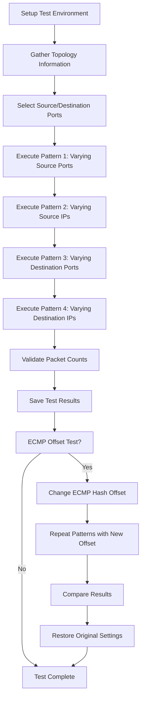

# Test Plan for  ECMP balance test

## Overview

This test plan validates ECMP (Equal-Cost Multi-Path) load balancing functionality in SONiC network devices by verifying packet distribution across multiple equal-cost paths using different traffic patterns and hash tuple variations.

## Test Objectives

- Verify ECMP load balancing distributes traffic evenly across available paths
- Validate hash tuple calculations using different packet field variations
- Confirm ECMP hash offset changes impact packet distribution
- Ensure packet forwarding accuracy

## Test Scope

### In Scope

- UDP packet forwarding with ECMP load balancing
- IPv4 and IPv6 traffic patterns
- Hash tuple variations (source IP, destination IP, source port, destination port)
- ECMP hash offset configuration changes
- Packet distribution analysis across upstream interfaces
- Broadcom ASIC platforms with T0/T1 topologies

### Out of Scope

- TCP traffic patterns
- Non-Broadcom ASIC platforms
- Other topology types (T2, M0, MX)
- Performance benchmarking
- Failover scenarios

## Test Environment

### Prerequisites

- SONiC device with Broadcom ASIC
- T0 or T1 topology configuration
- PTF (Packet Test Framework) environment
- Upstream and downstream port connectivity
- BCM command line interface access

### Hardware Requirements
- Supported platforms:
  - Broadcom

- Supported Arista hardware SKUs for case test_udp_packets_ecmp, updating ECMPHashSet0Offset doesn't change OFFSET_ECMP for 7050cx3, so exclude 7050cx3.
  - Arista-7060CX-32S-C32
  - Arista-7060CX-32S-D48C8
  - Arista-7060CX-32S-Q32
  - Arista-7260CX3-C64
  - Arista-7260CX3-D108C10
  - Arista-7260CX3-D108C8

## Test Cases

### Test Case 1: Basic UDP Packet ECMP Load Balancing

**Test Function:** `test_udp_packets`

**Objective:** Verify basic ECMP functionality with different traffic patterns. Also save the test results to output file as the original sample file which will be compared with the output file with Test Case 2.

**Test Steps:**

1. Initialize test environment and gather topology information
2. Clear port statistics
3. Execute four traffic patterns:
   - **Pattern 1:** Vary source ports (100-139) with fixed other parameters
   - **Pattern 2:** Vary source IPs (20.0.0.2 to 20.0.0.41 for IPv4) with fixed other parameters
   - **Pattern 3:** Vary destination ports (80-119) with fixed other parameters
   - **Pattern 4:** Vary destination IPs (194.50.16.2 to 194.50.16.41 for IPv4) with fixed other parameters
4. Send 100 packets per variation (40 variations per pattern)
5. Verify packet forwarding and count matches
6. Record output interface for each traffic pattern
7. Save test results to JSON file

**Expected Results:**

- All packets forwarded correctly (≥100 packets per test case)
- Traffic distributed across available ECMP paths
- Consistent interface selection for identical 5-tuples
- Test results saved successfully

**Pass Criteria:**

- Packet count variance ≤ 3 packets across similar patterns
- All sent packets received and properly routed
- At least one interface shows tx_ok ≥ 100 packets

### Test Case 2: ECMP Hash Offset Impact Verification

**Test Function:** `test_udp_packets_ecmp`

**Objective:** Verify ECMP hash offset changes affect packet distribution. In this case, will do comparison with the output file of Test Case 1 after changing ecmp offset, the distribution should be different with Test Case 1.

**Test Steps:**

1. Check hardware SKU compatibility
2. Record original ECMPHashSet0Offset value
3. Set ECMPHashSet0Offset to 0x1c
4. Execute same four traffic patterns as Test Case 1
5. Save results with ECMP offset suffix
6. Compare results with baseline test (without offset)
7. Restore original ECMPHashSet0Offset value

**Expected Results:**

- Traffic distribution changes when hash offset is modified
- Different interface selection compared to baseline test
- All packets still forwarded correctly

**Pass Criteria:**

- Results differ from baseline test (different interface mappings)
- No packet loss during hash offset changes
- Hash offset successfully restored after test

## Test Data and Parameters

### Traffic Parameters

- **Packet Count per Test:** 100 packets
- **Test Variations per Pattern:** 40 variations
- **Total Packets per Test Case:** 16,000 packets (4 patterns × 40 variations × 100 packets)
- **Protocol:** UDP (protocol 17)
- **Packet Size:** Standard UDP packet size
- **TTL/Hop Limit:** 64

### Network Parameters

- **Default Source IPs:**
  - IPv4: 20.0.0.1
  - IPv6: 60c0:a800::5
- **Default Destination IPs:**
  - IPv4: 194.50.16.1
  - IPv6: 2064:100::11
- **Base Ports:**
  - Source Port: 100
  - Destination Port: 80

### Hash Configuration

- **Default ECMP Hash Offset:** Original device value
- **Test ECMP Hash Offset:** 0x1c
- **Fallback Hash Offset:** 0x1a

## Validation Criteria

### Functional Validation

1. **Packet Forwarding Accuracy**
   - All sent packets must be received
   - Correct packet format after routing
   - Proper TTL/hop limit decrement

2. **Load Balancing Distribution**
   - Traffic distributed across multiple interfaces
   - Consistent path selection for identical flows
   - Variance in packet counts ≤ 4 packets

3. **Hash Offset Impact**
   - Different distribution patterns with offset changes
   - No packet loss during configuration changes
   - Successful restoration of original settings

### Performance Validation

1. **Interface Utilization**
   - At least one interface shows significant traffic (≥100 packets)
   - Multiple interfaces utilized for load balancing
   - Consistent forwarding rates

2. **Hash Effectiveness**
   - Different 5-tuples result in different paths
   - Hash algorithm properly distributes traffic
   - Minimal hash collisions

## Test Reporting

### Test Results Storage

- JSON files with detailed results per IP version
- Formatted results organized by interface
- Separate files for baseline and ECMP offset tests

### Key Metrics

- Packet transmission success rate
- Interface distribution patterns
- Hash offset impact measurement
- Test execution time

### Failure Analysis

- Packet loss detection and reporting
- Interface utilization analysis
- Hash distribution effectiveness
- Configuration restoration verification

## Risk Assessment

### Test Risks

- **Hardware Compatibility:** Limited to specific Arista SKUs
- **Configuration Changes:** ECMP hash offset modifications may affect other traffic
- **Timing Dependencies:** Packet polling timeouts may cause false failures
- **Resource Utilization:** High packet counts may impact device performance

### Mitigation Strategies

- SKU compatibility checks before test execution
- Automatic restoration of original configurations
- Configurable timeout values for different environments
- Rate limiting and batch processing for packet generation

## Dependencies

### External Dependencies

- PTF framework availability
- BCM command line interface access
- JSON file system permissions
- Network topology stability

### Internal Dependencies

- SONiC routing table configuration
- Interface status and connectivity
- Port statistics collection capability
- Minigraph facts availability

## Test Configuration Constants

```python
# Test Constants
PACKET_COUNT = 100
PACKET_COUNT_MAX_DIFF = 4
INCREMENT = 80

# IP Addresses
DEFAULT_SRC_IP = {"ipv4": "20.0.0.1", "ipv6": "60c0:a800::5"}
UPSTREAM_DST_IP = {"ipv4": "194.50.16.1", "ipv6": "2064:100::11"}

# Test Markers
pytestmark = [
    pytest.mark.asic("broadcom"),
    pytest.mark.topology("t0", "t1"),
]
```

## Test Execution Flow



## Test Matrix

| Test Case | IP Version | Pattern | Expected Outcome |
|-----------|------------|---------|------------------|
| test_udp_packets | IPv4 | Varying Source Ports | Traffic distributed across ECMP paths |
| test_udp_packets | IPv4 | Varying Source IPs | Traffic distributed across ECMP paths |
| test_udp_packets | IPv4 | Varying Dest Ports | Traffic distributed across ECMP paths |
| test_udp_packets | IPv4 | Varying Dest IPs | Traffic distributed across ECMP paths |
| test_udp_packets | IPv6 | Varying Source Ports | Traffic distributed across ECMP paths |
| test_udp_packets | IPv6 | Varying Source IPs | Traffic distributed across ECMP paths |
| test_udp_packets | IPv6 | Varying Dest Ports | Traffic distributed across ECMP paths |
| test_udp_packets | IPv6 | Varying Dest IPs | Traffic distributed across ECMP paths |
| test_udp_packets_ecmp | IPv4 | All Patterns | Different distribution vs baseline |
| test_udp_packets_ecmp | IPv6 | All Patterns | Different distribution vs baseline |

## Troubleshooting Guide

### Common Issues

1. **No ECMP paths available**
   - Check routing table for multiple equal-cost routes
   - Verify upstream neighbor connectivity
   - Confirm topology supports ECMP

2. **Hash offset changes not taking effect**
   - Verify BCM command execution success
   - Check hardware SKU compatibility
   - Ensure sufficient privileges for BCM commands

3. **Packet loss during testing**
   - Increase timeout values
   - Check interface status and link health
   - Verify PTF adapter configuration

4. **Inconsistent test results**
   - Clear port statistics before each test
   - Ensure stable network conditions
   - Check for background traffic interference

### Log Analysis

Key log entries to monitor:
- ECMPHashSet0Offset value changes
- Packet transmission and reception counts
- Interface selection patterns
- Test result file generation

## Future Enhancements

- Support for additional ASIC vendors
- TCP traffic pattern testing
