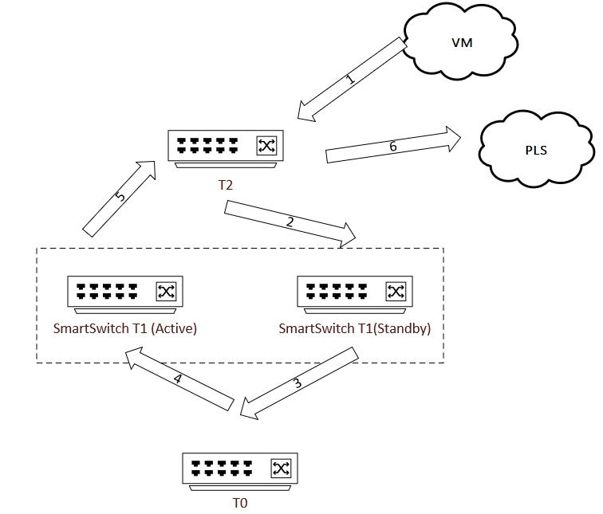
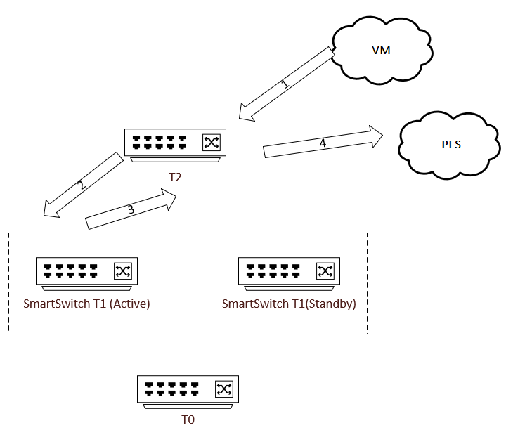
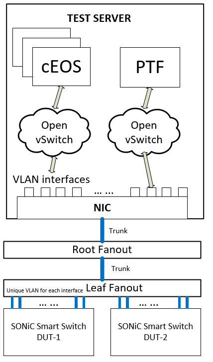

# Smart Switch HA – SONiC MGMT Test Plan

## Revision History

| Date       | Author     | Description   |
| ---------- | ---------- | ------------- |
| 2024-02-06 | Jing Zhang | Initial draft |

## Table of Contents

<!-- TOC orderedlist:false -->

- [Smart Switch HA – SONiC MGMT Test Plan](#smart-switch-ha--sonic-mgmt-test-plan)
    - [Revision History](#revision-history)
    - [Table of Contents](#table-of-contents)
    - [Scope](#scope)
    - [Terminology](#terminology)
    - [Topology](#topology)
        - [Setup configuration](#setup-configuration)
        - [Physical Connection](#physical-connection)
    - [Test Methodology](#test-methodology)
    - [Test Plan](#test-plan)
        - [Module 1 Steady State](#module-1-steady-state)
        - [Module 2 Planned Switchovers](#module-2-planned-switchovers)
        - [Module 3 BFD state pinned](#module-3-bfd-state-pinned)
        - [Module 4 HA state pinned by upstream service](#module-4-ha-state-pinned-by-upstream-service)
        - [Module 5 Link Failures](#module-5-link-failures)
        - [Module 6 Critical Process Crash](#module-6-critical-process-crash)
        - [Module 7 Power down and hardware failure](#module-7-power-down-and-hardware-failure)
        - [Module 8 Operations](#module-8-operations)
    - [Test Utilities](#test-utilities)

<!-- /TOC -->

## Scope 
This document proposes solutions for Smart Switch High-Availability test plans. The document will cover smart switch test scenarios.

The goal of this test plan is to verify HA state machine behavior in normal operation scenarios and network failure scenarios with [t1-smartswitch-ha](https://github.com/sonic-net/sonic-mgmt/blob/master/ansible/vars/topo_t1-smartswitch-ha.yml) topology. Both control plane and data plane will need to be verified in the test cases. 

## Terminology
| Term | Meaning              |
| ---- | -------------------- |
| PLS  | Private link service |

## Topology

### Setup configuration  

Traffic passes through the HA set under test. Assuming dpu0 in SmartSwitch0 will be the Active node and dpu0 in SmartSwitch1 shall be set to Standby. Both DPUs will share same network configurations.

In case the traffic lands on standby node, it will be tunnelled through T0 neighbor, to the active node, and eventually sent out to destination VM. Diagram below shows the logical path of the traffic. Note that inline sync is omitted in the graphs.


In case the traffic lands on active node, the path will be like below. 


The production scenario simulated with this testbed, is a VM-to-PLS traffic scenario. Basically in [Azure Private Link](https://azure.microsoft.com/en-us/products/private-link) production scenario, a packet coming from the VM and being sent to PLS. We may add other critical scenarios, such as vnet-to-vnet, in the future.


### Physical Connection
Tests will run on a sonic-mgmt testbed. The key physical components will be:
1. Test server
1. Fanout switches
    * root fanout switch
    * leaf fanout switch
1. SONiC DUTs -- the two smartswitches.


Key aspects of the physical connection:
1. Every DUT port is connected to the leaf fanout switch.
1. Every leaf fanout switch has unique VLAN tag for every DUT port.
1. Root fanout switch connects leaf fanout switches and test servers using 802.1Q trunks. 

For HA testbeds, the 2 smartswitch DUTs will be connected to the same leaf fanout, to eliminate factors that are irrelevant to the test scenarios. 

Any test server can access any DUT port by sending a packet with the port VLAN tag. In test servers, a set of dockers can be created for running cEOS to simulate neighbors of the SONiC DUT. A PTF container (based on the PTF test framework) for injecting/sniffing packets will be created. The PTF docker, the cEOS dockers and VLAN interfaces in test server can be interconnected by open vSwitch bridges. 

For HA testbeds, the 2 smartswitch DUTs will share the same set of cEOS dockers as the neighbors, and same PTF docker for packets injecting and sniffing. 



Please refer to [sonic-mgmt testbed overview](https://github.com/sonic-net/sonic-mgmt/blob/master/docs/testbed/README.testbed.Overview.md) for more about testbed setup and diagrams, also [HA Topology](https://github.com/sonic-net/SONiC/blob/master/doc/smart-switch/high-availability/smart-switch-ha-hld.md#4-network-physical-topology) for HA Network Physical Design. 


## Test Methodology

1. Test scenario is VM-to-PLS traffic (we may add other critical scenarios, such as vnet-to-vnet, in the future).
1. Open flow rules are configured on OVS Bridges to control the traffic flow:
    * All packets sent out from Neighbor are only forwarded to DUT
    * All packets sent out from DUT are forwarded to Neighbor and PTF
    * All packets sent out from PTF are only forwarded to DUT
1. Traffic will be sent from PTF docker, and sniffed on PTF docker by sonic-mgmt test scripts.
1. Depending on the test cases, switchovers will be triggered and verified. 
1. Control plane status, DPU counters, metering data, and flow table diff between active/standby will be measured for the tests.

**How to ensure the side traffic will land on?**

To ensure traffic lands on the DUT we desire, for example the active side DUT, packets will be injected only from PTF interfaces that bind with the DUT's interfaces. In real production scenario, the outer packet will have the destination IP to the VIP, hence, the traffic would land on either side, if no special configuration.

Similarly, when sniffing packets on PTF, we will sniff on the interfaces that we expect the packets to arrive. 

**How to define a baseline?**

The steady state module will be considered as baseline of the overall performance of ha testbed, packets sniffed will be analyzed and latency date will be collected and emitted to test reports. 

**How to verify the expected behavior?**

* Expecting no traffic interruption.

Sniffing process starts on PTF docker at the moment of test setup, and will be terminated after a fixed amount of time. Packets sniffed from the certain interfaces, will be parsed by SONiC-MGMT test utilities. The number of packets should be exactly same as the number of sent packets. Sequence numbers should be consecutive, no duplicates, and no missing. 

* Expecting traffic interruption but should recover within certain time.

Sniffing process starts on PTF docker at the moment of test setup, and will be terminated after a fixed amount of time. Packets sniffed from the certain interfaces, will be parsed by SONiC-MGMT test utilities. 

Sequence numbers should be consecutive with __only one allowed gap__, the number of missed packets should match the configured allowed amount.

* Expecting HA state and metrics value. 

Utilizing [wait_until](https://github.com/sonic-net/sonic-mgmt/blob/ab2b6c31e1a875442df0107967c0f350d85eb177/tests/common/utilities.py#L121) to check STATE_DB status, tests will fail if state doesn't change to the expected value before timeout. 


## Test Plan
Assuming there is a pair of DPUs in the system, and at the step of test setup, we have DPU-1 as active, DPU-2 as standby. 

Traffic will be injected by PTF through the T2 neighbors' OVS bridges. PTF will also sniff on the interfaces binding to the T2 neighbors.  

For some of the cases, you will see two versions, one is traffic sending through DPU1, and the other one is traffic sending through DPU2. The purpose of  it is to verify:
* Traffic shouldn’t be disrupted when failures happen on standby side.
* Traffic should be tunneled if landing on standby side. 

The name convention of a test case will be “\<Test Scenario\>-[Active|Standby]”, indicating the traffic is sent through the initial active or standby side. 

All of the test modules below, are requesting 2 SmartSwitch to form a pair. Test cases that run on one single SmartSwitch, are not under the scope of HA tests. 

### Module 1 Steady State


| Case                   | Goal                                     | Test Steps                              | Expected Control Plane Behavior            | Expected Data Plane Behavior                                 |
| ---------------------- | ---------------------------------------- | --------------------------------------- | ------------------------------------------ | ------------------------------------------------------------ |
| Steady State – Active  | Verify normal operation in healthy state | • Start sending traffic to Active side  | DPU1 remains active, DPU2 remains standby. | T2 receives packets without disruption.                      |


### Module 2 Planned Switchovers
| Case                                           | Goal                                                                                                                                                                                           | Test Steps                                                                                                                                                              | Expected Control Plane Behavior                | Expected Data Plane Behavior                                                                              |
| ---------------------------------------------- | ---------------------------------------------------------------------------------------------------------------------------------------------------------------------------------------------- | ----------------------------------------------------------------------------------------------------------------------------------------------------------------------- | ---------------------------------------------- | --------------------------------------------------------------------------------------------------------- |
| Planned Switchover - Active                    | Verify zero traffic loss in planned maintenance                                                                                                                                                | • Start sending traffic to active side<br>• Issue switchover following planned maintenance procedure                                                                    | DPU-1 becomes standby, DPU-2 becomes active.   | T2 receives packets without disruption.                                                                   |
| Planned Switchover – Standby                   | Verify zero traffic loss in planned maintenance                                                                                                                                                | • Start sending traffic to standby side<br>• Issue switchover following planned maintenance procedure                                                                   | DPU-1 becomes standby, DPU-2 becomes active.   | T2 receives packets without disruption.                                                                   |
| Planned shutdown standby                       | Verify zero traffic loss in planned shutdown                                                                                                                                                   | • Start sending traffic <br>• Issue shutdown on standby side                                                                                                            | DPU-1 becomes standalone, DPU-2 is dead.       | T2 receives packets without disruption.                                                                   |
| Planned shutdown active (DPU-driven mode only) | Verify zero traffic loss in planned shutdown                                                                                                                                                   | • Start sending traffic <br>• Issue shutdown on active side                                                                                                             | DPU-1 becomes dead, DPU-2 is standalone.       | T2 receives packets without disruption.                                                                   |
| HA Re-pairing                                  | Verify [HA re-pairing workflow](https://github.com/sonic-net/SONiC/blob/master/doc/smart-switch/high-availability/smart-switch-ha-dpu-scope-dpu-driven-setup.md#84-eni-migration--ha-re-pair). | • Start sending traffic <br> • Select another DPU from DUT-2, remove DPU-2 out of the HA pair, and re-pair DPU-1 with the new DPU selected. Workflow is defined in HLD. | DPU-1 remain active, DPU-3 become new standby. | Tables and objects related to old HA set are removed and new HA set to be created. No traffic disruption. |

###  Module 3 BFD state pinned
This test module is to explicitly test status pinning behavior.

Here the BFD pin down refers to a upstream service provided state, which does not essentially indicate a link failure hence **does not trigger an actual switchover**. The forwarding behavior change be achieved by overlay ECMP configuration or ENI forwarding configuration.

| Case                                  | Goal                                          | Test Steps                                                                               | Expected Control Plane Behavior            | Expected Data Plane Behavior            |
| ------------------------------------- | --------------------------------------------- | ---------------------------------------------------------------------------------------- | ------------------------------------------ | --------------------------------------- |
| BFD state UP pinned as DOWN – Active  | Verify traffic flow honored the pinned state. | • Start  sending traffic to active side<br>• Pin DPU1 BFD probe state as DOWN.           | DPU1 remains active, DPU2 remains standby. | T2 receives packets without disruption. |
| BFD state UP pinned as DOWN – Standby | Verify traffic flow honored the pinned state. | • Start  sending traffic to standby side<br>• Pin DPU1 BFD probe state as DOWN.          | DPU1 remains active, DPU2 remains standby. | T2 receives packets without disruption. |
| Both side pinned as DOWN – Active     | Verify traffic flow honored the pinned state. | • Start  sending traffic to active side<br>• Pin DPU1 and DPU2 BFD probe state as DOWN.  | DPU1 remains active, DPU2 remains standby. | T2 receives packets without disruption. |
| Both side pinned as DOWN – Standby    | Verify traffic flow honored the pinned state. | • Start  sending traffic to standby side<br>• Pin DPU1 and DPU2 BFD probe state as DOWN. | DPU1 remains active, DPU2 remains standby. | T2 receives packets without disruption. |


###  Module 4 HA state pinned by upstream service

| Case                                 | Goal                                          | Test Steps                                                                     | Expected Control Plane Behavior            | Expected Data Plane Behavior            |
| ------------------------------------ | --------------------------------------------- | ------------------------------------------------------------------------------ | ------------------------------------------ | --------------------------------------- |
| HA state pinned standalone – Active  | Verify control plane honors the pinned state. | • Start sending traffic to DPU1.<br>• Pin DPU2 as standalone.<br>• Remove Pin. | DPU1 becomes standby, DPU2 becomes active. | T2 receives packets without disruption. |
| HA state pinned standalone – Standby | Verify control plane honors the pinned state. | • Start sending traffic to DPU2.<br>• Pin DPU2 as standalone.<br>• Remove Pin. | DPU1 becomes standby, DPU2 becomes active. | T2 receives packets without disruption. |

###  Module 5 Link Failures 

| Case                                    | Goal                                                                     | Test Steps                                                                                      | Expected Control Plane Behavior                                                          | Expected Data Plane Behavior                     |
| --------------------------------------- | ------------------------------------------------------------------------ | ----------------------------------------------------------------------------------------------- | ---------------------------------------------------------------------------------------- | ------------------------------------------------ |
| Active NPU-to-DPU probe drop -Active    | Verify packet flow when NPU1 to DPU1 link starts dropping probe packets. | • Start  sending traffic to active side.<br>• Configure the NPU1-to-DPU1 link to drop packets.  | DPU1 remains active, DPU2 remains standby. All NPUs will be signaled to forward to DPU2. | T2 receives packets with allowed disruption[^1]. |
| Active NPU-to-DPU probe drop -Standby   | Verify packet flow when NPU1 to DPU1 link starts dropping probe packets. | • Start  sending traffic to standby side.<br>• Configure the NPU1-to-DPU1 link to drop packets. | DPU1 remains active, DPU2 remains standby.                                               | T2 receives packets with allowed disruption.     |
| Standby NPU-to-DPU probe drop – Active  | Verify packet flow when NPU2 to DPU2 link starts dropping probe packets. | • Start  sending traffic to active side.<br>• Configure the NPU2-to-DPU2 link to drop packets.  | DPU1 remains active, DPU2 remains standby.                                               | T2 receives packets without disruption.          |
| Standby NPU-to-DPU probe drop – Standby | Verify packet flow when NPU2 to DPU2 link starts dropping probe packets. | • Start  sending traffic to standby side.<br>• Configure the NPU2-to-DPU2 link to drop packets. | DPU1 remains active, DPU2 remains standby.                                               | T2 receives packets without disruption.          |
| Active T1-T0 link drop – Active         | Verify packet flow when T1-T0 link drop.                                 | • Start  sending traffic to active side.<br>• Configure DPU1 side T1-T0 link drop.              | DPU1 becomes standby, DPU2 becomes standalone.                                           | T2 receives packets with allowed disruption.     |
| Active T1-T0 link drop – Standby        | Verify packet flow when T1-T0 link drop.                                 | • Start  sending traffic to standby side.<br>• Configure DPU1 side T1-T0 link drop.             | DPU1 becomes standby, DPU2 becomes standalone.                                           | T2 receives packets with allowed disruption.     |
| Standby T1-T0 link drop – Active        | Verify packet flow when T1-T0 link drop.                                 | • Start  sending traffic to active side.<br>• Configure DPU2 side T1-T0 link drop.              | DPU1 becomes standalone, DPU2 is standby.                                                | T2 receives packets without disruption.          |
| Standby T1-T0 link drop - Standby       | Verify packet flow when T1-T0 link drop.                                 | • Start  sending traffic to standby side.<br>• Configure DPU2 side T1-T0 link drop.             | DPU1 becomes standalone, DPU2 is standby.                                                | T2 receives packets with allowed disruption.     |

An example of CONFIG_DB ACL rule entry to drop NPU to local DPU probe packets will be
```
    "ACL_RULE": {
        "ACL_LINK_DROP_TEST|LOCAL_PROBE_DROP1": {
            "PACKET_ACTION": "DROP",
            "PRIORITY": "1",
            "SRC_IP": <NPU1 IP>,
            "DST_IP": <DPU1 IP>,
            "IP_TYPE": "IP",
            "L4_SRC_PORT": "3784"
        },
        "ACL_LINK_DROP_TEST|LOCAL_PROBE_DROP2": {
            "PACKET_ACTION": "DROP",
            "PRIORITY": "1",
            "SRC_IP": <DPU1 IP>,
            "DST_IP": <NPU1 IP>,
            "IP_TYPE": "IP",CO
            "L4_SRC_PORT": "3784"
        }
     }
```


### Module 6 Critical Process Crash 
For all process crash cases, we will have 4 variations, it’s 
1. Process crash on DPU1, traffic landing on DPU2
2. Process crash on DPU2, traffic landing on DPU1
3. Process crash on DPU1, traffic landing on DPU1
4. Process crash on DPU2, traffic landing on DPU2   

The expected behavior is same, that HA state remains unchanged.

| Case          | Goal                                     | Test Steps                                      | Expected Control Plane Behavior            | Expected Data Plane Behavior                                                                                                                                                               |
| ------------- | ---------------------------------------- | ----------------------------------------------- | ------------------------------------------ | ------------------------------------------------------------------------------------------------------------------------------------------------------------------------------------------ |
| syncd on DPU  | Verify when syncd crash on DPU.          | • Start sending traffic<br>• Kill syncd on DPU  | HA state converges eventually.             | T2 receives packets with allowed disruption.                                                                                                                                               |
| hamgrd on NPU | Verify when hamgrd crash on NPU.         | • Start sending traffic<br>• Kill hamgrd on NPU | DPU1 remains active, DPU2 remains standby. | T2 receives packets with allowed disruption.                                                                                                                                               |
| pmon on NPU   | Verify when pmon crash on NPU.           | • Start sending traffic<br>• Kill pmon on NPU   | DPU1 remains active, DPU2 remains standby. | T2 receives packets with allowed disruption.                                                                                                                                               |
| bgpd on NPU   | Verify when bgpd crash on NPU.           | • Start sending traffic<br>• Kill bgpd on NPU   | DPU1 remains active, DPU2 remains standby. | T2 receives packets with allowed disruption.                                                                                                                                               |
| bgpd on DPU   | Verify when frr is killed on active DPU. | • Start sending traffic<br>• Kill bgpd on DPU   | HA state converges eventually.             | T2 receives packets with allowed disruption. (BFD runs in FRR on DPU, hence BFD state will be down for local DPU probing, traffic will be sniffed from standby side after bgpd is killed.) |

> [!NOTE]
> hamgrd and swbusd both run in ha docker. Either one of them crashing will lead to docker restart. The expected behavior needs to be evaluated based on this fact.

[^1]: The current goal for unplanned events are "time from detection to mitigation" is 2s. It will be a constant value defined in the test module.

###  Module 7 Power down and hardware failure
For each case in this module, there are 2 variations:
1. Failure happens on DPU1, traffic landing on DPU2
2. Failure happens on DPU2, traffic landing on DPU1

| Case                 | Goal                                        | Test Steps                                                              | Expected Control Plane Behavior                   | Expected Data Plane Behavior                 |
| -------------------- | ------------------------------------------- | ----------------------------------------------------------------------- | ------------------------------------------------- | -------------------------------------------- |
| DPU hardware failure | Verify traffic flow when DPU hardware fails | • Start sending traffic<br>• Force DPU reset (ChassisStateDB DPU_STATE) | DPU1 becomes non-active, DPU2 becomes standalone. | T2 receives packets with allowed disruption. |
| T1 unplanned reboot  | Verify traffic when T1 ungracefully reboots | • Start sending traffic<br>• Reboot T1                                  | DPU1 becomes non-active, DPU2 becomes standalone. | T2 receives packets with allowed disruption. |
| T1 power down        | Verify traffic when T1 power down           | • Start sending traffic<br>• Toggle T1 PDU link                         | DPU1 becomes non-active, DPU2 becomes standalone. | T2 receives packets with allowed disruption. |


### Module 8 Operations
For each case in this module, there are 2 variations:
1. Failure happens on DPU1, traffic landing on DPU2
2. Failure happens on DPU2, traffic landing on DPU1

| Case                                   | Goal                                                       | Test Steps                                                                                         | Expected Control Plane Behavior                                   | Expected Data Plane Behavior                 |
| -------------------------------------- | ---------------------------------------------------------- | -------------------------------------------------------------------------------------------------- | ----------------------------------------------------------------- | -------------------------------------------- |
| Shutdown/Startup BGP sessions from NPU | Verify traffic when shutdown and startup sessions from NOS | • Start sending traffic<br>• Shutdown all BGP sessions on NPU<br>• Startup all BGP sessions on NPU | Impacted side become non-active, the peer side become standalone. | T2 receives packets with allowed disruption. |
| TSA on T1                              | Verify traffic when TSA on T1                              | • Start sending traffic<br>• TSA on T1<br>• TSB on T1                                              | Impacted side become non-active, the peer side become standalone. | T2 receives packets with allowed disruption. |
| Config reload on T1                    | Verify traffic when config reload on T1                    | • Start sending traffic<br>• Config reload on T1                                                   | Impacted side become non-active, the peer side become standalone. | T2 receives packets with allowed disruption. |

## Test Utilities 
There are some test utilities we need to implement to cover all test scenarios, including but not limited to:
1. Utilities to configure [PTF namespace](https://github.com/sonic-net/sonic-mgmt/blob/035122ff3ed2ae23ba3e9903f06ab3967e00c1fe/docs/testbed/README.testbed.vSmartSwitch.md#ptf-container).
1. Utilities to generate, send and sniff traffic.
1. Utilities to simulator gnmi requests from upstream service.
2. Utilities to config link drops (add ACL rules to drop probe packets),  kill critical process etc.
3. Utilities to “fake” a failure signature in DB.
1. Utilities to do flow table dump and comparison between active/standby node.
