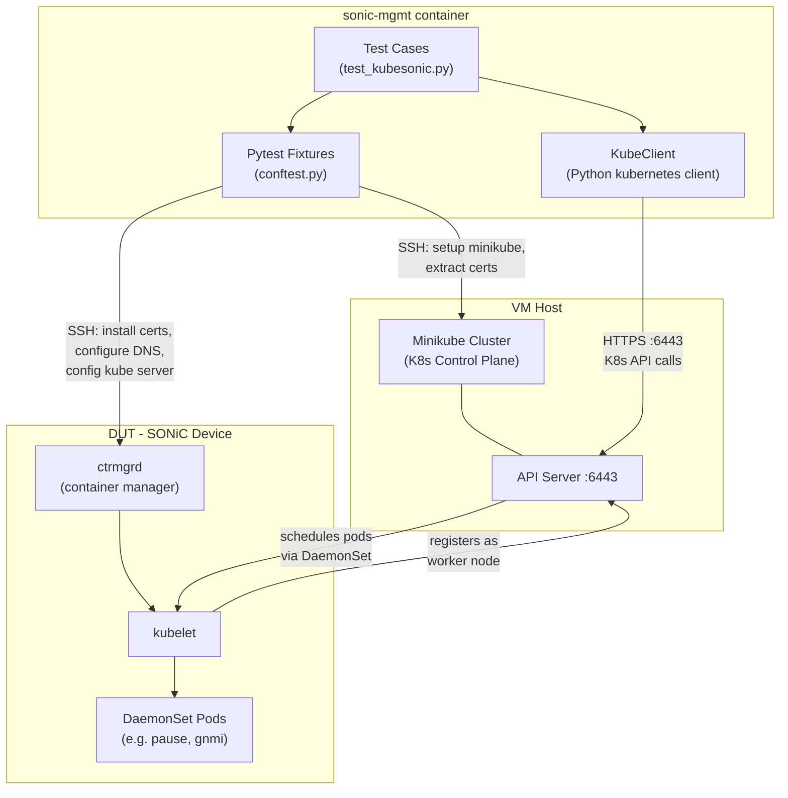

# Kubesonic Test Infrastructure

- [1 Overview](#1-overview)
- [2 Motivation](#2-motivation)
  - [2.1 Gaps in Existing Test Coverage](#21-gaps-in-existing-test-coverage)
  - [2.2 Sidecar Container Pattern](#22-sidecar-container-pattern)
  - [2.3 gNOI Upgrade Use Case](#23-gnoi-upgrade-use-case)
- [3 Scope](#3-scope)
- [4 Testbed](#4-testbed)
- [5 Architecture](#5-architecture)
  - [5.0 System Overview](#50-system-overview)
  - [5.1 Reusable Library (tests/common/kubesonic)](#51-reusable-library-testscommonkubesonic)
  - [5.2 Pytest Fixtures (tests/kubesonic/conftest.py)](#52-pytest-fixtures-testskubesonicconftestpy)
  - [5.3 Test Utilities (tests/kubesonic/kubesonic_utils.py)](#53-test-utilities-testskubesonickubesonic_utilspy)
- [6 Test Cases](#6-test-cases)
  - [6.1 Cluster Join and Node Readiness](#61-cluster-join-and-node-readiness)
  - [6.2 DaemonSet Scheduling](#62-daemonset-scheduling)
  - [6.3 DaemonSet Removal](#63-daemonset-removal)
  - [6.4 DUT Server Status](#64-dut-server-status)
  - [6.5 Join and Disjoin (End-to-End)](#65-join-and-disjoin-end-to-end)
- [7 Comparison with Existing Infrastructure](#7-comparison-with-existing-infrastructure)
- [8 Future Work](#8-future-work)

## 1 Overview

This document describes the kubesonic test infrastructure added to `sonic-mgmt` for testing SONiC Kubernetes integration. The infrastructure provisions a minikube cluster on the VM host, joins a DUT to that cluster, and validates Kubernetes-orchestrated container lifecycle operations using a Python Kubernetes client.

The primary deliverables are:

1. A **reusable library** (`tests/common/kubesonic/`) providing Python classes for minikube lifecycle management, DUT-side K8s configuration, and a Python Kubernetes API client wrapper.
2. **Pytest fixtures** (`tests/kubesonic/conftest.py`) that compose these components into module-scoped setup/teardown for test authors.
3. **Integration tests** (`tests/kubesonic/test_kubesonic.py`) providing basic coverage of cluster join, DaemonSet scheduling, and DUT status — primarily serving as a validation that the infrastructure works end-to-end. The main value of this PR is the infrastructure itself, not these specific tests.

## 2 Motivation

### 2.1 Gaps in Existing Test Coverage

Before this change, kubesonic test coverage in `sonic-mgmt` consisted of:

- **`tests/kubesonic/test_k8s_join_disjoin.py`** — A single procedural test that shells out to `minikube kubectl` for all cluster operations, uses inline YAML strings for DaemonSet deployment, and verifies results by parsing stdout. This approach works for a single join/disjoin scenario but does not scale to more complex Kubernetes control plane operations (e.g., programmatic pod queries, label-based scheduling, waiting on specific pod conditions).

- **`tests/container_upgrade/`** ([PR #16835](https://github.com/sonic-net/sonic-mgmt/pull/16835), zbud-msft) — Uses `docker run` to pull and start container images directly on the DUT. This tests container-OS version pairings but provides no coverage of Kubernetes-orchestrated deployment. Notably, the test plan document (`docs/testplan/Container-Upgrade-test-plan.md`) includes a "Planned Minikube Enhancement" section that calls for migrating to kubectl and DaemonSet-based deployment — the infrastructure introduced here enables that migration.

The core limitation shared by both approaches is the reliance on shell commands for Kubernetes operations, which makes it difficult to compose fixtures for multi-step scenarios (e.g., "join cluster, deploy a specific container image via DaemonSet, verify pod health, run functional tests, tear down").

### 2.2 Sidecar Container Pattern

SONiC uses a sidecar container pattern (implemented in `sonic-buildimage/dockers/docker-restapi-sidecar/` and `docker-telemetry-sidecar/`) where auxiliary containers:

- Run with `--privileged --pid=host` and use `nsenter` to synchronize files (systemd units, scripts) from the container filesystem to the host
- Use `kubectl` to manage pod lifecycle via `k8s_pod_control.sh` (querying pods by label selector, deleting stale pods to trigger rescheduling)
- Reconcile CONFIG_DB entries (telemetry sidecar writes `GNMI|gnmi` authentication settings)

This pattern is fundamentally Kubernetes-native. The `container_upgrade` test suite's docker-only deployment cannot exercise:
- Pod lifecycle management (`kubectl delete pod` triggering rescheduling)
- DaemonSet-driven container deployment and nodeSelector-based scheduling
- Sidecar coordination with host systemd via nsenter in a Kubernetes context

A test infrastructure with a real Kubernetes cluster and a Python API client is required to validate these behaviors.

### 2.3 gNOI Upgrade Use Case

The existing gNOI upgrade test (`tests/upgrade_path/test_upgrade_gnoi.py`) upgrades the entire SONiC image. However, a key production scenario is upgrading individual containers via KubeSONiC while keeping the base OS unchanged — for example, running a 202411 base image with a master-branch gnmi container deployed as a DaemonSet (since only the master gnmi container currently includes the gNOI service required for upgrade).

Testing this scenario requires:
1. A Kubernetes cluster fixture that can deploy a specific container image as a DaemonSet to a joined DUT
2. Programmatic verification that the pod is running the expected image version
3. The ability to compose this with existing gNOI test infrastructure

The Python `KubeClient` wrapper and module-scoped `minikube` fixture introduced here provide the building blocks for such tests.

## 3 Scope

From a test author's perspective, this infrastructure provides:

- A **Kubernetes control plane** (minikube on VM host) acting as the kube master
- A **DUT joined as a worker node** to that cluster
- A **Python Kubernetes client** running in the sonic-mgmt container for programmatic cluster operations (deploy DaemonSets, query pods, label nodes, etc.)

All setup details (minikube provisioning, certificate exchange, DNS configuration, kubelet compatibility fixes) are handled internally by the library and fixtures.

Out of scope (future work):
- Container image upgrade via DaemonSet (gNOI integration)
- Sidecar-specific functional tests

## 4 Testbed

- **Topology:** `any` (tests use `pytest.mark.topology('any')`)
- **Requirements:** VM host with Docker installed (for minikube with Docker driver), DUT with kubesonic support (`ctrmgrd` service). Tests skip automatically if `ctrmgrd` is not present.
- **Tested on:** `vms-kvm-t0` with virtual SONiC DUT

## 5 Architecture

### 5.0 System Overview

The following diagram shows the three nodes involved in a kubesonic test and how they interact:



**Key interactions:**
- **sonic-mgmt container → VM Host**: SSH (via Ansible) to provision minikube and extract certificates
- **sonic-mgmt container → K8s API**: Direct HTTPS using Python `kubernetes` client with in-memory kubeconfig
- **sonic-mgmt container → DUT**: SSH (via Ansible) to configure DUT for cluster join
- **DUT → K8s API**: kubelet registers with the API server; control plane schedules DaemonSet pods onto the DUT

### 5.1 Reusable Library (tests/common/kubesonic)

Four classes, each encapsulating a distinct concern:

| Class | File | Responsibility |
|-------|------|----------------|
| `MinikubeManager` | `minikube.py` | Minikube lifecycle on vmhost: download, start (K8s v1.22.2, Docker driver, port 6443), kubelet config patching, DaemonSet deployment, kubeconfig extraction |
| `CertManager` | `certs.py` | Extract apiserver certs from minikube container, install on DUT at `/etc/sonic/credentials/`, backup/restore |
| `DutKubeConfig` | `dut_kube.py` | DUT-side setup: DNS (`/etc/hosts`), STATE_DB initialization, kubelet cgroup driver fix, cluster join/disjoin, API server health check |
| `KubeClient` | `kube_client.py` | Thin wrapper around the official Python `kubernetes` client: node CRUD, pod listing with field/label selectors, node label management |

`KubeClient` is initialized from an in-memory kubeconfig dict (no temp files on the test runner):

```python
kubeconfig = minikube_manager.get_kubeconfig_data()  # certs fetched via shell, assembled as dict
client = KubeClient(kubeconfig_dict=kubeconfig)
```

### 5.2 Pytest Fixtures (tests/kubesonic/conftest.py)

Two composable module-scoped fixtures:

**`minikube`** — Provisions the cluster and returns a namespace with the K8s client:
```python
@pytest.fixture(scope="module")
def minikube(vmhost, creds):
    mgr = MinikubeManager(vmhost, creds)
    mgr.setup()
    client = KubeClient(kubeconfig_dict=mgr.get_kubeconfig_data())
    yield SimpleNamespace(client=client, vip=vmhost.mgmt_ip, vmhost=vmhost)
    mgr.teardown()
```

**`dut_joined_minikube`** — Configures the DUT and joins it to the cluster:
```python
@pytest.fixture(scope="module")
def dut_joined_minikube(minikube, duthost):
    # Skips if ctrmgrd not present
    setup_dut(duthost, minikube.vmhost)
    join_cluster(duthost, minikube.vip, vmhost=minikube.vmhost)
    yield
    disjoin_cluster(duthost)
    cleanup_dut(duthost)
```

Test authors can use `minikube` alone for manual control or `dut_joined_minikube` for automatic join/disjoin lifecycle.

### 5.3 Test Utilities (tests/kubesonic/kubesonic_utils.py)

Standalone helper functions (`setup_dut`, `join_cluster`, `disjoin_cluster`, `cleanup_dut`) that implement the DUT-side operations used by fixtures. This module also contains the `setup_and_teardown` fixture and `test_kubesonic_join_and_disjoin` procedural test, preserving backward compatibility with the original test while the new fixture-based tests in `test_kubesonic.py` are the recommended path forward.

## 6 Test Cases

### 6.1 Cluster Join and Node Readiness

**Test:** `test_dut_node_ready`

1. DUT joins minikube cluster (via `dut_joined_minikube` fixture)
2. Verify DUT hostname appears as a node via Python K8s client
3. Verify node status is `Ready`

**Pass criteria:** `KubeClient.node_exists()` and `KubeClient.is_node_ready()` both return `True`.

### 6.2 DaemonSet Scheduling

**Test:** `test_daemonset_scheduling`

1. DUT is joined to cluster
2. Label node with `deployDaemonset=true` via `KubeClient.label_node()`
3. Wait for DaemonSet pod with label `group=test-ds-pod` to reach `Running` phase on the DUT node
4. Verify pause container is running on DUT via `docker ps`
5. Remove label (cleanup)

**Pass criteria:** Pod reaches `Running` within 60 seconds; pause container visible on DUT.

### 6.3 DaemonSet Removal

**Test:** `test_daemonset_removal`

1. Label node to trigger scheduling
2. Wait for pod to be scheduled
3. Remove `deployDaemonset` label via `KubeClient.unlabel_node()`
4. Wait for pod to be removed

**Pass criteria:** Pod list for the node is empty within 60 seconds after unlabeling.

### 6.4 DUT Server Status

**Test:** `test_kube_server_status`

1. DUT is joined to cluster
2. Run `show kube server status` on DUT
3. Verify output contains `true` (connected)

**Pass criteria:** DUT CLI reports connected status.

### 6.5 Join and Disjoin (End-to-End)

**Test:** `test_kubesonic_join_and_disjoin` (in `kubesonic_utils.py`)

Procedural end-to-end test that exercises join, DaemonSet deploy, DaemonSet delete, and disjoin in sequence using shell-based verification. This test preserves coverage parity with the original `test_k8s_join_disjoin.py`.

## 7 Comparison with Existing Infrastructure

| Capability | `test_k8s_join_disjoin` (existing) | `container_upgrade` | This PR |
|---|---|---|---|
| Cluster provisioning | Inline minikube shell commands | None (docker-only) | `MinikubeManager` class with full lifecycle |
| Container deployment | `minikube kubectl -- apply` via shell | `docker run` | `KubeClient` + DaemonSet via K8s API |
| Verification | Parse kubectl stdout | `docker ps` | Python K8s client (typed objects, field selectors) |
| Composable fixtures | No (single procedural test) | Parametrized by OS version/container | Module-scoped `minikube` + `dut_joined_minikube` |
| DaemonSet scheduling test | Yes (shell-based) | No | Yes (API-based with label/unlabel) |
| Sidecar testing support | No | No (docker-only) | Foundation in place (K8s cluster + API client) |
| Reusable across test suites | No (inline code) | No | Yes (`tests/common/kubesonic/`) |

## 8 Future Work

1. **Container upgrade via DaemonSet** — Build a fixture that deploys a specific container image (e.g., gnmi from master) as a DaemonSet to a DUT running a different base image (e.g., 202411), enabling gNOI upgrade testing across version boundaries. This aligns with the "Planned Minikube Enhancement" described in `docs/testplan/Container-Upgrade-test-plan.md`.

2. **Sidecar container validation** — Extend `KubeClient` to deploy sidecar containers and verify host-side effects (systemd unit synchronization, CONFIG_DB reconciliation).

3. **DaemonSet template support** — Replace inline YAML strings with parameterized templates that accept container image, version, and nodeSelector as inputs, enabling the `container_upgrade` test suite to migrate from docker-only to DaemonSet-based deployment.

4. **Consolidation** — Migrate remaining shell-based operations in `kubesonic_utils.py` to use the `tests/common/kubesonic/` classes, reducing duplication between the flat helper functions and the OOP API.

5. **ACR image pull via proxy** — Enable DaemonSets to deploy real SONiC container images (e.g., gnmi, telemetry, sidecars) from Azure Container Registry. The DUT typically has no direct internet access, but the vmhost does. By running a forward proxy (e.g., tinyproxy) on the vmhost's bridge interface and configuring Docker on the DUT with `HTTP_PROXY`/`HTTPS_PROXY`, the DUT can `docker login` (using a token from `az acr login --expose-token`) and pull images through the vmhost. This has been validated manually — a DaemonSet referencing `soniccr1.azurecr.io/debian:bookworm` was successfully scheduled and pulled on a vlab DUT via this proxy path.
