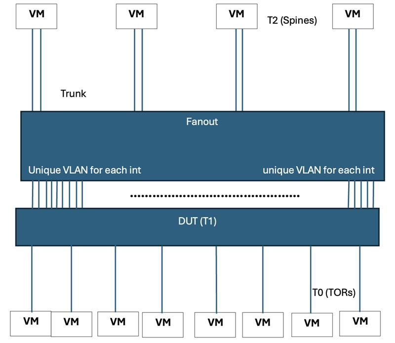

# Link Event Damping Test Plan

## 1. Introduction

### 1.1 Background

The Link Up/Down events generated for an interface at the ASIC layer are propagated up through the switch software stack to applications such as routing protocols. Link flap events are generally low rate, but dirty optics or faulty cable can cause rapid link flapping as the SerDes is able to lock and unlock on a marginal signal. This can generate excessive link events, leading to increased application load and network instability.

Link event damping feature provides a mechanism that suppresses the frequent link up/down events based on per interface configurations, preventing unstable link state changes from being propagated to higher layer applications and improving overall system stability.

### 1.2 Scope

The scope of this test plan is to validate the correctness, robustness, and compliance of the Link Event Damping feature in SONiC. The plan ensures that unstable link behavior is suppressed according to the HLD, while stable links propagate events reliably to applications.

This test plan covers:

- Link event propagation with and without damping
- Damping configuration validation
- Unsupported configuration handling
- Multi-port behavior
- Penalty accumulation, decay, suppression, and reuse logic
- Counters and observability
- Persistence across reboots and docker restarts

### 1.3 References

- SONiC Link Event Damping HLD (https://github.com/sonic-net/SONiC/blob/master/doc/link_event_damping/Link-event-damping-HLD.md)
- SONiC SWSS / OrchAgent design

## 2. Test Environment

### 2.1 Hardware

- SONiC-supported switch with multiple Ethernet ports
- Ability to generate deterministic link flaps
- Access to fanout-switches

### 2.2 Software

SONiC image with Link Event Damping support

Access to:

- config and show CLI
- Redis databases (CONFIG_DB, APPL_DB, STATE_DB, ASIC_DB)
- Docker CLI and system logs

### 2.3 Components under test

- SWSS (PortOrch, IntfOrch)
- OrchAgent
- Syncd
- Applications subscribing to link event notifications

## 3. Damping Configuration Parameters

| Parameter | Description |
|-----------|-------------|
| suppress-threshold | Penalty above which link enters damped state |
| reuse-threshold | Penalty below which link removed from damped state |
| decay-half-life | Time for penalty to decay by half |
| max-suppress-time | Maximum time a link may remain damped |
| flap-penalty | Penalty added per link down event |

## 4. Test Topology – T1

## 5. Test cases

### TC-01: Normal Link Flap Event Propagation

**Objective:**

Verify that link up/down events propagate normally when damping is inactive.

**Steps:**

- Generate link UP/DOWN events on one or more ports by shutting down fanout-switch interfaces connected to DUT ports
- Observe event propagation to applications.

**Expected Result:**

- All physical link changes are propagated.
- Operational state tracks physical state.

### TC-02: Valid Damping Configuration

**Objective:**

Verify that all damping parameters are configurable.

**Steps:**

- Configure max-suppress-time, decay-half-life, suppress-threshold, reuse-threshold, flap-penalty.
- Validate entries in CONFIG_DB and Redis.

**Expected Result:**

- Configuration accepted and applied.
- Damping behavior reflects configured values.

### TC-03: Unsupported configuration handling

**Objective:**

Ensure unsupported damping configurations disable damping safely.

**Scenario:**

- decay-half-life > max-suppress-time

**Steps:**

- Apply unsupported configuration.
- Check the entries in CONFIG_DB and Redis
- Generate link flaps

**Expected Result:**

- Configuration accepted and applied.
- Damping should be disabled
- All events propagate without suppression.

### TC-04: Multiple ports with mixed Damping configuration

**Objective:**

Verify independent behavior across multiple interfaces.

**Steps:**

- Enable damping on some ports.
- Leave others undamped.
- Generate identical flap patterns.

**Expected Result:**

- Validate CONFIG_DB and Redis for damped and undamped ports.
- Damped ports exhibit suppression if damping is active.
- Undamped ports propagate all events.

### TC-05: Post-Damping Operational State Accuracy

**Objective:**

Ensure operational state reflects physical state after damping ends.

**Steps:**

- Trigger damping via frequent flaps.
- Check Operational and Physical state (damping active)
- Allow penalty to decay below reuse threshold.
- Check Operational and Physical state (damping ended)

**Expected Result:**

- Interface exits suppression correctly.
- Operational state matches physical state once damping ends.

### TC-06: Frequent vs Infrequent Flaps

**Objective:**

Verify proportional suppression based on flap frequency.

**Steps:**

- Interface A: frequent flaps (10 flaps with 0.5s interval)
- Interface B: sparse flaps (1 flap for every 10 seconds, 5 total)
- Check the penalty accumulation

**Expected Result:**

- Suppression triggers once penalty reaches suppression threshold
- Interface A suppressed longer than Interface B.
- Recovers if penalty decays below reuse threshold (Penalty decay functions correctly).

### TC-07: Stats Verification

**Objective:**

Validate accuracy of link damping counters.

**Counters:**

- Pre-damping link transitions
- Post-damping propagated transitions
- Pre-damping UP events
- Pre-damping DOWN events
- Post-damping UP advertised
- Post-damping DOWN advertised

**Steps:**

- Enable damping by link flaps
- Check the pre/post counters
- Clear/Reset counters

**Expected Result:**

- Pre-damping counters increment for all physical events.
- Post-damping counters increment only for propagated events.
- Clear/Reset should set all counters to zero

### TC-08: Link flap events at specified intervals and Damping Algorithm Validation

**Objective:**

Validate link damping algorithm using a deterministic sequence of link events and ensure compliance with the HLD for suppression, reuse, and propagation.

**Configuration:**

| Parameter | Value |
|-----------|-------|
| Suppress Threshold | 1600 |
| Reuse Threshold | 1200 |
| Decay Half-Life | 15 seconds |
| Max Suppress Time | 30 seconds |
| Penalty Ceiling | 4800 |

**Preconditions:**

- Interface starts in UP state
- Damping enabled with above configuration

**Event Timeline and Expected Behavior:**

| Time | Event | Damping State | Event Propagated | Operational State |
|------|-------|---------------|------------------|-------------------|
| t=3 | DOWN | Not started | Yes | DOWN |
| t=7 | UP | Not active | Yes | UP |
| t=10 | DOWN | Started | Yes | DOWN |
| t=14 | UP | Active | No | DOWN |
| t=17 | DOWN | Active | No | DOWN |
| t=20 | UP | Active | No | DOWN |
| t=31 | None | Stopped (penalty < reuse) | Yes | UP |
| t=40 | DOWN | Started | Yes | DOWN |
| t=44 | UP | Active | No | DOWN |
| t=46 | DOWN | Active | No | DOWN |
| t=61 | None | Stopped (penalty < reuse) | No | DOWN |
| t=70 | UP | Not active | Yes | UP |
| t=100 | DOWN | Not active | Yes | DOWN |
| t=102 | UP | Not active | Yes | UP |
| t=105 | DOWN | Started | Yes | DOWN |
| t=124 | UP | Active | No | DOWN |
| t=152 | None | Stopped (penalty < reuse) | Yes | UP |

**Expected Results:**

- Suppression starts only after suppress-threshold is crossed.
- Operational state remains frozen during damping.
- No redundant events propagated during suppression.
- Suppression never exceeds max-suppress-time.
- Upon reuse, operational state reflects physical state.

### TC-09: Warm Reboot with Damping Configurations

**Objective:**

Verify damping configuration/functionality persists across reboot.

**Steps:**

- Configure damping.
- Reboot device.
- Generate link flaps.

**Expected Result:**

- Config persists post reboot.
- Damping functions normally after boot.

### TC-10: Docker Restart Resilience

**Objective:**

Verify damping functionality after SWSS/SyncD docker restarts.

**Steps:**

- Configure damping.
- Restart SWSS and SyncD dockers.
- Generate link flaps.

**Expected Result:**

- Shouldn't have any inconsistency with configs and state.
- No ASIC inconsistency.
- Damping works as expected.

## 6. Exit Criteria

- All test cases pass without critical defects
- Damping behavior complies with HLD
- No unintended link events propagated
