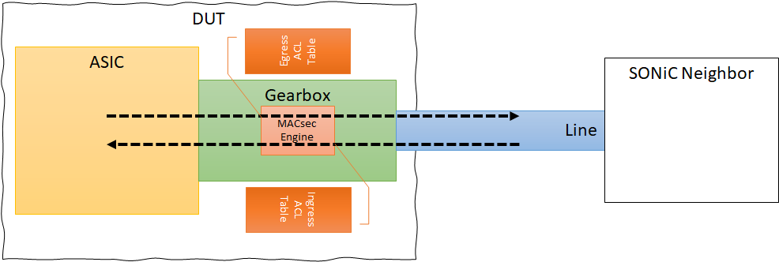

<!-- omit in toc -->
# MACsec Test plan

- [Testcases status](#testcases-status)
- [Testbed](#testbed)
- [Instruction to run MACsec test](#instruction-to-run-macsec-test)
  - [Setup MACsec testbed](#setup-macsec-testbed)
  - [Run MACsec test](#run-macsec-test)
- [Common Configuration](#common-configuration)
  - [Dynamic Key(MKA)](#dynamic-keymka)
- [Test cases](#test-cases)
  - [Testcase : Macsec Functionality](#testcase--macsec-functionality)
    - [Check Control plane](#check-control-plane)
    - [Check the Data plane](#check-the-data-plane)
    - [Refresh SAK](#refresh-sak)
    - [MACsec Key rotation, Primary/Fallback CAK](#macsec-key-rotation-primaryfallback-cak)
    - [MACsec Counters](#macsec-counters)
    - [COPP](#copp)
  - [Testcase : Macsec feature interop with other protocols](#testcase--macsec-feature-interop-with-other-protocols)
    - [Verify Port Channel is created with macsec configuration](#verify-port-channel-is-created-with-macsec-configuration)
    - [Verify LLDP neighbors are created with macsec configuration](#verify-lldp-neighbors-are-created-with-macsec-configuration)
    - [Verify the BGP neighbourship is created with macsec configuration](#verify-the-bgp-neighbourship-is-created-with-macsec-configuration)
    - [Verify PFC in MACsec](#verify-pfc-in-macsec)
      - [Bypass mode](#bypass-mode)
      - [Encrypt mode](#encrypt-mode)
      - [Strict mode](#strict-mode)
    - [Verify SNMP request/response works across interface with macsec configuration](#verify-snmp-requestresponse-works-across-interface-with-macsec-configuration)
  - [Testcase : Deployment usecases and fault handling scenario's](#testcase--deployment-usecases-and-fault-handling-scenarios)
    - [Link flap on an interface with macsec configured](#link-flap-on-an-interface-with-macsec-configured)
    - [Link flap on a portchannel member which has macsec configured](#link-flap-on-a-portchannel-member-which-has-macsec-configured)
    - [Testcases: Operation portchannel remove and re-add members to fix CRC error](#testcases-operation-portchannel-remove-and-re-add-members-to-fix-crc-error)
    - [MACsec session cannot be established under wrong MKA configuration](#macsec-session-cannot-be-established-under-wrong-mka-configuration)
    - [Config reload done on DUT with macsec configuration](#config-reload-done-on-dut-with-macsec-configuration)
    - [Everflow, port mirroring on macsec enabled interfaces](#everflow-port-mirroring-on-macsec-enabled-interfaces)
  - [Testcase : Macsec scenario's for multi-asic, multi-dut](#testcase--macsec-scenarios-for-multi-asic-multi-dut)
  - [Testcase : Scale tests](#testcase--scale-tests)
    - [Large number of interfaces having macsec enabled on the DUT/linecard](#large-number-of-interfaces-having-macsec-enabled-on-the-dutlinecard)
    - [Simultaneous rekeying in all macsec sessions](#simultaneous-rekeying-in-all-macsec-sessions)
    - [Macsec enabled on all interfaces and the DUT is rebooted](#macsec-enabled-on-all-interfaces-and-the-dut-is-rebooted)


## Testcases status

| Test cases                                                           |  status   | comment                                           |
| :------------------------------------------------------------------- | :-------: | :------------------------------------------------ |
| Check Control plane                                                  | Completed |                                                   |
| Check the Data plane                                                 | Completed |                                                   |
| Refresh SAK - timer based                                            | Completed |                                                   |
| Refresh SAK - packet number based                                    |  Ongoing  |                                                   |
| MACsec Key rotation, Primary/Fallback CAK                            | Not start | Feature hasn't been supported                    |
| MACsec Counters                                                      |  Ongoing  |                                                   |
| COPP                                                                 |  Ongoing  |                                                   |
| Port channel with MACsec                                             | Completed |                                                   |
| LLDP with MACsec                                                     | Completed |                                                   |
| BGP with MACsec                                                      | Completed |                                                   |
| PFC with MACsec                                                      | Not start | Feature hasn't been supported                    |
| SNMP with MACsec                                                     | Completed |                                                   |
| Link flap on an interface with MACsec                                | Completed |                                                   |
| Link flap on a PortChannel member with MACsec                        | Completed |                                                   |
| Operation PortChannel remove and re-add members to fix CRC error     |  Removed  | No use case                                       |
| MACsec session cannot be established under wrong MKA configuration   | Completed |                                                   |
| Config reload done on DUT with macsec configuration                  | Completed |                                                   |
| Everflow, port mirroring on macsec enabled interfaces                |  Removed  | Directly leveraging the testcase in everflow part |
| MACsec scenario's for multi-asic, multi-dut                          |  Ongoing  |                                                   |
| Large number of interfaces having macsec enabled on the DUT/linecard |  Ongoing  |                                                   |
| MACsec enabled on all interfaces and the DUT is rebooted             |  Ongoing  |                                                   |

## Testbed

```txt
+-------------------------------------------------------------------------+
|                                                                         |
| DUT                                                                     |
|                                                                         |
+-------+-------------------+-----------------+--------------+----------+-+
        *                   *                 |              |          |
        *                   *                 |              |          |
        *.........          *.........        +......        +......    |
        *        :          *        :        |     :        |     :    |
        *        :          *        :        |     :        |     :    |
  +-----+------+ :    +-----+------+ :    +---+---+ :    +---+---+ :    |
  |VM0         | :    |VM1         | :    |VM2    | :    |VM3    | :    |
  |(Controlled)| :    |(Controlled)| :    |       | :    |       | :    |
  +------------+ :    +------------+ :    +-------+ :    +-------+ :    |
                 :                   :              :              :    |
+----------------+-------------------+--------------+--------------+----+-+
|                                                                         |
| PTF                                                                     |
|                                                                         |
+-------------------------------------------------------------------------+


-----       normal link
.....       injected link
*****       protected link
VM<->DUT    up link
PTF<->DUT   down link
```

In this topology, We pick two VMs (MACsec support) that act as the MACsec participants of the DUT. These two pairs of MACsec participant belong to different MACsec connectivity association(CA).

## Instruction to run MACsec test

### Setup MACsec testbed

About the detail to set the testbed, please refer the doc: https://github.com/Azure/sonic-mgmt/blob/master/docs/testbed/README.testbed.VsSetup.md firstly.

``` bash
./testbed-cli.sh -m veos_vtb -n 4 -k vsonic start-vms server_1 password.txt
./testbed-cli.sh -t vtestbed.csv -m veos_vtb -k vsonic add-topo vms-kvm-t0 password.txt
./testbed-cli.sh -t vtestbed.csv -m veos_vtb deploy-mg vms-kvm-t0 veos_vtb password.txt
```

### Run MACsec test

``` bash
./run_tests.sh -u -n vms-kvm-t0 -d vlab-01 -c macsec/test_macsec.py -f vtestbed.csv -i veos_vtb -e "--neighbor_type=sonic"
```

## Common Configuration

### Dynamic Key(MKA)

***MACsec profile table***

| Field                 |                                                              Value                                                              |
| --------------------- | :-----------------------------------------------------------------------------------------------------------------------------: |
| priority              |                                                  DUT(*64*) VM0(*63*) VM1(*65*)                                                  |
| cipher suite          |                                 *GCM-AES-128*/*GCM-AES-256*/*GCM-AES-XPN-128*/*GCM-AES-XPN-256*                                 |
| CKN                   |                               *6162636465666768696A6B6C6D6E6F707172737475767778797A303132333435*                                |
| CAK                   | GCM-AES-128(*0123456789ABCDEF0123456789ABCDEF*)/GCM-AES-256(*0123456789ABCDEF0123456789ABCDEF0123456789ABCDEF0123456789ABCDEF*) |
| policy                |                                                           *security*                                                            |
| enable_replay_protect |                                                         *true*/*false*                                                          |
| replay_window         |                                    enable_replay_protect(*0*)/disable_replay_protect(*100*)                                     |
| send_sci              |                                                         *true*/*false*                                                          |
| rekey_period          |                                                            *0*/*60*                                                             |

***Port table***
| Field               |                Value                |
| ------------------- | :---------------------------------: |
| pfc_encryption_mode | *bypass*/*encrypt*/*strict_encrypt* |

**NOTE: The macsec functionality testcases will cover the various options for each of the above supported fields**

## Test cases

### Testcase : Macsec Functionality

This testcase covers the macsec/MKA protocol functionality

#### Check Control plane

- Enable macsec on the interface on the DUT and remote VM.
- Check the process, `wpa_supplicant`, for the target port is running in the devices.
- Check APP DB, Check the following fields in MACsec port table are consistent with configuration

    | Config DB Field | Config DB Value |  App DB Field  |  APP DB Value   |
    | :-------------: | :-------------: | :------------: | :-------------: |
    |                 |                 |     enable     |      true       |
    |  cipher_suite   |   GCM-AES-128   |  cipher_suite  |   GCM-AES-128   |
    |  cipher_suite   |   GCM-AES-256   |  cipher_suite  |   GCM-AES-256   |
    |  cipher_suite   | GCM-AES-XPN-128 |  cipher_suite  | GCM-AES-XPN-128 |
    |  cipher_suite   | GCM-AES-XPN-256 |  cipher_suite  | GCM-AES-XPN-256 |
    |                 |                 | enable_protect |      true       |
    |     policy      |    security     | enable_encrypt |      true       |
    |     policy      | integrity_only  | enable_encrypt |      false      |
    |    send_sci     |      true       |    send_sci    |      true       |
    |    send_sci     |      false      |    send_sci    |      false      |

- Check the following fields in MACsec SC table and MACsec SA table are consistent

    1. There should be a MACsec SA in MACsec SA table with the same AN of *encoding_an* in MACsec SC.
    2. The count of ingress MACsec SA shouldn't be lesser than the count of egress MACsec SA in the peer side.
    3. The corresponding ingress and egress MACsec SA should have same *sak* and *auth_key*.
    4. The *next_pn* of egress MACsec SA shouldn't be lesser than the *lowest_acceptable_pn* of the corresponding ingress MACsec SA in the peer side.

- Check MKA session

    1. Get the MKA session
       - In the virtual SONiC switch: `ip macsec show`
       - In the physical SONiC switch: `show macsec` (SONiC CLI)
    2. Check the MACsec session is consistent with configuration.

#### Check the Data plane
```txt
+-----------------------------------------------------------------------------------+
|                                                                                   |
| DUT                                                                               |
|                                                                                   |
+-------+-------------------+-------------------+-------------------+-------------+-+
        *                   *                   |                   |             |
        *                   *                   |                   |             |
        *.........          *.........          +.........          +.........    |
        *        :          *        :          |        :          |        :    |
        *        :          *        :          |        :          |        :    |
  +-----+------+ :    +-----+------+ :    +-----+------+ :    +-----+------+ :    |
  |VM0         | :    |VM1         | :    |VM2         | :    |VM3         | :    |
  |(Controlled)| :    |(Controlled)| :    |            | :    |            | :    |
  |ptf_nn_agent| :    |ptf_nn_agent| :    |ptf_nn_agent| :    |ptf_nn_agent| :    |
  +------------+ :    +------------+ :    +------------+ :    +------------+ :    |
                 :                   :                   :                   :    |
+----------------+-------------------+-------------------+-------------------+----+-+
|                                                                                   |
| PTF (ptf_nn_agent)                                                                |
|                                                                                   |
+-----------------------------------------------------------------------------------+

-----       normal link
.....       injected link
*****       protected link
VM<->DUT    up link
PTF<->DUT   down link
```

All VMs and PTF docker in the host need to install PTF NN agent. So, SONiC-mgmt-docker can use an unified interface, ptf_nn_client, to handle the packets sending operation in the servers and VMs.

- Check PTF to VM traffic. Verify the traffic is truly protected by MACsec.

    1. Send IPv4 packet

    |   Field   |      Value      |
    | :-------: | :-------------: |
    | ether dst | DUT mac address |
    |  ip src   |     1.2.3.4     |
    |  ip dst   | VM ipv4 address |
    |  ip ttl   |       64        |

    2. Expected IPv4 packet

    |   Field   |      Value      |
    | :-------: | :-------------: |
    | ether src | DUT mac address |
    | ether dst | VM mac address  |
    |  ip src   |     1.2.3.4     |
    |  ip dst   | VM ipv4 address |
    |  ip ttl   |       63        |

    3. Send a set of above packet on the down link of DUT
    4. The target VM should receive at least one expected above packet
    5. In the injected port of PTF, we should get at least one expected packet encapsulated by MACsec

    **Notes**
      1. The number of send packet is 100 to avoid the send packet dropped by MACsec engine or others.
      2. Set the buffer queue of PTF to the 1000 to avoid the send packet dropped by PTF
      3. We can decapsulate all MACsec packets by the activated SAK in the APP DB. Because the operation of decapsulation needs to take a long time which may cause we miss the expected packet, we collect all packets for 10 seconds firstly and decapsulate them one by one until the expected packet appearance.

- Check VM to VM traffic, This test is to verify a packet can be correctly forwarded between controlled nodes and uncontrolled nodes.
  In the following statement, we assume we send packet from VM(0) to VM(1). But in the real test, we will test all directions from VM(x) to VM(non-x)

    1. Send IPv4 packet

    |   Field   |      Value       |
    | :-------: | :--------------: |
    | ether dst | DUT mac address  |
    |  ip src   | VM0 ipv4 address |
    |  ip dst   | VM1 ipv4 address |
    |  ip ttl   |        64        |

    2. Expected IPv4 packet

    |   Field   |      Value       |
    | :-------: | :--------------: |
    | ether dst | DUT mac address  |
    | ether dst | DUT mac address  |
    |  ip src   | VM0 ipv4 address |
    |  ip dst   | VM1 ipv4 address |
    |  ip ttl   |        63        |

    3. Send a set of above packet on the VM0
    4. VM1 should receive at least one expected above packet
    5. Check the interface stats with macsec counters.

#### Refresh SAK

The thresholds of rekey packet number are `0xC0000000ULL` to 32bits packet number and `0xC000000000000000ULL` to 64bits packet number(XPN). It's impossible to really send many packets to trigger the rekey action. So, We use the attribute `next_pn` of `MACSEC_EGRESS_SA` in APP_DB to cheat MKA protocol for rekey action.

```txt https://asciiflow.com/#/share/eJzNU91qgzAUfpWR6xZ0uxgTdiHOlV7MDbWwi0DINFSZRomRVUrfYuxhxp5mTzI3Oig1SuJPaTgX8STfd75z%2FLIFFKcEGLRMkhlIcEUYMMAWgg0Exo1%2BNYOgqneX13q942TD6w8ILo7W9%2FuXUkBIBRSNRNu1IqNxME%2FXKe%2B8JsU2VHcLO61HhXJ6yyNGiihLwrmuaVoHvo%2Bc4aqFs5IYnBj%2FlmNUlHmexAGmXB3fu%2F6Y8fEpNbUu5dOjGXkl1eEJZ5gWaczR3njnpl44YtH095sGZpDbG2LbrdfNgPMchS9NhiArKSfs72xKDUqhjlHwvnidGXb%2FGE5cVdbrh%2F9JmllGYic6Y0GE14Ty%2F4RnLtGDaXm2hTwTmb7vImvlurbjo%2BcnZxIZyjaWY26X0sCKmn507peLlWvfIXvh2p732%2F64VUfFqtpslJCyg3Ifx6miokHYH65Y%2FfQBwQ7sfgAV2TM0)
                ┌──────────────┐
                │              │
                │  sonic-mgmt  │
                │              │
                └────┬─────────┘
                     │
            next_pn=threshold-100
                     │    ┌───────────────────────────┐
                     │    │                           │
                     │    │       wpa_supplicant      │
                     │    │                           │
                     │    └─────────────────────────▲─┘
                     │        *                     │
                     │        *                     │
                     │      rekey            transmit_next_pn
                     │        *                     │
                     │        *                     │
                 ┌───▼────────▼─┐    ┌──────────────┴─┐
                 │              │    │                │
                 │    app_db    │    │    counter_db  │
                 │              │    │                │
                 └───┬──────────┘    └──────────────▲─┘
                     │                              │
                     │                              │
                     │                              │
      MACSEC_EGRESS_SA:next_pn                      │
                     │                              │
                 ┌───▼──────────┐                   │
                 │              │                   │
                 │   orchagent  │   SAI_MACSEC_SA_ATTR_CURRENT_XPN
                 │              │                   │
                 └───┬──────────┘                   │
                     │                              │
SAI_MACSEC_SA_ATTR_CONFIGURED_EGRESS_XPN            │
                     │                              │
                     │                              │
                 ┌───▼──────────────────────────────┴──┐
                 │                                     │
                 │                syncd                │
                 │                                     │
                 └─────────────────────────────────────┘
```

- Steps
    1. Record the SAK in APP DB.
    2. Update the next_pn of egress SA to `threshold - 100`.
    3. Ping VM0 `sudo ping VM0_ipv4_address -c 200 -i 0.1` to simulate continuous traffic.
    4. Check whether the SAK was changed. If no, sleep 6 seconds and check again until waiting more 10 times(60 seconds) and this test fail. If yes, this test pass.
    5. Check whether the new AN is next expected AN.
    6. Expect no packet loss on the ping result.

- Periodic Rekey, this testcase is only available if the field *rekey_period* in configuration is more than 0.
    1. Record the SAK in APP DB.
    2. Ping VM0 `sudo ping VM0_ipv4_address -w 120 -q -i 0.1` to simulate continuous traffic.
    3. Check whether the SAK was changed.
    4. Check whether the new AN is next expected AN.
    5. Expect no packet loss on the ping result.

#### MACsec Key rotation, Primary/Fallback CAK

   TODO

#### MACsec Counters

MACsec counter helps the monitoring of MACsec frame TX/RX on protected (macsec-enabled) link. This test is to verify MACsec statistics can be collected from ASIC/NPU/PHY and it includes proper counters to indicate the status of MACsec frame handling.

- Check MACsec SA counters
    1. Send traffic continuously by referring to the test [Check the Data plane](#check-the-data-plane)
    2. For egress SA, the following counters keep increasing:
         - SAI_MACSEC_SA_STAT_OCTETS_ENCRYPTED
         - SAI_MACSEC_SA_STAT_OCTETS_PROTECTED
         - SAI_MACSEC_SA_STAT_OUT_PKTS_ENCRYPTED
         - SAI_MACSEC_SA_STAT_OUT_PKTS_PROTECTED

    3. For ingress SA, the following counters keep increasing:
         - SAI_MACSEC_SA_STAT_IN_PKTS_OK
         - SAI_MACSEC_SA_STAT_OCTETS_ENCRYPTED
         - SAI_MACSEC_SA_STAT_OCTETS_PROTECTED

    4. For both egress and ingress SAs, the following counter keeps increasing:
         - SAI_MACSEC_SA_ATTR_CURRENT_XPN

#### COPP

   TODO

### Testcase : Macsec feature interop with other protocols

  This testcase covers the behavior of slow protocols when mac security is configured on interfaces

  **Note:** Below test expectations are based on assumption that physical interface remains up when macsec profile is attached to an interface.

#### Verify Port Channel is created with macsec configuration

- Configure the macsec profile and apply them on a selected interface. Let the MKA session be establised
    - Add this macsec enabled interface as member of a Portchannel
      - Expect the member interface and portchannel to be in oper UP state.

- Configure macsec on the member interface of a Portchannel which is already in oper UP state. There is only one member interface.
    - Expect the portchannel to remain oper UP if the mka session establishment happens within 3*30sec, assuming LACP is in slow mode.
    - Expect the portchannel to go down if time taken for mka session establishment is > 3*30sec.
        - Portchannel interface goes oper UP after the MKA session is established
 
#### Verify LLDP neighbors are created with macsec configuration

- Configure the macsec profile on interface where LLDP neighborship was already present
    - Expect the LLDP neighborship is maintained as long as mka session establishment happens within 4*30sec which is default LLDP hold time interval
- Remove the macsec profile from the interface
    - Check the LLDP neighborship exists even after the removal of macsec config.

#### Verify the BGP neighbourship is created with macsec configuration

- Check the behaviour when macsec is enabled on an interface where BGP session was already established with peer.
    - Expect to see BGP neighbors remain established state as long as mka session establishment happens within the BGP hold time interval 
- Remove the macsec profile from the interface
    - Check the BGP sessions are established again after removal of macsec config.

#### Verify PFC in MACsec

  

Use PTF to generate and capture PFC packets and set the same mode between DUT and Neighbor device.

##### Bypass mode

The switch should react clear and encrypted ingress PFC frames and should send clear egress PFC frames.

1. Send clear PFC frame from the neighbor device to the DUT
   - The DUT expects to capture the clear PFC packet
2. Send clear PFC frame from the DUT to the neighbor device
   - The neighbor expect to capture the clear PFC packet
   - The inject port expects to capture the clear PFC packet
3. Send clear PFC frame on the PTF injected port
   - The DUT expects to capture the clear PFC packet
4. Send encrypted PFC frame on the PTF injected port
   - The DUT expects to capture the clear PFC packet

##### Encrypt mode

The switch should react clear and encrypted PFC frames, send encrypted PFC frames.

1. Send clear PFC frame from the neighbor device to the DUT
   - The DUT expects to capture the clear PFC packet
2. Send clear PFC frame from the DUT to the neighbor device
   - The neighbor expect to capture the clear PFC packet
   - The inject port expects to capture the encrypted PFC packet
3. Send clear PFC frame on the PTF injected port
   - The DUT expects to capture the clear PFC packet
4. Send encrypted PFC frame on the PTF injected port
   - The DUT expects to capture the clear PFC packet

##### Strict mode

The switch should only react encrypted PFC frames, send encrypted PFC frames.

1. Send clear PFC frame from the neighbor device to the DUT
   - The DUT expects to capture the clear PFC packet
2. Send clear PFC frame from the DUT to the neighbor device
   - The neighbor expect to capture the clear PFC packet
   - The inject port expects to capture the encrypted PFC packet
3. Send clear PFC frame on the PTF injected port
   - The DUT expects to drop any PFC packet
4. Send encrypted PFC frame on the PTF injected port
   - The DUT expects to capture the clear PFC packet

#### Verify SNMP request/response works across interface with macsec configuration

- Configure the macsec profile on interface and check if the snmp walk succeeds from the peer VM.

### Testcase : Deployment usecases and fault handling scenario's

  This testcase covers the various fault scenario's and the expected behavior. The link flap will happen in both local and remote interface down/up.

#### Link flap on an interface with macsec configured

- MKA session can be recovered from the link flap if the port comes back up in < 6 secs (MKA lietime)
- If the port is down for more than 6 sec, MKA session will create a new session.

#### Link flap on a portchannel member which has macsec configured

- When the member interface flaps and it is the only portchannel member
   - Expect the Portchannel to go down and come up depending on whether the member port comes back in 6 secs (MKA lietime)
- When one member interface flaps, but the Portchannel has more member ports which are macsec enabled.
   - Expect Portchannel to remain up.

#### Testcases: Operation portchannel remove and re-add members to fix CRC error

  The portchannel member is removed from the portchannel, add/remove IP address. Add the interface back to portchannel with macsec enabled.
  Check the behavior back

#### MACsec session cannot be established under wrong MKA configuration

- If the CAK is mis-matched between DUT and peer, the MKA session cannot be established.
   - Control plane protocols eg: BGP session will not be established.

#### Config reload done on DUT with macsec configuration

- The macsec sessions will be reconfigured, MKA session created again with a new SAK key.
- The control protocol sessions like LACP, LLDP, BGP get established again over the macsec configured interfaces.

#### Everflow, port mirroring on macsec enabled interfaces

- This test is to verify 2 cases
   - configure mirroring on interfaces where macsec is configured.
   - configure macsec on the outgoing interface ( in case of Everflow ).
     - TODO add expected behavior

### Testcase : Macsec scenario's for multi-asic, multi-dut

- Verify that macsec dockers are coming up in different namespaces.
- Verify macsec packet flow where the Ingress and Egress ports are on different Linecards.
   - TODO add expected behavior

### Testcase : Scale tests

#### Large number of interfaces having macsec enabled on the DUT/linecard

- Use the "configure feature macsec enabled" command to turn ON macsec, with all ports having macsec profile attached.
   - Check the CPU, ASIC behavior when there are multiple wpa_supplicant processes being spawned.
   - Expect the macsec sessions all come up. Measure the time taken.
- When all the interfaces flap together, how much time it takes for Portchannels/BGP sessions to be up
    -Expect the macsec sessions all come up. Measure the time taken.

#### Simultaneous rekeying in all macsec sessions
- Enable macsec on multiple interfaces so that they have same rekey period.
- Check the sessions are coming back up and there is no traffic loss during h/w progamming.

#### Macsec enabled on all interfaces and the DUT is rebooted

- Check the macsec docker comes up and macsec sessions are established.
