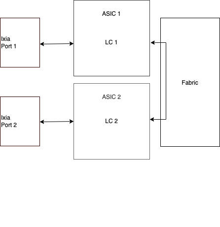
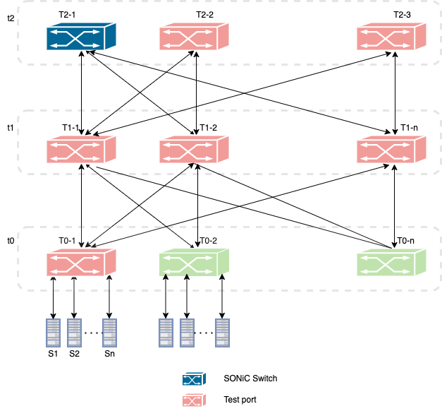
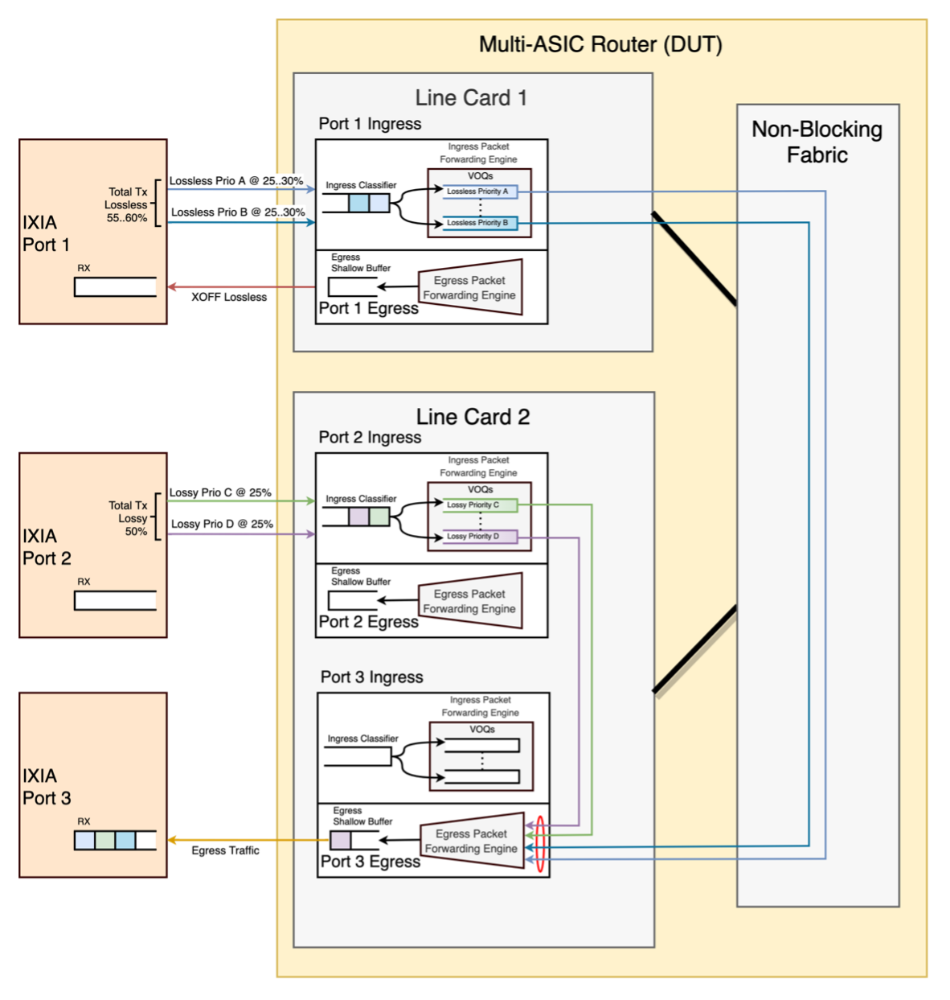
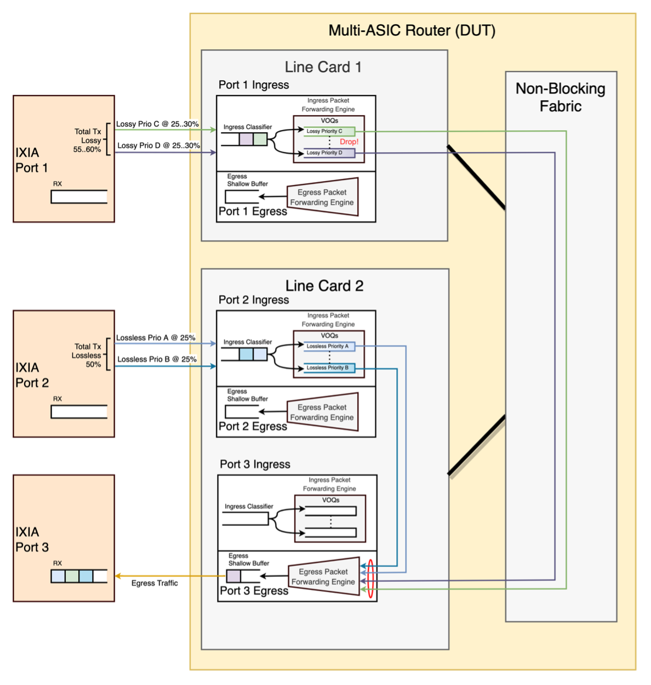
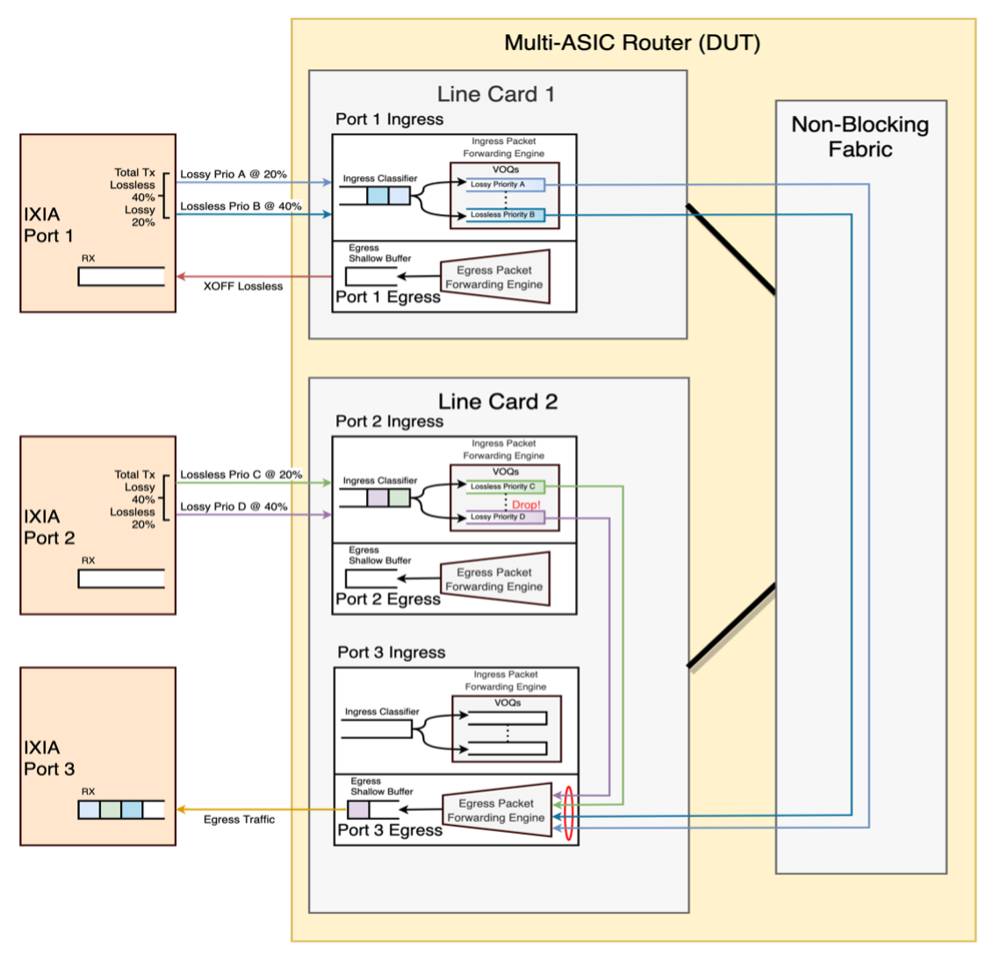
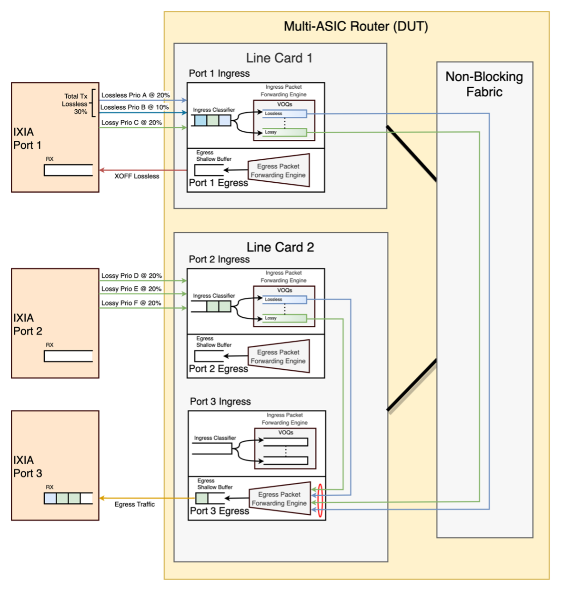
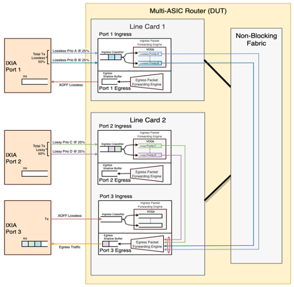

# PFC testing during congestion and oversubscription

- [PFC testing during congestion and oversubscription](#pfc-testing-during-congestion-and-oversubscription)
  - [Overview](#overview)
    - [Scope](#scope)
    - [Keysight Testbed](#keysight-testbed)
  - [Topology](#topology)
    - [SONiC DUT as T2 switch](#sonic-dut-as-t2-switch)
  - [Setup configuration](#setup-configuration)
  - [Test cases](#test-cases)
    - [Test case # 1 - Many-to-One congestion oversubscribe lossless traffic](#test-case--1---many-to-one-congestion-oversubscribe-lossless-traffic)
      - [Test objective](#test-objective)
      - [Background](#background)
      - [Testbed Setup](#testbed-setup)
      - [Test steps](#test-steps)
    - [Test case # 2 – Many-to-One Congestion oversubscribe lossy traffic](#test-case--2--many-to-one-congestion-oversubscribe-lossy-traffic)
      - [Test objective](#test-objective-1)
      - [Background](#background-1)
      - [Testbed Setup](#testbed-setup-1)
      - [Test steps](#test-steps-1)
    - [Test case # 3 – Many-to-One Congestion oversubscribe lossless and lossy traffic](#test-case--3--many-to-one-congestion-oversubscribe-lossless-and-lossy-traffic)
      - [Test objective](#test-objective-2)
      - [Background](#background-2)
      - [Testbed Setup](#testbed-setup-2)
      - [Test steps](#test-steps-2)
    - [Test case # 4 – Many-to-One with Fluctuating Lossless Traffic Congestion](#test-case--4--many-to-one-with-fluctuating-lossless-traffic-congestion)
      - [Test objective](#test-objective-3)
      - [Background](#background-3)
      - [Testbed Setup](#testbed-setup-3)
      - [Test steps](#test-steps-3)
    - [Test case # 5 – Lossless Response to External PFC Pause Storms](#test-case--5--lossless-response-to-external-pfc-pause-storms)
      - [Test objective](#test-objective-4)
      - [Background](#background-4)
      - [Testbed Setup](#testbed-setup-4)
      - [Test steps](#test-steps-4)
    - [Test case # 6 – Lossless Response to Throttling PFC Pause](#test-case--6--lossless-response-to-throttling-pfc-pause)
      - [Test objective](#test-objective-5)
      - [Background](#background-5)
      - [Testbed Setup](#testbed-setup-5)
      - [Test Steps](#test-steps-5)

## Overview
The purpose of these tests is to verify pfc behavior when the links are congested and oversubscribed and verify the performance of the SONiC chassis system, closely resembling production environment.

### Scope
These tests are targeted on fully functioning SONiC chassis system. Will cover functional testing of PFC during congestion and oversubscription scenarios.

### Keysight Testbed
The tests can run on single line card or multi line card in a sonic chassis system.

### SONiC Chassis Topology

  

## Topology
### SONiC DUT as T2 switch

  

## Setup configuration
IBGP neighborship will be established between the fabric and each line card.

## Test cases
### Test case # 1 - Many-to-One congestion oversubscribe lossless traffic
#### Test objective
Test the response of lossy and lossless streams destined to a single egress port, with lossless traffic oversubscription causing congestion.
PFC pause frames should automatically be generated by the device under test (DUT) to throttle back the lossless traffic sources causing the over-subscription, thus avoid any lossless traffic drops.
The three aspects that will be verified are whether:
1.	SONiC can send PFC pause frames on lossless priorities when there is congestion
2.	SONiC has enough PFC headroom (correctly configured watermarks)
3.	The WRR scheduler works as expected

#### Background
The diagram in the test bed setup shows a multi-ASIC router using a VOQ architecture, with line cards interconnected via a non-blocking fabric. Although the diagram appears to imply a multi-card, multi-ASIC architecture, the test and expected behavior also applies to a single-card, multi-ASIC architecture.
It is assumed that the VOQs within the ingress packet forwarding engines will request and receive credits as needed from the output ports' egress packet forwarding engines, with all the forwarding engines being treated equally regardless of whether the request/response messages need to traverse the fabric or can communicate within the same switching ASIC.
When the egress port is presented with more bandwidth that it can handle (egress congestion), the egress packet forwarding engine will use a weighted round robin (WRR) to fairly allocate bandwidth from the requestors' VOQs. For this version of the test, we will assume a SONiC configuration of a WRR scheduler with the same weights across all traffic priorities (lossy and lossless), and no strict-priority (SP) scheduling.
The case of ingress congestion would happen when the chosen input ports are serviced by the same switch ASIC's ingress forwarding engine, with a combined offered load higher than what the egress port could handle. The overall resulting behavior will still be the same, with the egress forwarding engine still allocating bandwidth to the VOQs in a fair manner per the configured schedules.
In either case, the ingress port VOQs, with not enough allocation granted for the lossless traffic streams causing the congestion, will in turn generate PFC pause (XOFF) messages out of the ingress port to temporarily stop the incoming lossless frames for the appropriate priority.

#### Testbed Setup
The test bed setup consists of three IXIA ports and a SONiC router as the device under test (DUT). All IXIA ports should have the same line speed.  The three DUT ports will be chosen at random across all the available ports in the router in order to eventually cover combinations of ports within the same line card and across line cards (or ports within the same ASIC vs. different ASICs on a single-card, multi-ASIC design).

  

#### Test steps
In this experiment we will create a total of four streams, with each of the two test ports sending two streams each. The aggregate bandwidth will be slightly over 100%:
  *	The background traffic will include two lossy traffic streams, each with randomly chosen priorities (0..2, 5..7), and each having a 25% bandwidth.
  *	The test data traffic will consist of two lossless traffic streams, with the SONiC default lossless priorities of 3 and 4, and randomized so that either both streams are at 30% bandwidth each, or for one stream to be at 25% while the other is at 30% bandwidth.

The mapping of background and test data traffic streams to IXIA transmit ports can be randomized while keeping two streams per port; for example, one test port could send two lossless traffic streams and the second port two lossy streams, or each port could send two mixed streams, one lossless, one lossy.

This experiment needs the following eight steps:
1.	Start the background traffic from IXIA Tx ports 1 & 2; the combined line rate will be 50% of the egress port capacity (25% line rate bandwidth per stream)
2.	Start the test traffic from IXIA Tx ports 1 & 2; the additional increase in bandwidth will be either 55% or 60% depending on randomization (one stream with 25% BW, second stream with 30%, or both at 30% each), for a total oversubscription of either 105% or 110%.
3.	After a few seconds, measure the received bandwidth per flow on the IXIA Rx port 3: each of the four flows should have an allocation of 25% of the total egress port bandwidth. There should be PFC pause messages being received at the IXIA transmit ports causing the over-subscription.
4.	Stop all traffic from the two IXIA ports 1 & 2
5.	On the IXIA Rx port ensure that:
a.	The received lossless traffic streams on IXIA port 3 show no missing and no out-of-order frames.
b.	The lossy traffic streams got their fair share of allocated bandwidth and did not drop frames.
6.	If possible, query the DUT drop counters to verify that no packets got discarded.
7.	Repeat the test by adding a impairment (Network emulator) device between Tx port and DUT ingress port to simulate various cable lengths and validate that PFC headroom is sufficient for variable cable lengths.
8.	Verify that the test results are same for varying cable lengths.

### Test case # 2 – Many-to-One Congestion oversubscribe lossy traffic
#### Test objective
Test the response of lossy and lossless streams destined to a single egress port, with lossy traffic causing oversubscription of the egress port.
PFC pause frames should automatically be generated by the device under test (DUT) to throttle back the lossless traffic sources causing the over-subscription, avoiding any lossless traffic drops.
The two aspects that will be verified are whether:
*	Packet drops really happen when lossy traffic suffers from congestion without triggering PFC
*	WRR scheduler works as expected

#### Background
This test uses a similar diagram and description of the multi-ASIC router as the ‘Many-to-One Lossless Traffic Congestion’ test case.
In this variant, the egress port packet forwarding engine, facing similar oversubscription demands as the previous test, will fairly grant resources to the VOQs in the packet forwarding engines.  The ingress port VOQs, with not enough allocation granted for the lossy traffic streams causing the congestion, will eventually run out of the memory buffer resources for the aggressor VOQs and will be forced drop some of their frames.

#### Testbed Setup
The test bed setup consists of three IXIA ports and a SONiC router as the device under test (DUT). All IXIA ports should have the same line speed.  The three DUT ports will be chosen at random across all the available ports in the router in order to eventually cover combinations of ports within the same line card and across line cards (or ports within the same ASIC vs. different ASICs on a single-card, multi-ASIC design).

  

#### Test steps
In this experiment we will create a total of four streams, with each of the two test ports sending two streams each. The aggregate bandwidth will be slightly over 100%:
  *	The background traffic will include two lossless traffic streams, with the SONiC default lossless priorities of 3 and 4, and each having a 25% bandwidth.
  *	The test data traffic will consist of two lossy traffic streams, each with randomly chosen priorities (0..2, 5..7), and randomized so that either both streams are at 30% bandwidth each, or for one stream to be at 25% while the other is at 30% bandwidth.

The mapping of background and test data traffic streams to IXIA transmit ports can be randomized while keeping two streams per port; for example, one test port could send two lossless traffic streams and the second port two lossy streams, or each port could send two mixed streams, one lossless, one lossy.

This experiment needs the following eight steps:
1.	Start the background traffic from IXIA Tx ports 1 & 2; the combined line rate will be 50% of the egress port capacity (25% line rate bandwidth per stream)
2.	Start the test traffic from IXIA Tx ports 1 & 2; the additional increase in bandwidth will be either 55% or 60% depending on randomization (one stream with 25% BW, second stream with 30%, or both at 30% each), for a total oversubscription of either 105% or 110%.
3.	After a few seconds, measure the received bandwidth per flow on the IXIA Rx port 3: each of the four flows should have an allocation of 25% of the total egress port bandwidth. Internally the router should be dropping lossy frames from the streams causing the over-subscription.
4.	Stop all traffic from the two IXIA ports 1 & 2
5.	On the IXIA Rx port ensure that:
a.	The received lossless traffic streams on IXIA port 3 show no missing and no out-of-order frames.
b.	The lossy traffic streams causing the oversubscription had some frame drops.
6.	If possible, query the DUT drop counters to verify that the lossy stream drops were accounted for.
7.	Repeat the test by adding a impairment (Network emulator) device between Tx port and DUT ingress port to simulate various cable lengths and validate that PFC headroom is sufficient for variable cable lengths.
8.	Verify that the test results are same for varying cable lengths.

### Test case # 3 – Many-to-One Congestion oversubscribe lossless and lossy traffic
#### Test objective
Test the response of lossy and lossless streams destined to a single egress port, with both lossless & lossy traffic causing oversubscription of the egress port.
PFC pause frames should automatically be generated by the device under test (DUT) to throttle back the lossless traffic sources causing the over-subscription, avoiding any lossless traffic drops.
The two aspects that will be verified are whether:
*	Packet drops really happen when lossy traffic suffers from congestion without triggering PFC
*	WRR scheduler works as expected

#### Background
This test uses a similar diagram and description of the multi-ASIC router as the ‘Many-to-One Lossless Traffic Congestion’ test case.
In this variant, the egress port packet forwarding engine, facing similar oversubscription demands as the previous test, will fairly grant resources to the VOQs in the packet forwarding engines.  The ingress port VOQs, with not enough allocation granted for the lossless traffic streams causing the congestion, will in turn generate PFC pause (XOFF) messages out of the ingress port to temporarily stop the incoming lossless frames for the appropriate priority and for the lossy traffic streams causing the congestion, will eventually run out of the memory buffer resources for the aggressor VOQs and will be forced drop some of their frames.

#### Testbed Setup
The test bed setup consists of three IXIA ports and a SONiC router as the device under test (DUT). All IXIA ports should have the same line speed.  The three DUT ports will be chosen at random across all the available ports in the router in order to eventually cover combinations of ports within the same line card and across line cards (or ports within the same ASIC vs. different ASICs on a single-card, multi-ASIC design).

  

#### Test steps
In this experiment we will create a total of four streams, with each of the two test ports sending two streams each. The aggregate bandwidth will be slightly over 100%:
  *	The test data traffic will include two lossless traffic streams, with the SONiC default lossless priorities of 3 and 4, and first stream having a 40% bandwidth from port 1 and second stream having 20% of bandwidth from port 2.
  *	The background traffic will consist of two lossy traffic streams, each with randomly chosen priorities (0..2, 5..7), and one stream to be at 20% from port 1while the other is at 40% bandwidth from port 2.

The mapping of background and test data traffic streams to IXIA transmit ports can be randomized while keeping two streams per port; for example, one test port could send two lossless traffic streams and the second port two lossy streams, or each port could send two mixed streams, one lossless, one lossy.

This experiment needs the following eight steps:
1. Start the test data traffic from IXIA Tx ports 1; the combined line rate will be 60% of the egress port capacity.
2. Start the background traffic from IXIA Tx ports 2; the additional increase in bandwidth will be 60%, for a total oversubscription of 120%.
3. After a few seconds, measure the received bandwidth per flow on the IXIA Rx port 3: test data traffic and background traffic with 20% of bandwidth should not lose any packet. Internally the router should be dropping lossy frames from the streams causing the over-subscription (Port 2). There should be PFC pause messages being received at the IXIA transmit port 1 stream 2 causing the over-subscription.
4.	Stop all traffic from the two IXIA ports 1 & 2
5.	On the IXIA Rx port ensure that:
a.	The received lossless traffic streams on IXIA port 3 show no missing and no out-of-order frames.
b.	The lossy traffic streams causing the oversubscription had some frame drops.
6.	If possible, query the DUT drop counters to verify that the lossy stream drops were accounted for.
7.	Repeat the test by adding a impairment (Network emulator) device between Tx port and DUT ingress port to simulate various cable lengths and validate that PFC headroom is sufficient for variable cable lengths.
8.	Verify that the test results are same for varying cable lengths.

### Test case # 4 – Many-to-One with Fluctuating Lossless Traffic Congestion
#### Test objective
Test the dynamic response of lossy and lossless streams destined to a single egress port when the lossless streams cause periods of over-subscription.
PFC pause frames should automatically be generated by the device under test (DUT) to throttle back the lossless traffic sources causing the over-subscription, avoiding any lossless traffic drops. The PFC pause frame generation should stop once the over-subscription condition subsides.

#### Background
This test uses a similar diagram and description of the multi-ASIC router as the ‘Many-to-One Lossless Traffic Congestion’ test case (it is indeed a superset of that test).
In this variant, we will use all the lossy and lossless traffic priorities simultaneously, and will expect an even distribution of traffic across all eight priorities even under periods of oversubscription caused by lossless traffic streams. The assumption is that the SONiC default scheduler will allocate same weights to all eight priorities in its WRR scheduler with no strict priority (SP) priorities configured.

#### Testbed Setup

The test bed setup consists of three IXIA ports and a SONiC router as the device under test (DUT). All IXIA ports should have the same line speed.  The three DUT ports will be chosen at random across all the available ports in the router in order to eventually cover combinations of ports within the same line card and across line cards (or ports within the same ASIC vs. different ASICs on a single-card, multi-ASIC design).

  

#### Test steps
  In this experiment we will create a total of six streams, four lossy streams and two lossless streams:
  *	The background traffic will include four lossy traffic streams, with any priorities 0..2 and 5..6, each having 20% bandwidth for a total of 80% of the port line rate.
  *	The test data traffic will include two lossless traffic flows, with the SONiC default lossless priorities of 3 and 4.
  *	Each of lossless traffic flows will be shaped to have line rate of 20% and 10%, so that there are periods where both lossless flows contribute a bandwidth of 30% (which should cause over-subscription on the egress port).

The mapping of background and test data traffic streams to IXIA transmit ports can be randomized; the only constraint is for a transmit port to have at least one stream assigned to it.
 This experiment needs the following steps:
1.	Start the background and test traffic from IXIA Tx ports 1 & 2.
2.	The combined bandwidth of all the streams going to the egress port will be 110% (over-subscription).
3.	After a few seconds, measure the received bandwidth per flow on the IXIA Rx port 3: each of the four lossy flows should have an allocation of 18% of the total egress port bandwidth. Lossless flows should have an allocation of 18% and 10% of the total egress port bandwidth. There should be PFC pause messages being received at the IXIA transmit port(s) causing the over-subscription.
4.	Perform a few more bandwidth samples to ensure there are no drastic changes in the final allocated bandwidth across all traffic priorities.
5.	Stop all traffic from the two IXIA Tx ports
6.	On the IXIA Rx port ensure that:
a.	The received lossless traffic streams on IXIA port 3 show no missing and no out-of-order frames.
b.	The lossy traffic streams got their fair share of allocated bandwidth and did not drop frames.
7.	If possible, query the DUT drop counters to verify that no packets got discarded.
8.	Repeat the test by adding a impairment (Network emulator) device between Tx port and DUT ingress port to simulate various cable lengths.
9.	Verify that the test results are same for varying cable lengths.

### Test case # 5 – Lossless Response to External PFC Pause Storms
#### Test objective
Test the dynamic response of lossless streams when subject to continuous external PFC pause messages intending to fully block their bandwidth.
The key question to answer is whether DUT’s PFC mechanism responds fast enough to fully stop lossless streams without drops.

#### Background
This test uses a similar diagram and description of the multi-ASIC router as the 'Lossless Traffic Causing Egress or Ingress Congestion' test case.
Rather than using traffic aggregation to cause over-subscription, we will create conditions of egress congestion by applying periods of continuous PFC pause messages into the egress port.
Similar to the cases of lossless traffic congestion, an egress packet forwarding engine receiving a PFC pause message for a particular priority will stop granting resources to any VOQs requesting credits for the egress port and priority combination.  The affected VOQs in the ingress packet forwarding engines will in-turn fill-up their buffering resources, eventually hitting watermarks that will cause the ingress port to apply backpressure to the sender via PFC pause out of its port.
In this test case we will also assume that all the lossy and lossless traffic priorities have a WRR scheduler configured with the same weights across all eight priorities, with no strict priority (SP) priorities configured.

#### Testbed Setup
The test bed setup consists of three IXIA ports and a SONiC router as the device under test (DUT). All IXIA ports should have the same line speed.  The three DUT ports will be chosen at random across all the available ports in the router in order to eventually cover combinations of ports within the same line card and across line cards (or ports within the same ASIC vs. different ASICs on a single-card, multi-ASIC design).

  

In addition, PFC watchdog must be disabled at the SONiC DUT. Otherwise, the DUT will trigger PFC watchdog to drop packets when it detects persistent PFC pause storms. The command to disable PFC watchdog is sudo pfcwd stop.

#### Test steps
In this experiment we will create a total of five traffic items:
  *	The background traffic will include two lossy traffic streams, each with randomly chosen priorities (0..2, 5..7), and each having a 25% bandwidth.
  *	The test data traffic will consist of two lossless traffic streams, with the SONiC default lossless priorities of 3 and 4, and each having a 25% bandwidth.
  * PFC pause storm: Persistent PFC pause frames from the IXIA Rx port. The priority of PFC pause frames will be randomized to those of the test data traffic streams, or include all lossless priorities. The inter-frame transmission interval should be smaller than the per-frame pause duration.
The mapping of background and test data traffic streams to IXIA transmit ports can be randomized while keeping two streams per port; for example, one test port could send two lossless traffic streams and the second port two lossy streams, or each port could send two mixed streams, one lossless, one lossy.

This experiment needs the following six steps:
1.	Start the background and test traffic from IXIA Tx ports 1 & 2; the combined line rate will be 100% of the egress port capacity (25% line rate bandwidth per stream)
2.	After a few seconds, start the PFC pause storm to fully block one or all test priorities at the switch. Ensure that:
a.	The IXIA Rx port is receiving all lossy streams and any of the lossless streams not marked for PFC pause due to randomization.
b.	The IXIA Rx port does not receive any of the lossless streams marked to be fully blocked by PFC.
c.	If possible, query the DUT drop and watermark counters
3.	After a few more seconds, stop the PFC pause storm; ensure that the IXIA Rx port statistics show that 100% of the traffic is being received.
4.	Repeat steps 2 & 3 a few times, possibly with different PFC storm durations.
5.	Stop the PFC storm and all traffic.
6.	On the IXIA Rx port ensure that:
a.	The received lossless traffic streams on IXIA port 3 show no missing and no out-of-order frames.
b.	The lossy traffic streams did not drop frames.

### Test case # 6 – Lossless Response to Throttling PFC Pause
#### Test objective
Test the reduction in lossless streams bandwidth when subject to throttling PFC pause messages. The PFC watchdog, which should be enabled for this test, should not intervene.

#### Background
This test uses the same configuration and test bed as  similar diagram and description of the multi-ASIC router as the ‘Lossless Response to External PFC Pause Storms ' test case.

In this test case we will also assume that all the lossy and lossless traffic priorities have a WRR scheduler configured with the same weights across all eight priorities, with no strict priority (SP) priorities configured.

#### Testbed Setup
The test bed setup consists of three IXIA ports and a SONiC router as the device under test (DUT). All IXIA ports should have the same line speed.  The three DUT ports will be chosen at random across all the available ports in the router in order to eventually cover combinations of ports within the same line card and across line cards (or ports within the same ASIC vs. different ASICs on a single-card, multi-ASIC design).

  

In addition, PFC watchdog must be enabled at the SONiC DUT (default mode of operation).

#### Test Steps

In this experiment we will create a total of five traffic items:
*	The background traffic will include two lossy traffic streams, each with randomly chosen priorities (0..2, 5..7), and each having a 25% bandwidth.
*	The test data traffic will consist of two lossless traffic streams, with the SONiC default lossless priorities of 3 and 4, and each having a 25% bandwidth.
*	PFC pause throttling stream: Persistent PFC pause frames from the IXIA Rx port with enough repetition and quanta chosen so as to reduce one or all lossless streams down to 90% of their configured bandwidth.

The mapping of background and test data traffic streams to IXIA transmit ports can be randomized while keeping two streams per port; for example, one test port could send two lossless traffic streams and the second port two lossy streams, or each port could send two mixed streams, one lossless, one lossy.

This experiment needs the following six steps:
1.	Start the background and test traffic from IXIA Tx ports 1 & 2; the combined line rate will be 100% of the egress port capacity (25% line rate bandwidth per stream)
2.	After a few seconds, from IXIA port 3, start the PFC throttling stream onto one or all lossless priorities. Ensure that:
a.	The IXIA RX port indicates that the targeted lossless streams got their bandwidth reduced by 90%
b.	The IXIA Rx port is receiving all lossy streams and any of the lossless streams not marked for PFC pause to their nominal configured transmit bandwidth.
c.	If possible, query the DUT drop and watermark counters
3.	After a few more seconds, stop the PFC throttling stream; ensure that the IXIA Rx port statistics show that 100% of the traffic is being received.
4.	Repeat steps 2 & 3 a few times, possibly with different throttling durations.
5.	Stop the PFC throttling stream and all traffic.
6.	On the IXIA Rx port ensure that:
a.	The received lossless traffic streams on IXIA port 3 show no missing and no out-of-order frames.
b.	The lossy traffic streams did not drop frames.
