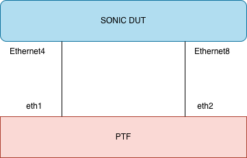

# Feature Name
SonicMgmt Testcases for PVST
# High Level Design Document
#### Rev 1.0

# Table of Contents
  * [List of Tables](#list-of-tables)
  * [Revision](#revision)
  * [About this Manual](#about-this-manual)
  * [Scope](#scope)
  * [Testing Strategy for PVST feature](#testing-strategy-for-pvst-feature)
  * [Test cases](#test-cases)
    * [TC1: Validate SONIC DUT acting as root bridge](#tc1-validate-sonic-dut-acting-as-root-bridge)
    * [TC2: Validate SONIC DUT as designated bridge](#tc2-validate-sonic-dut-as-designated-bridge)
    * [TC3: Validate shutting down the root port on SONIC DUT](#tc3-validate-shutting-down-the-root-port-on-sonic-dut)
    * [TC4: Validate bridge priority configuration on SONIC DUT](#tc4-validate-bridge-priority-configuration-on-sonic-dut)
    * [TC5: Validate port priority change in BPDU](#tc5-validate-port-priority-change-in-bpdu)
    * [TC6: Validate port cost change in BPDU](#tc6-validate-port-cost-change-in-bpdu)
    * [TC7: Validate root guard functionality on SONIC DUT](#tc7-validate-root-guard-functionality-on-sonic-dut)
    * [TC8: Validate BPDU guard functionality on SONIC DUT](#tc8-validate-bpdu-guard-functionality-on-sonic-dut)
    * [TC9: Validate PVST timer configurations](#tc9-validate-pvst-timer-configurations)
    * [TC10: Validate Backup port functionality](#tc10-validate-backup-port-functionality)
    * [TC11: Validate Mac flush functionality](#tc11-validate-mac-flush-functionality)
  * [References](#references)
  * [Abbreviations](#abbreviations)
  * [Revision](#revision)


# List of Tables
[Table 1: Abbreviations](#table-1-abbreviations)

PVST - Per Vlan Spanning Tree

# Revision
| Rev |     Date    |       Author               | Change Description                |
|:---:|:-----------:|:--------------------------:|-----------------------------------|
| 0.1 | 24/07/2025  |     Venkata Gouri Rajesh E, Praveen Hoskote Madhusudana       | Initial version                   |

# About this Manual
This document describes the approach taken adding support for PVST feature testing as part of sonic-mgmt test suite.
# Scope
This document describes the high level details of SONiC management test-cases for PVST feature.

# Testing Strategy for PVST feature:
Existing t0 topology will be used for developing the PVST test suite. 
A simplified version of the topology will be as shown above where the SONIC DUT ports will be connected to PTF.
Following mechanisms will be used in the test script implementation

- SONIC DUT will be configured using the available CLICK CLIs for PVST
- Verification of operational data will be performed by fetching the data from the redis DB (like spanning tree port states, root port, root bridge etc)
- PTF will be used to validate the BPDUs received from SONIC DUT. For example, based on any configuration change on SONIC DUT whether the information is reflected in the BPDUs (Ex - bridge priority, timer value etc).
- PTF will be used to generate the BPDUs as well. For example, to simulate a peer device acting as root bridge, PTF will generate BPDUs with better bridge priority than the DUT bridge priority. Packets need to be generated periodically from PTF to simulate the expected protocol behaviour.

# Topology



# Test cases:
The test cases here are to validate the basic functionality of PVST feature.

## TC1: Validate SONIC DUT acting as root bridge
1)	Enable PVST in global mode on SONIC DUT. This will enable PVST on the already configured VLAN 1000.
     ```
      config spanning-tree enable pvst
     ```
2)	SONIC DUT should start transmitting the BPDUs after enabling PVST. Verify SONIC DUT is acting as the root bridge by checking the root bridge id in APP DB.
     ```
      127.0.0.1:6379> hgetall _STP_VLAN_TABLE:Vlan100
      1) "bridge_id"
      2) "80640255aaeb76d7"
      3) "max_age"
      4) "20"
      5) "hello_time"
      6) "2"
      7) "forward_delay"
      8) "15"
      9) "hold_time"
      10) "1"
      11) "root_bridge_id"
      12) "80640255aaeb76d7"
      13) "root_path_cost"
      14) "0"
      15) "desig_bridge_id"
      16) "80640255aaeb76d7"
      17) "root_port"
      18) "Root"
      19) "root_max_age"
      20) "20"
      21) "root_hello_time"
      22) "2"
      23) "root_forward_delay"
      24) "15"
      25) "stp_instance"
      26) "0"
      27) "topology_change_count"
      28) "2"
      29) "last_topology_change"
      30) "3513"
      127.0.0.1:6379> 

     ```
3)	Verify the port state transitions on SONIC DUT from listening -> learning -> forwarding
     ```
      127.0.0.1:6379> hgetall "_STP_VLAN_PORT_TABLE:Vlan100:Ethernet8"
      1) "port_num"
      2) "8"
      3) "priority"
      4) "128"
      5) "path_cost"
      6) "200"
      7) "port_state"
      8) "FORWARDING"
      9) "desig_cost"
      10) "0"
      11) "desig_root"
      12) "80640255aaeb76d7"
      13) "desig_bridge"
      14) "80640255aaeb76d7"
      15) "desig_port"
      16) "8"
      17) "bpdu_sent"
      18) "1936"
      19) "bpdu_received"
      20) "0"
      21) "tc_sent"
      22) "0"
      23) "tc_received"
      24) "0"
      25) "root_guard_timer"
      26) "0"
      127.0.0.1:6379> 

     ```
4)	On PTF capture the BPDUs on Ethernet4 and Ethernet8, validate with the expected BPDU packet.
5)	From PTF, send L2 data packets from Ethernet4 on VLAN 1000 and verify it’s received back on Ethernet8

## TC2: Validate SONIC DUT as designated bridge
1)	From PTF send packets with better bridge priority than SONIC DUT from all the ports
2)	Verify on SONIC DUT the root bridge is selected with root bridge id sent in the BPDU from PTF
     ```
      127.0.0.1:6379> hgetall _STP_VLAN_TABLE:Vlan100
      1) "bridge_id"
      2) "80640255aaeb76d7"
      3) "max_age"
      4) "20"
      5) "hello_time"
      6) "2"
      7) "forward_delay"
      8) "15"
      9) "hold_time"
      10) "1"
      11) "root_bridge_id"
      12) "80640255aaeb76d7"
      13) "root_path_cost"
      14) "0"
      15) "desig_bridge_id"
      16) "80640255aaeb76d7"
      17) "root_port"
      18) "Root"
      19) "root_max_age"
      20) "20"
      21) "root_hello_time"
      22) "2"
      23) "root_forward_delay"
      24) "15"
      25) "stp_instance"
      26) "0"
      27) "topology_change_count"
      28) "2"
      29) "last_topology_change"
      30) "3513"
      127.0.0.1:6379> 

     ```

3)	Verify on SONIC DUT the root port is selected, and root port is in forwarding state by fetching the information from STP_VLAN_TABLE and STP_VLAN_PORT_TABLE entries from APP DB
     ```
      127.0.0.1:6379> hgetall "_STP_VLAN_PORT_TABLE:Vlan100:Ethernet8"
      1) "port_num"
      2) "8"
      3) "priority"
      4) "128"
      5) "path_cost"
      6) "200"
      7) "port_state"
      8) "FORWARDING"
      9) "desig_cost"
      10) "0"
      11) "desig_root"
      12) "80640255aaeb76d7"
      13) "desig_bridge"
      14) "80640255aaeb76d7"
      15) "desig_port"
      16) "8"
      17) "bpdu_sent"
      18) "1936"
      19) "bpdu_received"
      20) "0"
      21) "tc_sent"
      22) "0"
      23) "tc_received"
      24) "0"
      25) "root_guard_timer"
      26) "0"
      127.0.0.1:6379> 

     ```
4)	Verify on SONIC DUT port Ethernet8 is in blocking state
5)	From PTF send L2 data packets from Ethernet4 for VLAN 1000 and verify it’s not received back on Ethernet8 as the port is in blocking state
6)	Verify the source MAC of the packet sent is learnt on Etherent4 for VLAN 1000 on SONIC DUT
    ```
    show mac
    ```
7)	From PTF send L2 data packets from Ethernet8 for VLAN 1000 and verify it’s not received back on Ethernet4 as Ethernet8 is in blocking state
8)	Verify the source MAC of the packet sent is not learnt on Ethernet8 for VLAN 100 on SONIC DUT as port is in blocking state


## TC3: Validate shutting down the root port on SONIC DUT
1)	From PTF send packets with better bridge priority than SONIC DUT from all the ports
2)	Verify on SONIC DUT port Ethernet4 is in forwarding state and Ethernet8 is in blocking state.
     ```
      127.0.0.1:6379> hgetall "_STP_VLAN_PORT_TABLE:Vlan100:Ethernet8"
      1) "port_num"
      2) "8"
      3) "priority"
      4) "128"
      5) "path_cost"
      6) "200"
      7) "port_state"
      8) "BLOCKING"
      9) "desig_cost"
      10) "0"
      11) "desig_root"
      12) "80640255aaeb76d7"
      13) "desig_bridge"
      14) "80640255aaeb76d7"
      15) "desig_port"
      16) "8"
      17) "bpdu_sent"
      18) "1936"
      19) "bpdu_received"
      20) "0"
      21) "tc_sent"
      22) "0"
      23) "tc_received"
      24) "0"
      25) "root_guard_timer"
      26) "0"
      127.0.0.1:6379> 

     ```

3)	Shutdown the Ethernet4 port and verify Ethernet8 moves to forwarding state on SONIC DUT
    ```
    config interface shutdown Ethernet4 
    ```
4)	Enable (startup) the port Ethernet4 and verify Ethernet4 moves to forwarding state and Ethernet8 moves to blocking state again.
    ```
    config interface startup Ethernet4 
    ```

## TC4: Validate bridge priority configuration on SONIC DUT
1)	From PTF send packets with better bridge priority than SONIC DUT from all the ports
2)	Verify on SONIC DUT the root bridge is selected with root bridge id sent in the BPDU from PTF
     ```
      127.0.0.1:6379> hgetall _STP_VLAN_TABLE:Vlan100
      1) "bridge_id"
      2) "80640255aaeb76d7"
      3) "max_age"
      4) "20"
      5) "hello_time"
      6) "2"
      7) "forward_delay"
      8) "15"
      9) "hold_time"
      10) "1"
      11) "root_bridge_id"
      12) "80640255aaeb76d7"
      13) "root_path_cost"
      14) "0"
      15) "desig_bridge_id"
      16) "80640255aaeb76d7"
      17) "root_port"
      18) "Root"
      19) "root_max_age"
      20) "20"
      21) "root_hello_time"
      22) "2"
      23) "root_forward_delay"
      24) "15"
      25) "stp_instance"
      26) "0"
      27) "topology_change_count"
      28) "2"
      29) "last_topology_change"
      30) "3513"
      127.0.0.1:6379> 

     ```

3)	Modify the bridge priority on SONIC DUT so that it has better bridge priority than PTF generated packets
     ```
     config spanning-tree vlan priority 100 8192
     ```
4)	Verify on SONIC DUT the root bridge is selected as self, and all ports are in forwarding state
5)	On PTF capture the packets generated on Ethernet interfaces and verify the root bridge id is same as SONIC DUT

## TC5: Validate port priority change in BPDU
1)	From PTF send packets with better bridge priority than SONIC DUT from all the ports
2)	Verify on SONIC DUT the root bridge is selected with root bridge id sent in the BPDU from PTF
     ```
      127.0.0.1:6379> hgetall _STP_VLAN_TABLE:Vlan100
      1) "bridge_id"
      2) "80640255aaeb76d7"
      3) "max_age"
      4) "20"
      5) "hello_time"
      6) "2"
      7) "forward_delay"
      8) "15"
      9) "hold_time"
      10) "1"
      11) "root_bridge_id"
      12) "80640255aaeb76d7"
      13) "root_path_cost"
      14) "0"
      15) "desig_bridge_id"
      16) "80640255aaeb76d7"
      17) "root_port"
      18) "Root"
      19) "root_max_age"
      20) "20"
      21) "root_hello_time"
      22) "2"
      23) "root_forward_delay"
      24) "15"
      25) "stp_instance"
      26) "0"
      27) "topology_change_count"
      28) "2"
      29) "last_topology_change"
      30) "3513"
      127.0.0.1:6379> 

     ```
3)	Verify on SONIC DUT the root port is selected, and root port is in forwarding state by fetching the information from STP_VLAN_TABLE and STP_VLAN_PORT_TABLE entries from APP DB
     ```
      127.0.0.1:6379> hgetall "_STP_VLAN_PORT_TABLE:Vlan100:Ethernet8"
      1) "port_num"
      2) "8"
      3) "priority"
      4) "128"
      5) "path_cost"
      6) "200"
      7) "port_state"
      8) "FORWARDING"
      9) "desig_cost"
      10) "0"
      11) "desig_root"
      12) "80640255aaeb76d7"
      13) "desig_bridge"
      14) "80640255aaeb76d7"
      15) "desig_port"
      16) "8"
      17) "bpdu_sent"
      18) "1936"
      19) "bpdu_received"
      20) "0"
      21) "tc_sent"
      22) "0"
      23) "tc_received"
      24) "0"
      25) "root_guard_timer"
      26) "0"
      127.0.0.1:6379> 

     ```
4)	Verify on SONIC DUT port Ethernet8 is in blocking state
5)	From PTF, send a BPDU with better port priority to Ethernet8 port of SONIC DUT
6)	Verify on SONIC DUT port Ethernet8 becomes root port and moves to forwarding state and Ethernet4 moves to blocking state.

## TC6: Validate port cost change in BPDU
1)	From PTF send packets with better bridge priority than SONIC DUT to Ethernet4
2)	Verify on SONIC DUT the root bridge is selected with root bridge id sent in the BPDU from PTF
    ```
      127.0.0.1:6379> hgetall _STP_VLAN_TABLE:Vlan100
      1) "bridge_id"
      2) "80640255aaeb76d7"
      3) "max_age"
      4) "20"
      5) "hello_time"
      6) "2"
      7) "forward_delay"
      8) "15"
      9) "hold_time"
      10) "1"
      11) "root_bridge_id"
      12) "80640255aaeb76d7"
      13) "root_path_cost"
      14) "0"
      15) "desig_bridge_id"
      16) "80640255aaeb76d7"
      17) "root_port"
      18) "Root"
      19) "root_max_age"
      20) "20"
      21) "root_hello_time"
      22) "2"
      23) "root_forward_delay"
      24) "15"
      25) "stp_instance"
      26) "0"
      27) "topology_change_count"
      28) "2"
      29) "last_topology_change"
      30) "3513"
      127.0.0.1:6379> 

     ```
3)	On PTF, check the received BPDU from Ethernet8 of SONIC DUT. The received BPDU should consists of root bridge as per the PTF generated packet and designated bridge as SONIC DUT, root path cost should be as per the default value set for Ethernet4
    ```
    show spanning-tree vlan 100
    show spanning-tree interface Ethernet4
    ```

4)	Update the port cost of Ethernet4 on SONIC DUT using the config command.
5)	On PTF, verify the received BPDU from Ethernet8 has the root path cost with the configured port cost of Ethernet4.

## TC7: Validate root guard functionality on SONIC DUT
1)	On SONIC DUT enable root guard on Ethernet4 and Ethernet8
    ```
    config spanning-tree interface root_guard enable Ethernet4
    ```

2)	From PTF send packets with better bridge priority than SONIC DUT to Ethernet4 and Ethernet8
3)	Verify on SONIC DUT the port is moved into Root inconsistent state
     ```
      127.0.0.1:6379> hgetall "_STP_VLAN_PORT_TABLE:Vlan100:Ethernet8"
      1) "port_num"
      2) "8"
      3) "priority"
      4) "128"
      5) "path_cost"
      6) "200"
      7) "port_state"
      8) "ROOT-INC"
      9) "desig_cost"
      10) "0"
      11) "desig_root"
      12) "80640255aaeb76d7"
      13) "desig_bridge"
      14) "80640255aaeb76d7"
      15) "desig_port"
      16) "8"
      17) "bpdu_sent"
      18) "1936"
      19) "bpdu_received"
      20) "0"
      21) "tc_sent"
      22) "0"
      23) "tc_received"
      24) "0"
      25) "root_guard_timer"
      26) "0"
      127.0.0.1:6379> 

     ```
4)	Stop sending the BPDUs from PTF
5)	Verify the ports on SONIC DUT move to forwarding state after 120 seconds
    ```
    config spanning-tree interface root_guard disable Ethernet4
    ```

## TC8: Validate BPDU guard functionality on SONIC DUT
1)	On SONIC DUT enable BPDU guard with shutdown enabled on Ethernet4
2)	From PTF send BPDUs to SONIC DUT on Ethernet4
    ```
    config spanning-tree interface bpdu_guard enable Ethernet4 --shutdown
    ```
3)	Verify BPDU guard kicks in and shuts down port Ethernet4, by verifying the operational state of port from APP DB
     ```
      127.0.0.1:6379> hgetall "_STP_VLAN_PORT_TABLE:Vlan100:Ethernet8"
      1) "port_num"
      2) "8"
      3) "priority"
      4) "128"
      5) "path_cost"
      6) "200"
      7) "port_state"
      8) "BPDU-DIS"
      9) "desig_cost"
      10) "0"
      11) "desig_root"
      12) "80640255aaeb76d7"
      13) "desig_bridge"
      14) "80640255aaeb76d7"
      15) "desig_port"
      16) "8"
      17) "bpdu_sent"
      18) "1936"
      19) "bpdu_received"
      20) "0"
      21) "tc_sent"
      22) "0"
      23) "tc_received"
      24) "0"
      25) "root_guard_timer"
      26) "0"
      127.0.0.1:6379> 

     ```
4)	Disable BPDU guard on the port Ethernet4
    ```
    config spanning-tree interface bpdu_guard disable Ethernet4
    ```
5)	Enable port Ethernet4 using CLI command
6)	From PTF send BPDUs to SONIC DUT on Ethernet4
7)	Verify the BPDU guard doesn’t kick in by verifying the Ethernet4 port state is still UP

## TC9: Validate PVST timer configurations
1)	Modify the hello interval from default value to 3 secs
2)	On PTF capture the packet and verify the hello interval in the BPDU is set to 3 secs
3)	Modify the forward delay from default value to 20 secs
4)	On PTF capture the packet and verify the forward delay in the BPDU is set to 20 secs
5)	Modify the max age from default value to 25 secs
     ```
      config spanning-tree vlan hello 100 5

      config spanning-tree vlan max_age 100 25
                         

      config spanning-tree vlan forward_delay 100 20
     ```
6)	On PTF capture the packet and verify the max age in the BPDU is set to 25 secs

## TC10: Validate Backup port functionality
1)	Configure DUT to be the root bridge
2)	On PTF capture the BPDU generated by DUT on Ethernet4 and use same BPDU to send it back on Ethernet8
3)	Verify on DUT port Ethernet8 is moved into blocking state as it receives its own BPDU
4)	Wait for 60seconds and verify port Ethernet8 moves to forwarding state as DUT is not getting its own BPDU now.

## TC11: Validate Mac flush functionality
1)	Verify SONIC DUT is acting as the root bridge by checking the root bridge id in APP DB.
    ```
      127.0.0.1:6379> hgetall _STP_VLAN_TABLE:Vlan100
      1) "bridge_id"
      2) "80640255aaeb76d7"
      3) "max_age"
      4) "20"
      5) "hello_time"
      6) "2"
      7) "forward_delay"
      8) "15"
      9) "hold_time"
      10) "1"
      11) "root_bridge_id"
      12) "80640255aaeb76d7"
      13) "root_path_cost"
      14) "0"
      15) "desig_bridge_id"
      16) "80640255aaeb76d7"
      17) "root_port"
      18) "Root"
      19) "root_max_age"
      20) "20"
      21) "root_hello_time"
      22) "2"
      23) "root_forward_delay"
      24) "15"
      25) "stp_instance"
      26) "0"
      27) "topology_change_count"
      28) "2"
      29) "last_topology_change"
      30) "3513"
      127.0.0.1:6379> 

     ```
2)	On PTF, capture and validate L2 traffic sent from Ethernet4  to Ethernet8  over VLAN 1000.
3)	 Ensure that the MAC address is learned on the SONIC DUT for the receiving port Ethernet4.
     ```
       show mac
     ```
4)	From PTF, send a TCN BPDU packet to trigger MAC flush.
5)	Verify that MAC address entries on SONIC DUT for Ethernet4 are flushed (reduced in count).
