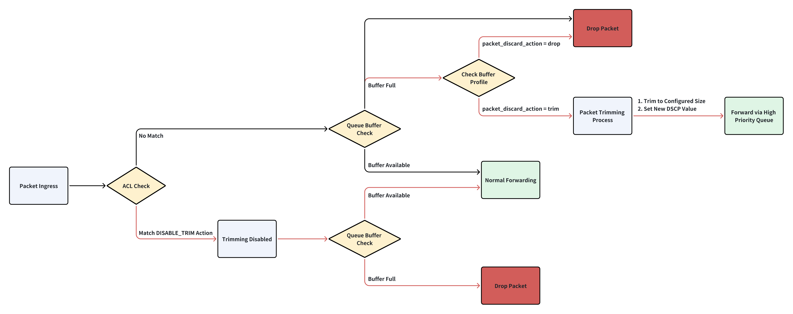

# 1. Feature Overview
In traditional packet loss handling, when a lossy queue exceeds its buffer threshold, packets are silently dropped without notifying the destination host. While packet recovery can occur via fast retransmission or timeout-based retransmission, the latter method introduces significant latency, degrading application performance.

Packet Trimming is an enhancement mechanism designed to optimize network performance during congestion conditions. It will trim packet to a configured size, and try sending it on a different queue to deliver a packet drop notification to an end host. This speeds up retransmissions and reduces network latency.


# 2. Packet Flow


**Notes**:
- Black line: Packet processing flow **without** the trimming function
- Red line: Packet processing flow **with** the trimming function

**Packet Flow**:
1. When a packet enters the switch, the switch will check the packet according to the configured ACL rules.
   - If packet does not match ACL rule with the `DISABLE_TRIM` action, it will enter its assigned queue.
   - If packet match an ACL rule with the `DISABLE_TRIM` action, it will not be trimmed even if the buffer is full. Even if the Buffer Profile of the queue is configured with `packet_discard_action = "trim"`, the packet will be discarded without trimming.

2. If the packet does not match any ACL rule, the packet enters the specified queue and checks whether the queue buffer has enough space.
   - If the buffer has space -> forward normally
   - If the buffer is full -> proceed to the next step

3. Check the `packet_discard_action` parameter of the Buffer Profile configuration for the queue application:
   - If set to `drop` -> directly discard the entire packet
   - ​​If set to `trim` -> enter the trimming process

4. Trimming of packets
   - Trimming packets to the configured size
   - Setting new DSCP values
   - Sending trimmed packets to the specified queue


# 3. Symmetric / Asymmetric DSCP
## 1. Symmetric DSCP
Symmetric DSCP uses the same DSCP value for the trimmed packets sent from different ports. In this case, the receiver cannot identify the source of congestion.


```json
{
    "SWITCH_TRIMMING": {
        "GLOBAL": {
            "size": "256",
            "dscp_value": "10",
            "queue_index": "6"
        }
    }
}
```

## 2. Asymmetric DSCP
Asymmetric DSCP allows different DSCP values to be used for trimmed packets sent through different ports. This mechanism helps the receiver to distinguish where the congestion is occurring.


```json
{
    "SWITCH_TRIMMING": {
        "GLOBAL": {
            "size": "256",
            "dscp_value": "from-tc",
            "tc_value": "5",
            "queue_index": "6"
        }
    },
    "TC_TO_DSCP_MAP": {
        "host_trim_map": {
            "5": "10"
        },
        "spine_trim_map": {
            "5": "20"
        }
    },
    "PORT_QOS_MAP": {
        "Ethernet0": {
            "tc_to_dscp_map": "host_trim_map"
        },
        "Ethernet4": {
            "tc_to_dscp_map": "spine_trim_map"
        }
    }
}
```


# 4. Packet Trimming Drop Counter
## Queue Level
- `SAI_QUEUE_STAT_TRIM_PACKETS` ---> `Trim/pkts`
- `SAI_QUEUE_STAT_TX_TRIM_PACKETS` ---> `TrimSent/pkts`
- `SAI_QUEUE_STAT_DROPPED_TRIM_PACKETS` ---> `TrimDrop/pkts`
  ```
  root@sonic:/home/admin# show queue counters Ethernet0 --all
       Port    TxQ    Counter/pkts    Counter/bytes    Drop/pkts    Drop/bytes    Trim/pkts    TrimSent/pkts    TrimDrop/pkts
  ---------  -----  --------------  ---------------  -----------  ------------  -----------  ---------------  ---------------
  Ethernet0    UC0             N/A              N/A          N/A           N/A          N/A              N/A              N/A
  Ethernet0    UC1             N/A              N/A          100          6400          100               50               50
  Ethernet0    UC2             N/A              N/A          N/A           N/A          N/A              N/A              N/A
  Ethernet0    UC3             100             6400          N/A           N/A          N/A              N/A              N/A
  Ethernet0    UC4             N/A              N/A          N/A           N/A          N/A              N/A              N/A
  Ethernet0    UC5             N/A              N/A          N/A           N/A          N/A              N/A              N/A
  Ethernet0    UC6             N/A              N/A          N/A           N/A          N/A              N/A              N/A
  Ethernet0    UC7             N/A              N/A          N/A           N/A          N/A              N/A              N/A
  ```

## Port Level
- `SAI_PORT_STAT_TRIM_PACKETS` ---> `TRIM_PKTS`
- `SAI_PORT_STAT_TX_TRIM_PACKETS` ---> `TRIM_TX_PKTS`
- `SAI_PORT_STAT_DROPPED_TRIM_PACKETS` ---> `TRIM_DRP_PKTS`
  ```
  root@sonic:/home/admin# show interfaces counters trim Ethernet0
      IFACE    STATE    TRIM_PKTS    TRIM_TX_PKTS    TRIM_DRP_PKTS
  ---------  -------  -----------  --------------  ---------------
  Ethernet0        U          100              50               50
  ```


## Switch Level
- `SAI_SWITCH_STAT_TX_TRIM_PACKETS`      ---> `TrimSent/pkts`
- `SAI_SWITCH_STAT_DROPPED_TRIM_PACKETS` ---> `TrimDrop/pkts`
  ```
  root@sonic:/home/admin# show switch counters all
    TrimSent/pkts    TrimDrop/pkts
  ---------------  ---------------
              200              100
  ```


# 5. Limitation
1. Packet trimming only supports IPv4 and IPv6 unicast packets. The ARP/NDP/ECMP are not supported. Any encap/decap packets (e.g., VxLAN, GRE, MPLS) are not supported.
2. Packet trimming only supports "Lossy Queue" and it is configured only on the egress queue.
3. Packet trimming only supports config reload and cold reboot, does not support warm/fast reboot.
4. After packet is trimmed, the `checksum` and `IP length` fields in IP header is not recalculated.
5. The test cases only cover `STATIC` DSCP and Queue mode, which means only `config switch-trimming global --size 256 --dscp 48 --queue 6` is supported to set a specific queue, and `--queue auto` is not supported.


# 6. Related Command
1. Packet trimming with **Symmetric DSCP**.  
    1.1. Trimming global config
    - config: `config switch-trimming global --size 256 --dscp 48 --queue 6`  
    - show: `show switch-trimming global`
    ```json
    {
        "SWITCH_TRIMMING": {
            "GLOBAL": {
                "size": "256",
                "dscp_value": "48",
                "queue_index": "6"
            }
        }
    }
    ```

    1.2. Buffer related config
    ```json
    {
        "BUFFER_POOL": {
            "egress_lossy_pool": {
                "mode": "dynamic",
                "type": "egress"
            }
        },
        "BUFFER_PROFILE": {
            "q_lossy_trim_profile": {
                "dynamic_th": "3",
                "pool": "egress_lossy_pool",
                "size": "0",
                "packet_discard_action": "trim"
            }
        },
        "BUFFER_QUEUE": {
            "Ethernet0|3": {
                "profile": "q_lossy_trim_profile"
            }
        }
    }
    ```


2. Packet trimming with  with **Asymmetric DSCP**.  
    2.1. Trimming global config
    - config: `config switch-trimming global --size 128 --dscp from-tc --tc 5 --queue 6`  
    - show: `show switch-trimming global`
    ```json
    {
        "SWITCH_TRIMMING": {
            "GLOBAL": {
                "size": "256",
                "dscp_value": "from-tc",
                "tc_value": "5",
                "queue_index": "6"
            }
        }
    }
    ```

    2.2. QOS map related config.
    ```json
    {
        "TC_TO_DSCP_MAP": {
            "host_trim_map": {
                "5": "10"
            },
            "spine_trim_map": {
                "5": "20"
            }
        },
        "PORT_QOS_MAP": {
            "Ethernet0": {
                "tc_to_dscp_map": "host_trim_map"
            },
            "Ethernet4": {
                "tc_to_dscp_map": "spine_trim_map"
            }
        },
    }
    ```


    2.2. Buffer related config.
    ```json
    {
        "BUFFER_POOL": {
            "egress_lossy_pool": {
                "mode": "dynamic",
                "type": "egress"
            }
        },
        "BUFFER_PROFILE": {
            "q_lossy_trim_profile": {
                "dynamic_th": "3",
                "pool": "egress_lossy_pool",
                "size": "0",
                "packet_discard_action": "trim"
            }
        },
        "BUFFER_QUEUE": {
            "Ethernet0|3": {
                "profile": "q_lossy_trim_profile"
            },
            "Ethernet4|3": {
                "profile": "q_lossy_trim_profile"
            }
        }
    }
    ```

3. ACL related config.
    ```json
    {
        "ACL_TABLE_TYPE": {
            "TRIMMING_L3": {
                "MATCHES": [
                    "SRC_IP"
                ],
                "ACTIONS": [
                    "DISABLE_TRIM_ACTION"
                ],
                "BIND_POINTS": [
                    "PORT"
                ]
            }
        },
        "ACL_TABLE": {
            "TRIM_TABLE": {
                "POLICY_DESC": "Packet trimming",
                "TYPE": "TRIMMING_L3",
                "STAGE": "INGRESS",
                "PORTS": [
                    "Ethernet0"
                ]
            }
        },
        "ACL_RULE": {
            "TRIM_TABLE|TRIM_RULE": {
                "PRIORITY": "999",
                "SRC_IP": "1.1.1.1/32",
                "PACKET_ACTION": "DISABLE_TRIM"
            }
        }
    }
    ```


4. Counter related config.
- Config command
  ```
  counterpoll switch enable
  counterpoll switch interval 1000

  counterpoll port enable
  counterpoll port interval 1000

  counterpoll queue enable
  counterpoll queue interval 1000
  ```

- Show command
  - Switch level
  ```
  root@sonic:/home/admin# show switch counters all
    TrimSent/pkts    TrimDrop/pkts
  ---------------  ---------------
              200              100
  ```
  - Port level
  ```
  root@sonic:/home/admin# show interfaces counters trim Ethernet0
      IFACE    STATE    TRIM_PKTS    TRIM_TX_PKTS    TRIM_DRP_PKTS
  ---------  -------  -----------  --------------  ---------------
  Ethernet0        U          100             100                0
  ```
  - Queue level
  ```
  root@sonic:/home/admin# show queue counters Ethernet0 --all
       Port    TxQ    Counter/pkts    Counter/bytes    Drop/pkts    Drop/bytes    Trim/pkts    TrimSent/pkts    TrimDrop/pkts
  ---------  -----  --------------  ---------------  -----------  ------------  -----------  ---------------  ---------------
  Ethernet0    UC0             N/A              N/A          N/A           N/A          N/A              N/A              N/A
  Ethernet0    UC1             N/A              N/A          100          6400          100               50               50
  Ethernet0    UC2             N/A              N/A          N/A           N/A          N/A              N/A              N/A
  Ethernet0    UC3             100             6400          N/A           N/A          N/A              N/A              N/A
  Ethernet0    UC4             N/A              N/A          N/A           N/A          N/A              N/A              N/A
  Ethernet0    UC5             N/A              N/A          N/A           N/A          N/A              N/A              N/A
  Ethernet0    UC6             N/A              N/A          N/A           N/A          N/A              N/A              N/A
  Ethernet0    UC7             N/A              N/A          N/A           N/A          N/A              N/A              N/A
  ```


# 7. Test Cases
## Test Case 1: Verify Trimming Configuration via CLI command / Config DB
**Objective**: Validate trimming configuration through CLI commands / Config DB.  
**Test Steps**
1. Configure trimming via CLI `config switch-trimming global --size 256 --dscp 48 --queue 6`.
2. Verify the config in running config by CLI `show switch-trimming global`.
    ```json
    {
        "SWITCH_TRIMMING": {
            "GLOBAL": {
                "size": "256",
                "dscp_value": "48",
                "queue_index": "6"
            }
        }
    }
    ```
3. Update packet trimming with asymmetric DSCP via CLI `config switch-trimming global --size 256 --dscp from-tc --tc 5 --queue 6`.
    ```json
    {
        "SWITCH_TRIMMING": {
            "GLOBAL": {
                "size": "256",
                "dscp_value": "from-tc",
                "tc_value": "5",
                "queue_index": "6"
            }
        }
    }
    ```
4. Verify the boundary values ​​of the trimming configuration and verfiy syslog record correct messages.
   - `size`: the supported minimum size value is 256
   - `dscp_value`: 0-63
   - `queue_index`: 0-7
5. Config invalid value, verify syslog records error messages.
6. Enable counterpoll and config poll interval, verify the commands successfully.
    ```
    counterpoll switch enable
    counterpoll port enable
    counterpoll queue enable
    counterpoll acl enable

    counterpoll switch interval 1000
    counterpoll port interval 1000
    counterpoll queue interval 1000
    counterpoll acl interval 1000
    ```
7. Verify the boundary values of the counter command.

---

## Test Case 2: Verify Packet Size After Trimming
**Objective**: Ensure trimmed packets retain headers and meet size requirements.  
**Test Steps**
1. Configure packet trimming in global level and set `"size": "256"`.
2. Create a buffer profile setting `packet_discard_action=trim` and apply buffer profile.
3. Create egress queue congestion.
   1. Create scheduler and apply it to the egress queue.  
   `sonic-db-cli CONFIG_DB hset "SCHEDULER|SCHEDULER_BLOCK_DATA_PLANE" "type" DWRR "weight" 15 "pir" 1`  
   `sonic-db-cli CONFIG_DB hset 'QUEUE|Ethernet0|0' scheduler SCHEDULER_BLOCK_DATA_PLANE`
   2. Send packets to make the buffer full.
4. Send 1500B packets (If the queue has WRED enabled, the packet should have ECN enabled) from PTF to DUT to trigger trimming (cover ipv4_tcp / ipv4_udp / ipv6_tcp / ipv6_udp packets).
5. Capture egress packets and verify trimmed packet size is 256B, verify the TTL value is correct in the trimmed packet.
6. Check the queue counter by command `show queue counters EthernetXX` or `queuestat -p EthernetXX --trim`.
   ```
   root@r-r640-03-135:/home/admin# show queue counters Ethernet0
   Last cached time was 2025-04-01T15:09:50.632897
   Ethernet0 Last cached time was 2025-04-01T15:09:50.632897
        Port    TxQ    Counter/pkts    Counter/bytes    Drop/pkts    Drop/bytes
   ---------  -----  --------------  ---------------  -----------  ------------
   Ethernet0    UC0               0                0          100           N/A
   Ethernet0    UC1               0                0            0           N/A
   Ethernet0    UC2               0                0            0           N/A
   Ethernet0    UC3               0                0            0           N/A
   Ethernet0    UC4               0                0            0           N/A
   Ethernet0    UC5               0                0            0           N/A
   Ethernet0    UC6             100             6400            0           N/A
   Ethernet0    UC7             107           10,130            0           N/A
   ```
   ```
   root@r-r640-03-135:/home/admin# queuestat -p Ethernet0
        Port    TxQ    Counter/pkts    Counter/bytes    Drop/pkts    Drop/bytes    Trim/pkts
   ---------  -----  --------------  ---------------  -----------  ------------  -----------
   Ethernet0    UC0             N/A              N/A          100          6400          100
   Ethernet0    UC1             N/A              N/A          N/A           N/A          N/A
   Ethernet0    UC2             N/A              N/A          N/A           N/A          N/A
   Ethernet0    UC3             N/A              N/A          N/A           N/A          N/A
   Ethernet0    UC4             N/A              N/A          N/A           N/A          N/A
   Ethernet0    UC5             N/A              N/A          N/A           N/A          N/A
   Ethernet0    UC6             100             6400          N/A           N/A          N/A
   Ethernet0    UC7             N/A              N/A          N/A           N/A          N/A
   ```
7. Update the trimming size value to 4084.
8. Send 5000B packets from PTF to DUT to test jumb packet trimming. 
9. Capture egress packets and verify trimmed packet size is 4084B.

---

## Test Case 3: Verify DSCP Remapping After Trimming  
**Objective**: Validate DSCP value is updated after trimming.  
**Test Steps**:  
1. Configure packet trimming in global level and set `"dscp_value": "48"`, `"size": "256"`.
2. Create a buffer profile setting `packet_discard_action=trim` and apply buffer profile.
3. Create egress queue congestion.
   1. Create scheduler and apply it to the egress queue.  
   `sonic-db-cli CONFIG_DB hset "SCHEDULER|SCHEDULER_BLOCK_DATA_PLANE" "type" DWRR "weight" 15 "pir" 1`  
   `sonic-db-cli CONFIG_DB hset 'QUEUE|Ethernet0|0' scheduler SCHEDULER_BLOCK_DATA_PLANE`
   2. Send packets to make the buffer full.
3. Send 1500B packets (If the queue has WRED enabled, the packet should have ECN enabled) with DSCP=0.
4. Capture egress packets and verify the DSCP value has updated to 48.
5. Send 100B packets (less than 256) with DSCP=0.
6. Capture egress packets and verify that the packets are not trimmed but the DSCP value is updated to 48.
7. Update packet trimming with asymmetric DSCP via CLI `config switch-trimming global --size 256 --dscp from-tc --tc 5 --queue 6`.
    ```json
    "TC_TO_DSCP_MAP": {
        "host_trim_map": {
            "5": "10"
        },
        "spine_trim_map": {
            "5": "20"
        }
    },
    "PORT_QOS_MAP": {
        "Ethernet0": {
            "tc_to_dscp_map": "host_trim_map"
        },
        "Ethernet4": {
            "tc_to_dscp_map": "spine_trim_map"
        }
    }
    ```
8. Create egress queue congestion on both `Ethernet0` and `Ethernet4`.
9. Send 1500B packets (If the queue has WRED enabled, the packet should have ECN enabled) from PTF to DUT to trigger trimming on both `Ethernet0` and `Ethernet4`.
10. Capture egress packets on `Ethernet0` and verify DSCP value is 10 for the trimmed packet.
11. Capture egress packets on `Ethernet4` and verify DSCP value is 20 for the trimmed packet.
12. Verify that the DSCP values ​​in the untrimmed packets sent from the other queues of Ethernet 0 and Ethernet 4 do not change.

---

## Test Case 4: Verify Trimming with Traditional/Dynamic Buffer Model
**Objective**: Validate trimming behavior under traditional and dynamic buffer allocation.  
**Test Steps**:  
1. Config `mode: traditional` in `buffer_model`.
2. Configure packet trimming in global level.
3. Create a buffer profile setting `packet_discard_action=trim` and apply buffer profile.
4. Create egress queue congestion.
   1. Create scheduler and apply it to the egress queue.  
   `sonic-db-cli CONFIG_DB hset "SCHEDULER|SCHEDULER_BLOCK_DATA_PLANE" "type" DWRR "weight" 15 "pir" 1`  
   `sonic-db-cli CONFIG_DB hset 'QUEUE|Ethernet0|0' scheduler SCHEDULER_BLOCK_DATA_PLANE`
   2. Send packets to make the buffer full.
5. Send packets (If the queue has WRED enabled, the packet should have ECN enabled) from PTF to DUT to trigger trimming. 
6. Capture egress packets and verfiy trimming works for traditional buffer model.
7. Update the `mode: dynamic` for `buffer_model`.
8. Repeat step3-4 to verfiy trimming works for dynamic buffer model.
9. Update packet trimming with asymmetric DSCP.
10. Create egress queue congestion on both `Ethernet0` and `Ethernet4`.
11. Send 1500B packets from PTF to DUT to trigger trimming on both `Ethernet0` and `Ethernet4`.
12. Capture egress packets on `Ethernet0` and verify DSCP value is 10 for the trimmed packet.
13. Capture egress packets on `Ethernet4` and verify DSCP value is 20 for the trimmed packet.

---

## Test Case 5: Verify Trimming on Physical/LAG Ports  
**Objective**: Validate trimming on physical ports and LAG members.  
**Test Steps**:  
1. Configure packet trimming in global level and bind buffer profile to `Ethernet0`.
2. Create a buffer profile setting `packet_discard_action=trim` and apply buffer profile.
3. Create egress queue congestion.
   1. Create scheduler and apply it to the egress queue.  
   `sonic-db-cli CONFIG_DB hset "SCHEDULER|SCHEDULER_BLOCK_DATA_PLANE" "type" DWRR "weight" 15 "pir" 1`  
   `sonic-db-cli CONFIG_DB hset 'QUEUE|Ethernet0|0' scheduler SCHEDULER_BLOCK_DATA_PLANE`
   2. Send packets to make the buffer full.
4. Send packets (If the queue has WRED enabled, the packet should have ECN enabled) from PTF to DUT `Ethernet0` to trigger trimming.
5. Capture egress packets and verify the trimming works well on `Ethernet0`.
6. Create `PortChannel1` and add member `Ethernet0`.
7. Send packets to `PortChannel1` and verfiy trimming still works for `Ethernet0`.

---

## Test Case 6: Verify Trimming Compatibility with Lossless Queues
**Objective**: Validate trimmed packets can be sent from a lossless queue.  
**Test Steps**:  
1. Configure Ethernet0 queue4 as a ​lossless queue.
2. Enable packet trimming globally and set "queue_index": "4" under SWITCH_TRIMMING.
3. Send packets (If the queue has WRED enabled, the packet should have ECN enabled) from PTF to DUT Ethernet0 to trigger trimming.
4. Capture egress packets on queue4 and verify trimmed packets are successfully transmitted through the lossless queue.

---

## Test Case 7: Verify ACL Disable Trimming Action
**Objective**: Verify trimming does not work if ACL rule with the `DISABLE_TRIM` action is matched.  
**Test Steps**:
1. Configure packet trimming in global level and set `packet_discard_action=trim` in buffer profile.
2. Create ACL rules to disable trimming action for specific flows.
   ```json
    "ACL_RULE": {
        "TRIM_TABLE|TRIM_RULE": {
            "PRIORITY": "999",
            "SRC_IP": "1.1.1.1/32",
            "PACKET_ACTION": "DISABLE_TRIM"
        },
        "TRIM_TABLE|TRIM_RULE_ipv6": {
            "PACKET_ACTION": "DISABLE_TRIM",
            "PRIORITY": "999",
            "SRC_IPV6": "8000::2/128"
        }
    }
   ```
3. Send packets with src_ip `1.1.1.1` and `8000::2` (matched ACL rule) to DUT and exceeding buffer threshold.
4. Verify the packets are dropped (not trimmed).
5. Verify ACL disable trim action counter increments.
6. Send packets with src_ip `1.1.1.2` and `8000::3` (not matched ACL rule) to DUT and exceeding buffer threshold.
7. Verfiy the packet is trimmed.
8. Delete ACL rule.
9. Send packets with src_ip `1.1.1.1` and `8000::2` to DUT and exceeding buffer threshold.
10. Verfiy the packet is trimmed.

---

## Test Case 8: Configuration Persistence After Reload/Reboot
**Objective**: Validate trimming config survives after cold reboot/config reload.  
**Test Steps**:  
1. Configure packet trimming in global level and bind buffer profile.
2. Create a buffer profile setting `packet_discard_action=trim` and apply buffer profile.
3. Create egress queue congestion.
   1. Create scheduler and apply it to the egress queue.  
   `sonic-db-cli CONFIG_DB hset "SCHEDULER|SCHEDULER_BLOCK_DATA_PLANE" "type" DWRR "weight" 15 "pir" 1`  
   `sonic-db-cli CONFIG_DB hset 'QUEUE|Ethernet0|0' scheduler SCHEDULER_BLOCK_DATA_PLANE`
   2. Send packets to make the buffer full.
4. Send packets and verify trimming function works well.
5. DUT config reload.
6. Verify trimming global config and queue bindings persist and trimming function still works well.
7. DUT cold reboot.
8. Verify trimming global config and queue bindings persist and trimming function still works well.
9. Verify the counter config and the trimmed packet counters after config reload/reboot.
10. Update packet trimming with asymmetric DSCP.
11. DUT config reload/reboot.
12. Verify trimming global config and queue bindings persist and trimming function still works well.

---

## Test Case 9: Verify Trimming During Multiple Egress Port Admin Toggle
**Objective**: Validate trimming functions when repeatedly enabling/disabling egress ports.  
**Test Steps**:
1. Configure packet trimming in global level and bind buffer profile on Ethernet0.
2. Create a buffer profile setting `packet_discard_action=trim` and apply buffer profile.
3. Create egress queue congestion.
   1. Create scheduler and apply it to the egress queue.  
   `sonic-db-cli CONFIG_DB hset "SCHEDULER|SCHEDULER_BLOCK_DATA_PLANE" "type" DWRR "weight" 15 "pir" 1`  
   `sonic-db-cli CONFIG_DB hset 'QUEUE|Ethernet0|0' scheduler SCHEDULER_BLOCK_DATA_PLANE`
   2. Send packets to make the buffer full.
4. Send packets and verify trimming function works well on Ethernet0.
5. Update the buffer profile setting `packet_discard_action=drop` and apply buffer profile.
6. Send packets and verify packets are dropped directly.
7. Update the buffer profile setting `packet_discard_action=trim` and apply buffer profile.
8. Send packets and verify trimming function works well on Ethernet0.
9. Toggle admin state 10 times on Ethernet0.
10. After each toggle, verify the buffer profile and buffer configuration are applied correctly on Ethernet0.
11. After each toggle, send traffic and verify trimming function works well on Ethernet0.
12. Verify the trimmed packet counters.
13. Update packet trimming with asymmetric DSCP.
14. Toggle admin state 10 times on Ethernet0 and Ethernet4.
15. After each toggle, verify the `TC_TO_DSCP_MAP` and `PORT_QOS_MAP` are applied correctly.

---

## Test Case 10: Stability During Feature State Toggles
**Objective**: Ensure no crashes occur during repeated trimming config changes.  
**Test Steps**:
1. Configure packet trimming in global level and bind buffer profile.
2. Send packets and verify trimming function works well.
3. Update the `packet_discard_action` value (`trim` -> `drop` -> `trim`) in the buffer profile 10 times.
4. Verify trimming function works well consistently.
5. Verify no crashes/core dumps observed.

---

## Test Case 11: SRv6 Compatibility with Trimming
**Objective**: Validate SRv6 functions when trimming is enabled/disabled.  
**Test Steps**:  
1. Configure packet trimming in global level and bind buffer profile.
2. Config SRv6 as pipe mode.
3. Verify the trimming function works well for SRv6 SHIFT packet.
   - Verify the SRv6 SHIFT packet is trimmed, verify the trimmed packet size is correct.
   - Verify the DSCP value in outer header is updated and DSCP value in inner header is not updated.
   - Verify the `segment left` decreased in SRH header.
4. Verify the trimming function works well for SRv6 DECAP packet.
   - Verify the SRv6 DECAP packet is trimmed, verify the trimmed packet size is correct.
   - Verify SRv6 packet decapsulation success.
   - Verify the DSCP value is not updated in the packet.  
  (The DSCP value of the outer header of the SRv6 packet is updated by trimming, and the DSCP value of the inner header is not updated. After decapsulation, the outer header is discarded, leaving only the inner packet. Therefore, the DSCP value of the inner header is not updated.)

---

## Test Case 12: Verify Trimming in Generic Config Updater Test
**Objective**: Verify trimming in generic config updater test.  
**Test Steps**
1. Add trimming configuration via `config apply-patch`, verify configuration is added successfully.
2. Update trimming configuration via `config apply-patch`, verify configuration is updated successfully.
3. Add invalid trimming configuration via `config apply-patch`, verify configuration is added fail and report error info.
4. Remove trimming configuration via `config apply-patch`, verify configuration is removed successfully.

---

## Test Case 13: Verify Packet Trimming Counter
**Objective**: Ensure packet trimming counter is correct in different level.  
**Test Steps**
1. Enable switch/port/queue level counters and set switch level counter poll interval 10 seconds.
2. Configure packet trimming in global level.
3. Update the buffer profile setting `packet_discard_action=trim` and apply buffer profile.
4. Create congestion on queue1 of egress port Ethernet0.  
   `sonic-db-cli CONFIG_DB hset "SCHEDULER|SCHEDULER_BLOCK_DATA_PLANE" "type" DWRR "weight" 15 "pir" 1`  
   `sonic-db-cli CONFIG_DB hset 'QUEUE|Ethernet0|1' scheduler SCHEDULER_BLOCK_DATA_PLANE`
5. Send packets from PTF to DUT to trigger packet trimming on Ethernet0 queue1.
6. Verify the trimming counters.
   - Queue level
   ```
   root@sonic:/home/admin# show queue counters Ethernet0 --all
        Port    TxQ    Counter/pkts    Counter/bytes    Drop/pkts    Drop/bytes    Trim/pkts    TrimSent/pkts    TrimDrop/pkts
   ---------  -----  --------------  ---------------  -----------  ------------  -----------  ---------------  ---------------
   Ethernet0    UC0             N/A              N/A          N/A           N/A          N/A              N/A              N/A
   Ethernet0    UC1             N/A              N/A          100          6400          100              100                0
   Ethernet0    UC2             N/A              N/A          N/A           N/A          N/A              N/A              N/A
   Ethernet0    UC3             N/A              N/A          N/A           N/A          N/A              N/A              N/A
   Ethernet0    UC4             N/A              N/A          N/A           N/A          N/A              N/A              N/A
   Ethernet0    UC5             N/A              N/A          N/A           N/A          N/A              N/A              N/A
   Ethernet0    UC6             100             6400          N/A           N/A          N/A              N/A              N/A
   Ethernet0    UC7             N/A              N/A          N/A           N/A          N/A              N/A              N/A
   ```
   ```
   root@sonic:/home/admin# sudo show queue counters Ethernet0 --all --json
   {
     "Ethernet0": {
       ...
       "UC1": {
         "dropbytes": "6400",
         "droppacket": "100",
         "totalbytes": "0",
         "totalpacket": "0",
         "trimdroppacket": "N/A",
         "trimpacket": "100",
         "trimsentpacket": "100"
       },
       ...
       "UC6": {
         "dropbytes": "N/A",
         "droppacket": "0",
         "totalbytes": "6400",
         "totalpacket": "100",
         "trimdroppacket": "N/A",
         "trimpacket": "0",
         "trimsentpacket": "N/A"
       },
       ...
     }
   }
   ```
   - Port level
   ```
   root@sonic:/home/admin# show interfaces counters trim Ethernet0
       IFACE    STATE    TRIM_PKTS    TRIM_TX_PKTS    TRIM_DRP_PKTS
   ---------  -------  -----------  --------------  ---------------
   Ethernet0        U          100             100                0
   ```
   ```
   root@sonic:/home/admin# show interfaces counters trim Ethernet0 --json
   {
       "Ethernet0": {
           "STATE": "U",
           "TRIM_DRP_PKTS": "N/A",
           "TRIM_PKTS": "100",
           "TRIM_TX_PKTS": "100"
       }
   }
   ```
   - Switch level
   ```
   root@sonic:/home/admin# show switch counters all
     TrimSent/pkts    TrimDrop/pkts
   ---------------  ---------------
               100                0
   ```
   ```
   root@sonic:/home/admin# show switch counters all --json
   {
       "trim_drop": "N/A",
       "trim_sent": "100"
   }
   ```
7. Create congestion on queue2 of egress ports Etherent0, then send packets to trigger packet trimming on queue2.  
   `sonic-db-cli CONFIG_DB hset 'QUEUE|Ethernet0|2' scheduler SCHEDULER_BLOCK_DATA_PLANE`
8. Verify the trimming counters.
   - Queue level
   ```
   root@sonic:/home/admin# show queue counters Ethernet0 --all
        Port    TxQ    Counter/pkts    Counter/bytes    Drop/pkts    Drop/bytes    Trim/pkts    TrimSent/pkts    TrimDrop/pkts
   ---------  -----  --------------  ---------------  -----------  ------------  -----------  ---------------  ---------------
   Ethernet0    UC0             N/A              N/A          N/A           N/A          N/A              N/A              N/A
   Ethernet0    UC1             N/A              N/A          100          6400          100              100                0
   Ethernet0    UC2             N/A              N/A          100          6400          100              100                0
   Ethernet0    UC3             N/A              N/A          N/A           N/A          N/A              N/A              N/A
   Ethernet0    UC4             N/A              N/A          N/A           N/A          N/A              N/A              N/A
   Ethernet0    UC5             N/A              N/A          N/A           N/A          N/A              N/A              N/A
   Ethernet0    UC6             200            12800          N/A           N/A          N/A              N/A              N/A
   Ethernet0    UC7             N/A              N/A          N/A           N/A          N/A              N/A              N/A
   ```
   ```
   root@sonic:/home/admin# sudo show queue counters Ethernet0 --all --json
   {
     "Ethernet0": {
       ...
       "UC1": {
         "dropbytes": "6400",
         "droppacket": "100",
         "totalbytes": "0",
         "totalpacket": "0",
         "trimdroppacket": "N/A",
         "trimpacket": "100",
         "trimsentpacket": "100"
       },
       "UC2": {
         "dropbytes": "6400",
         "droppacket": "100",
         "totalbytes": "0",
         "totalpacket": "0",
         "trimdroppacket": "N/A",
         "trimpacket": "100",
         "trimsentpacket": "100"
       },
       ...
       "UC6": {
         "dropbytes": "N/A",
         "droppacket": "0",
         "totalbytes": "12800",
         "totalpacket": "200",
         "trimdroppacket": "N/A",
         "trimpacket": "0",
         "trimsentpacket": "N/A"
       },
       ...
     }
   }
   ```
   - Port level
   ```
   root@sonic:/home/admin# show interfaces counters trim Ethernet0
       IFACE    STATE    TRIM_PKTS    TRIM_TX_PKTS    TRIM_DRP_PKTS
   ---------  -------  -----------  --------------  ---------------
   Ethernet0        U          200             200                0
   ```
   ```
   root@sonic:/home/admin# show interfaces counters trim Ethernet0 --json
   {
       "Ethernet0": {
           "STATE": "U",
           "TRIM_DRP_PKTS": "N/A",
           "TRIM_PKTS": "200",
           "TRIM_TX_PKTS": "200"
       }
   }
   ```
   - Switch level
   ```
   root@sonic:/home/admin# show switch counters all
     TrimSent/pkts    TrimDrop/pkts
   ---------------  ---------------
               200                0
   ```
   ```
   root@sonic:/home/admin# show switch counters all --json
   {
       "trim_drop": "N/A",
       "trim_sent": "200"
   }
   ```
9.  Create congestion on queue1 of egress ports Etherent1, then send packets to trigger packet trimming on queue1.  
   `sonic-db-cli CONFIG_DB hset 'QUEUE|Ethernet1|1' scheduler SCHEDULER_BLOCK_DATA_PLANE`
10. Verify the trimming counters.
    - Queue level
    ```
    root@sonic:/home/admin# show queue counters Ethernet1 --all
         Port    TxQ    Counter/pkts    Counter/bytes    Drop/pkts    Drop/bytes    Trim/pkts    TrimSent/pkts    TrimDrop/pkts
    ---------  -----  --------------  ---------------  -----------  ------------  -----------  ---------------  ---------------
    Ethernet1    UC0             N/A              N/A          N/A           N/A          N/A              N/A              N/A
    Ethernet1    UC1             N/A              N/A          100          6400          100              100                0
    Ethernet1    UC2             N/A              N/A          N/A           N/A          N/A              N/A              N/A
    Ethernet1    UC3             N/A              N/A          N/A           N/A          N/A              N/A              N/A
    Ethernet1    UC4             N/A              N/A          N/A           N/A          N/A              N/A              N/A
    Ethernet1    UC5             N/A              N/A          N/A           N/A          N/A              N/A              N/A
    Ethernet1    UC6             100             6400          N/A           N/A          N/A              N/A              N/A
    Ethernet1    UC7             N/A              N/A          N/A           N/A          N/A              N/A              N/A
    ```
    ```
    root@sonic:/home/admin# sudo show queue counters Ethernet1 --all --json
    {
      "Ethernet1": {
        ...
        "UC1": {
          "dropbytes": "6400",
          "droppacket": "100",
          "totalbytes": "0",
          "totalpacket": "0",
          "trimdroppacket": "N/A",
          "trimpacket": "100",
          "trimsentpacket": "100"
        },
        ...
        "UC6": {
          "dropbytes": "N/A",
          "droppacket": "0",
          "totalbytes": "6400",
          "totalpacket": "100",
          "trimdroppacket": "N/A",
          "trimpacket": "0",
          "trimsentpacket": "N/A"
        },
        ...
      }
    }
    ```
    - Port level
    ```
    root@sonic:/home/admin# show interfaces counters trim
        IFACE    STATE    TRIM_PKTS    TRIM_TX_PKTS    TRIM_DRP_PKTS
    ---------  -------  -----------  --------------  ---------------
    Ethernet0        U          200             200                0
    Ethernet1        U          100             100                0
    ```
    ```
    root@sonic:/home/admin# show interfaces counters trim --json
    {
        "Ethernet0": {
            "STATE": "U",
            "TRIM_DRP_PKTS": "N/A",
            "TRIM_PKTS": "100",
            "TRIM_TX_PKTS": "100"
        },
        "Ethernet1": {
            "STATE": "U",
            "TRIM_DRP_PKTS": "N/A",
            "TRIM_PKTS": "100",
            "TRIM_TX_PKTS": "100"
        }
    }
    ```
    - Switch level
    ```
    root@sonic:/home/admin# show switch counters all
        TrimSent/pkts    TrimDrop/pkts
    ---------------  ---------------
                300                0
    ```
    ```
    root@sonic:/home/admin# show switch counters all --json
    {
        "trim_drop": "N/A",
        "trim_sent": "300"
    }
    ```
11. Block Ethernet1 queue6, which forward trimming packet, then send 100 packet to Ethernet1 queue1.  
   `sonic-db-cli CONFIG_DB hset 'QUEUE|Ethernet1|6' scheduler SCHEDULER_BLOCK_DATA_PLANE`
12. Verify the trimming counters.
    - Queue level
    ```
    root@sonic:/home/admin# show queue counters Ethernet1 --all
         Port    TxQ    Counter/pkts    Counter/bytes    Drop/pkts    Drop/bytes    Trim/pkts    TrimSent/pkts    TrimDrop/pkts
    ---------  -----  --------------  ---------------  -----------  ------------  -----------  ---------------  ---------------
    Ethernet1    UC0             N/A              N/A          N/A           N/A          N/A              N/A              N/A
    Ethernet1    UC1             N/A              N/A          200         12800          200              200                0
    Ethernet1    UC2             N/A              N/A          N/A           N/A          N/A              N/A              N/A
    Ethernet1    UC3             N/A              N/A          N/A           N/A          N/A              N/A              N/A
    Ethernet1    UC4             N/A              N/A          N/A           N/A          N/A              N/A              N/A
    Ethernet1    UC5             N/A              N/A          N/A           N/A          N/A              N/A              N/A
    Ethernet1    UC6             100             6400          N/A           N/A          N/A              N/A              N/A
    Ethernet1    UC7             N/A              N/A          N/A           N/A          N/A              N/A              N/A
    ```
    ```
    root@sonic:/home/admin# sudo show queue counters Ethernet1 --all --json
    {
      "Ethernet1": {
        ...
        "UC1": {
          "dropbytes": "12800",
          "droppacket": "200",
          "totalbytes": "0",
          "totalpacket": "0",
          "trimdroppacket": "N/A",
          "trimpacket": "200",
          "trimsentpacket": "200"
        },
        ...
        "UC6": {
          "dropbytes": "N/A",
          "droppacket": "0",
          "totalbytes": "6400",
          "totalpacket": "100",
          "trimdroppacket": "N/A",
          "trimpacket": "0",
          "trimsentpacket": "N/A"
        },
        ...
      }
    }
    ```
    - Port level
    ```
    root@sonic:/home/admin# show interfaces counters trim
        IFACE    STATE    TRIM_PKTS    TRIM_TX_PKTS    TRIM_DRP_PKTS
    ---------  -------  -----------  --------------  ---------------
    Ethernet0        U          200             200                0
    Ethernet1        U          200             100              100
    ```
    ```
    root@sonic:/home/admin# show interfaces counters trim --json
    {
        "Ethernet0": {
            "STATE": "U",
            "TRIM_DRP_PKTS": "N/A",
            "TRIM_PKTS": "200",
            "TRIM_TX_PKTS": "200"
        },
        "Ethernet1": {
            "STATE": "U",
            "TRIM_DRP_PKTS": "100",
            "TRIM_PKTS": "100",
            "TRIM_TX_PKTS": "100"
        }
    }
    ```
    - Switch level
    ```
    root@sonic:/home/admin# show switch counters all
      TrimSent/pkts    TrimDrop/pkts
    ---------------  ---------------
                300              100
    ```
    ```
    root@sonic:/home/admin# show switch counters all --json
    {
        "trim_drop": "100",
        "trim_sent": "300"
    }
    ```
13. Set switch level counter poll interval 30 seconds, repeat the test.
