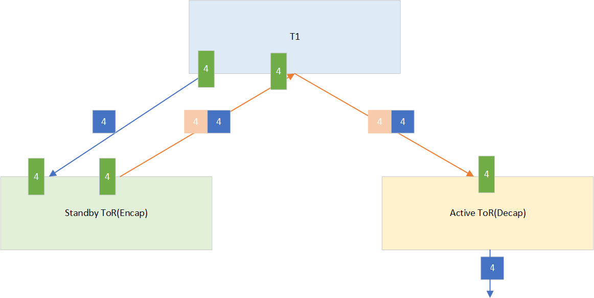
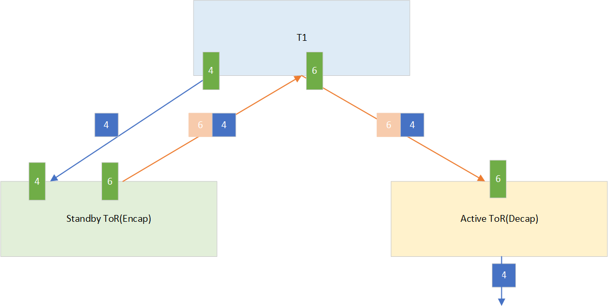
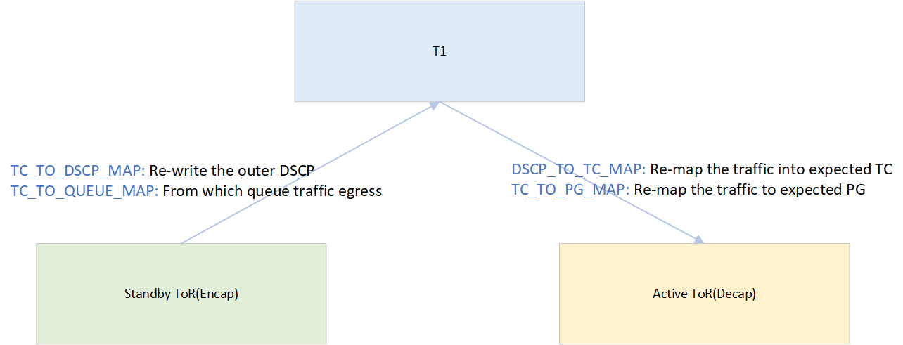

# QoS remapping for tunnel traffic test plan

- [Overview](#overview)
  - [Scope](#scope)
  - [Testbed](#testbed)
- [Setup configuration](#setup-configuration)
- [Test Cases](#test-cases)
  - [Test case group for packet encapsulation](#test-case-group-for-packet-encapsulation)
  - [Test case group for packet decapsulation](#test-case-group-for-packet-decapsulation)
  - [Improve the current qos_sai_test](#improve-the-current-qossaitest)

## Overview

The purpose is to test the functionality of QoS remapping of tunnel traffic.

## Scope

The test is targeting a running SONiC system with fully functioning configuration.

PFC deadlock can happen in dualtor deployment because the bounded back traffic is delivered in the same queue as regular traffic.

As a result, a cyclic buffer dependency can happen among T1 and both ToRs.

To avoid the issue, a solution was proposed in [\[HLD\] DSCP/TC remapping for tunnel traffic](https://github.com/sonic-net/SONiC/pull/950)

The general idea is to deliver the bounced back traffic in another lossless queue.

In current design, the bounced traffic for queue 3 is delivered in queue 2, and the bounced traffic for queue 4 is delivered in queue 6. 

To achieve the remap, 4 new QoS maps are introduced for tunnel.

The purpose of the test is to verify SONiC correctly performs the QoS remapping for tunnel traffic, and PFC pause is generated as expected.

## Testbed

Supported topologies: dual-tor testbed

## Setup configuration

No setup pre-configuration is required, test will configure and return testbed to the initial state.

## Test cases
The test suite is categorized into two groups. 

## Test case group for packet encapsulation
### Setup of DUT switch
1. Randomly select a ToR for testing, say `upper_tor`
2. Randomly select a server (say ip `192.168.0.2`) facing interface on the selected ToR in step 1 (`upper_tor`), and toggle the mux status to `standby` in order to do packet encapsulation
3. Startup `garp_service` on ptf to populate arp for servers
### Test cases
#### Test case 1 - Verify DSCP re-writing
##### Test steps
1. Generate packet with various `DSCP` values (listed below), `target_ip = 192.168.0.2`, `src_ip = 1.1.1.1`
2. Send the packets to `standby_tor` via a portchannel
3. Verify the packets are encaped, and bounced back to T1
4. Verify the `DSCP` value of bounced back packet is as expected.

The expected DSCP values is as below

|DSCP| Expected DSCP after encap|TC to verify|
| ---- | ---- | --- |
|8|8|0|
|0|0|1|
|33|33|8|
|3|2|3|
|4|6|4|
|46|46|5|
|48|48|7|

#### Test case 2 - Verify traffic is egressed at expected queue
##### Test steps
1. Generate `100` packets with various `DSCP` values (listed below), `target_ip = 192.168.0.2`, `src_ip = 1.1.1.1`
2. Clear `queuecounter` with CLI `sonic-clear queuecounters`
3. Send the packets to `upper_tor` via a portchannel
4. Verify the packets are encaped, and bounced back to T1
5. Verify the bounced back traffic is egressed at expected queue with CLI `show queue counter`. The packet counter for expected queue is supposed to be larger or equal to `100`.

The expected DSCP to queue mapping is as below

|DSCP| Expected outgoing queue|TC to verify|
| ---- | ---- | --- |
|8|0|0|
|0|1|1|
|33|1|8|
|3|2|3|
|4|6|4|
|46|5|5|
|48|7|7|

## Test case group for packet decapsulation
### Setup of DUT switch
1. Swap `syncd` docker with `syncd-rpc` as `saithrift` call is required to do the validation
2. Randomly select a ToR for testing, say `upper_tor`, and the unselected ToR would be `lower_tor`
3. Randomly select a server (say ip `192.168.0.2`) facing interface on the selected ToR in step 1 (`upper_tor`), and toggle the mux status to `standby` in order to do packet encapsulation. server `192.168.0.2` would be active on `lower_tor`
4. Startup `garp_service` on ptf to populate arp for servers

### Test cases

#### Test case 1 - Verify packets enter expected PG on active_tor
##### Test steps
1. Generate `100` encapped packets with different various `DSCP` combinations (listed below), `target_ip = 10.1.0.33`, `src_ip = 10.1.0.32`
2. Send the `100` packets to `active_tor` via a portchannel
3. Verify the packets are mapped to expected PGs on `active_tor` by sai_thrift api `sai_thrift_read_pg_counters`.

The `DSCP` combinations and expected PGs are as below

|DSCP outter|DSCP inner|Expected PG|
| ---- | ---- | --- |
|2|3|2|
|6|4|6|
|0|0|0|
|1|1|0|

#### Test case 2 - Verify packets egressed to server at expected queue
##### Test steps
1. Generate `100` encapped packets with different various `DSCP` combinations (listed below), `target_ip = 10.1.0.33`, `src_ip = 10.1.0.32`
2. Send the `100` packets to `active_tor` via a portchannel
3. Verify the decapped packets is egressed to server at expected queue with CLI `show queue counter`. The packet counter for expected queue is supposed to be larger or equal to `100`. 

The `DSCP` combinations and expected Queues are as below

|DSCP outter|DSCP inner|Expected Queue|
| ---- | ---- | --- |
|2|3|3|
|6|4|4|
|0|0|0|
|2|2|1|
|5|5|5|
|6|6|6|
|7|7|7|

#### Test case 3 - Verify PFC frame generation at expected priority
##### Test steps
1. Block a random port between `active_tor` and server with sai_thrift api `sai_thrift_port_tx_disable`
2. Generate encapsulated packet with different DSCP combinations as below, set `dst_ip = 192.168.0.2`, `src_ip = loopback0 of standby_tor`. 

|DSCP outter|DSCP inner|Expected PFC priority|
| ---- | ---- | --- |
|2|3|2|
|6|4|6|
3. Send `N` packets to `active_tor` via a portchannel to fill the shared buffer, and verify PFC pause frames are generated on expected priority
4. Send the packets again, and check the `PG` dropcounters to verify the counter increased as expected.

#### Test case 4 - Verify PFC frame generation at two priorities
##### Test steps
1. Block a random port between `active_tor` and server with sai_thrift api `sai_thrift_port_tx_disable`
2. Generate one encapsulated packet with `outer_dscp=2, inner_dscp=3, dst_ip = 192.168.0.2`, `src_ip = loopback0 of standby_tor`, and one regular packet with `dscp=3, dst_ip = 192.168.0.2, src_ip = 1.1.1.1`. 
3. Send `N` packets to `active_tor` via a portchannel to fill the shared buffer, and verify PFC pause frames are generated on both priority 2 and 3
4. Send the packets again, and check the `PG` dropcounters to verify the counter increased as expected.

## Others
### 1 Improve the current `qos_sai_test`
As we are having extra lossless PG/Queue for ports between `T1` and `dualtor`, the current `qos_sai_test` will be separated into two groups

1. For regular T0/T1 testbed, the test is running as before
2. For `dualtor` testbeds, since we have two extra lossless PGs and Queues, the extra PGs and Queues are to be verified

### 2 Update the hardcoded lossless PG/Queue in current test set
The fixed lossless PG/Queue `3-4` is hardcoded in a few test cases. These test cases are to be updated to be compatible with new extra lossless PG/Queue. 
