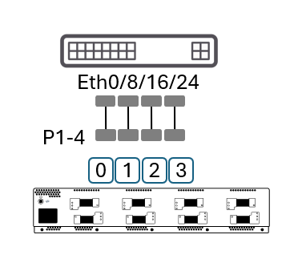
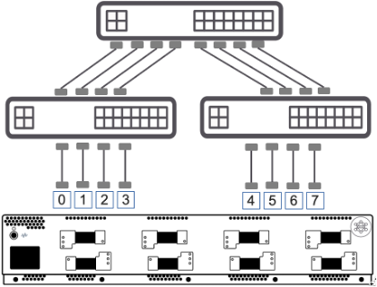
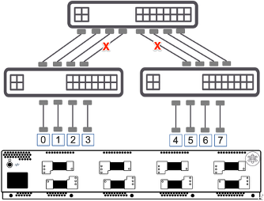
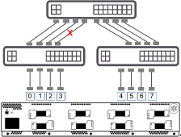

# SONiC RoCEv2 Test Plan

## Test Topology 1 – Functional test with single DUT

- Basic single-DUT functional topology.
- Tester connects four ports to the DUT at a common Ethernet speed (for example 800GE, 400GE, 200GE, or 100GE).
- Used for RoCEv2 functional and congestion-control scenarios.

  

## Test Topology 2 – Functional and performance test with Clos fabric

- Two leaf switches and one spine switch forming a two-tier leaf/spine Clos fabric.
- Downlink and uplink use the same link speed.
- Used for test cases that require multiple DUTs, such as hashing and load balancing.

  

---

## Test Case 1 – Congestion Control with PFC and ECN/CNP for AI Traffic

### Objective

- Validate basic congestion control for RoCEv2/RDMA AI traffic using:
  - Priority Flow Control (PFC)
  - ECN marking on the switch
  - CNP/ACK behavior on the endpoints
- Applicable roles: T0, T1, T2.

### Topology

- Uses Test Topology 1 (single DUT with four connected test ports).

  

### Test Steps

1.	Configure DUT with 2 lossless queues 3 and 4 mapping to DSCP value 3 and 4. 
2.	Configure 2:1 in-cast test traffic between rank 0-3 & 1-3, 1 rank (endpoint) per port.  
3.	Configure 4GB bursty test traffic (RoCEv2 AI traffic) for 1 lossless queue: 1QP per rank pair, DSCP value 26, 4K IB MTU, 1MB message size (250 packets in burst per message), 55% rate per Tx port
4.	Disable DCQCN, run traffic and validate statistics
5.	Enable DCQCN, run traffic and validate statistics.
6.	Configure 4GB bursty test traffic (RoCEv2 AI traffic) for 2 lossless queues: 2 QP per rank pair, DSCP value 26 and 32 respectively, 4K IB MTU, 1MB message size (250 packets in burst per message), 55% rate per Tx port
7.	Disable DCQCN, run traffic and validate statistics
8.	Enable DCQCN, run traffic and validate statistics.
9.	Increase number of ranks (endpoint) per port to 4K for testing T2

### Expected Results

1.	In step 4, all messages should be completed successful. No loss should be observed. Switch ECN counter should match tester ECN counter. No NAK and sequence error, ACK/CNP Tx/Rx should be same. PFC should be received on priority 3 queue. Tx rate on port 1 & 2 should be reduced and total should not exceed egress port bandwidth (eg. 400Gbps). Avg/Max latency should be within DUT spec.
2.	In step 5, all messages should be completed successful. No loss should be observed. Switch ECN counter should match tester ECN counter. No NAK and sequence error, ACK/CNP Tx/Rx should be same. No PFC should be received on priority 3 queue. Tx rate on port 1 & 2 should be reduced (due to DCQCN) and total should not exceed egress port bandwidth (eg. 400Gbps). Avg/Max latency should be within DUT spec.
3.	In step 7, all messages should be completed successful. No loss should be observed. Switch ECN counter should match tester ECN counter. No NAK and sequence error, ACK/CNP Tx/Rx should be same. PFC should be received on both priority 3 & 4 queue. Tx rate on port 1 & 2 should be reduced and total should not exceed egress port bandwidth (eg. 400Gbps). Avg/Max latency should be within DUT spec.
4.	In step 8, all messages should be completed successful. No loss should be observed. Switch ECN counter should match tester ECN counter. No NAK and sequence error, ACK/CNP Tx/Rx should be same. No PFC should be received on either priority queue 3 or 4. Tx rate on port 1 & 2 should be reduced (due to DCQCN) and total should not exceed egress port bandwidth (eg. 400Gbps). Avg/Max latency should be within DUT spec.
5.	Successful test result indicates that DUT forward RoCEv2 AI traffic and control signaling as expected. PFC and ECN/CNP congestion signaling and congestion control function as expected. 

### Notes
1. SONiC support ECN counter. It does not support CNP counter

---

## Test Case 2 – Congestion Control with PFC and ECN/CNP for Storage Traffic

### Objective

- Validate basic congestion control for RoCEv2/RDMA storage traffic using PFC and ECN/CNP.
- Applicable roles: T0, T1, T2.

### Topology

- Uses Test Topology 1.

  

### Test Steps

1.	Configure DUT with 2 lossless queues 3 and 4 mapping to DSCP value 3 and 4. 
2.	Configure tester for 2:1 in-cast between rank 0-3 & 1-3, 1 rank (endpoint) per port.  
3.	Configure 4GB constant rate test traffic (RoCEv2 storage traffic) for 1 lossless queue: 1QP per rank pair, DSCP value 3, 4K IB MTU, 1MB message size (constant rate), 55% rate per Tx port
4.	Disable DCQCN, run traffic and validate statistics
5.	Enable DCQCN, run traffic and validate statistics.
6.	Configure 4GB constant rate test traffic (RoCEv2 storage traffic) for 2 lossless queues: 2 QPs per rank pair, DSCP value 3 and 4 respectively, 4K IB MTU, 1MB message size (constant rate), 55% rate per Tx port
7.	Disable DCQCN, run traffic and validate statistics
8.	Enable DCQCN, run traffic and validate statistics.

### Expected Results

1.	In step 4, all messages should be completed successful. No loss should be observed. Switch ECN counter should match tester ECN counter. No NAK and sequence error, ACK/CNP Tx/Rx should be same. PFC should be received on priority 3 queue. Tx rate on port 1 & 2 should be reduced and total should not exceed egress port bandwidth (eg. 400Gbps). Avg/Max latency should be within DUT spec.
2.	In step 5, all messages should be completed successful. No loss should be observed. Switch ECN counter should match tester ECN counter. No NAK and sequence error, ACK/CNP Tx/Rx should be same. No PFC should be received on priority 3 queue. Tx rate on port 1 & 2 should be reduced (due to DCQCN) and total should not exceed egress port bandwidth (eg. 400Gbps). Avg/Max latency should be within DUT spec.
3.	In step 7, all messages should be completed successful. No loss should be observed. Switch ECN counter should match tester ECN counter. No NAK and sequence error, ACK/CNP Tx/Rx should be same. PFC should be received on both priority 3 & 4 queue. Tx rate on port 1 & 2 should be reduced and total should not exceed egress port bandwidth (eg. 400Gbps). Avg/Max latency should be within DUT spec.
4.	In step 8, all messages should be completed successful. No loss should be observed. Switch ECN counter should match tester ECN counter. No NAK and sequence error, ACK/CNP Tx/Rx should be same. No PFC should be received on either priority queue 3 or 4. Tx rate on port 1 & 2 should be reduced (due to DCQCN) and total should not exceed egress port bandwidth (eg. 400Gbps). Avg/Max latency should be within DUT spec.
5.	Successful test result indicates that DUT forward RoCEv2 storage traffic and control signaling as expected. PFC and ECN/CNP congestion signaling and congestion control function as expected. 

---

## Test Case 3 – Dynamic ECN

### Objective

- Validate that the switch can dynamically adjust ECN marking threshold and probability.

### Topology

- Uses Test Topology 1.

  

### Status

- Steps and expected results are currently marked as TBD.
- Note: Adaptive/dynamic ECN support in SONiC should be checked; this test may be skipped if not supported.

---

## Test Case 4 – Hashing and Load Balancing

### Objective

- Validate the DUT’s load-balancing and hashing behavior for distributing RoCEv2 traffic across multiple upstream links.
- Focus on avoiding congestion while preserving flow ordering.
- Applies primarily to T0 and T1; for T2 it may apply mainly to uplinks.

### Topology

- Uses Test Topology 2 (leaf–spine Clos).

  

### Test Steps

1.	Configure DUT with lossless queues 3 mapping to DSCP value 2. 
2.	Configure continuous test traffic: 4K IB MTU,1MB message size, 
3.	One rank pair from 0-4, 1 QP per rank pair, check leaf 1 egress.
4.	Increase to X QPs per rank pair, check leaf 1 egress.
5.	Two rank pairs from 0-4 and 1-5, 1 QP per rank pair, check leaf 1 egress
6.	Enable staggered transmit on tester side, check leaf 1 egress.
7.	Increase to X QPs per rank pair, check leaf 1 egress.
8.	Four rank pairs from 0-4,1-5, 2-6, 3-7, 1 QP per rank pair, check leaf 1 egress
9.	Enable staggered transmit on tester side, check leaf 1 egress.
10.	Increase to X QPs per rank pair, check leaf 1 egress.

### Expected Results

1.	In step 3, expect traffic on 1 egress port, no congestion.
2.	In step 4, expect traffic on 1 or more egress port, no congestion.
3.	In step 5, expect traffic on 1 egress port, 2-1 incast congestion. 
4.	In step 6, expect traffic on 2 egress ports, no congestion
5.	In step 7, expect traffic on 2 or more egress port, no congestion. 
6.	In step 8, expect traffic on 1 egress ports, 4-1 incast congestion
7.	In step 9, expect traffic on 2 or more egress ports, no congestion.
8.	In step 10, expect traffic on 2 or more egress ports, no congestion 

### Notes

1.	Hashing algorithm maybe different for different HW if different switch chip is used. The hashing algorithm is typically secret sauce of switch chip.
2.	Most of switch chip has dynamic hashing based on traffic load. In this case, the start time of various flows will impact hashing result.
3.	This kind of p2p test reflects pipeline parallelism and expert parallelism in real AI world training and inferencing. It is a good reference of hash behavior of DUT. 

---

## Test Case 5 – Packet Spray

### Objective

- Validate load balancing using packet spray such that traffic is efficiently distributed across all available links, while maintaining acceptable out-of-order characteristics.

### Topology

- Uses Test Topology 2.

  

### Test Steps

1.	Configure DUT with lossless queues 3 mapping to DSCP value 26. 
2.	Configure continuous all-to-all test traffic between 8 ranks: 4K IB MTU,1MB message size, 
3.	Disable PFC and enable Out-of-order support on tester.
4.	Start traffic for 5 mins and stop traffic.
5.	Check traffic statistics on tester

### Expected Results

1.	In step 4, all messages should be completed successful. No loss should be observed. Expect no NAK and sequence error. Expect max packet latency to be reduced comparing with packet spray disabled.

### Notes

1.	Assume packet spray does not create big out of order sequence beyond tester’s support. Eg. within 512 out-of-order distance for 800GE port.

---

## Test Case 6 – QoS Profile Prioritizing Lossless Traffic

### Objective

- Validate that the DUT prioritizes RoCEv2 lossless traffic and guarantees bandwidth in the presence of competing best-effort traffic.
- Particularly relevant for T2 with mixed lossless and lossy traffic.

### Topology

- Uses Test Topology 2, with one egress link intentionally brought down per leaf to create contention.

  

### Test Steps

1.	Configure DUT with lossless queues 3 mapping to DSCP 26, lossy queue 0 mapped to DSCP 0
2.	RoCEv2 test traffic: 4K IB MTU,1MB message size, DSCP 26, enable PFC and DCQCN. 
3.	Create 3 background traffic flows between port pair 0-4, 1-5, 2-6. Start 3 traffic flows one after the other. Set traffic to 100% and start traffic. Check leaf 1 egress
4.	Create RoCEv2 traffic with one rank pair from 3-7, 1 QP per rank pair, check leaf 1 egress.
5.	Increase RoCEv2 traffic to X (eg. 16) QPs per rank pair, check leaf 1 egress.
6.	Stop RoCEv2 traffic and check leaf 1 egress.

### Expected Results

1.	In step 3, expect traffic of each ingress port is hashing to 1 egress port. No congestion and loss.
2.	In step 4, expect RoCEv2 traffic is forwarded without loss. Expect loss in one background traffic flow which hash collision with RoCEv2 traffic
3.	In step 5, expect loss in 1 or more background traffic flows 
4.	In step 6, expect background traffic recovery and no further loss are seen. 

### Notes
1.	Need to experiment to validate expected result.
2.	Set traffic rate as % of line rate which is applicable to different link speeds (Riff’s comment: Make traffic rate as input parameter to adapt to different test topology)

---

## Test Case 7 – QP Fairness with DCQCN + PFC

### Objective

- Validate fairness between QPs under congestion when DCQCN and PFC are in use.

### Topology

- Can use Test Topology 1 or 2; single-DUT topology is sufficient for illustration.

  

### Test Steps

1.	Configure DUT with lossless queues 3 mapping to DSCP 26.
2.	Configure continuous 2:1 incast test traffic between 0-3, 1-3: 4K IB MTU,1MB message size, 16 QPs per rank pair, disable PFC, enable DCQCN. 
3.	Check per QP Tput within same rank and across different ranks
4.	Adjust DCQCN, check per QP Tput

### Expected Results

1.	In step 3, check ECN counter, expect Tput per QP vary. The difference should not be over ??? 
2.	In step 4, expect more even Tput among QPs

### Notes
1.	Test QP fairness in congestion condition

---

## Test Case 8 – Failover and Recovery

### Objective

- Validate that RoCEv2 traffic continues without loss during link failover and recovery in a Clos fabric.

### Topology

- Uses Test Topology 2.

  

### Test Steps

1.	Configure DUT with lossless queues 3 mapping to DSCP value 26. 
2.	Configure test traffic between left and right leaf: 0-4, 1-5, 2-6, 4K IB MTU,1MB message size, 
3.	Start traffic and check tester statistics
4.	Bring down 1 egress link on leaf 1 which has traffic on it, check tester ports statistics 
5.	Bring up the down egress link on leaf 1, check tester ports statistics 

### Expected Results

1.	In step 3, traffic is forward across available egress link on leaf 1. No loss is expected.
2.	In step 4, traffic should be failover to the next available egress link on leaf 1. No loss is expected.
3.	In step 5, expect traffic to move back to original link if resilient ECMP is enabled/supported, or expect traffic to stay if resilient ECMP is disabled/not-supported.

---
