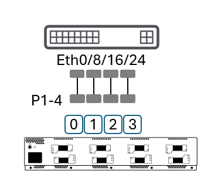
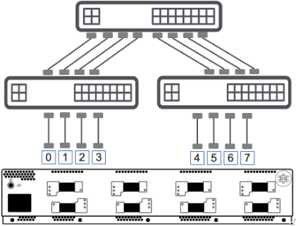
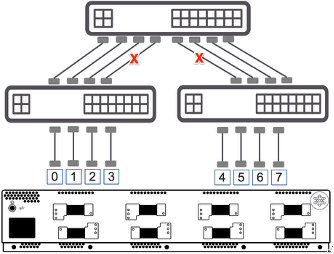
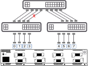

# SONiC RoCEv2 Test Plan

### Authors: Kamal Sahu (Keysight Technologies), Eric Yu (Keysight Technologies) and Vineet Mittal (Microsoft)

## Test Topology 1 – Functional test with single DUT

- Basic single-DUT functional topology.
- Tester connects four ports(rank 0,1,2,3) to the DUT at a common Ethernet speed (for example 800GE, 400GE, 200GE, or 100GE).
- Used for RoCEv2 functional and congestion-control scenarios.

  

## Test Topology 2 – Functional and performance test with Clos fabric

- Two leaf switches and one spine switch forming a two-tier leaf/spine Clos fabric.
- Downlink and uplink use the same link speed.
- Used for test cases that require multiple DUTs, such as hashing and load balancing.

  

---

## Test Case 1 – Basic dataplane traffic testing without congestion

### Objective

- Validate basic functionality for RoCEv2/RDMA AI traffic using:
  - Priority Flow Control (PFC)
  - ECN marking on the switch
  - CNP/ACK behavior on the endpoints
- Applicable roles: T0, T1, T2.

### Topology

- Uses Test Topology 1 (single DUT with four connected test ports).

  

### Test Steps

### Prerequisites

1. Configure the DUT with both **lossless** and **lossy** queues.
   - Enable **PFC** on the lossless queues.
   - Configure **WRED with ECN marking** on the lossless queues.
   - Assume the following queue assignments:
     - **Queues 3 and 4:** Lossless queues
     - **Queues 0, 1, 2, 5, and 6:** Lossy queues
     - **Queue 5:** Reserved for **CNP (Congestion Notification Packet)** traffic
     - **Queue 6:** Reserved for **ACK/NAK (Acknowledgement/Negative Acknowledgement)** traffic
2. Determine the DSCP values for each queue from the DUT's `DSCP_TO_TC_MAP`.
   - If multiple DSCP values are mapped to the same traffic class (TC) or queue, randomly select one DSCP value for the test.

### Traffic Configuration

3. Configure two 1:1 traffic flows with one rank (endpoint) per port:
   - **Rank 0 → Rank 2:** Port1 → Port3
   - **Rank 1 → Rank 3:** Port2 → Port4

4. Configure constant-rate RoCEv2 AI traffic as follows:
   - **Lossless traffic (Rank 0 → Rank 2):**
     - Select a random DSCP value mapped to either **Queue 3** or **Queue 4**.
     - Configure **one Queue Pair (QP)** for the rank pair.
   - **Lossy traffic (Rank 1 → Rank 3):**
     - Configure one QP for each lossy priority (**Queues 0, 1, 2, 5, and 6**), resulting in **n** QPs per rank pair, where **n** is the number of lossy priorities under test.
     - The DSCP value mapped to **Queue 5** shall carry **CNP traffic**.
     - The DSCP value mapped to **Queue 6** shall carry **ACK/NAK traffic**.
5. Configure the following traffic parameters:
   - **InfiniBand MTU:** 4 KB
   - **Message size:** 1 MB (256 packets per message burst)
   - **Initial ECN field:** `00` (Not ECN-Capable)
  
6. Run lossless and lossy traffic for 3 minutes and verify the statistics.

### Expected Results

1. Verify the following:
   - Lossless and lossy traffic are forwarded successfully without packet loss.
   - No packet loss is observed on the traffic generator (tester).
   - No NAK packets or sequence errors are observed on the tester.
   - No ECN-CE packets, CNP transmissions, or CNP receptions are observed on the tester.
   - No PFC frames are generated on **Queue 3**/**queue 4**. The DUT PFC counters shall match the tester PFC counters.
   - ACK packets are observed on **Queue 6**. The DUT ACK counters shall match the tester ACK counters.
   - No ECN-CE marking is observed on **Queue 3** or **Queue 4**. The DUT ECN-CE counters shall match the tester ECN-CE counters.
   - No CNP packets are observed on **Queue 5**. The DUT CNP counters shall match the tester CNP counters.
   - Record the average and maximum packet latency. Both values shall be within the DUT specification.
2.	A successful test indicates that the DUT correctly forwards RoCEv2 AI data traffic and associated control traffic under congestion-free conditions without packet loss, congestion notification, or flow-control events.

## Test Case 2 – Congestion Control with PFC for AI Traffic 

### Objective

- Validate basic congestion control for RoCEv2/RDMA AI traffic using:
  - Priority Flow Control (PFC)
  - ECN marking on the switch
  - CNP/ACK behavior on the endpoints
- Applicable roles: T0, T1, T2.

### Topology

- Uses Test Topology 1 (single DUT with four connected test ports).

  

### Test Steps

### Prerequisites

1. Configure the DUT with the following queue assignments:
   - **Queue 3:** Lossless queue
   - **Queue 4:** Lossless queue
   - **Queue 0, 1, 2** Lossy queues
   - **Queue 5:** Reserved for **CNP (Congestion Notification Packet)** traffic
   - **Queue 6:** Reserved for **ACK(Acknowledgement)/NAK(Negative Acknowledgement)** traffic
   - Enable **PFC** and **ECN marking** on the lossless queues.

2. Determine the DSCP values corresponding to **Queue 0**, **Queue 1**, **Queue 2**, **Queue 3**, **Queue 4**, **Queue 5** and **Queue 6** from the DUT's `DSCP_TO_TC_MAP`.
   - If multiple DSCP values are mapped to a queue, randomly select one DSCP value for the test.

3. Configure a **3:1 incast** topology with one rank (endpoint) per port:
   - **Rank 0 → Rank 3**
   - **Rank 1 → Rank 3**
   - **Rank 2 → Rank 3**

### Test Scenario 1 – Single Lossless and Lossy Incast

4. Configure stateful RoCEv2 traffic with the following parameters:
   - Configure **one Queue Pair (QP)** per rank pair.
   - Each rank pair shall transmit **4 GB** of data traffic.
   - **Rank 0 → Rank 3**
     - Data traffic shall use the **DSCP value mapped to Queue 3** (lossless).
   - **Rank 1 → Rank 3**
     - Data traffic shall use the **DSCP value mapped to Queue 3** (lossless).
   - **Rank 2 → Rank 3**
     - Configure one QP for each lossy queue (**Queues 0, 1, and 2**).
     - Data traffic shall use the **DSCP values mapped to Queues 0, 1, and 2**, respectively.
   - CNP traffic shall use the **DSCP value mapped to Queue 5**.
   - ACK/NAK traffic shall use the **DSCP value mapped to Queue 6**.
   - **InfiniBand MTU:** 4 KB
   - **Message size:** 128 KB (32 packets per message burst)
   - **Traffic rate:** 100% line rate per transmitting port
   - **Initial ECN field:** `00` (Not ECN-Capable)

5. Run the traffic until completion and validate the traffic and DUT statistics.

### Test Scenario 2 – Dual Lossless and Lossy Incast

6. Configure stateful RoCEv2 traffic with the following parameters:
   - Configure **one Queue Pair (QP)** per lossless rank pair.
   - Configure **one Queue Pair (QP)** for each lossy queue on the lossy rank pair.
   - Each rank pair shall transmit **4 GB** of data traffic.
   - **Rank 0 → Rank 3**
     - Data traffic shall use the **DSCP value mapped to Queue 3** (lossless).
   - **Rank 1 → Rank 3**
     - Data traffic shall use the **DSCP value mapped to Queue 4** (lossless).
   - **Rank 2 → Rank 3**
     - Configure one QP for each lossy queue (**Queues 0, 1, and 2**).
     - Data traffic shall use the **DSCP values mapped to Queues 0, 1, and 2**, respectively.
   - CNP traffic shall use the **DSCP value mapped to Queue 5**.
   - ACK/NAK traffic shall use the **DSCP value mapped to Queue 6**.
   - **InfiniBand MTU:** 4 KB
   - **Message size:** 128 KB (32 packets per message burst)
   - **Traffic rate:** 100% line rate per transmitting port
   - **Initial ECN field:** `00` (Not ECN-Capable)

7. Run the traffic until completion and validate the traffic and DUT statistics.

### Test Scenario 3 – Mixed Message Sizes with Lossless and Lossy Incast

8. Configure stateful RoCEv2 traffic with the following parameters:
   - Configure **one Queue Pair (QP)** per lossless rank pair.
   - Configure **one Queue Pair (QP)** for each lossy queue on the lossy rank pair.
   - Each rank pair shall transmit **4 GB** of data traffic.
   - **Rank 0 → Rank 3**
     - Data traffic shall use the **DSCP value mapped to Queue 3** (lossless).
     - **InfiniBand MTU:** 4 KB
     - **Message size:** 128 KB (32 packets per message burst)
   - **Rank 1 → Rank 3**
     - Data traffic shall use the **DSCP value mapped to Queue 4** (lossless).
     - **InfiniBand MTU:** 4 KB
     - **Message size:** 4 KB (**WRITE-only** message)
   - **Rank 2 → Rank 3**
     - Configure one QP for each lossy queue (**Queues 0, 1, and 2**).
     - Data traffic shall use the **DSCP values mapped to Queues 0, 1, and 2**, respectively.
     - **InfiniBand MTU:** 4 KB
     - **Message size:** 128 KB (32 packets per message burst)
   - CNP traffic shall use the **DSCP value mapped to Queue 5**.
   - ACK/NAK traffic shall use the **DSCP value mapped to Queue 6**.
   - **Traffic rate:** 100% line rate per transmitting port
   - **Initial ECN field:** `00` (Not ECN-Capable)

9. Run the traffic until completion and validate the traffic and DUT statistics.

### Expected Results

### 1. Test Scenario 1 (Step 5)

All messages shall complete successfully.

- No packet loss shall be observed on the tester.
- No NAK packets or sequence errors shall be observed on the tester.
- No ECN-CE marking or CNP Tx/Rx shall be observed on the tester.
- PFC frames shall be observed on **Queue 3**, and the DUT PFC counters shall match the tester PFC counters.
- ACK packets shall be observed on **Queue 6**, and the DUT ACK counters shall match the tester ACK counters.
- No ECN-CE packets shall be observed on **Queue 3**, and the DUT ECN-CE counters shall match the tester ECN-CE counters.
- No CNP packets shall be observed on **Queue 5**, and the DUT CNP counters shall match the tester CNP counters.
- Record the average and maximum latency. Both values shall be within the DUT specification.

### 2. Test Scenarios 2 and 3 (Steps 7 and 9)

All messages shall complete successfully.

- No packet loss shall be observed on the tester.
- No NAK packets or sequence errors shall be observed on the tester.
- No ECN-CE marking or CNP Tx/Rx shall be observed on the tester.
- PFC frames shall be observed on **Queue 3** for **Rank 0**, and the DUT PFC counters shall match the tester PFC counters.
- PFC frames shall be observed on **Queue 4** for **Rank 1**, and the DUT PFC counters shall match the tester PFC counters.
- ACK packets shall be observed on **Queue 6**, and the DUT ACK counters shall match the tester ACK counters.
- No ECN-CE packets shall be observed on **Queue 3** or **Queue 4**, and the DUT ECN-CE counters shall match the tester ECN-CE counters.
- No CNP packets shall be observed on **Queue 5**, and the DUT CNP counters shall match the tester CNP counters.
- Record the average and maximum latency. Both values shall be within the DUT specification.

## Test Case 3 – Congestion Control with DCQCN for AI Traffic 

### Objective

- Validate basic congestion control for RoCEv2/RDMA AI traffic using:
  - Priority Flow Control (PFC)
  - ECN marking on the switch
  - CNP/ACK behavior on the endpoints
- Applicable roles: T0, T1, T2.

### Topology

- Uses Test Topology 1 (single DUT with four connected test ports).

  

### Prerequisites

1. Configure the DUT with the following queue assignments:
   - **Queue 3:** Lossless queue
   - **Queue 4:** Lossless queue
   - **Queue 0, 1, 2** Lossy queues
   - **Queue 5:** Reserved for **CNP (Congestion Notification Packet)** traffic
   - **Queue 6:** Reserved for **ACK(Acknowledgement)/NAK(Negative Acknowledgement)** traffic
   - Enable **PFC** and **ECN marking** on the lossless queues.

2. Determine the DSCP values corresponding to **Queue 0**, **Queue 1**, **Queue 2**, **Queue 3**, **Queue 4**, **Queue 5** and **Queue 6** from the DUT's `DSCP_TO_TC_MAP`.
   - If multiple DSCP values are mapped to a queue, randomly select one DSCP value for the test.

3. Configure a **3:1 incast** topology with one rank (endpoint) per port:
   - **Rank 0 → Rank 3**
   - **Rank 1 → Rank 3**
   - **Rank 2 → Rank 3**

### Test Steps

### Test Scenario 1 – Single Lossless and Lossy Incast with DCQCN

4. Configure stateful RoCEv2 traffic with the following parameters:
   - Configure **one Queue Pair (QP)** per rank pair.
   - Each rank pair shall transmit **4 GB** of data traffic.
   - **Rank 0 → Rank 3**
     - Data traffic shall use the **DSCP value mapped to Queue 3** (lossless).
   - **Rank 1 → Rank 3**
     - Data traffic shall use the **DSCP value mapped to Queue 3** (lossless).
   - **Rank 2 → Rank 3**
     - Configure one QP for each lossy queue (**Queues 0, 1, and 2**).
     - Data traffic shall use the **DSCP values mapped to Queues 0, 1, and 2**, respectively.
   - CNP traffic shall use the **DSCP value mapped to Queue 5**.
   - ACK/NAK traffic shall use the **DSCP value mapped to Queue 6**.
   - **InfiniBand MTU:** 4 KB
   - **Message size:** 128 KB (32 packets per message burst)
   - **Traffic rate:** 100% line rate per transmitting port
   - **Initial ECN field:** `01/10` (ECN-Capable)
5. Run traffic and validate statistics.
   
### Test Scenario 2 – Dual Lossless and Lossy Incast with DCQCN.

6. Configure stateful RoCEv2 traffic with the following parameters:
   - Configure **one Queue Pair (QP)** per lossless rank pair.
   - Configure **one Queue Pair (QP)** for each lossy queue on the lossy rank pair.
   - Each rank pair shall transmit **4 GB** of data traffic.
   - **Rank 0 → Rank 3**
     - Data traffic shall use the **DSCP value mapped to Queue 3** (lossless).
   - **Rank 1 → Rank 3**
     - Data traffic shall use the **DSCP value mapped to Queue 4** (lossless).
   - **Rank 2 → Rank 3**
     - Configure one QP for each lossy queue (**Queues 0, 1, and 2**).
     - Data traffic shall use the **DSCP values mapped to Queues 0, 1, and 2**, respectively.
   - CNP traffic shall use the **DSCP value mapped to Queue 5**.
   - ACK/NAK traffic shall use the **DSCP value mapped to Queue 6**.
   - **InfiniBand MTU:** 4 KB
   - **Message size:** 128 KB (32 packets per message burst)
   - **Traffic rate:** 100% line rate per transmitting port
   - **Initial ECN field:** `01/10` (ECN-Capable)
7. Run traffic and validate statistics.
8. Set ECN-CE bit value 11 
9. Run traffic and validate statistics. 
10. Increase endpoint per port to 4K for testing T2 

### Expected Results

1. In step 5, all messages should be completed successfully.  

- No loss should be observed on the tester.  
- No NAK and sequence error on the tester. 
- Few or no PFC should be observed on queue 3, matching tester PFC counter. 
- ACK should be observed on queue 6, matching tester ACK counter. 
- ECN-CE should be observed on queue 3, matching tester ECN-CE counter. 
- CNP should be observed on queue 5, matching tester CNP counter. 
- Note Avg/Max latency and it should be within DUT spec. 

2. In step 7, all messages should be completed successfully.  

- No loss should be observed on the tester.  
- No NAK and sequence error on the tester. 
- Few or no PFC should be observed on queue 3, matching tester PFC counter for rank0. 
- Few or no PFC should be observed on queue 4, matching tester PFC counter for rank1. 
- ACK should be observed on queue 6, matching tester ACK counter for rank0. 
- ACK should be observed on queue 6, matching tester ACK counter for rank1. 
- ECN-CE should be observed on queue 3, matching tester ECN-CE counter for rank0. 
- ECN-CE should be observed on queue 4, matching tester ECN-CE counter for rank1. 
- CNP should be observed on queue 5, matching tester CNP counter. 
- Note Avg/Max latency and it should be within DUT spec. 

3. In step 9, all messages should be completed successfully. 

- No loss should be observed on the tester.  
- No NAK and sequence error on the tester. 
- Few or no PFC should be observed on queue 3, matching tester PFC counter for rank0. 
- Few or no PFC should be observed on queue 4, matching tester PFC counter for rank1. 
- ACK should be observed on queue 6, matching tester ACK counter for rank0. 
- ACK should be observed on queue 6, matching tester ACK counter for rank1. 
- All data packets marked with ECN-CE should be observed on queue 3 or 4, matching tester ECN-CE counter. 
- CNP should be observed on queue 5, matching tester CNP counter. 
- Note Avg/Max latency and it should be within DUT spec. 

4. Successful test results indicate that DUT forward RoCEv2 AI traffic and control signaling as expected. DCQCN congestion control functions as expected. 

## Test Case 4 – Congestion Control with PFC and ECN/CNP for Storage Traffic

### Objective

- Validate basic congestion control for RoCEv2/RDMA storage traffic using PFC and ECN/CNP.
- Applicable roles: T0, T1, T2.

### Topology

- Uses Test Topology 1.

  

### Prerequisites

1. Configure the DUT with the following queue assignments:
   - **Queue 3:** Lossless queue
   - **Queue 4:** Lossless queue
   - **Queue 0, 1, 2** Lossy queues
   - **Queue 5:** Reserved for **CNP (Congestion Notification Packet)** traffic
   - **Queue 6:** Reserved for **ACK(Acknowledgement)/NAK(Negative Acknowledgement)** traffic
   - Enable **PFC** and **ECN marking** on the lossless queues.

2. Determine the DSCP values corresponding to **Queue 0**, **Queue 1**, **Queue 2**, **Queue 3**, **Queue 4**, **Queue 5** and **Queue 6** from the DUT's `DSCP_TO_TC_MAP`.
   - If multiple DSCP values are mapped to a queue, randomly select one DSCP value for the test.

3. Configure a **3:1 incast** topology with one rank (endpoint) per port:
   - **Rank 0 → Rank 3**
   - **Rank 1 → Rank 3**
   - **Rank 2 → Rank 3**

### Test Steps

### Test Scenario 1 – Single Lossless and Lossy Incast with/without DCQCN

4. Configure stateful RoCEv2 traffic with the following parameters:
   - Configure **one Queue Pair (QP)** per rank pair.
   - Each rank pair shall transmit **4 GB** of data traffic.
   - **Rank 0 → Rank 3**
     - Data traffic shall use the **DSCP value mapped to Queue 3** (lossless).
   - **Rank 1 → Rank 3**
     - Data traffic shall use the **DSCP value mapped to Queue 3** (lossless).
   - **Rank 2 → Rank 3**
     - Configure one QP for each lossy queue (**Queues 0, 1, and 2**).
     - Data traffic shall use the **DSCP values mapped to Queues 0, 1, and 2**, respectively.
   - CNP traffic shall use the **DSCP value mapped to Queue 5**.
   - ACK/NAK traffic shall use the **DSCP value mapped to Queue 6**.
   - **InfiniBand MTU:** 4 KB
   - **Message size:** 1 MB (256 packets per message burst)
   - **Traffic rate:** 100% line rate per transmitting port
   - **Initial ECN field:** `01/10` (ECN-Capable)
   - **Configure constant rate traffic (RoCEv2 storage traffic)**
   - Disable **DCQCN**
5. Run traffic for 3 minutes and validate statistics.
6. Enable **DCQCN**
7. Run traffic for 3 minutes and validate statistics.

### Test Scenario 2 – Dual Lossless and Lossy Incast with/without DCQCN.

8. Configure stateful RoCEv2 traffic with the following parameters:
   - Configure **one Queue Pair (QP)** per lossless rank pair.
   - Configure **one Queue Pair (QP)** for each lossy queue on the lossy rank pair.
   - Each rank pair shall transmit **4 GB** of data traffic.
   - **Rank 0 → Rank 3**
     - Data traffic shall use the **DSCP value mapped to Queue 3** (lossless).
   - **Rank 1 → Rank 3**
     - Data traffic shall use the **DSCP value mapped to Queue 4** (lossless).
   - **Rank 2 → Rank 3**
     - Configure one QP for each lossy queue (**Queues 0, 1, and 2**).
     - Data traffic shall use the **DSCP values mapped to Queues 0, 1, and 2**, respectively.
   - CNP traffic shall use the **DSCP value mapped to Queue 5**.
   - ACK/NAK traffic shall use the **DSCP value mapped to Queue 6**.
   - **InfiniBand MTU:** 4 KB
   - **Message size:** 1 MB (256 packets per message burst)
   - **Traffic rate:** 100% line rate per transmitting port
   - **Initial ECN field:** `01/10` (ECN-Capable)
   - **Configure constant rate traffic (RoCEv2 storage traffic)**
   - Disable **DCQCN**
9. Run traffic for 3 minutes and validate statistics.
10. Enable **DCQCN**
11. Run traffic for 3 minutes and validate statistics.
12. Increase endpoint per port to 4K for testing T2 

### Expected Results  

1. In step 5 & 7, all messages should be completed successfully.  

- No loss should be observed on the tester.  
- No NAK and sequence error on the tester. 
- PFC should be observed on queue 3, matching tester PFC counter. 
- ACK should be observed on queue 6, matching tester ACK counter. 
- ECN-CE should be observed on queue 3, matching tester ECN-CE counter. 
- CNP should be observed on queue 5, matching tester CNP counter. 
- Note Bandwidth during traffic run and it should be within DUT spec. 
- Note Avg/Max latency and it should be within DUT spec.
  
2. In step 7, no or few PFC should be observed on queue 3 .
   
3. In step 9, all messages should be completed successfully.  
- No loss should be observed on the tester.  
- No NAK and sequence error on the tester. 
- PFC should be observed on queue 3, matching tester PFC counter for rank0. 
- PFC should be observed on queue 4, matching tester PFC counter for rank1. 
- ACK should be observed on queue 3, matching tester ACK counter for rank0. 
- ACK should be observed on queue 4, matching tester ACK counter for rank1. 
- ECN-CE should be observed on queue 3, matching tester ECN-CE counter for rank0. 
- ECN-CE should be observed on queue 4, matching tester ECN-CE counter for rank1. 
- CNP should be observed on queue 6, matching tester CNP counter. 
- Note Bandwidth during traffic run and it should be within DUT spec. 
- Note Avg/Max latency and it should be within DUT spec.
  
4. In step 11, no or few PFC should be observed on queue 3 and queue 4.   

5. Successful test result indicates that DUT forward RoCEv2 storage traffic and control signaling as expected. PFC and ECN/CNP congestion signaling and congestion control function as expected.  

 ## Test Case 5 – PFC propagation

### Objective

- Validate basic PFC propagation for RoCEv2/RDMA AI/storage traffic.
- Applicable roles: T0, T1, T2.

### Topology

- Uses Test Topology 1.

  

### Prerequisites

1. Configure the DUT with both **lossless** and **lossy** queues.
   - Enable **PFC** on the lossless queues.
   - Configure **WRED with ECN marking** on the lossless queues.
   - Assume the following queue assignments:
     - **Queues 3 and 4:** Lossless queues
     - **Queues 0, 1, 2, 5, and 6:** Lossy queues
     - **Queue 5:** Reserved for **CNP (Congestion Notification Packet)** traffic
     - **Queue 6:** Reserved for **ACK/NAK (Acknowledgement/Negative Acknowledgement)** traffic
2. Determine the DSCP values for each queue from the DUT's `DSCP_TO_TC_MAP`.
   - If multiple DSCP values are mapped to the same traffic class (TC) or queue, randomly select one DSCP value for the test.

### Test Steps

3. Configure two 1:1 traffic flows with one rank (endpoint) per port:
   - **Rank 0 → Rank 2:** Port1 → Port3
   - **Rank 1 → Rank 3:** Port2 → Port4

4. Configure constant-rate RoCEv2 AI traffic as follows:
   - **Lossless traffic (Rank 0 → Rank 2):**
     - Select a random DSCP value mapped to either **Queue 3** or **Queue 4**.
     - Configure **one Queue Pair (QP)** for the rank pair.
   - **Lossy traffic (Rank 1 → Rank 3):**
     - Configure one QP for each lossy priority (**Queues 0, 1 and 2**).
     - The DSCP value mapped to **Queue 5** shall carry **CNP traffic**.
     - The DSCP value mapped to **Queue 6** shall carry **ACK/NAK traffic**.
     - **InfiniBand MTU:** 4 KB
     - **Message size:** 128 KB (32 packets per message burst)
     - **Traffic rate:** 100% line rate per transmitting port
     - **Initial ECN field:** `01/10` (ECN-Capable)
     - **Configure constant rate traffic (RoCEv2 storage traffic)**
     - Disable **DCQCN**
5. Run traffic for 30 seconds and validate statistics.
6. Configure PFC generation on rank2 and 3 for 90% available bandwidth.
7. Run traffic for 30 seconds and validate statistics.
8. Increase endpoint per port to 4K for testing T2

### Expected Results  

1. In step 5, all messages should be completed successfully.  
- No loss should be observed on the tester.  
- No NAK and sequence error on the tester. 
- No PFC should be observed on queue 3, matching tester PFC counter. 
- No PFC should be observed on queue 4, matching tester PFC counter. 
2. In step 7, all messages should be completed successfully.  
- No loss should be observed on the tester.  
- No NAK and sequence error on the tester. 
- PFC should be observed on queue 3, matching tester PFC counter. 
- PFC should be observed on queue 4, matching tester PFC counter. 
3. Successful test results indicate that DUT forward RoCEv2 AI traffic and PFC generated by tester as expected. 

## Test Case 6 – QP Fairness with DCQCN

### Objective

- Validate fairness between QPs under congestion controlled with DCQCN.

### Topology

- Can use Test Topology 1 or 2; single-DUT topology is sufficient for illustration.

  

### Prerequisites

1. Configure the DUT with the following queue assignments:
   - **Queue 3:** Lossless queue
   - **Queue 4:** Lossless queue
   - **Queue 0, 1, 2** Lossy queues
   - **Queue 5:** Reserved for **CNP (Congestion Notification Packet)** traffic
   - **Queue 6:** Reserved for **ACK(Acknowledgement)/NAK(Negative Acknowledgement)** traffic
   - Enable **PFC** and **ECN marking** on the lossless queues.

2. Determine the DSCP values corresponding to **Queue 0**, **Queue 1**, **Queue 2**, **Queue 3**, **Queue 4**, **Queue 5** and **Queue 6** from the DUT's `DSCP_TO_TC_MAP`.
   - If multiple DSCP values are mapped to a queue, randomly select one DSCP value for the test.

3. Configure a **3:1 incast** topology with one rank (endpoint) per port:
   - **Rank 0 → Rank 3**
   - **Rank 1 → Rank 3**
   - **Rank 2 → Rank 3**

### Test Steps

### Test Scenario 1 – Single Lossless and Lossy Incast with DCQCN

4. Configure stateful RoCEv2 traffic with the following parameters:
   - Configure **one Queue Pair (QP)** per rank pair.
   - Each rank pair shall transmit **4 GB** of data traffic.
   - **Rank 0 → Rank 3**
     - Data traffic shall use the **DSCP value mapped to Queue 3** (lossless).
   - **Rank 1 → Rank 3**
     - Data traffic shall use the **DSCP value mapped to Queue 3** (lossless).
   - **Rank 2 → Rank 3**
     - Configure one QP for each lossy queue (**Queues 0, 1, and 2**).
     - Data traffic shall use the **DSCP values mapped to Queues 0, 1, and 2**, respectively.
   - CNP traffic shall use the **DSCP value mapped to Queue 5**.
   - ACK/NAK traffic shall use the **DSCP value mapped to Queue 6**.
   - **InfiniBand MTU:** 4 KB
   - **Message size:** 1 MB (256 packets per message burst)
   - **Traffic rate:** 100% line rate per transmitting port
   - **Initial ECN field:** `01/10` (ECN-Capable)
     
5. Run traffic for 3 minutes and validate statistics.
   
### Test Scenario 2 – Dual Lossless and Lossy Incast with DCQCN

6. Configure stateful RoCEv2 traffic with the following parameters:
   - Configure **one Queue Pair (QP)** per lossless rank pair.
   - Configure **one Queue Pair (QP)** for each lossy queue on the lossy rank pair.
   - Each rank pair shall transmit **4 GB** of data traffic.
   - **Rank 0 → Rank 3**
     - Data traffic shall use the **DSCP value mapped to Queue 3** (lossless).
   - **Rank 1 → Rank 3**
     - Data traffic shall use the **DSCP value mapped to Queue 4** (lossless).
   - **Rank 2 → Rank 3**
     - Configure one QP for each lossy queue (**Queues 0, 1, and 2**).
     - Data traffic shall use the **DSCP values mapped to Queues 0, 1, and 2**, respectively.
   - CNP traffic shall use the **DSCP value mapped to Queue 5**.
   - ACK/NAK traffic shall use the **DSCP value mapped to Queue 6**.
   - **InfiniBand MTU:** 4 KB
   - **Message size:** 1 MB (256 packets per message burst)
   - **Traffic rate:** 100% line rate per transmitting port
   - **Initial ECN field:** `01/10` (ECN-Capable)
     
7. Run traffic for 3 minutes and validate statistics.
8. Configure n:1 in-cast test traffic to check QP fairness further.   

### Expected Result:  

1. In step 5, all messages should be completed successfully. 
- No loss should be observed on the tester.  
- No NAK and sequence error on the tester. 
- Few or no PFC should be observed on queue 3, matching tester PFC counter. 
- ACK should be observed on queue 6, matching tester ACK counter. 
- ECN-CE should be observed on queue 3, matching tester ECN-CE counter. 
- CNP should be observed on queue 5, matching tester CNP counter. 
- Note Bandwidth during traffic run and Tx Rate of rank0 and rank1 should be fair, with a deviation less than 30%.
  
2. In step 7, all messages should be completed successfully. 
- No loss should be observed on the tester.  
- No NAK and sequence error on the tester. 
- Few or no PFC should be observed on queue 3, matching tester PFC counter for rank0. 
- Few or no PFC should be observed on queue 4, matching tester PFC counter for rank1. 
- ACK should be observed on queue 6, matching tester ACK counter for rank0. 
- ACK should be observed on queue 6, matching tester ACK counter for rank1. 
- ECN-CE should be observed on queue 3, matching tester ECN-CE counter for rank0. 
- ECN-CE should be observed on queue 4, matching tester ECN-CE counter for rank1. 
- CNP should be observed on queue 5, matching tester CNP counter. 
- Note Bandwidth during traffic run and Tx Rate of rank0 and rank1 should be fair, with a deviation less than 30%. 

## Test Case 7 – Hashing and Load Balancing

### Objective

- Validate the DUT’s load-balancing and hashing behavior for distributing RoCEv2 traffic across multiple upstream links.
- Focus on avoiding congestion while preserving flow ordering.
- Applies primarily to T0 and T1; for T2 it may apply mainly to uplinks.

### Topology

- Uses Test Topology 2 (leaf–spine Clos).

  

### Prerequisites

1. Configure the DUT with the following queue assignments:
   - **Queue 3:** Lossless queue.
   - Enable **PFC** and **ECN marking** on the lossless queue.

2. Determine the DSCP value corresponding to **Queue 3** from the DUT's `DSCP_TO_TC_MAP`.
   - If multiple DSCP values are mapped to the queue, randomly select one DSCP value for the test.

3. Configure continuous stateful RoCEv2 traffic with the following parameters:
   - **InfiniBand MTU:** 4 KB
   - **Message size:** 1 MB
   - Data traffic shall use the **DSCP value mapped to Queue 3**.
   - ACK/NAK traffic shall use the **DSCP value mapped to Queue 6**.
   - CNP traffic shall use the **DSCP value mapped to Queue 5**.
   - Traffic shall run continuously throughout each test scenario.

### Test Steps

1. Configure **one rank pair (Rank 0 → Rank 4)** with **1 QP** and verify **Leaf 1** egress statistics.
2. Increase to **X QPs** for the same rank pair and verify **Leaf 1** egress statistics.
3. Configure **two rank pairs (Rank 0 → Rank 4 and Rank 1 → Rank 5)** with **1 QP** per rank pair and verify **Leaf 1** egress statistics.
4. Enable **staggered transmit** on the tester and verify **Leaf 1** egress statistics.
5. Increase to **X QPs** per rank pair while staggered transmit is enabled and verify **Leaf 1** egress statistics.
6. Configure **four rank pairs (Rank 0 → Rank 4, Rank 1 → Rank 5, Rank 2 → Rank 6, Rank 3 → Rank 7)** with **1 QP** per rank pair and verify **Leaf 1** egress statistics.
7. Enable **staggered transmit** on the tester and verify **Leaf 1** egress statistics.
8. Increase to **X QPs** per rank pair while staggered transmit is enabled and verify **Leaf 1** egress statistics.

### Expected Results

1.	In step 1, expect traffic on 1 egress port, no congestion.
2.	In step 2, expect traffic on 1 or more egress port, no congestion.
3.	In step 3, expect traffic on 1 egress port, 2-1 incast congestion. 
4.	In step 4, expect traffic on 2 egress ports, no congestion
5.	In step 5, expect traffic on 2 or more egress port, no congestion. 
6.	In step 6, expect traffic on 1 egress ports, 4-1 incast congestion
7.	In step 7, expect traffic on 2 or more egress ports, no congestion.
8.	In step 8, expect traffic on 2 or more egress ports, no congestion 

### Notes

1.	Hashing algorithm maybe different for different HW if different switch chip is used. The hashing algorithm is typically secret sauce of switch chip.
2.	Most of switch chip has dynamic hashing based on traffic load. In this case, the start time of various flows will impact hashing result.
3.	This kind of p2p test reflects pipeline parallelism and expert parallelism in real AI world training and inferencing. It is a good reference of hash behavior of DUT. 

## Test Case 8 – Packet Spray

### Objective

- Validate load balancing using packet spray such that traffic is efficiently distributed across all available links, while maintaining acceptable out-of-order characteristics.

### Topology

- Uses Test Topology 2.

  

### Prerequisites

1. Configure the DUT with the following queue assignments:
   - **Queue 3:** Lossless queue.
   - Enable **PFC** and **ECN marking** on the lossless queue.

2. Determine the DSCP value corresponding to **Queue 3** from the DUT's `DSCP_TO_TC_MAP`.
   - If multiple DSCP values are mapped to the queue, randomly select one DSCP value for the test.

3. Configure continuous stateful RoCEv2 traffic with the following parameters:
   - **InfiniBand MTU:** 4 KB
   - **Message size:** 128 KB
   - Data traffic shall use the **DSCP value mapped to Queue 3**.
   - ACK/NAK traffic shall use the **DSCP value mapped to Queue 6**.
   - Configure one CNP queue using the **DSCP value mapped to the configured CNP queue**.
   - Traffic shall run continuously throughout each test scenario.

### Test Steps

1. Configure **4 GB all-to-all** stateful RoCEv2 traffic between **8 ranks**.
2. Configure the traffic with the following parameters:
   - Data traffic shall use the **DSCP value mapped to Queue 3**.
   - ACK/NAK traffic shall use the **DSCP value mapped to Queue 6**.
   - CNP traffic shall use the **DSCP value mapped to Queue 5**.
   - **InfiniBand MTU:** 4 KB
   - **Message size:** 128 KB (32 packets per message burst)
   - **Initial ECN field:** `ECT(0)` or `ECT(1)` (`10` or `01`).
3. Enable **Out-of-Order (OoO)** support on the tester.
4. Run the traffic until completion and validate the traffic and DUT statistics.

### Expected Results: 

1. In Step 4, all messages shall complete successfully.

- No packet loss, NAK packets, or sequence errors shall be observed on the tester.
- No PFC frames shall be observed on **Queue 3**, and the DUT PFC counters shall match the tester PFC counters.
- ACK packets shall be observed on **Queue 6**, and the DUT ACK counters shall match the tester ACK counters.
- No ECN-CE marked packets shall be observed on **Queue 3**, and the DUT ECN-CE counters shall match the tester ECN-CE counters.
- No CNP packets shall be observed on **Queue 5**, and the DUT CNP counters shall match the tester CNP counters.
- Packet distribution across the DUT egress ports shall be balanced and match the expected all-to-all traffic pattern.
- Record the average and maximum latency. Both values shall be within the DUT specification.

2. Successful completion of the test indicates that the DUT correctly forwards all-to-all RoCEv2 traffic with Out-of-Order (OoO) support enabled while maintaining balanced egress traffic distribution and expected control-plane behavior.

## Test Case 9 – QoS Profile Prioritizing Lossless Traffic

### Objective

- Validate that the DUT prioritizes RoCEv2 lossless traffic and guarantees bandwidth in the presence of competing best-effort traffic.
- Particularly relevant for T2 with mixed lossless and lossy traffic.

### Topology

- Uses Test Topology 2, with one egress link intentionally brought down per leaf to create contention.

  

### Prerequisites

1. Configure the DUT with the following queue assignments:
   - **Queue 3:** Lossless queue
   - **Queue 4:** Lossless queue
   - **Queue 0, 1 & 2:** Lossy queues
   - Enable **PFC** and **DCQCN** on the lossless queue.
2. Determine the DSCP values corresponding to **Queue 3**, **Queue 4**, **Queue 0**, **Queue 1** and **Queue 2** from the DUT's `DSCP_TO_TC_MAP`. If multiple DSCP values are mapped to a queue, randomly select one.

### Test Steps

1. Configure stateful RoCEv2 traffic with the following parameters:
   - **InfiniBand MTU:** 4 KB
   - **Message size:** 1 MB
   - Data traffic shall use the **DSCP value mapped to Queue 3/Queue 4**.
2. Configure **three background traffic flows** between the following port pairs:
   - **Port 0 → Port 4** (Queue 0)
   - **Port 1 → Port 5** (Queue 1)
   - **Port 2 → Port 6** (Queue 2)
3. Start the three background traffic flows sequentially at **100% line rate** and verify **Leaf 1** egress statistics.
4. Configure RoCEv2 traffic with **one rank pair (Rank 3 → Rank 7)** and **one Queue Pair (QP)**.
5. Start the RoCEv2 traffic and verify **Leaf 1** egress statistics.
6. Increase the RoCEv2 traffic to **X QPs** (for example, **16 QPs**) for the rank pair and verify **Leaf 1** egress statistics.
7. Stop the RoCEv2 traffic and verify **Leaf 1** egress statistics.

### Expected Results

- Background traffic shall continue to be forwarded successfully throughout the test.
- RoCEv2 traffic shall be forwarded successfully without packet loss, NAK packets, or sequence errors.
- PFC and DCQCN shall operate as expected for the configured lossless traffic.
- Leaf 1 egress queue statistics shall match the expected traffic distribution before, during, and after the RoCEv2 traffic.
- Average and maximum latency shall remain within the DUT specification.
- Successful completion of the test indicates that the DUT correctly forwards RoCEv2 traffic alongside line-rate background traffic while maintaining the expected egress queue behavior.

### Notes
1.	Need to experiment to validate expected result.
2.	Set traffic rate as % of line rate which is applicable to different link speeds (Riff’s comment: Make traffic rate as input parameter to adapt to different test topology)

## Test Case 10 – Failover and Recovery

### Objective

- Validate that RoCEv2 traffic continues without loss during link failover and recovery in a Clos fabric.

### Topology

- Uses Test Topology 2.

  

### Prerequisites

1. Configure the DUT with **Queue 3** as the lossless queue.
2. Determine the DSCP value mapped to **Queue 3** from the DUT's `DSCP_TO_TC_MAP`. If multiple DSCP values are mapped to the queue, randomly select one.

### Test Steps

1. Configure stateful RoCEv2 traffic between the following port pairs:
   - **Port 0 → Port 4**
   - **Port 1 → Port 5**
   - **Port 2 → Port 6**
2. Configure the traffic with the following parameters:
   - Data traffic shall use the **DSCP value mapped to Queue 3**.
   - **InfiniBand MTU:** 4 KB
   - **Message size:** 1 MB
3. Start the traffic and verify the tester statistics.
4. Bring down one **Leaf 1** egress link carrying traffic and verify the tester statistics.
5. Bring the egress link back up and verify the tester statistics.

### Expected Results

- Traffic shall be forwarded successfully before, during, and after the link failure.
- Traffic shall be rerouted when the egress link is brought down, with no unexpected packet loss or protocol errors.
- Traffic shall resume using the restored egress link after it is brought back up.
- Tester statistics shall reflect the expected traffic redistribution during failover and recovery.
- Average and maximum latency shall remain within the DUT specification.
- Successful completion of the test indicates that the DUT correctly performs link failover and recovery while maintaining RoCEv2 traffic forwarding.

## Test Case 11 – Control Plane Timeout Retransmission Mitigation

### Objective

- Validate control plane timeout due to PFC mitigated by setting higher or other priority queue. This test applies to T0/T1/T2. 

### Topology

- Uses Test Topology 2.

  

### Prerequisites

1. Configure the DUT with the following queue assignments:
   - **Queue 3:** Lossless queue
   - **Queue 4:** Lossless queue
   - **Queue 5:** CNP queue
   - **Queue 6:** ACK/NAK queue
   - Enable **PFC** and **ECN marking** on the lossless queues.
2. Determine the DSCP values corresponding to **Queue 3**, **Queue 4**, **Queue 5** and **Queue 6** from the DUT's `DSCP_TO_TC_MAP`. If multiple DSCP values are mapped to a queue, randomly select one DSCP value for the test.

### Test Steps

1. Configure **4:1 incast** traffic between **Rank 0 → Rank 4**, **Rank 1 → Rank 4**, **Rank 2 → Rank 4**, and **Rank 3 → Rank 4**, and **1:4 broadcast** traffic between **Rank 4 → Rank 0**, **Rank 4 → Rank 1**, **Rank 4 → Rank 2**, and **Rank 4 → Rank 3**, with one rank (endpoint) per port.
2. Configure the traffic with the following parameters:
   - Data traffic shall use the **DSCP value mapped to Queue 3**.
   - CNP traffic shall use the **DSCP value mapped to Queue 5**.
   - ACK/NAK traffic shall use the **DSCP value mapped to Queue 6**.
   - **InfiniBand MTU:** 4 KB
   - **Message size:** 128 KB (32 packets per message burst)
   - **Initial ECN field:** `00` (Not ECN-Capable).
3. Run the traffic for **60 seconds** and validate the traffic and DUT statistics.
4. Configure **constant-rate** traffic for:
   - **Incast:** Data traffic using the **DSCP value mapped to Queue 3** and ACK/NAK traffic using the **DSCP value mapped to Queue 6**.
   - **Broadcast:** Data traffic using the **DSCP value mapped to Queue 3** and ACK/NAK traffic using the **DSCP value mapped to Queue 6**.
5. Run the traffic for **60 seconds** and validate the traffic and DUT statistics.
6. Reconfigure the **broadcast** traffic:
   - Data traffic shall use the **DSCP value mapped to Queue 4**.
   - ACK/NAK traffic shall use the **DSCP value mapped to Queue 4**.
7. Run the traffic for **60 seconds** and validate the traffic and DUT statistics.

### Expected Results

- All traffic shall complete successfully.
- No packet loss, NAK packets, or sequence errors shall be observed on the tester.
- PFC, ACK/NAK, ECN-CE, and CNP behavior shall match the configured queue mappings.
- DUT counters shall match the corresponding tester counters.
- Average and maximum latency shall remain within the DUT specification.
- Successful completion of the test indicates that the DUT correctly forwards simultaneous incast and broadcast RoCEv2 traffic while maintaining the expected congestion-control behavior.
