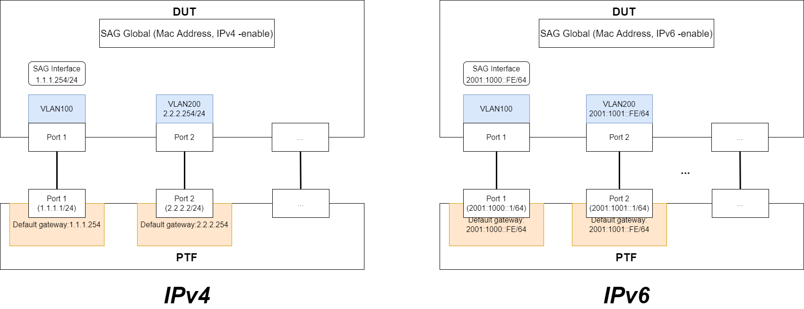

# SONiC SAG Test Plan HLD

## Revision History

[© Edgecore Networks](https://www.edge-core.com/)  

|  Revision No| Description | Author  | Contributors |Date |  
| :-------------: |:-------------:| :-----:|:----------:|:-----:|
|1.0| SAG Test Cases Version 1.0| [Jimi Chen](https://github.com/superchild), [Josh Yang](https://github.com/JoshYangEC)| [Jimi Chen](https://github.com/superchild), [Josh Yang](https://github.com/JoshYangEC) | 8 April 2022|

## Table of Contents

- Overview
- Scope
- Introduction
- Testbed
- Experimental Setup Configuration
- Test Cases
  - Test Cases for IPv4
    - Test Case # 1: Testing pingable to SAG using CLI to setup SAG
    - Test Case # 2: Testing routing over SAG using CLI to setup SAG
    - Test Case # 3: Testing pingable and routing over SAG after changing mac address using CLI to setup SAG
    - Test Case # 4: Testing pingable and routing over SAG after disabled and then enabled SAG using CLI to setup SAG
    - Test Case # 5: Testing pingable and routing over SAG after config reload using CLI to setup SAG
  - Test Cases for IPv6
    - Test Case # 1: Testing pingable to SAG using CLI to setup SAG
    - Test Case # 2: Testing routing over SAG using CLI to setup SAG
    - Test Case # 3: Testing pingable and routing over SAG after changing mac address using CLI to setup SAG
    - Test Case # 4: Testing pingable and routing over SAG after disabled and then enabled SAG using CLI to setup SAG
    - Test Case # 5: Testing pingable and routing over SAG after config reload using CLI to setup SAG

## Overview

In this HLD we will perform Static Anycast Gateway (SAG) functional level testing in a SONiC based testing environment.  
In each test case we have given sample topology, reference commands and expected output.

## Scope

This high-level design document describes the functional level testing of SAG in SONiC.  
The scope of this test plan is shown as follows:

- Check whether SAG can be pingable or not
- Check whether the routing over SAG is correct or not
- Check whether SAG can be pingable and routing over SAG is correct or not after changing mac address of SAG
- Check whether SAG can be pingable and routing over SAG is correct or not after disabled and then enabled SAG
- Check whether SAG can be pingable and routing over SAG or not after config reload

## Introduction

SAG provides a default gateway mechanism including IPv4 and IPv6 address setting into SAG, and SAG also can be setup using CLI.  
In this HLD, we will describe different test cases for functional testing of SAG with IPv4 and IPv6 address using CLI to setup SAG.

## Testbed

These test cases will be run in the proposed [PTF32 topology](https://github.com/Azure/sonic-mgmt/blob/master/ansible/vars/topo_ptf32.yml) or  [PTF64 topology](https://github.com/Azure/sonic-mgmt/blob/master/ansible/vars/topo_ptf64.yml).  
It is assumed that such a configuration is deployed on the chassis.

### Supported Topology

The test will be supported on ptf32, ptf64.

## Experimental Setup Configuration

Using the baseline testbed from the SONiC home page, we will be building a testing environment with different testing scenarios.  
As shown in the following topology, there are two parts of test cases in this HLD, e.g., IPv4 and IPv6.  
The details of the scenarios and testing steps are given in the following section.

  
## Test Cases

## Test Cases for IPv4

The following test cases #1 ~ #5 are discussed and verified using IPv4 address for SAG.

### Test Case # 1: Testing pingable of SAG using CLI to setup SAG

- Test steps

  1. setup host1 in eth0 of ptf
  2. config mac address of SAG1 using CLI
  3. config ipv4 address of SAG1 using CLI
  4. enable SAG using CLI
  5. flush all neighbor of host1 and then let host1 ping SAG1
  6. verify SAG in the neighbor of host1

- Pass/Fail Criteria

  - Test case is pass if SAG1 is found as neighbor of host1 after step 6

### Test Case # 2: Testing routing over SAG using CLI to setup SAG

- Test steps

  1. setup host1 and host2 in eth0 and eth1 of ptf respectively
  2. config mac address of SAG1 using CLI
  3. config ipv4 address of SAG1 using CLI
  4. enable SAG using CLI
  5. config ipv4 address of vlan interface (VLAN2)
  6. flush all neighbor of host2 and then let host2 ping VLAN2
  7. flush all neighbor of host1 and then let host1 ping host2
  8. verify SAG in the neighbor of host1
>
- Pass/Fail Criteria
  - Test case is pass if host2 is pingable after step 7
  - Test case is pass if SAG1 is found as neighbor of host1 after step 8

### Test Case # 3: Testing pingable and reachable over SAG after changing mac address using CLI to setup SAG

- Test steps
  1. setup host1 and host2 in eth0 and eth1 of ptf respectively
  2. config mac address (MAC1) of SAG1 using CLI
  3. config ipv4 address of SAG1 using CLI
  4. enable SAG using CLI
  5. config ipv4 address of vlan interface (VLAN2)
  6. flush all neighbor of host1 and then let host1 ping host2
  7. verify neighbor of host1
  8. change mac address of SAG1 to MAC2 using CLI
  9. flush all neighbor of host1 and then let host1 ping host2
  10. verify neighbor of host1

- Pass/Fail Criteria
  - Test case is pass if host2 is pingable after step 6
  - Test case is pass if SAG1 is found as neighbor of host1 after step 7 before changing mac
  - Test case is pass if host2 is pingable after step 9
  - Test case is pass if SAG1 is found as neighbor of host1 after step 10 after changing mac address of SAG1

### Test Case # 4: Testing pingable and reachable over SAG after disabled and then enabled SAG using CLI to setup SAG  
- Test steps
  1. setup host1 and host2 in eth0 and eth1 of ptf respectively
  2. config mac address of SAG1 using CLI
  3. config ipv4 address of SAG1 using CLI
  4. config ipv4 address of vlan interface (VLAN2)
  5. enable SAG using CLI
  6. disable SAG using CLI
  7. flush all neighbor of host1 and then let host1 ping SAG1
  8. verify neighbor of host1
  9. flush all neighbor of host1 and then let host1 ping host2
  10. verify neighbor of host1
  11. enable SAG using CLI
  12. flush all neighbor of host1 and then let host1 ping SAG1
  13. verify neighbor of host1
  14. flush all neighbor of host1 and then let host1 ping host2
  15. verify neighbor of host1

- Pass/Fail Criteria
  - Test case is pass if SAG1 is not found as neighbor of host1 after step 8
  - Test case is pass if host2 is not pingable after step 9
  - Test case is pass if SAG1 is not found as neighbor of host1 after step 10
  - Test case is pass if SAG1 is found as neighbor of host1 after step 13
  - Test case is pass if host2 is pingable after step 14
  - Test case is pass if SAG1 is found as neighbor of host1 after step 15  

### Test Case # 5: Testing pingable and reachable over SAG after config reload using CLI to setup SAG

- Test steps
  1. setup host1 and host2 in eth0 and eth1 of ptf respectively
  2. config mac address of SAG1 using CLI
  3. config ipv4 address of SAG1 using CLI
  4. enable SAG using CLI
  5. config ipv4 address of vlan interface (VLAN2)
  6. config reload
  7. flush all neighbor of host1 and then let host1 ping SAG1
  8. verify neighbor of host1

- Pass/Fail Criteria
  - Test case is pass if SAG1 is found as neighbor of host1 after step8

## Test Cases for IPv6

The following test cases #1 ~ #5 are discussed and verified using IPv6 address for SAG.

### Test Case # 1: Testing pingable of SAG using CLI to setup SAG

- Test steps

  1. setup host1 in eth0 of ptf
  2. config mac address of SAG1 using CLI
  3. config ipv6 address of SAG1 using CLI
  4. enable SAG using CLI
  5. flush all neighbor of host1 and then let host1 ping SAG1
  6. verify SAG in the neighbor of host1

- Pass/Fail Criteria

  - Test case is pass if SAG1 is found as neighbor of host1 after step 6

### Test Case # 2: Testing routing over SAG using CLI to setup SAG

- Test steps

  1. setup host1 and host2 in eth0 and eth1 of ptf respectively
  2. config mac address of SAG1 using CLI
  3. config ipv6 address of SAG1 using CLI
  4. enable SAG using CLI
  5. config ipv6 address of vlan interface (VLAN2)
  6. flush all neighbor of host2 and then let host2 ping VLAN2
  7. flush all neighbor of host1 and then let host1 ping host2
  8. verify SAG in the neighbor of host1

- Pass/Fail Criteria
  - Test case is pass if host2 is pingable after step 7
  - Test case is pass if SAG1 is found as neighbor of host1 after step 8

### Test Case # 3: Testing pingable and reachable over SAG after changing mac address using CLI to setup SAG

- Test steps
  1. setup host1 and host2 in eth0 and eth1 of ptf respectively
  2. config mac address (MAC1) of SAG1 using CLI
  3. config ipv6 address of SAG1 using CLI
  4. enable SAG using CLI
  5. config ipv6 address of vlan interface (VLAN2)
  6. flush all neighbor of host1 and then let host1 ping host2
  7. verify neighbor of host1
  8. change mac address of SAG1 to MAC2 using CLI
  9. flush all neighbor of host1 and then let host1 ping host2
  10. verify neighbor of host1

- Pass/Fail Criteria
  - Test case is pass if host2 is pingable after step 6
  - Test case is pass if SAG1 is found as neighbor of host1 after step 7 before changing mac
  - Test case is pass if host2 is pingable after step 9
  - Test case is pass if SAG1 is found as neighbor of host1 after step 10 after changing mac address of SAG1

### Test Case # 4: Testing pingable and reachable over SAG after disabled and then enabled SAG using CLI to setup SAG

- Test steps
  1. setup host1 and host2 in eth0 and eth1 of ptf respectively
  2. config mac address of SAG1 using CLI
  3. config ipv6 address of SAG1 using CLI
  4. config ipv6 address of vlan interface (VLAN2)
  5. enable SAG using CLI
  6. disable SAG using CLI
  7. flush all neighbor of host1 and then let host1 ping SAG1
  8. verify neighbor of host1
  9. flush all neighbor of host1 and then let host1 ping host2
  10. verify neighbor of host1
  11. enable SAG using CLI
  12. flush all neighbor of host1 and then let host1 ping SAG1
  13. verify neighbor of host1
  14. flush all neighbor of host1 and then let host1 ping host2
  15. verify neighbor of host1

- Pass/Fail Criteria
  - Test case is pass if SAG1 is not found as neighbor of host1 after step 8
  - Test case is pass if host2 is not pingable after step 9
  - Test case is pass if SAG1 is not found as neighbor of host1 after step 10
  - Test case is pass if SAG1 is found as neighbor of host1 after step 13
  - Test case is pass if host2 is pingable after step 14
  - Test case is pass if SAG1 is found as neighbor of host1 after step 15

 ### Test Case # 5: Testing pingable and reachable over SAG after config reload using CLI to setup SAG

- Test steps
  1. setup host1 and host2 in eth0 and eth1 of ptf respectively
  2. config mac address of SAG1 using CLI
  3. config ipv6 address of SAG1 using CLI
  4. enable SAG using CLI
  5. config ipv6 address of vlan interface (VLAN2)
  6. config reload
  7. flush all neighbor of host1 and then let host1 ping SAG1
  8. verify neighbor of host1

- Pass/Fail Criteria
  - Test case is pass if SAG1 is found as neighbor of host1 after step8