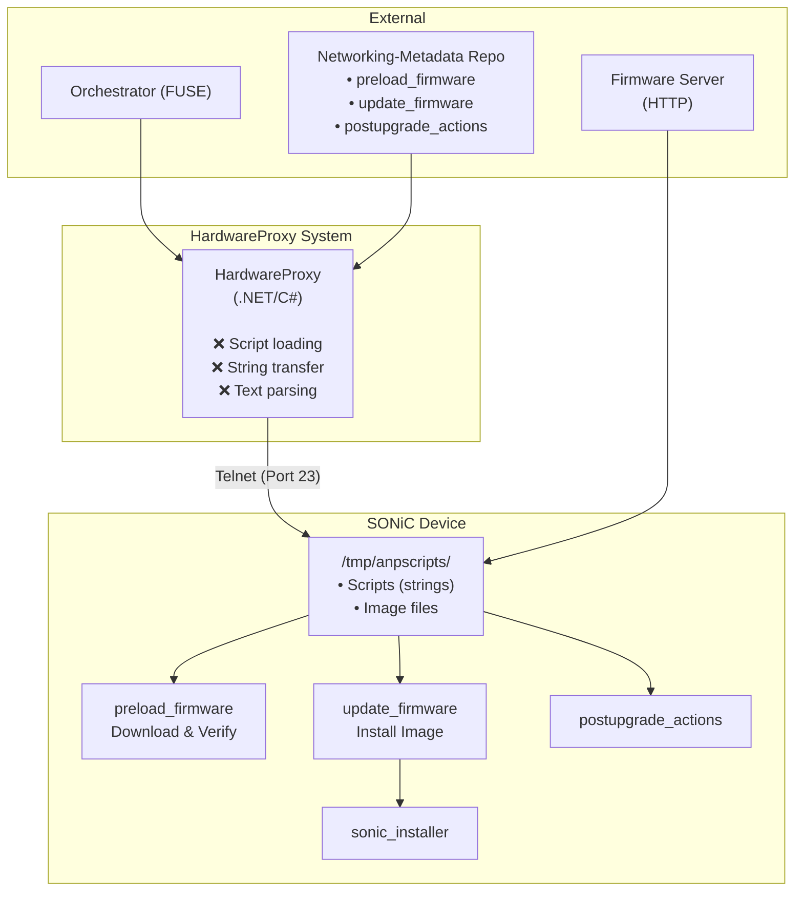

- [Overview](#overview)
- [Background](#background)
- [Scope](#scope)
- [Test structure](#test-structure)
- [Test scenario](#test-scenario)
- [Test cases](#test-cases)
# TestName
Upgrade Service via gNOI

## Overview
The goal of this test is to verify that the Upgrade Service, implemented via gNOI, functions correctly across different deployment environments. This includes validating the gRPC-based upgrade workflow (download → apply → reboot), and error handling using both the upgrade-agent and gNOI server.

## Background
Legacy SONiC upgrades commonly relied on ad-hoc scripts and a HardwareProxy that performed firmware transfer and activation over SSH/Telnet using prompt parsing. These approaches are brittle, hard to test, and offer limited observability.

## Current State: HardwareProxy Upgrade MoPs



**Issues**: Multiple layers • String transfer • Primitive communication • Resource competition
## Scope
This test targets SONiC systems running in three environments: local Linux VM, KVM-based SONiC, and physical SONiC devices. The purpose is to validate the compatibility and correctness of the upgrade service across these platforms, ensuring consistent behavior and reliability.

### Related DUT Configuration Files
upgrade_gNOI.yaml – YAML config file specifying upgrade parameters (image URL, save path, timeouts, etc.)

### Related APIs
gNOI: System.SetPackage (download), File.TransferToRemote (download), File.Remove (clean up)
gNMI: gNMI.Get (for read operations such as detecting platform types)
Other custom rpc for Platform/Vendor/Version specific operations.

## Test structure
### Setup Configuration
Deploy gNOI server on the target environment (Linux VM, KVM SONiC, or physical SONiC).
Build and install upgrade-agent on the testbed or control host.
Ensure gRPC port is reachable from the agent.
Prepare a valid upgrade YAML configuration file.

### Configuration scripts
build_deploy script – build and deploy gnmi docker
upgrade-agent – CLI tool for upgrade operations

## Test scenario
1. PR testing(sonic-gnmi): This test runs in the sonic-gnmi repository to validate gNOI-related changes in a lightweight local Linux CI environment during pull requests.
2. KVM PR testing(sonic-buildimage) This test runs in the sonic-buildimage repository's pull request pipeline, using a KVM-based SONiC VM. It verifies that gNOI upgrade-related components.
3. Nightly testing(sonic-mgmt): This test is integrated into sonic-mgmt to perform full-system validation of gNOI functionality across physical SONiC devices during nightly regression.

### Testbed setup & verification
Provide a reproducible recipe for preparing a testbed, deploying components, and verifying RPCs and post-upgrade state.

Testbed components
- Control host / Test controller (PTF or CI runner) running the workflow engine / `upgrade-agent` and test harness.
- Firmware server (HTTP/HTTPS) hosting test images.
- DUT running SONiC with gNOI server available (container or daemon).
- Optional: PTF/host with test tools (grpcurl, gnmi-client) and network isolation controls.

Setup steps (example)
1. Prepare firmware server
   - Place a test image and a SHA‑256 digest in a directory and expose via HTTPS (or HTTP for local tests).
2. Prepare control host
   - Install `upgrade-agent` and test tools; make sure it can reach DUT gRPC port.
   - Place example `upgrade_gNOI.yaml` in a test workspace.
3. Prepare DUT
   - Deploy gNOI server (e.g., run provided Docker image or start system service).
   - Verify management network connectivity from control host to DUT and that gRPC/TLS ports are reachable.
4. Run a dry-run
   - Use `upgrade-agent apply --dry-run -f upgrade_gNOI.yaml` or invoke equivalent gNOI SetPackage in dry-run mode.
5. Execute an actual flow
   - Run `upgrade-agent apply -f upgrade_gNOI.yaml` and observe download → install → activation steps.

Example `UpgradeWorkflow` (YAML)
```yaml
apiVersion: sonic.net/v1
kind: UpgradeWorkflow
metadata:
  name: example-upgrade
spec:
  steps:
    - name: download-sonic-image
      type: download
      params:
        url: "https://firmware.test/SONiC.bin"
        filename: "/tmp/SONiC.bin"
        sha256: "<sha256-hex>"
    - name: install-image
      type: install
      params:
        filename: "/tmp/SONiC.bin"
    - name: reboot-device
      type: reboot
      params:
        delay: 30
```

Mapping YAML steps to gNOI/gRPC calls
- download → gNOI File.TransferToRemote or System.SetPackage (remote download), with digest metadata.
- install → System.SetPackage / System-specific install RPCs (activate flag or separate activate step).
- reboot → System Reboot RPC or platform-specific action.
- reads/verification → gNMI Get to check operational state, and platform-specific RPCs for health.

Verification checklist
- Connectivity: `grpcurl` or a gNOI client can list services and open a SetPackage stream.
- File presence: image exists on DUT at the expected path with correct permissions.
- Checksum: SHA‑256 digest in metadata matches the staged file.
- Activation: after install/activate, verify software version and running state (gNMI/Get or CLI).
- Post-upgrade health: ping/routes/BGP sessions and system services are up.
- Logs/telemetry: agent and server logs contain traceable session ids and progress events.

## Test Fixture
### Test Fixture #1 - Local Linux VM Compatibility

#### Test objective

Verify that the upgrade service functions correctly in a local Linux VM environment. (Can run along with sonic-gnmi PR testing)
1. Deploy gNOI server locally using build_deploy.sh.
2. Run grpcurl to list services and verify connectivity.
3. Use upgrade-agent download with a test file URL.
4. Use upgrade-agent apply with a dry-run config.

### Test Fixture #2 - KVM SONiC Compatibility

#### Test objective

Validate upgrade service behavior on a KVM-based SONiC device.
1. Deploy gNOI server on DUT and agent on PTF server.
2. Run full upgrade flow: download → apply → reboot.
3. Verify session tracking and post-upgrade state.
4. Simulate failure (e.g., invalid URL) and verify error handling.

### Test Fixture #3 - Physical SONiC Compatibility

#### Test objective

Ensure upgrade service works reliably on physical SONiC hardware.
1. Deploy gNOI server and agent on PFT server.
2. gNOI server health check and client readiness check.
3. Run upgrade with a real image and reboot.
4. Validate system health post-upgrade.
5. Test watchdog reboot and missing next-hop scenarios.

### Test Fixture #4 - Negative Scenarios

#### Test objective

Test robustness of the upgrade service under failure conditions.
1. Use unreachable URL in download config.
2. Connection timeout.
3. APIs failure.
4. Apply malformed YAML config.
5. Simulate TLS handshake failure.
6. Kill gNOI server mid-upgrade and observe behavior.

### Antagonist (sad-case) scenarios
Run these negative setups per scenario to validate error handling and robustness. Each antagonist defines: setup, expected behavior, and verification.

1) Low disk space on DUT
- Setup: fill `/tmp` or target mounting point to below required threshold.
- Expected: download should fail or agent should detect insufficient space and abort cleanly with explicit error.
- Verify: agent returns ENOSPC-like error; no partial install left behind; logs show clear failure reason.

2) No management interface (e.g., eth0 down)
- Setup: administratively disable DUT management interface.
- Expected: control host cannot open gRPC connection; agent times out with clear connectivity error.
- Verify: grpc connection attempts fail; test harness records timeout; recovery steps are documented.

3) No route to firmware server
- Setup: block firmware server via iptables or remove route on DUT/control host.
- Expected: remote download fails with network error; agent retries according to policy and then errors out.
- Verify: agent error codes indicate network/dns failure; download sessions are cleaned up.

4) Corrupt or tampered image (checksum mismatch)
- Setup: serve an image whose contents do not match provided SHA‑256 digest (or omit digest).
- Expected: server or DUT verifies digest and rejects image; install not performed.
- Verify: checksum mismatch logged; installation not started; proper error returned.

5) TLS / certificate failures
- Setup: present incorrect TLS certs or force TLS mismatch between agent and gNOI server.
- Expected: TLS handshake fails and gRPC connections are rejected.
- Verify: agent logs show TLS errors; no sensitive fallback to plaintext.

6) gNOI server killed mid-upgrade
- Setup: start a normal download, then kill/restart the gNOI server process on DUT during transfer/install.
- Expected: agent detects stream error, marks session incomplete, and records state for resumption where supported.
- Verify: session state is persisted; subsequent attempts either resume or fail with clear diagnostics.

7) Disk corruption / I/O errors
- Setup: emulate I/O errors or remove media during file write.
- Expected: write fails; agent reports I/O error and cleans up partial files.
- Verify: partial files removed; logs include I/O error details.

Notes
- Each scenario should include automation where possible (Ansible or test scripts) so PR-level tests can inject antagonists reliably.
- Add per-scenario timeouts and retries to avoid false positives due to transient lab issues.

### Test examples & code snippets
Practical snippets and checks to include in test cases and automation.

1) gNOI sanity checks (grpcurl)
```sh
# List services (plaintext test)
grpcurl -plaintext DUT:50051 list
# Describe the System service or method
grpcurl -plaintext DUT:50051 describe System.SetPackage
```

2) Go: SetPackage client (illustrative)
```go
// Illustrative: open a SetPackage stream and send package metadata with SHA256 digest.
stream, err := client.SetPackage(ctx)
if err != nil { return err }

pkg := &system.SetPackageRequest{
 Request: &system.SetPackageRequest_Package{
  Package: &system.Package{
   Filename: "SONiC.bin",
   Version:  "SONiC-2025",
   RemoteDownload: &common.RemoteDownload{
    Path: "https://fw.test/SONiC.bin",
    Protocol: common.RemoteDownload_HTTP,
   },
   Hash: &types.Hash{ Type: types.Hash_SHA256, Value: sha256sum },
  },
 },
}
if err := stream.Send(pkg); err != nil { return err }
// handle responses...
```

3) Go helper: compute SHA‑256
```go
func computeSHA256(path string) ([]byte, error) {
 f, err := os.Open(path); if err!=nil { return nil, err }
 defer f.Close()
 h := sha256.New()
 if _, err := io.Copy(h, f); err!=nil { return nil, err }
 return h.Sum(nil), nil
}
```

4) Phase‑1 wrapper / agent invocation (bash sketch)
```sh
# phase-1 wrapper should require HTTPS + SHA256
upgrade-agent download \
  --url "${URL:?https URL required}" \
  --filename "/tmp/sonic-image.bin" \
  --sha256 "${SHA256:?sha256 required}"
```

5) Ansible task snippet: deploy gNOI docker
```yaml
- name: Deploy gNOI docker
  community.docker.docker_container:
    name: gnmi-server
    image: myrepo/gnmi-server:latest
    state: started
    published_ports: ["50051:50051"]
```

6) Antagonist / test-harness commands (automation helpers)
```sh
# Simulate low disk
fallocate -l 4G /tmp/fillfile
# Disable mgmt interface
ip link set dev eth0 down
# Block firmware server
iptables -A OUTPUT -d ${FW_IP} -j REJECT
# Corrupt image (serve wrong content)
# Kill gNOI server during transfer
pkill -f gnmi-server
```

7) Verification commands to include in tests
```sh
# Check file integrity on DUT
sha256sum /tmp/SONiC.bin
# Ensure gNOI service lists System and File services
grpcurl -plaintext DUT:50051 list
# Query version/state via gNMI (example)
# gnmi-client get --target DUT --path /sonic/system/version
```

Notes:
- Keep snippets short and adapt tokens (ports, service names) to your environment.
- Add these examples to your CI job scripts or Ansible playbooks for reproducible tests.