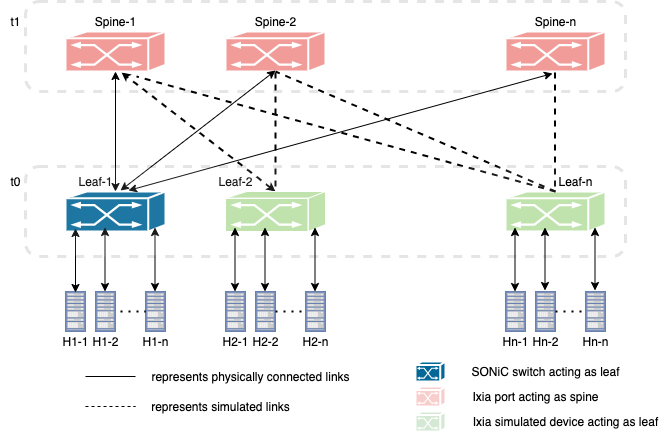
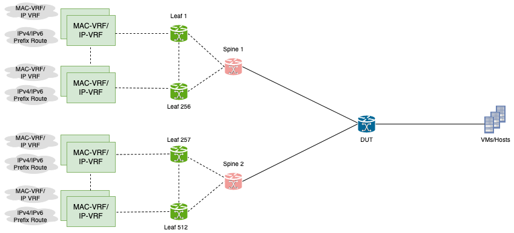
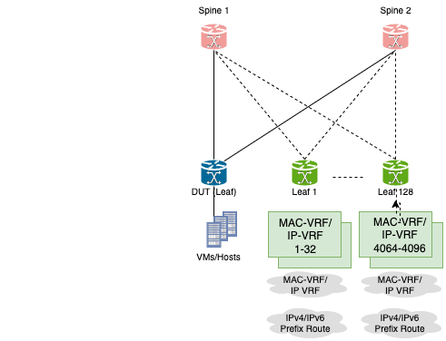
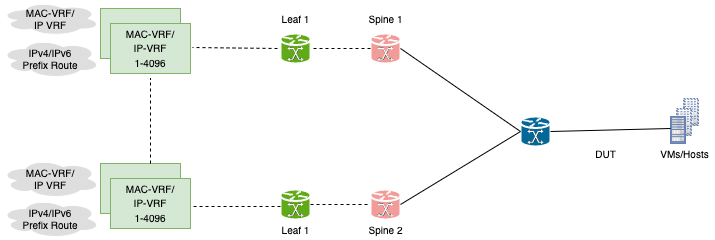
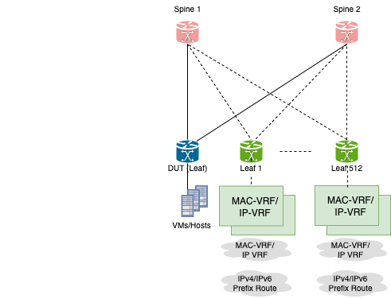
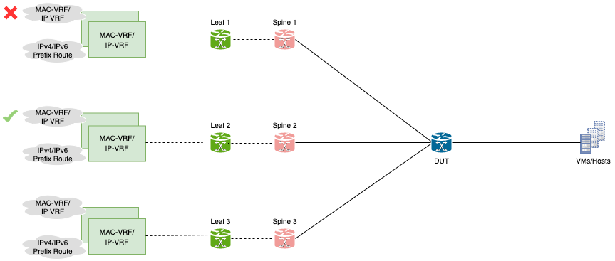

# Functionality and Scaling of BGP EVPN VxLAN

- [Functional and Scale testing of BGP EVPN VxLAN](#functional-and-scale-testing-of-bgp-evpn-vxlan)
  - [Overview](#overview)
    - [Scope](#scope)
    - [Keysight Testbed](#keysight-testbed)
  - [Topology](#topology)
    - [SONiC switch as Leaf](#sonic-switch-as-leaf)
  - [Setup configuration](#setup-configuration)
  - [Bgp Evpn VxLan HLD](#bgp-evpn-vxlan-hld)
  - [Scalability Requirements](#scalability-requirements)
  - [Test cases](#test-cases)
    - [Test case # 1 - Validate the functionality of remote VTEPs (VXLAN destination tunnels) and the maximum VTEPs supported on switch - 512](#test-case--1---validate-the-functionality-of-remote-vteps-vxlan-destination-tunnels-and-the-maximum-vteps-supported-on-switch---512)
      - [Test objective](#test-objective)
      - [Test steps](#test-steps)
      - [Test results](#test-results)
    - [Test case # 2 – Validate the functionality of L2VNI and the maximum L2VNIs supported per switch with unique L2VNIs configured behind VTEPs - 4K.](#test-case--2--validate-the-functionality-of-L2VNI-and-the-maximum-L2VNIs-supported-per-switch-with-unique-L2VNIs-configured-behind-VTEPs---4k)
      - [Test objective](#test-objective-1)
      - [Test steps](#test-steps-1)
      - [Test results](#test-results-1)
    - [Test case # 3 – Validate the functionality of L2VNI and the maximum L2VNIs supported per switch with common L2VNIs configured behind VTEPs - 4K.](#test-case--3--validate-the-functionality-of-L2VNI-and-the-maximum-L2VNIs-supported-per-switch-with-common-L2VNIs-configured-behind-VTEPs---4k)
      - [Test objective](#test-objective-2)
      - [Test steps](#test-steps-2)
      - [Test results](#test-results-2)
    - [Test case # 4 – Validate the functionality of L2VNI and the maximum L2VNIs supported per tunnel - 4K.](#test-case--4--validate-the-functionality-of-L2VNI-and-the-maximum-l2vnis-supported-per-tunnel---4k)
      - [Test objective](#test-objective-3)
      - [Test steps](#test-steps-3)
      - [Test results](#test-results-3)
    - [Test case # 5 – Validate the functionality of L3VNI(VRF) and the maximum L3VNI(VRF) supported per switch - 512.](#test-case--5--validate-the-functionality-of-l3vni(vrf)-and-the-maximum-l3vni(vrf)-supported-per-switch---512)
      - [Test objective](#test-objective-4)
      - [Test steps](#test-steps-4)
      - [Test results](#test-results-4)
    - [Test case # 6 – Host mac mobility from one VTEP to other.](#test-case--6--host-mac-mobility-from-one-vtep-to-other)
      - [Test objective](#test-objective-5)
      - [Test steps](#test-steps-5)
      - [Test results](#test-results-5)

## Overview
The purpose of these tests is to perform the functionality and scalability tests on BGP EVPN VxLAN and verify the performance of the SONiC system, closely resembling production environment.

### Scope
These tests are targeted on fully functioning SONiC system. Will cover functional and scalability testing of VxLAN using BGP EVPN as control plane to learn remote hosts.

### Keysight Testbed
The tests will use Single DUT Topology defined under Keysight Testbed section in testbed overview.

[Keysight Testbed](https://github.com/Azure/sonic-mgmt/blob/master/docs/testbed/README.testbed.Overview.md)

## Topology
### SONiC switch as Leaf

## Setup configuration
IPv4 EBGP/IBGP neighborship will be established for underlay and BGP EVPN will be used as the control plane protocol for overlay network.

## Bgp Evpn VxLan HLD

[HLD](https://github.com/Azure/SONiC/blob/eeebbf6f8a32e5d989595b0816849e8ef0d15141/doc/vxlan/EVPN/EVPN_VXLAN_HLD.md)

## Scalability Requirements
* Total Remote VTEPs (VXLAN destination tunnels) - 512.
* Total L2 VNI per switch - 4K.
* Total VNI per tunnel - 4K.
* Total EVPN participating VRF per switch - 512.

## Test cases
### Test case # 1 - Validate the functionality of remote VTEPs (VXLAN destination tunnels) and the maximum VTEPs supported on switch - 512
#### Test objective
The main objective of this test is to verify that switch can learn remote VTEPs information and also validate the functionality and scalability limits of the switch.

  

#### Test steps
* Configure the same number of leafs across all spines. Number of leafs will be taken as user input while running the script with each leaf having single vtep.
* Configure EBGP/IBGP as underlay protocol.
* Configure EBGP as overlay protocol for remote mac learning.
* Start all protocols.
* Verify that switch is able to learn all remote VTEPs and measure the CPU utilization and memory usage.
* Measure how long it is taking to learn remote VTEP's while doing scale testing.
* Verify that different route types are learned and shown in database.
* Send traffic from local host to remote hosts configured behind these VTEPs.
* Also send traffic from remote host to remote host and verify the statistics.
* Match the tunnel counters with traffic statistics.
* Enable egress tracking on vlan and see packets mapped between VNI and Vlan's.
* Traffic should flow without any loss at line rate.
* Do warm, fast, soft and cold reboots while traffic is running.

#### Test results

### Test case # 2 – Validate the functionality of L2VNI and the maximum L2VNIs supported per switch with unique L2VNIs configured behind VTEPs - 4K.
#### Test objective
  Verify that switch supports total 4K L2 VNI's.

  

#### Test steps
* Configure one L2VNI per leaf and check the functionality. Scale the config such that each spine has multiple leafs connected and each leaf has multiple unique L2VNIs configured to test the max scale of the switch.
* Configure EBGP/IBGP as underlay protocol.
* Configure EBGP as overlay protocol for remote mac learning.
* Start all protocols.
* Verify that switch is able to learn all configured L2VNI's and measure the CPU utilization and memory usage.
* Measure the time it takes to learn configured L2VNI's while doing scale testing.
* Verify that different route types are learned and shown in database.
* Send traffic from local host to remote hosts configured behind these VTEPs.
* Also send traffic from remote host to remote host and verify the statistics.
* Match the tunnel counters with traffic statistics.
* Enable egress tracking on vlan and see packets mapped between VNI and Vlan's.
* Traffic should flow without any loss at line rate.
* Do warm, fast, soft and cold reboots while traffic is running.

#### Test results

### Test case # 3 – Validate the functionality of L2VNI and the maximum L2VNIs supported per switch with common L2VNIs configured behind VTEPs - 4K.
#### Test objective
  Verify that switch supports total 4K L2 VNI's.

  

#### Test steps
* Configure one L2VNI per leaf and check the functionality. Scale the config such that each spine has multiple leafs connected and each leaf has multiple L2VNIs configured and some are common between remote VTEPs configured to test the max scale of the switch.
* Configure EBGP/IBGP as underlay protocol.
* Configure EBGP as overlay protocol for remote mac learning.
* Start all protocols.
* Verify that switch is able to learn all configured L2VNI's and measure the CPU utilization and memory usage.
* Measure the time it takes to learn configured L2VNI's while doing scale testing.
* Verify that different route types are learned and shown in database.
* Send traffic from local host to remote hosts configured behind these VTEPs.
* Match the tunnel counters with traffic statistics.
* Enable egress tracking on vlan and see packets mapped between VNI and Vlan's.
* Traffic should flow without any loss at line rate.
* Do warm, fast, soft and cold reboots while traffic is running.

#### Test results

### Test case # 4 – Validate the functionality of L2VNI and the maximum L2VNIs supported per tunnel - 4K.
#### Test objective
Verify that switch supports total 4K L2 VNI's per tunnel.

  

#### Test steps
* Configure one L2VNI per leaf and check the functionality. Scale the config such that each spine has the same leaf connected and the tunnel to support max L2VNIs
* Configure EBGP/IBGP as underlay protocol.
* Configure EBGP as overlay protocol for remote mac learning.
* Start all protocols.
* Verify that switch is able to learn all remote VTEPs and measure the CPU utilization and memory usage.
* Measure the time it takes to learn configured L2VNI's while doing scale testing.
* Verify that different route types are learned and shown in database.
* Send traffic from local host to remote hosts configured behind these VTEPs.
* Match the tunnel counters with traffic statistics.
* Enable egress tracking on vlan and see packets mapped between VNI and Vlan's.
* Traffic should flow without any loss at line rate.
* Do warm, fast, soft and cold reboots while traffic is running.

#### Test results

### Test case # 5 – Validate the functionality of L3VNI/VRF and the maximum L3VNI/VRF supported per switch - 512.
#### Test objective
Verify that swich supports upto 512 VRF instances.

  

#### Test steps
* Validate the functionality of L3VNI/VRF by configuring single L3VNI on each leaf. Scale the config such that each leaf supports 512 VRFs per switch.
* Configure EBGP/IBGP as underlay protocol.
* Configure IBGP as overlay protocol for remote mac learning.
* Start all protocols.
* Verify that switch is able to learn all remote VTEPs and measure the CPU utilization and memory usage.
* Measure the time it takes to learn configured L3VNI's while doing scale testing.
* Verify that different route types are learned and shown in database.
* Send traffic from local host to remote hosts configured behind these VTEPs.
* Match the tunnel counters with traffic statistics.
* Enable egress tracking on vlan and see packets mapped between VNI and Vlan's.
* Traffic should flow without any loss at line rate.
* Do warm, fast, soft and cold reboots while traffic is running.

#### Test results

### Test case # 6 – Host mac mobility from one VTEP to other.
#### Test objective
Verify that swich supports host mobility and learns the informtion through new VTEP.

  

#### Test steps
* Configure one VTEP behind each spine.
* onfigure EBGP/IBGP as underlay protocol.
* Configure EBGP as overlay protocol for remote mac learning.
* Start all protocols.
* Move host from one VTEP1 to VTEP2 and see that it learns the new information that it has been moved.
* Verify that switch is able to learn all remote VTEPs and measure the CPU utilization and memory usage.
* Verify that different route types are learned and shown in database.
* Send traffic from local host to remote hosts configured behind these VTEPs.
* Match the tunnel counters with traffic statistics.
* Similarly move the host from remote VTEP to local VTEP while traffic is running.
* Enable egress tracking on vlan and see packets mapped between VNI and Vlan's.
* Traffic should flow without any loss at line rate.

#### Test results
