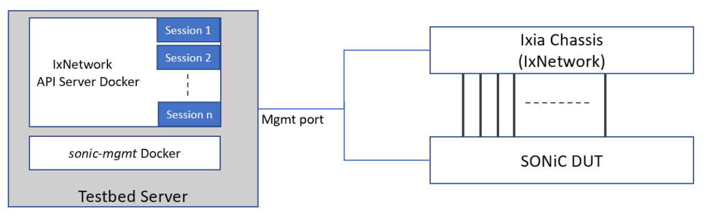

# Scaling of BGP EVPN VxLAN

- [Scaling of BGP EVPN VxLAN](#scaling-of-bgp-evpn-vxlan)
  - [Overview](#overview)
    - [Scope](#scope)
    - [Keysight Testbed](#keysight-testbed)
  - [Topology](#topology)
    - [SONiC switch as Leaf](#sonic-switch-as-leaf)
  - [Setup configuration](#setup-configuration)
  - [Bgp Evpn VxLan HLD](#bgp-evpn-vxlan-hld)
  - [Scalability Requirements](#scalability-requirements)
  - [Test cases](#test-cases)
    - [Test case # 1 - Validating maximum remote VTEPs (VXLAN destination tunnels) supported on switch - 512](#test-case--1---validating-maximum-remote-vteps-vxlan-destination-tunnels-supported-on-switch---512)
      - [Test objective](#test-objective)
      - [Test steps](#test-steps)
      - [Test results](#test-results)
  - [Test cases](#test-cases-1)
    - [Test case # 2 – Validating total L2 VNI supported per switch - 4K.](#test-case--2--validating-total-l2-vni-supported-per-switch---4k)
      - [Test objective](#test-objective-1)
      - [Test steps](#test-steps-1)
      - [Test results](#test-results-1)
  - [Test cases](#test-cases-2)
    - [Test case # 3 – Validating total L2 VNI supported per tunnel - 4K.](#test-case--3--validating-total-l2-vni-supported-per-tunnel---4k)
      - [Test objective](#test-objective-2)
      - [Test steps](#test-steps-2)
      - [Test results](#test-results-2)
  - [Test cases](#test-cases-3)
    - [Test case # 4 – Validating total EVPN participating VRF per switch - 512.](#test-case--4--validating-total-evpn-participating-vrf-per-switch---512)
      - [Test objective](#test-objective-3)
      - [Test steps](#test-steps-3)
      - [Test results](#test-results-3)
  - [Test cases](#test-cases-4)
    - [Test case # 5 – Host mac mobility from one VTEP to other.](#test-case--5--host-mac-mobility-from-one-vtep-to-other)
      - [Test objective](#test-objective-4)
      - [Test steps](#test-steps-4)
      - [Test results](#test-results-4)

## Overview
The purpose of these tests is to perform the scalability tests on BGP EVPN VxLAN and verify the performance of the SONiC system, closely resembling production environment.

### Scope
These tests are targeted on fully functioning SONiC system. Will cover functional and scalability testing of VxLAN using BGP EVPN as control plane to learn remote hosts.

### Keysight Testbed
The tests will use Single DUT Topology defined under Keysight Testbed section in testbed overview.

[Keysight Testbed](https://github.com/Azure/sonic-mgmt/blob/master/docs/testbed/README.testbed.Overview.md)

## Topology
### SONiC switch as Leaf

## Setup configuration
IPv4 EBGP/IBGP neighborship will be established for underlay and BGP EVPN will be used as the control plane protocol for overlay network. 

## Bgp Evpn VxLan HLD

[HLD](https://github.com/Azure/SONiC/blob/eeebbf6f8a32e5d989595b0816849e8ef0d15141/doc/vxlan/EVPN/EVPN_VXLAN_HLD.md)

## Scalability Requirements
* Total Remote VTEPs (VXLAN destination tunnels) - 512.
* Total L2 VNI per switch - 4K. 
* Total VNI per tunnel - 4K.
* Total EVPN participating VRF per switch - 512. 
  
## Test cases
### Test case # 1 - Validating maximum remote VTEPs (VXLAN destination tunnels) supported on switch - 512
#### Test objective
Verify that switch supports 512 remote VTEPs.

  

#### Test steps
* Configure EBGP/IBGP as underlay protocol.
* Configure IBGP as overlay protocol for remote mac learning.
* Configure 512 remote VTEPs.
* Start all protocols.
* Verify that switch is able to learn all remote VTEPs and measure the CPU utilization and memory usage.
* Verify that different route types are learned and shown in database.
* Send traffic from local host to remote hosts configured behind these VTEPs.
* Enable egress tracking on vlan and see packets mapped between VNI and Vlan's.
* Traffic should flow without any loss at line rate.

#### Test results
* It supports upto 500 VTEPs. 
* If we go beyond 500, it is not able to forward the traffic between the hosts on these VTEPs.

## Test cases
### Test case # 2 – Validating total L2 VNI supported per switch - 4K.
#### Test objective
  Verify that switch supports total 4K L2 VNI's.

  

#### Test steps
* Configure EBGP/IBGP as underlay protocol.
* Configure IBGP as overlay protocol for remote mac learning.
* Configure total 4K L2 VNIs per switch.
* Start all protocols.
* Verify that switch is able to learn all remote VTEPs and measure the CPU utilization and memory usage.
* Verify that different route types are learned and shown in database.
* Send traffic from local host to remote hosts configured behind these VTEPs.
* Enable egress tracking on vlan and see packets mapped between VNI and Vlan's.
* Traffic should flow without any loss at line rate.

#### Test results
* Switch becomes very slow and unusable after configuring 4K L2 VNI. 

## Test cases
### Test case # 3 – Validating total L2 VNI supported per tunnel - 4K.
#### Test objective
Verify that switch supports total 4K L2 VNI's per tunnel.

  

#### Test steps
* Configure EBGP/IBGP as underlay protocol.
* Configure IBGP as overlay protocol for remote mac learning.
* Configure total 4K L2 VNIs per tunnel.
* Start all protocols.
* Verify that switch is able to learn all remote VTEPs and measure the CPU utilization and memory usage.
* Verify that different route types are learned and shown in database.
* Send traffic from local host to remote hosts configured behind these VTEPs.
* Enable egress tracking on vlan and see packets mapped between VNI and Vlan's.
* Traffic should flow without any loss at line rate

#### Test results
* Switch becomes very slow and unusable after configuring 4K L2 VNI. 

## Test cases
### Test case # 4 – Validating total EVPN participating VRF per switch - 512.
#### Test objective
Verify that swich supports upto 512 VRF instances.

  

#### Test steps
* Configure EBGP/IBGP as underlay protocol.
* Configure IBGP as overlay protocol for remote mac learning.
* Configure 512 VRF instances per switch.
* Start all protocols.
* Verify that switch is able to learn all remote VTEPs and measure the CPU utilization and memory usage.
* Verify that different route types are learned and shown in database.
* Send traffic from local host to remote hosts configured behind these VTEPs.
* Enable egress tracking on vlan and see packets mapped between VNI and Vlan's.
* Traffic should flow without any loss at line rate.

## Test cases
### Test case # 5 – Host mac mobility from one VTEP to other.
#### Test objective
Verify that swich supports host mobility and learns the informtion through new VTEP.

  

#### Test steps
* Configure EBGP/IBGP as underlay protocol.
* Configure IBGP as overlay protocol for remote mac learning.
* Move host from one VTEP to another and see that it learns the new information that it has been moved.
* Start all protocols.
* Verify that switch is able to learn all remote VTEPs and measure the CPU utilization and memory usage.
* Verify that different route types are learned and shown in database.
* Send traffic from local host to remote hosts configured behind these VTEPs.
* Enable egress tracking on vlan and see packets mapped between VNI and Vlan's.
* Traffic should flow without any loss at line rate.

#### Test results
