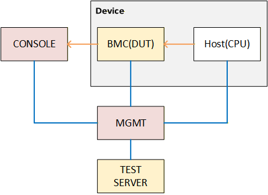
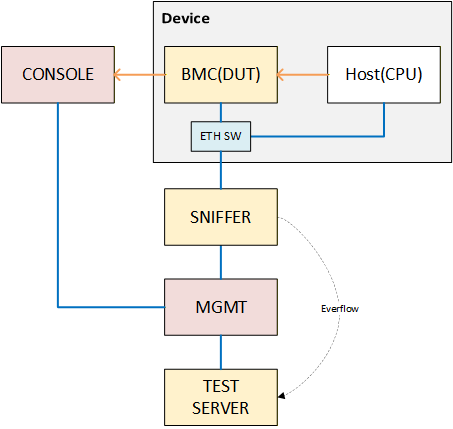

# BMC High-Level Test Plan

## Definitions/Abbreviation

| **Definitions/Abbreviation** | **Description** |
|-------------------|----------|
| BMC | Baseboard Management Controller  |

## 1 Overview

The BMC provides a dedicated management channel independent of the main CPU and OS. It enables users to access the system via the BMC for troubleshooting and recovery even if the switch OS crashes or the CPU freeze. And it also provides many useful features such as remote power control/hardware health monitoring etc.

SONiC BMC is designed for SONiC network switch. Using SONiC as the BMC’s operating system offers a unified and modular software stack that simplifies integration between the switch CPU and the management controller. It leverages SONiC’s containerized architecture, rich networking capabilities, and standardized APIs (such as gNMI/streaming telemetry/Redfish API, etc.) to enable consistent management, telemetry, and orchestration across the entire platform. This approach reduces operational complexity by providing a unified environment for operators, supports advanced out-of-band networking features, and allows flexible service deployment on the BMC.

## 2 Scope

### 2.1 Test Scenario

The SONiC BMC test treats the BMC itself as the DUT in the testbed. The BMC runs a fully functional SONiC OS. However, since the BMC has no ASIC or data-plane, features that depend on these components will not be enabled on the BMC, and the related tests will be scoped out accordingly. All tests related to features supported by the SONiC BMC OS will be included in the BMC test suite.

#### 2.1.1 In Scope

- Control-plane functionality on the BMC (e.g., gNMI, streaming telemetry, Redfish API)
- Hardware health monitoring and remote power control
- Out-of-band management networking features
- Platform-level tests applicable to the BMC environment
- Containerized service deployment and lifecycle on the BMC

#### 2.1.2 Out of Scope

- ASIC and data-plane related tests (e.g., forwarding, ACL hardware offload, ECMP)
- Features that require a switching ASIC (e.g., port channel, VLAN bridging)

### 2.2 Supported Topology

There are two new topologies designed for SONiC BMC testing:

- **bmc-dual-mgmt** — The BMC and the main CPU each have their own dedicated management port on the switch's front panel.
- **bmc-shared-mgmt** — The BMC and the main CPU share a single management port on the switch's front panel.

Please refer to section 3 for details about these topologies.

## 3 Testbed

### 3.1 bmc-dual-mgmt

The diagram below illustrates the bmc-dual-mgmt topology.



In this topology, the BMC and the main CPU each have their own dedicated management port on the switch's front panel. Both ports can be connected to the management network of your test infrastructure independently.

**Management Network**

The test server hosts PTF containers to support tests such as ZTP, Redfish, gNMI, etc. Since the BMC and the main CPU have separate management ports, each has its own IP address and independent network connectivity to the test server.

**Serial Console**

The default serial console connections are shown as the yellow arrows in the diagram.

- The physical console port on the switch's front panel connects to your lab infrastructure and is used for console testing (e.g., default baud rate) or testbed recovery.
- The host-side console connects to the BMC's UART via board-embedded circuits.

Based on this design, the BMC serves as the direct console device for host-side console access. Some console tests that are currently designed for the c0 topology will also be included in the BMC test suite.

**Testbed Modeling**

The BMC is closely coupled with the host (CPU). Many BMC tests require interaction with the host side to verify functionality — for example, the BMC may power-cycle the host CPU and then examine the host's status or reboot cause. Because of this, the host-side DUT will be reserved during BMC test execution to prevent conflicting operations from other test sessions.

To allow both the BMC and the host to serve as the DUT in different testbeds, the BMC entry is duplicated in the devices file. When the BMC is the DUT, the host is treated as part of the testbed infrastructure. Conversely, when the host is the DUT, the BMC is treated as a console server and lab infrastructure device.

Below is a minimal model of a BMC testbed:

```csv
*_devices.csv

Hostname,ManagementIp,HwSku,Type,Protocol,Os
switch01,192.168.0.100/24,SKU,DevSonic,,sonic
switch01-bmc,192.168.0.101/24,bmc,DevSonic,,sonic
sniffer-01,192.168.0.102/24,SKU,Sniffer,,sonic
...
lab-con,192.168.0.80/24,OOB,ConsoleServer,ssh,sonic
switch01-bmc-con,192.168.0.101/24,bmc,ConsoleServer,ssh,sonic
```

- `switch01` — The host-side SONiC switch.
- `switch01-bmc` — The BMC as a DUT (used when running BMC tests).
- `sniffer-01` — The sniffer device for `bmc-shared-mgmt` setup. Optional for other topology.
- `lab-con` — The lab console server, providing physical console access to the BMC.
- `switch01-bmc-con` — The BMC acting as a console server for the host (used when running host-side tests). Note this shares the same management IP as `switch01-bmc` since it is the same device in a different role.

```csv
*_console_links.csv

StartDevice,StartPort,EndDevice,Console_type,Console_menu_type,Proxy,BaudRate
lab-con,1,switch01-bmc,ssh,sonic_config,sonicadmin,9600
switch01-bmc-con,1,switch01,ssh,sonic_config,sonicadmin,115200
```

- `lab-con → switch01-bmc` — Physical console access from the lab console server to the BMC (baud rate 9600).
- `switch01-bmc-con → switch01` — Console access from the BMC to the host via the board-embedded UART (baud rate 115200).

**Topology Definition**

The BMC topology definition is modeled after `topo_c0.yml`, as the BMC functions similarly to a single downstream async-port device in the c0 topology. However, since the BMC has no ASN, no neighbor VMs, and no route programming, the topology definition is significantly simpler.

Below is the topology definition for `topo_bmc-dual-mgmt.yml`:

```yaml
topology:
  console_interfaces:
    - 1.115200.0

configuration_properties:
  common:
    dut_type: NetworkBmc
```

- **`dut_type`**: `NetworkBmc` — identifies the DUT as a BMC device.
- **`console_interfaces`**: A single port at 115200 baud, representing the console link between the BMC and the host (CPU). This is used for generating the console configuration on the BMC.

### 3.2 bmc-shared-mgmt

The diagram below illustrates the bmc-shared-mgmt topology.



In this topology, the BMC and the main CPU share a single management port on the switch's front panel. An embedded ethernet switch inside the system bridges traffic between three internal ports — the BMC-facing port, the CPU-facing port, and the front-panel-facing port.

The device's factory default state includes a VLAN tagging configuration on the embedded switch similar to the one described in the `embedded_switch` field in `testbed.yaml` (e.g., BMC port untagged, CPU port tagged, front panel port trunk). However, for testbed use, all three ports are configured in the same VLAN with no tagging so that both the BMC and the CPU are directly accessible from the lab management network without any special VLAN configuration. This untagged state is the default testbed state.

For production or advanced deployments, the embedded switch supports VLAN tagging to isolate BMC and CPU traffic on the shared port. The BMC is responsible for programming the VLAN configuration on the embedded switch. During bmc-shared-mgmt specific tests, the test will apply the VLAN tagging configuration (defined in `testbed.yaml`) to the embedded switch and verify correct behavior. After the test completes, the configuration is restored to the default testbed state (untagged).

**Management Network**

The test server hosts PTF containers to support tests such as ZTP, Redfish, gNMI, etc. Although the BMC and the main CPU share a single physical management port, each is assigned its own IP address and can be reached independently from the management network.

**Sniffer**

A sniffer device is placed between the DUT's front-panel management port and the lab infrastructure management switch. By default, the sniffer operates in pass-through mode — all traffic is transparently forwarded between the front-panel port and the management switch, so it has no impact on normal test operations and users are not aware of its presence.

During bmc-shared-mgmt specific tests (e.g., VLAN tagging verification), the sniffer can be activated with everflow (port mirroring) enabled. This allows it to mirror a copy of all packets from the DUT-facing port to the PTF for inspection. Since the sniffer captures traffic directly from the front-panel port before it reaches the management switch, tagged packets (such as CPU-side VLAN-tagged traffic) are preserved and visible to the PTF for verification.

**Serial Console**

The serial console design is the same as the bmc-dual-mgmt topology. Please refer to the bmc-dual-mgmt section for details.

**Topology Definition**

The topology definition for bmc-shared-mgmt includes the same console interface as bmc-dual-mgmt, plus additional properties for the embedded ethernet switch VLAN configuration.

Below is the topology definition for `topo_bmc-shared-mgmt.yml`:

```yaml
topology:
  console_interfaces:
    - 1.115200.0

configuration_properties:
  common:
    dut_type: NetworkBmc
```

In addition to the topology file, the following new fields are introduced in the `testbed.yaml` entry to describe the target VLAN tagging configuration for the embedded ethernet switch. These values reflect the device's factory default VLAN tagging configuration. They define the VLAN settings that the test will apply to the embedded switch during bmc-shared-mgmt specific tests (e.g., VLAN tagging verification). After the test completes, the embedded switch is restored to the default testbed state (untagged).

Example `testbed.yaml` segment for bmc-shared-mgmt:

```yaml
- conf-name: bmc-shared-mgmt-01
  group-name: bmc-shared-mgmt
  topo: bmc-shared-mgmt
  ptf_image_name: docker-ptf
  ptf: ptf_bmc02
  ptf_ip: 10.255.0.201/24
  ptf_ipv6: 2001:db8:1::11/64
  server: server_1
  vm_base:
  dut:
    - switch02-bmc
  bmc_host: switch02
  inv_name: lab
  auto_recover: 'False'
  comment: BMC shared-mgmt testbed
  embedded_switch:
    bmc_port:
      mode: access
      vlan: 100
    cpu_port:
      mode: tagged
      vlan: 200
    frontpanel_port:
      mode: trunk
      native_vlan: 100
```

- **`embedded_switch`**: Describes the target VLAN configuration to be applied to the embedded ethernet switch during tests.
  - **`bmc_port`**: The BMC-facing port. `mode: access` means traffic is untagged. `vlan` is the VLAN ID assigned to this port.
  - **`cpu_port`**: The CPU-facing port. `mode: tagged` means traffic carries the specified VLAN tag.
  - **`frontpanel_port`**: The front-panel-facing port. `mode: trunk` allows both tagged and untagged traffic. `native_vlan` specifies the VLAN for untagged traffic, which matches the BMC port's VLAN so that untagged inbound traffic is forwarded to the BMC.

## 4 Utilities

This section describes the key utilities that will be added or extended to support BMC testing. The primary focus is extending the existing `SonicHost` class so that test authors can seamlessly interact with both the BMC and the host side within the same test.

### 4.1 SonicHost Extensions

The `SonicHost` class (defined in `tests/common/devices/sonic.py`) will be extended with the following methods to support BMC-aware test workflows.

#### `is_bmc()`

Check whether the current `SonicHost` instance is a BMC device.

```python
def is_bmc(self):
    """Check if the current SONiC host is a BMC.

    Returns:
        bool: True if this host is a BMC device, False otherwise.
    """
```

**Usage example:**

```python
def test_bmc_feature(duthosts, rand_one_dut_hostname):
    duthost = duthosts[rand_one_dut_hostname]
    pytest_assert(duthost.is_bmc(), "This test requires a BMC DUT")
```

#### `get_bmc_host()`

When the current `SonicHost` is a BMC, return a `SonicHost` instance for the associated host (CPU) side. This enables test authors to cross-check host-side status during BMC tests — for example, verifying reboot cause or service state after a BMC-initiated power cycle.

The BMC-to-host mapping is defined in the testbed YAML file via a new `bmc_host` field, rather than relying on hostname conventions. Below is an example `testbed.yaml` segment:

```yaml
- conf-name: bmc-dual-mgmt-01
  group-name: bmc-dual-mgmt
  topo: bmc-dual-mgmt
  ptf_image_name: docker-ptf
  ptf: ptf_bmc01
  ptf_ip: 10.255.0.200/24
  ptf_ipv6: 2001:db8:1::10/64
  server: server_1
  vm_base:
  dut:
    - switch01-bmc
  bmc_host: switch01
  inv_name: lab
  auto_recover: 'False'
  comment: BMC dual-mgmt testbed
```

The `bmc_host` field specifies the hostname of the associated host (CPU) side device. The `get_bmc_host()` method reads this field from testbed info to resolve the host-side `SonicHost` instance.

```python
def get_bmc_host(self):
    """Get the SonicHost instance of the associated host (CPU) for this BMC.

    The host-side device is resolved from the 'bmc_host' field defined in
    the testbed YAML file.

    Returns:
        SonicHost: A SonicHost instance representing the host (CPU) side.

    Raises:
        AssertionError: If the current device is not a BMC.
    """
```

**Usage example:**

```python
def test_bmc_power_cycle(duthosts, rand_one_dut_hostname):
    """Test that BMC can power-cycle the host and the host recovers."""
    duthost = duthosts[rand_one_dut_hostname]
    host = duthost.get_bmc_host()

    # BMC initiates power cycle on the host
    duthost.shell('bmc-util power-cycle host')

    # Wait for host to come back up
    wait_until(300, 10, 0, host.critical_services_fully_started)

    # Verify reboot cause on the host side
    output = host.show_and_parse('show reboot-cause')
    pytest_assert('Power Cycle' in output[0]['cause'],
                  "Expected power cycle reboot cause")
```

### 4.2 Future Utilities

The following utilities may be added in subsequent phases as the BMC test suite matures:

| Utility | Description |
|---|---|
| `get_bmc_from_host()` | Inverse of `get_bmc_host()` — given a host-side `SonicHost`, return the associated BMC instance. |
| BMC power control helpers | Wrappers for common BMC power operations (power on/off/cycle/status) on the host side. |
| BMC health check fixtures | Pytest fixtures that verify BMC health before and after each test. |
| Console access helpers | Utilities for testing serial console access through the BMC to the host. |


## 5 Test Cases

### 5.1 Reused Test Suites

The following existing test suites are compatible with the BMC environment and will be reused directly by adding the BMC topologies (`bmc-dual-mgmt`, `bmc-shared-mgmt`) to their topology markers. No BMC-specific modifications are expected for these tests — they should work as-is once the topology markers are updated.

| Feature | Test Suite Directory |
|---|---|
| Database | `tests/database/` |
| gNMI | `tests/gnmi/` |
| LLDP | `tests/lldp/` |
| PMON | `tests/platform_tests/daemon/` |
| Telemetry | `tests/telemetry/` |
| Redfish | `tests/redfish/` |
| CACL | `tests/cacl/` |
| Console | `tests/console/` |
| Rsyslog | `tests/rsyslog/` |
| ZTP | `tests/ztp/` |

The table above is not exhaustive — additional features not listed here may also be included in the BMC common test suite as compatibility is validated over time.

For the topology marker, use `'bmc'` as a simplified marker when a test applies to both `bmc-dual-mgmt` and `bmc-shared-mgmt`. Use the specific topology name only when a test is exclusive to one of them. For example:

```python
# Test applies to both BMC topologies — use 'bmc'
@pytest.mark.topology('t0', 't1', 'bmc')
def test_example(duthosts, rand_one_dut_hostname):
    ...

# Test applies only to bmc-dual-mgmt
@pytest.mark.topology('bmc-dual-mgmt')
def test_dual_mgmt_specific(duthosts, rand_one_dut_hostname):
    ...
```

Feature-level test plans are owned and maintained by the respective feature owners and are not covered in this document.

### 5.2 bmc-shared-mgmt Specific Tests

#### 5.2.1 Embedded Switch VLAN Tagging Verification

The bmc-shared-mgmt topology uses an embedded ethernet switch to share a single front-panel management port between the BMC and the CPU. Verifying the VLAN tagging configuration is critical to ensure correct traffic isolation and connectivity.

A sniffer device is placed between the DUT's front-panel management port and the lab management switch (see section 3.2). By default it operates in pass-through mode. During these tests, everflow is enabled on the sniffer to mirror traffic from the DUT-facing port to the PTF, allowing direct inspection of VLAN-tagged packets before they are stripped by the upstream management switch.

**Test Case 1: BMC traffic is untagged**

Enable everflow on the sniffer, then generate traffic from the BMC (e.g., ping the test server). Capture the mirrored packets at the PTF and verify that frames originating from the BMC are **untagged** (no 802.1Q header).

- Enable everflow on the sniffer to mirror the DUT-facing port to PTF.
- From the BMC, ping the test server.
- At the PTF, verify captured packets from the BMC's MAC/IP have no VLAN tag.

**Test Case 2: CPU traffic is tagged**

Enable everflow on the sniffer, then generate traffic from the CPU (e.g., ping the test server). Capture the mirrored packets at the PTF and verify that frames originating from the CPU carry the **expected VLAN tag** as defined in the testbed configuration.

- Enable everflow on the sniffer to mirror the DUT-facing port to PTF.
- From the CPU, ping the test server.
- At the PTF, verify captured packets from the CPU's MAC/IP carry the expected VLAN ID (e.g., VLAN 200).