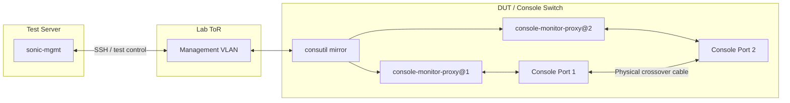

# Console Mirror Test Plan

- [1 Background](#1-background)
- [2 Scope](#2-scope)
- [3 Testbed Setup](#3-testbed-setup)
- [4 Test Cases](#4-test-cases)
  - [4.1 Functionality Test](#41-functionality-test)
  - [4.2 Lifecycle and Robustness](#42-lifecycle-and-robustness)
  - [4.3 Performance Test](#43-performance-test)

## 1 Background

Console Mirror records RX and/or TX traffic from a console line for troubleshooting, without taking ownership of or interfering with an active console session.

For design details, refer to [Console Mirror High Level Design](https://github.com/sonic-net/SONiC/blob/master/doc/console/Console-Mirror-High-Level-Design.md).

## 2 Scope

This plan verifies:

- `consutil mirror start`, `show`, `timeout`, and `stop`, including invalid requests
- RX, TX, and bidirectional recording without console-session interference
- SCM-Text v1 format, payload escaping, file rotation, and ZIP packaging
- STATE_DB state management, automatic stop, and resource stability

## 3 Testbed Setup

- **Test Server**: Runs `sonic-mgmt`.
- **Lab ToR**: Provides the VLAN path used by `sonic-mgmt` to access the DUT.
- **DUT**: Runs `consutil`, the per-line console proxies, Console Mirror, STATE_DB, and local recording storage.
- **Serial wiring**: Console ports 1 and 2 on the DUT are connected directly with a crossover cable.

This is a `c0-lo`-style physical two-port loopback setup. The Lab ToR is only the management path and is not part of the serial traffic path.

For a mirror session on line 1:

| Test traffic | Direction recorded on line 1 |
|---|---|
| Send from the line 1 console session | TX |
| Send from the line 2 console session | RX |

## 4 Test Cases

### 4.1 Functionality Test

| Case | Objective | Test Steps | Expected Result |
|-|-|-|-|
| CLI and State | Verify CLI control, runtime state, validation | 1. Start, show, check `STATE_DB`, update timeout, check `STATE_DB`, and stop line 1 mirror 2. Repeat with invalid parameters | Valid operations return correct state and metadata; timeout update resets remaining time; invalid requests are rejected without side effects. |
| Traffic Recording | Verify direction filtering, data integrity, escaping, and non-interference | 1. Parameterize `rx`, `tx`, and `both` 2. Exchange unique printable and control-byte payloads through line 1 and line 2 while the console sessions remain active | Only selected directions are fully recorded with correct labels and escaping. |
| Recording Files | Verify file format, rotation, retention, packaging, and permissions | 1. Stop once without archiving 2. Repeat with a small file-size limit and `--archive`, inspect log parts, ZIP contents, ownership, and permissions | Format and rotation are correct; unarchived logs remain; a successful ZIP contains every part and removes its source logs; directories are `0700` and files are `0600`, owned by `root:root` |
| Archive Failure | Verify recording data is preserved when packaging fails | Force ZIP creation to fail | Incomplete `.zip.tmp` is removed, source logs are preserved, and console forwarding continues |

### 4.2 Lifecycle and Robustness

| Case | Objective | Test Steps | Expected Result |
|-|-|-|-|
| Automatic Stop | Verify bounded mirror lifetime and automatic finalization | Start with a short timeout and wait for expiry | Mirror becomes `idle`, records `reason=timeout`, and creates a ZIP automatically |
| Rapid Session Restart | Verify old session state and timers cannot affect a new session | Repeatedly start and stop line 1, then keep the final session active beyond an earlier session's deadline | Every session has a unique file prefix; stale timers do not stop the current session and state remains correct |
| Asynchronous Archive | Verify archiving is independent of later sessions and the waiting CLI | 1. Start archiving a large recording 2. Terminate the waiting CLI, and immediately start a new mirror on the same line | The previous archive continues, the new session records independently, and files from the two sessions are not mixed |

### 4.3 Performance Test

| Case | Objective | Test Steps | Expected Result |
|-|-|-|-|
| RAM Usage | Measure mirror memory usage under continuous traffic | Start bidirectional mirroring, generate continuous traffic, and sample the target proxy service RSS before, during, and after recording | Report peak RAM usage; memory remains bounded and returns near the idle baseline after stop |
| Peak CPU Usage | Measure peak mirror CPU usage under continuous traffic | Generate continuous bidirectional traffic during mirroring and sample the target proxy service CPU usage | Report peak CPU usage; serial traffic remains intact without visible latency or loss |
