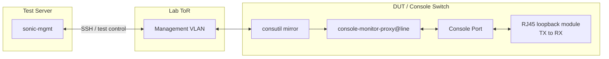

# Console Mirror Test Plan

- [1 Background](#1-background)
- [2 Scope](#2-scope)
- [3 Testbed Setup](#3-testbed-setup)
- [4 Test Cases](#4-test-cases)
  - [4.1 Functionality Test](#41-functionality-test)
  - [4.2 Lifecycle Test](#42-lifecycle-test)
  - [4.3 Performance Test](#43-performance-test)
- [5 Future Work](#5-future-work)

## 1 Background

Console Mirror records RX and/or TX traffic from a console line for troubleshooting, without taking ownership of or interfering with an active console session.

For design details, refer to [Console Mirror High Level Design](https://github.com/sonic-net/SONiC/blob/master/doc/console/Console-Mirror-High-Level-Design.md).

## 2 Scope

This plan verifies:

- Valid `consutil mirror start`, `show`, `timeout`, and `stop` operations
- RX, TX, and bidirectional recording without console-session interference
- SCM-Text v1 format, payload escaping, file rotation, and successful ZIP packaging
- STATE_DB state management, automatic stop, session cleanup, and resource stability

## 3 Testbed Setup

- **Test Server**: Runs `sonic-mgmt`.
- **Lab ToR**: Provides the VLAN path used by `sonic-mgmt` to access the DUT.
- **DUT**: Runs `consutil`, the per-line console proxies, Console Mirror, STATE_DB, and local recording storage.
- **Serial wiring**: Select one console line from the testbed's `*_serial_links.csv`. In accordance with `c0-lo`, that console port is fitted with an RJ45 loopback module that connects its TX pins back to its RX pins.

The initial automation targets the `c0-lo` topology defined by the [Standalone SONiC Console Server Test Plan](standalone_sonic_console_server_test_plan.md).

For a mirror session on the selected line:

| Test traffic leg | Direction recorded on the selected line |
|---|---|
| Data sent from the reverse-SSH console session to the physical port | TX |
| The same data returned by the RJ45 loopback module | RX |

## 4 Test Cases

Use a function-scoped teardown fixture for every test case. The fixture stops any active mirror, waits for `consutil mirror show` and `CONSOLE_MIRROR|<line>` in STATE_DB to report `idle`, verifies that all active-session fields are cleared and no recording file for the stopped session remains open by the target proxy, and releases the console session. A teardown verification failure fails the test.

### 4.1 Functionality Test

| Case | Objective | Test Steps | Expected Result |
|-|-|-|-|
| CLI and State | Verify CLI control and runtime state | Start, show, check `STATE_DB`, update timeout, check `STATE_DB`, and stop mirroring on the selected line | Operations return correct state and metadata; the timeout update resets the remaining time. |
| Traffic Recording | Verify direction filtering, data integrity, escaping, and non-interference | 1. Parameterize `rx`, `tx`, and `both` 2. Send a unique printable and control-byte payload through one reverse-SSH session and receive it back through the selected port's loopback module | Only selected directions are fully recorded with correct labels and escaping. The console session receives exactly the string sent, without loss, duplication, or other changes. In `both` mode the same frame appears once as TX and once as RX. |
| Recording Files | Verify file format, rotation, retention, and permissions | Start with a small file-size limit, generate enough traffic to rotate the recording, stop without archiving, and inspect the log parts, ownership, and permissions | SCM-Text format and rotation are correct; all unarchived log parts remain; directories are `0700` and log files are `0600`, owned by `root:root` |
| Archive Success | Verify successful ZIP packaging | Start with a small file-size limit, generate multiple log parts, preserve hard links to their inodes, stop with `--archive`, and compare each ZIP entry with its source log | The ZIP is created successfully with mode `0600` and ownership `root:root`; its entry names, sizes, and SHA-256 digests match the source logs exactly; the original source paths are removed |

### 4.2 Lifecycle Test

| Case | Objective | Test Steps | Expected Result |
|-|-|-|-|
| Automatic Stop | Verify bounded mirror lifetime and automatic finalization | Start with a short timeout and wait for expiry | Mirror becomes `idle`, records `reason=timeout`, and creates a ZIP automatically |

### 4.3 Performance Test

| Case | Objective | Test Steps | Expected Result |
|-|-|-|-|
| Single-Line Maximum-Rate Resource Usage | Measure peak memory and CPU usage while one line is mirrored at its maximum serial rate | 1. Select one console line and read its configured baud rate 2. Record the target proxy service's idle memory and CPU baseline 3. Start bidirectional mirroring on the selected line 4. Send continuous console traffic through its reverse-SSH session and receive it back through the RJ45 loopback module at the maximum throughput supported by the configured baud rate while sampling the proxy's memory and CPU usage 5. Stop mirroring and record the peaks and post-stop memory usage | Report peak memory and CPU usage; looped-back traffic remains intact at the expected baud-limited rate; memory remains bounded and returns near the idle baseline after teardown. |

## 5 Future Work

- Add support for the 'c0' topology, including discovery and control of the console fanout endpoint for the selected serial link.
