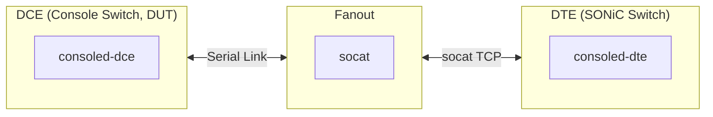

# Console Monitor Test Plan

- [Console Monitor Test Plan](#console-monitor-test-plan)
  - [1 Background](#1-background)
  - [2 Scope](#2-scope)
  - [3 Testbed Setup](#3-testbed-setup)
  - [4 Test Cases](#4-test-cases)
    - [4.1 Functional Tests](#41-functional-tests)
    - [4.2 Filter Timeout Test](#42-filter-timeout-test)
    - [4.3 Filter Correctness Test](#43-filter-correctness-test)
    - [4.4 Enable/Disable Toggle Test](#44-enabledisable-toggle-test)
    - [4.5 Performance Tests](#45-performance-tests)

## 1 Background

Console Monitor is a link operational state detection service between Console Server (DCE) and SONiC Switch (DTE) via serial ports. The system uses heartbeat frames for connectivity detection without interfering with normal console operations.

For more design detail, refer to [Console Monitor High Level Design](https://github.com/sonic-net/SONiC/blob/master/doc/console/Console-Monitor-HLD.md).

## 2 Scope

The scope of this test plan is to verify the correct operation of Console Monitor service, including:

- Heartbeat-based link state detection (Oper Up/Unknown)
- Frame filtering (heartbeat frames should not pass through to user sessions)
- Service enable/disable functionality
- Performance under concurrent serial port monitoring

## 3 Testbed Setup

The testbed consists of:

- **DCE (Console Switch, DUT)**: SONiC device with Console Switch attached, running `consoled-dce` service
- **Fanout**: Intermediate device that bridges serial link to TCP using `socat`
- **DTE (SONiC Switch)**: Target SONiC device running `consoled-dte` service, connected via TCP

Wiring diagram:

## 4 Test Cases

### 4.1 Functional Tests

| Case | Objective | Test Steps | Expected Result |
|-|-|-|-|
| Initial State | Verify initial oper state is `unknown` after timeout | 1. Configure serial ports in CONFIG_DB 2. Start DCE service 3. Wait for initial timeout | All configured ports show `oper_state=unknown` in STATE_DB |
| Link Up Detection | Verify oper state changes to `up` when heartbeat received | 1. Start DTE service on switch 2. Connect serial cable 3. Wait for heartbeat | DCE shows `oper_state=up`, `state_duration` resets to 0 |
| Link Unknown Detection | Verify oper state changes to `unknown` after heartbeat timeout | 1. Establish link (oper_state=up) 2. Disconnect serial cable or stop DTE heartbeat 3. Wait for heartbeat timeout | DCE shows `oper_state=unknown`, `state_duration` resets to 0 |

### 4.2 Filter Timeout Test

| Case | Objective | Test Steps | Expected Result |
|-|-|-|-|
| Data Pass-through | Verify user data passes through after filter timeout | 1. Stop DTE heartbeat 2. Send short string from DTE side 3. Read from DCE PTY | DCE receives the exact string sent |

### 4.3 Filter Correctness Test

| Case | Objective | Test Steps | Expected Result |
|-|-|-|-|
| Concurrent Heartbeat and Data | Verify data integrity while heartbeat is active | 1. DTE sends heartbeat continuously 2. DTE sends a long random string 3. DCE reads from PTY | DCE receives complete string without heartbeat frame corruption |

### 4.4 Enable/Disable Toggle Test

| Case | Objective | Test Steps | Expected Result |
|-|-|-|-|
| DCE Service Toggle | Verify DCE service starts and stops gracefully | 1. Start consoled-dce service 2. Verify service is running 3. Stop consoled-dce service | Service starts/stops without errors; PTY symlinks cleaned up on stop |
| DTE Service Toggle | Verify DTE service starts and stops gracefully | 1. Start consoled-dte service 2. Verify service is running 3. Stop consoled-dte service | Service starts/stops without errors; heartbeat stops on service stop |

### 4.5 Performance Tests

| Case | Objective | Test Setup | Expected Result |
|-|-|-|-|
| Heartbeat Scalability | Verify system handles 48 ports heartbeat concurrently | 48 serial ports with active heartbeat monitoring for 60s | Avg CPU < 10%; Memory < 200MB; All ports report correct oper_state |
| Data Transfer Scalability | Verify system handles 48 ports data transfer concurrently | 48 serial ports with continuous data transfer for 60s | Avg CPU < 10%; Memory < 200MB; No data corruption |
