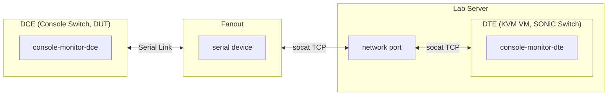

# Console Monitor Test Plan

- [Console Monitor Test Plan](#console-monitor-test-plan)
  - [1 Background](#1-background)
  - [2 Scope](#2-scope)
  - [3 Testbed Setup](#3-testbed-setup)
  - [4 Test Cases](#4-test-cases)
    - [4.1 Connectivity Test](#41-connectivity-test)
    - [4.2 Functionality Test](#42-functionality-test)
    - [4.3 Filter Test](#43-filter-test)
    - [4.4 Performance Test](#44-performance-test)

## 1 Background

Console Monitor is a link operational state detection service between Console Server (DCE) and SONiC Switch (DTE) via serial ports. The system uses heartbeat frames for connectivity detection without interfering with normal console operations.

For more design detail, refer to [Console Monitor High Level Design](https://github.com/sonic-net/SONiC/blob/master/doc/console/Console-Monitor-HLD.md).

## 2 Scope

The scope of this test plan is to verify the correct operation of Console Monitor service, including:

- Heartbeat-based link state detection (Oper Up/Unknown)
- Frame filtering (heartbeat frames should not pass through to user sessions)
- DCE service enable/disable functionality (DTE toggle is covered implicitly by other tests)
- Memory and CPU usage under normal operation

## 3 Testbed Setup

The testbed consists of:

- **DCE (Console Switch, DUT)**: SONiC device with Console Switch attached, running `consoled-dce` service
- **Fanout**: Intermediate device that bridges serial port to TCP using `socat`
- **Lab Server**: Host machine running KVM; uses `socat` to bridge an eth port to the DTE VM's management interface
- **DTE (KVM VM)**: SONiC virtual machine running `consoled-dte` service, hosted on Lab Server

Wiring diagram:

## 3.1 Test Utilities

### ConsoleBridge

`ConsoleBridge` is a dataclass that describes a fully established console bridge between a DUT serial port and a neighbor VM. It records the link ID, VM serial port, socat bridge port, fanout device path, and neighbor VM name.

### BridgeManager

`BridgeManager` orchestrates the setup and teardown of console bridges during tests. For a given console line and neighbor VM, it:

1. Looks up the fanout host and port that corresponds to the DUT's serial line.
2. Queries the VM host (`virsh dumpxml`) to find the VM's serial TCP port.
3. Starts a `socat` TCP relay on the VM host to bridge the VM serial port to a known TCP port.
4. Instructs the fanout to connect its serial device to the VM host's TCP port via `bridge_remote`.
5. Tracks all active bridges and cleans them up (kills socat, unbridges fanout) after the test.

This utility enables tests to programmatically connect DUT console lines to neighbor VMs without manual wiring changes.

## 4 Test Cases

### 4.1 Connectivity Test

| Case | Objective | Test Steps | Expected Result |
|-|-|-|-|
| DUT Connected to Fanout | Verify DUT console line is physically connected to a fanout | 1. Get configured console lines from DUT 2. Search fanout hosts for serial port mapping to the target line | Fanout host with matching serial port mapping is found |

### 4.2 Functionality Test

| Case | Objective | Test Steps | Expected Result |
|-|-|-|-|
| Oper State Transition | Verify full oper state lifecycle: initial Unknown, heartbeat-driven Up, and timeout-driven Unknown | 1. Wait for heartbeat timeout; verify all lines are `Unknown` 2. Build console bridge (DUT → Fanout → VM Host → Neighbor VM) 3. Enable DTE heartbeat on neighbor VM 4. Wait for heartbeat detection; verify target line is `Up` and others remain `Unknown` 5. SSH to DUT and `connect line`; verify login prompt from DTE is visible 6. Disable DTE heartbeat; wait for timeout; verify target line returns to `Unknown` | All state transitions occur correctly; login prompt visible on DCE side when link is Up |

### 4.3 Filter Test

| Case | Objective | Test Steps | Expected Result |
|-|-|-|-|
| Filter Correctness | Verify data integrity while heartbeat is active; no non-printable characters leak | 1. Build console bridge and enable DTE heartbeat 2. Wait for line status to become `Up` 3. Send a long random printable string (256 chars) from DTE side 4. Capture output on DCE side 5. Verify output contains only printable ASCII characters 6. Verify the test string is received intact | DCE receives complete string without heartbeat frame corruption; no non-printable characters in output |
| Filter Timeout | Verify user data passes through after filter timeout (no heartbeat) | 1. Build console bridge and disable DTE heartbeat 2. Capture console output 3. Send short test string from DTE side 4. Read captured output on DCE and verify string is present | DCE receives the exact string sent from DTE |

### 4.4 Performance Test

| Case | Objective | Test Steps | Expected Result |
|-|-|-|-|
| Memory Usage | Verify total memory of all console-monitor services is within threshold | 1. Verify all services are active (`console-monitor-dce`, `pty-bridge@N`, `proxy@N` for each line) 2. Parse memory from `systemctl status` output for each service 3. Sum total memory across all services | Total memory usage across all services < 1024 MB |
| CPU Usage | Verify peak CPU usage of a single link under active traffic is within threshold | 1. Build console bridge and start DTE heartbeat 2. Wait for link to become `Up` 3. Get PIDs of `pty-bridge` and `proxy` services for the target line 4. SSH to DCE and `connect line`; continuously generate data traffic 5. while traffic is still active, measure CPU usage 6. Assert total CPU of both services < 1.0% | Total CPU usage of bridge + proxy for one link < 1.0% under active traffic |