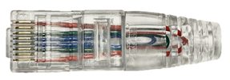

# Standalone SONiC Console Server Test Plan

## Overview

This purpose is to define the SONiC console server test topology and provide detailed testbed setup and test plan.

## Definitions/Abbreviations

| Abbreviation | Description                               |
| ------------ | ----------------------------------------- |
| DCE          | Data Circuit Terminating Equipment        |
| DTE          | Data Terminal Equipment |
| BGP          | Border Gateway Protocol |

### Scope

The test is targeting a running SONiC system with console server capbility.

### Testbed

Tests are avaialble on the following topologies:

- c0
- c0-lo

## Setup

### Test topology

A new test topology `c0` and `c0-lo` will be introdueced for standalone SONiC console server test.

The console server(C0) has 3 upstream paths via BGP.

1. C0 -> M1
1. C0 -> M0 -> M1(multiple)
1. C0 -> C1

The first path is the default data path as it has shorter ASN path length.
The second path is mainly for redundency in case first path not avaialable.
The thrid path suppose to be only used for provision purpose.

The topo illustrated 4 different scenarios and we will going to consider them all in this test plan. The route annoucement will aslo respect following scenarios.

#### Scenario #1 Regular data path

#### Scenario #2 Backup data path

#### Scenario #3 Provision data path (for C0)

#### Scenario #4 Provision data path (for M1)

This is only scenario that the C0 is not the endpoint in the network. It is been used as a L3 ethernet switch in this scenario and forward traffic from `Secondary Network` to devices that not reachable from `Primary Network` directly.

### Physical Testbed

#### Pinouts defination

Below table illustrated the console server DUT's DCE ports' pinouts 

| PIN number | Signal |   |
| ---------- | ------ | - |
| 1 | CTS | Clear To Send |
| 2 | DSR | Data Set Read |
| 3 | RXD |  |
| 4 | GND |  |
| 5 | GND |  |
| 6 | TXD |  |
| 7 | DTR | Data Terminal Ready |
| 8 | RTS | Request To Send |

#### Testbed Setup - c0

Below diagram shows the physical testbed setup:

To build a c0 topo testbed, we need prepare 2 kinds of leaf fanout:

- Regular ethernet switch for ethernet ports on the DUT

- Another console server for all console ports 

Unlike regular leaf fanout switch, they have ethernet connection with root fanout and then server, the console server leaf fanout does not need ethernet connection with server via the root fanout as it does not have direct ethernet connection with DUT. It will have indirect connectvitity with server/vms via the management plane.

The cable used between DUT and console serer Leaf Fanout are rollover cables. The pinouts mapping can refer to below table:

| Color | DUT PIN number | DUT Signal | L-Fan Signal | L-Fan PIN number |
| - | - | - | - | - |
| White-Orange | 1 | CTS | RTS | 8 |
| Orange | 2 | DSR | DTR | 7 |
| White-Green | 3 | RXD | TXD | 6 | 
| Green | 4 | GND | GND | 5 |
| White-Blue | 5 | GND | GND | 4 | 
| Blue | 6 | TXD | RXD | 3 |
| White-Brown | 7 | DTR | DSR | 2 | 
| Brown | 8 | RTS | CTS  | 1 |

##### Limitation

- The console serve leaf fanout cannot pass through the hardware flowcontrol signals which result in the test can be only proceed for normal data transfer related test cases

#### Testbed Setup - c0-lo

Below diagram shows the phsycial testbed setup for c0-lo:

To build a c0-lo topo testbed, we need prepare just ethernet leaf fanout. All the console ports on DUT will be plugged with RJ45 loopback module:

The pins out and connection are illusrated as below:

| PIN number | connect to PIN number |
| - | - |
| 1 | 8 |
| 2 | 7 |
| 3 | 6 |
| 4 | 5 |

* Depends on the hardware flow control implementaion, we might able to ignore the 2-7 connection 

## Test Cases

Dataplane test will be covered by existing tests. 

Following features are mandatory:
- arp
- autorestart
- bgp
- bmp
- cacl
- container_checker
- database
- disk
- dns
- dut_console
- fips
- generic_config_updater
- gnmi
- golden_config_infra
- iface_namingmode
- ip
- ipfwd
- kubesonic
- lldp
- log_fidelity
- memory_checker
- minigraph
- monit
- ntp
- override_config_table
- passw_hardening
- platform_tests
- portstat
- process_monitoring
- route
- scp
- show_techsupport
- snmp
- ssh
- stress
- syslog
- system_health
- tacacs
- telemetry

Following features are arugable if the device does not have network ASIC
- acl (we could use cacl feature instead)
- copp 
- crm
- decap
- drop_packets
- everflow (tcpdump)
- fib
- radv

This HLD will focus on serial console specific tests. Many of tests has already implemented by [console_test_hld](https://github.com/sonic-net/sonic-mgmt/blob/master/docs/testplan/console/console_test_hld.md). In this testplan, we improved the test setup and steps to adopt these tests into new topo `c0` and `c0-lo`.

### Test Utilities

With topo `c0`, we can leverge the console server Leaf Fanout to achive NxN any to any communication by using `socat`.

A new set of utilities will be created for this purpose.

1. set_loopback(port)

    This method will loopback(TX->RX, RX->TX) a console port on the console switch Leaf Fanout side. With this method, all loopback related test can be performed on `c0` topo testbed except hardware flow control related cases.

1. bridge(port1, port2)

    This method will bridge 2 console ports on the console siwtch Leaf Fanout side. With proper set up, the test cases that using general test wiring defined in [console_test_hld](https://github.com/sonic-net/sonic-mgmt/blob/master/docs/testplan/console/console_test_hld.md) can be performed on `c0` topo testbed except hardware flow control related cases.

1. bridge_remote(port1, remote_host_console_port)

    This method will bridge a console port on the console switch leaf fanout to a remote virutal serial console port via socket. It will allow interactive tests between SONiC console server and a virtual DTE. This method will be useful for SONiC<->SONiC serial console feature interactive test.

### 1. Driver Test

#### 1.1 TTY Devices Presenting Test
- **Objective**: Verify console ports are presented in SONiC OS
- **Topo**: c0, c0-lo
- **Test Setup**: None
- **Test Steps**:
  1. Verify if the underlayer tty* devices
- **Expected Results**: 
  1. All tty* devices are presented in SONiC

### 2. Serial Link Wiring Test

#### 2.1 Single Serial Link Wiring Test
- **Objective**: Verify a single serial link is correctly connected with leaf fanout. This test objective is similar to the link flap test for ethernet ports.
- **Topo**: c0
- **Test Setup**: None
- **Test Steps**:
  1. Send a message from DUT to a specific console port
  1. Listening on the leaf fanout side ports
- **Expected Results**: 
  1. Received the message from the specific port on the leaf fanout side
  1. Not received the message from other ports on the leaf fanout side

### 3. Reverse SSH

#### 3.1 Connectivity Test
- **Objective**: Verify console session is available after connect DUT via reverse SSH
- **Topo**: c0, c0-lo
- **Test Setup**: None
- **Test Steps**:
  1. Connect to a console port via reverse SSH through the DUT's management IP address
  1. Exit the console session by sending escape keys (default: ctrl-A + ctrl-X) 
- **Expected Results**: 
  1. The target console port is shown as `busy` after connect to the session
  1. The console session is UP and can be exit by sending escape keys 
  1. The target console port is shown as `idle` after exit the session

#### 3.1 Force Interrupt Test
- **Objective**: Verify console session is available after connect DUT via reverse SSH
- **Topo**: c0, c0-lo
- **Test Setup**: None
- **Test Steps**:
  1. Connect to a console port via reverse SSH through the DUT's management IP address
  2. Exit the console session by clearing the line from the DUT
- **Expected Results**: 
  1. The target console port is shown as `busy` after connect to the session
  1. The console session been closed within 5s after performed clear line command
  1. The target console port is shown as `idle` after exit the session

### 4. Loopback Test

#### 4.1 Echo Test
- **Objective**: Verify data can go out through the console switch and come back through the console switch
- **Topo**: c0, c0-lo
- **Test Setup**:
  1. parameter: [flowcontrol-off]
  1. parameter: [baud-9600, baud-115200]
  - *c0 topo only*
  1. Set all console server leaf fanout console ports to loopback mode
  - *c0-lo topo only*
  1. parameter: [flowcontrol-on]
- **Test Steps**:
  1. For each of console port on DUT
  1. Connect to the console port via reverse SSH through the DUT's management IP address
  1. Send random string to the port
- **Expected Results**: 
  1. The eachoed back string is matching the sent string

#### 4.2 Ping-Pong Test
- **Objective**: Verify data can go out through the console switch and come back through the console switch
- **Topo**: c0
- **Test Setup**:
  1. parameter: [baud-9600, baud-115200]
  1. Put all console ports to an array and randomly shuffle the set
  1. Pick 4 pairs from the front of the array
  1. Bridge the paried ports from the console server leaf fanout side
- **Test Steps**:
  1. For each of console port (A, B)
  1. Connect to the console port A via reverse SSH through the DUT's management IP address
  1. Connect to the console port B via reverse SSH through the DUT's management IP address
  1. Send string `ping` to port A
  1. Send string `pong` to port B after received `ping` from port B
- **Expected Results**: 
  1. Got 'pong' back from port A's RX

### 5. Escape Test

#### 5.1 Force Interrupt Test
- **Objective**: Verify console session can be only escaped by sending configured escape keys
- **Topo**: c0, c0-lo
- **Test Setup**: None
- **Test Steps**:
  1. Update escape key from default `A` to `B`
  1. Connect to a console port via reverse SSH through the DUT's management IP address
  1. Exit the console session by sending default escape keys `ctrl-A + ctrl-X`
  1. Check the line status from DUT
  1. Exit the console session by sending escape keys `ctrl-B + ctrl-X`
  1. Check the line status from DUT
- **Expected Results**: 
  1. The target console port is shown as `busy` after connect to the session
  1. The target console port is shown as `busy` after typed the default escape keys
  1. The target console port is shown as `idle` after exit the session

### 6. Stress Test

#### 6.1 Echo Test
- **Objective**: Verify the system is health while all console ports been used
- **Topo**: c0-lo
- **Test Setup**:
  1. parameter: [flowcontrol-off, flowcontrol-on]
  1. parameter: [baud-9600(flow 10KB/s), baud-115200(100KB/s)]
  1. parameter: [chunksize-32, chunksize-128, chunksize-1024]
  1. Config all DUT console ports
- **Test Steps**:
  1. For each of console port on DUT
  1. Connect to the console port via reverse SSH through the DUT's management IP address
  1. Send random string with specific [chunksize] to the port with specifc flow size
- **Expected Results**: 
  - *baud 9600*
    - *chunksize 32*
      1. Avg CPU <= 75%
      1. Actual Speed > 800B/s
    - *chunksize 128*
      1. Avg CPU <= 70%
      1. Actual Speed > 850B/s
    - *chunksize 1024*
      1. Avg CPU <= 65%
      1. Actual Speed > 900B/s
  - *baud 115200*
    - *chunksize 32*
      1. Avg CPU <= 85%
      1. Actual Speed > 5000B/s
    - *chunksize 128*
      1. Avg CPU <= 80%
      1. Actual Speed > 8000B/s
    - *chunksize 1024*
      1. Avg CPU <= 75%
      1. Actual Speed > 9000B/s

### 7. Interactive Test

The interactive test mainly designed for interactive ability between C0 and end devices. Including but not limited to file transfer, probing, login, etc.

This part test will be updated on Phase II.
