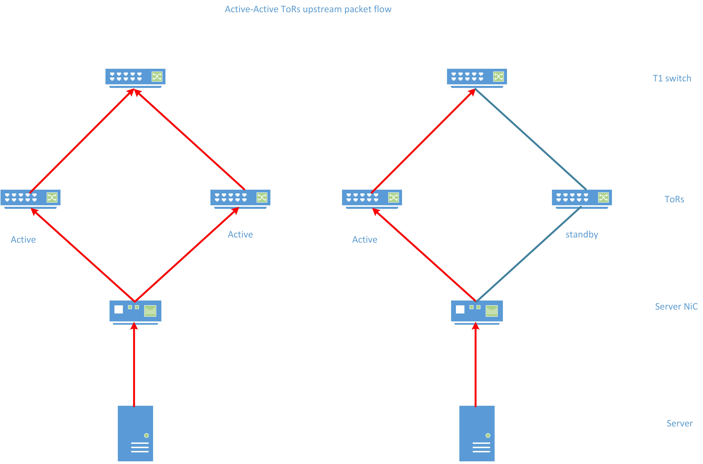
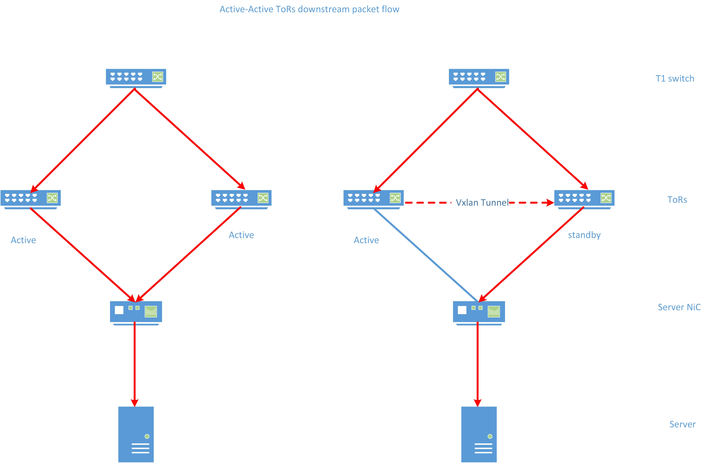

# active-active ToR test plan

## overview
Active-active ToRs is an enhancement to the current [dual-tor](https://github.com/Azure/sonic-mgmt/blob/master/docs/testplan/dual_tor/dual_tor_test_hld.md) implementation to further utilize the ToRs bandwidth resources. While a dualtor setup uses a smart cable(mux cable) to select a active ToR to use, the active-active ToRs setup could use both ToRs(as they are both active) with the leverage of the server NiC. The server NiC has two ports. Each port is connected to one of the ToRs by regular cable., if both ToRs are active, the server could send/receive packets via either of them. If either ToR experiences a failure(link failure or ToR down), the server NiC will get notification from the ToRs to choose the links to the remainining active ToRs to use. On the server side, the server NiC exposes a single bandwidth-doubled network adapter to the server host, so all host applications are agnostic to the fact that the single network adapter is implemented with two physical uplinks.

## scope
The scope of the test plan is to verify correct end-to-end operation of a running active-active ToRs setup with fully functioning configuration:
* control plane verification: the correctness of the ToRs' state and the state transitions.
* data plane verification: the correctness of traffic flow including both upstream and downstream

The following are out of scope for this test plan:
* the server NiC operation
* Individual component behavior(i.e. the CLI commands) 

## testbed setup
The active-active testbed setup is similar to dualtor testbed setup.

* The NiC on server will be connected to both the upper and the lower ToR.
    * The ports connected to the same server NiC have the same port name, e.g. Ethernet12.
    * If both ToRs are active, the server NiC could send/receive traffic via both uplinks.
    * If either of the ToR goes standby, the server NiC will choose the uplink to the active ToR to send/receive traffic.
* Each ToR will be connected to 8 T1s.
    * Both the upper ToR and the lower ToR are advertising the same VLAN to the upstream T1s, so the downstream traffic to the server will be forwarded by ECMP via both ToRs(as T1 will see 2 available nexthops for the VLAN)
* For a server, if one of the ToRs' forwarding state goes standby, there will be a Vxlan tunnel from the standby ToR to active ToR to redirect all the downstream traffic to the server from standby ToR to the active ToR, then the active ToR will forward those traffic to the server.

### Server NiC
The testcases defined here are under the assumptions that the server NiC is functioning correctly:
- The server NiC could send/receive traffic via uplinks to the active ToRs.
- The server NiC could respond to the ICMP echo requests sent by both ToRs as link probe.
- The server NiC could replicates the following link-local packets:
    * ARP
    * IPv6 Neighbor Discovery and Router Advertisement
    * ICMP echo replies to the link probes from the ToRs
    * BGP traffic from SLB.

As the testing of a server NiC device operation is out of the scope of this test plan, the testcases described here needs a server NiC simulator to operates with those functional requirements listed above. In order to validate those functionalities, there should be a pretest sanity check to verify the server NiC could operates properly.

## testcases
These testcases are to verify the traffic flows behaves as expected following the configuration changes or ToR state changes.
For all testcases in the packet flow scenario:
* all ToRs are active initially.
* Let ToR A be the upper ToR and ToR B be the lower ToR.

### upstream traffic verification

| 
case
 | 
Goal
                                                            | 
Test Setup
                                      | 
Expected Control
Plane                                                                         | 
Expected Data
  Plane                                                                                                                                                                |
| ----------------------------------- | ---------------------------------------------------------------------------------------------- | ------------------------------------------------------------------------------ | ---------------------------------------------------------------------------------------------------------------------------- | ------------------------------------------------------------------------------------------------------------------------------------------------------------------------------------------------------------------ |
| Healthy                             | Verify normal active-active operation                                                          | None                                                                           | Both ToRs are active                                                                                                         | T1 could receive packets from either ToR A or ToR B                                                                                                                                                                |
| ToR A  link down                    | Verify packet flow after a link from ToR A  to the server NiC goes down                        | Take down a link between ToR A  and server NiC                                 | ToR A's port on the down link becomes standby and unhealthy link, ToR B stays active                                         | T1 switch receives packet from ToR B(active) but not ToR A(standby)                                                                                                                                                |
| ToR A link drop                     | Verify packet flow if a link from ToR A to the server NiC starts dropping packets, but stay up | Configure the server NiC simulator to drop packets on a link destined to ToR A | ToR A's port on the link becomes standby and unhealthy link, ToR B stays active                                              | T1 switch receives packet from ToR B(active) but not ToR A(standby)                                                                                                                                                |
| ToR(A) heartbeat loss               | Verify packet flow after ToR A stops sending heartbeats                                        | Stop the link prober submodule on ToR A                                        | ToR A becomes standby and unhealthy link, ToR B stays active                                                                 | T1 switch receives packet from ToR B(active) but not ToR A(standby)                                                                                                                                                |
| ToR(A) BGP shutdown/startup         | Verify packet flow when admin shutdown/startup all BGP sessions on ToR A                       | Admin shutdown/startup the BGP sessions on ToR A                               | ToR A becomes standby during BGP down and change back to active after BGP sessions get re-established, ToR B stays active    | During ToR A is standby(BGP sessions down), T1 switch receives packet only from ToR B(active), after ToR A changes back to active(BGP sessions get up), T1 switch could receive packets from either ToR A or ToR B |
| ToR(A) reboot                       | Verify packet flow during/after ToR A reboot                                                   | Reboot ToR A                                                                   | ToR A becomes standby during reboot and change back to active after reboot, ToR B stays active                               | During ToR A is standby, T1 switch receives packet only from ToR B(active), after ToR A changes back to active, T1 switch could receive packets from either ToR A or ToR B                                         |
| ToR(A) config reload                | Verify packet flow during/after `config reload` command                                        | Issue `config reload` command on ToR A                                         | ToR A becomes standby during `config reload` and change back to active after `config reload` is finished, ToR B stays active | During ToR A is standby, T1 switch receives packet only from ToR B(active), after ToR A changes back to active, T1 switch could receive packets from either ToR A or ToR B                                         |

### downstream traffic verification
For downstream traffic from T1, the ECMP routing behavior is out of the scope of this test plan. For the testcases defined below, the T1 switch will explicitly send traffic to ToR A, on which the testcase will triage different operations to trigger state change.

| 
case
 | 
Goal
                                                            | 
Test Setup
                                      | 
Expected Control
Plane                                                                         | 
Expected Data
  Plane                                                                         |
| ----------------------------------- | ---------------------------------------------------------------------------------------------- | ------------------------------------------------------------------------------ | ---------------------------------------------------------------------------------------------------------------------------- | --------------------------------------------------------------------------------------------------------------------------- |
| Healthy                             | Verify normal active-active operation                                                          | None                                                                           | Both ToRs are active                                                                                                         | T1 switch receives no Vxlan tunnel packet, server receives packet                                                           |
| ToR A  link down                    | Verify packet flow after a link from ToR A to the server NiC goes down                         | Take down a link between ToR A  and server NiC device                          | ToR A's port on the down link becomes standby and unhealthy link, ToR B stays active                                         | T1 switch receives Vxlan tunnel packet with correct attributes from ToR A to ToR B, server receives packet                  |
| ToR A link drop                     | Verify packet flow if a link from ToR A to the server NiC starts dropping packets, but stay up | Configure the server NiC simulator to drop packets on a link destined to ToR A | ToR A's port on the link becomes standby and unhealthy link, ToR B stays active                                              | T1 switch receives Vxlan tunnel packet with correct attributes from ToR A to ToR B, server receives packet                  |
| ToR(A) heartbeat loss               | Verify packet flow after ToR A stops sending heartbeats                                        | Stop the link prober submodule on ToR A                                        | ToR A becomes standby and unhealthy link, ToR B stays active                                                                 | T1 switch receives Vxlan tunnel packet with correct attributes from ToR A to ToR B, server receives packet                  |
| ToR(A) BGP shutdown/startup         | Verify packet flow after admin shutdown/startup all BGP sessions on ToR A                      | Admin shutdown/startup the BGP sessions on ToR A                               | ToR A becomes standby during BGP down and change back to active after BGP sessions get re-established, ToR B stays active    | After ToR A BGP sessions get re-established, T1 switch receives no Vxlan tunnel packet, server receives packet              |
| ToR(A) reboot                       | Verify packet flow after ToR reboot                                                            | Reboot ToR A                                                                   | ToR A becomes standby during reboot and change back to active after reboot, ToR B stays active                               | After ToR A changes back to active after reboot, T1 switch receives no Vxlan tunnel packet, server receives packet          |
| ToR(A) config reload                | Verify packet flow after ToR config reload                                                     | Issue `config reload` on ToR A                                                 | ToR A becomes standby during `config reload` and change back to active after `config reload` is finished, ToR B stays active | After ToR A changes back to active after `config reload`, T1 switch receives no Vxlan tunnel packet, server receives packet |