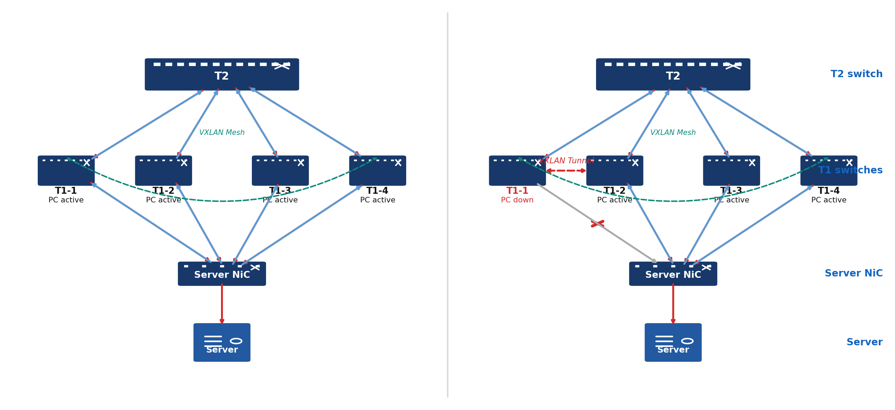
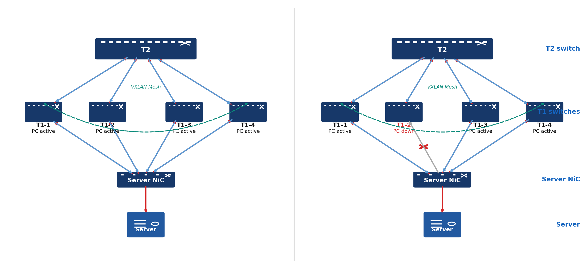
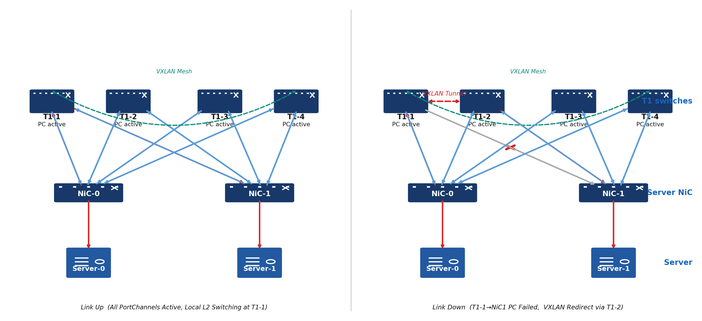

# BGP EVPN multihoming test plan

## overview
This project flattens Azure's data center network by removing Top-of-Rack (ToR) switches and directly connecting server NICs to T1 switches. Each server NIC connects via max 8 independent links to 8 different T1s, all running in active mode. BGP EVPN Multihoming (per RFC 7432 and RFC 8365) is the control-plane mechanism that provides high availability, loop-free forwarding, and fast failover across this topology. It simplifies the network topology, reduces the network latency (2 less hops from NIC to NIC), improves the network resiliency.

This test plan will primarily focus on four active-active links. It covers end-to-end verification of EVPN Multihoming correctness on SONiC T1 switches.

## Scope

**In scope:**
The scope of the test plan is to verify correct end-to-end operation of a running active-active T1s setup with fully functioning configuration:
* control plane verification: the correctness of the T1s' state and the state transitions.
* EVPN Type-2 (MAC/IP) route advertisement, withdrawal, and re-advertisement driven by LACP link events
* Data plane: the correctness of traffic flow including both upstream and downstream.

The following are out of scope for this test plan:
* the server NiC operation
* Individual component behavior(i.e. the CLI commands)
* EVPN Type-1 (AD-per-ES) routes — not used in this design
* Split horizon — not applicable in this design
* linkmgrd / mux simulator / NIC simulator — replaced by LACP
* Inter-EVI failures (T2-layer redundancy is assumed sufficient)
* Hardware FRR fast-path protection (Phase 2; to be covered in a separate plan)

## testbed setup
The active-active testbed setup is similar to dualtor testbed setup.

* The NiC on server will be connected to all the T1s.
    * All T1s are active, the server NiC will send/receive traffic via all uplinks.
    * If either of the T1 goes standby, the server NiC will send/receive the traffic via uplink to the other T1s.
    * In T1, all ports connecting to server live within a single /24 IPv4 VLAN and /64 IPv6 VLAN. The VLAN IP ranges will be advertised into the network by the T1s directly.
* For a server, if one of the T1s' forwarding state goes standby, there will be a Vxlan tunnel from the standby T1 to any of the active T1 to redirect all the downstream traffic to the server from standby T1 to the active T1, then the active T1 will forward those traffic to the server.
## Server NiC
The testcases defined here are under the assumptions that the server NiC is functioning correctly:
- The server NiC could send/receive traffic via uplinks to the active ToRs.

As the testing of a server NiC device operation is out of the scope of this test plan, the testcases described here needs a server NiC simulator to operates with those functional requirements listed above. In order to validate those functionalities, there should be a pretest sanity check to verify the server NiC could operates properly.

**Key topology details:**
- **4 T1 SONiC switches** (VTEPs), each running EVPN in the same EVI
- **Shared across T1 set**: same anycast gateway IP/MAC, same eBGP ASN, same system-mac (for ESI auto-derivation)
- **LACP**: each T1 has a Port-Channel (`PortChannel1`) toward the DPU; LACP PDUs exchanged per link
- **ESI**: auto-derived from system-mac + port-channel ID, or statically configured; same ESI across all T1s for a given DPU
- **CE simulator**: cEOS node or PTF simulating a DPU with 4 port-channels (one per T1), LACP enabled
- **T2 simulators**: cEOS nodes acting as upstream eBGP peers
- **Traffic generator**: PTF / scapy

### Testbed Assumptions
- All T1 VTEPs reachable to each other and to T2 via underlay (eBGP loopback peering)
- CE simulator supports LACP (active or passive mode) on both port-channels
- All EVPN control-plane daemons (`bgpd`, `fdborch`, `neighorch`) running
- LACP fast timers (1s) used unless stated otherwise

---

## testcases
These testcases are to verify the traffic flows behaves as expected following the configuration changes or T1 state changes.
For all testcases in the packet flow scenario:
* all T1s are active initially.

## 1. Downstream Traffic Verification

| #     | Case                                             | Goal                                                 | Test Steps                                                       | Action During I/O                           | Expected Control Plane                                                                                                                                                                                        | Expected Data Plane                                                                 |
|-------|--------------------------------------------------|------------------------------------------------------|------------------------------------------------------------------|---------------------------------------------|---------------------------------------------------------------------------------------------------------------------------------------------------------------------------------------------------------------|-------------------------------------------------------------------------------------|
| DS-01 | Baseline — all T1s active                        | Verify normal active-active operation                | Start downstream I/O                                             | None                                        | All T1s active. T1s share identical ESI to shared segment. All T1s advertise Type-2 (MAC+IP). Proxy ARP populated from Type-2.                                                                                | All T1s receive packet. No disruption. T1s receive no VXLAN tunnel packets.         |
| DS-02 | LAG down on T1-1                                 | Verify packet flow after PortChannel down            | 1. Bring down PortChannel on T1-1 and save config 2. Config reload 3. Start downstream I/O | None                                        | T1-1 becomes standby/unhealthy after config reload. T1-1 withdraws Type-2 MAC/IP; remote T1s remove T1-1 from NHG.                                                                                            | T2 receives VXLAN tunnel packet (T1-1→T1-2); server receives packet. No disruption. |
| DS-03 | LAG up on T1-1 after LAG down                    | Verify packet flow when PortChannel up after down    | 1. Bring down PortChannel on T1-1 and save config 2. Config reload 3. Start downstream I/O | Admin up PortChannel (T1-1 ↔ server NIC)    | T1-1 standby after reload; becomes active after PortChannel up. T1-1 re-advertises Type-2; remote T1s add T1-1 back to NHG.                                                                                   | Post-reload: T2 receives VXLAN packet (T1-1→T1-2); server receives packet. Post-PortChannel up: no VXLAN tunnel packet; traffic load-balances across both T1s. |
| DS-04 | LAG member down — LAG goes down                  | Verify packet flow after member port down            | 1. Bring down member port of PortChannel on T1-1 and save config 2. Config reload 3. Start downstream I/O | None                                        | T1-1 withdraws Type-2 MAC/IP; remote T1s remove T1-1 from NHG.                                                                                                                                                | T2 receives VXLAN tunnel packet (T1-1→T1-2); server receives packet. No disruption. |
| DS-05 | LACP timeout on T1-1 — server stops sending PDUs | Verify T1-1 detects peer timeout and brings LAG down | None                                                             | None                                        | T1-1 transitions PortChannel to Down. BGP Type-2 routes withdrawn.                                                                                                                                            | Traffic rerouted to other T1s.                                                      |
| DS-06 | T1-1 BGP shutdown / startup                      | Verify packet flow on admin BGP shutdown/startup     | Start downstream I/O                                             | Admin shutdown/startup BGP sessions on T1-1 | Shutdown: T1-1 becomes standby; sends BGP NOTIFICATION; Type-2 & Type-4 routes withdrawn. Startup: T1-1 becomes active; re-establishes sessions; re-advertises Type-2 & Type-4.                            | After re-establish: T2 receives no VXLAN tunnel packet; server receives packet.     |
| DS-07 | T1-1 kill BGP process                            | Verify packet flow after ungraceful BGP kill         | Start downstream I/O                                             | Kill BGP process on T1-1                    | T1-1 down without BGP NOTIFICATION. Peers detect loss after hold timer (90 s); withdraw T1-1 Type-2 & Type-4. On recovery: T1-1 re-establishes LACP, BGP; re-advertises Type-2 & Type-4.                      | During outage: traffic redistributed to remaining T1s; T1-1 not used. After recovery: T1-1 re-added to NHG; load-balances across all VTEPs. |
| DS-08 | T1-1 power shutdown                                      | Verify packet flow during/after T1-1 power shutdown          | Start downstream I/O                                             | Reboot T1-1                                 | T1-1 becomes standby; goes down without BGP NOTIFICATION. Peers detect loss after 90 s; withdraw T1-1 Type-2 & Type-4. On reboot: T1-1 active again; re-establishes LACP, BGP; re-advertises Type-2 & Type-4. | After reboot: T2 receives no VXLAN tunnel packet; server receives packet.           |
| DS-09 | T1-1 config reload                               | Verify packet flow during/after config reload        | Start downstream I/O                                             | Issue config reload on T1-1                 | During reload: T1-1 becomes standby; sends BGP NOTIFICATION; PortChannel briefly down; Type-2 & Type-4 withdrawn. After reload: T1-1 active; LACP + BGP restored; Type-2 & Type-4 re-advertised.           | After reload: T1 receives no VXLAN tunnel packet; server receives packet.           |
| DS-10 | T1-1 ARP time out                                 | Verify packet flow after MAC age out                 | Start downstream I/O                                             | Configure MAC age-out timer                 | VTEP-1 withdraws own Type-2 for server MAC within age-out timer. Re-installs with tunnel NH from peer Type-2 — no disruption.                                                                                 | Traffic to server at T1-1 tunneled to T1-2; server receives packet.                 |

## 2. Upstream Traffic Verification

| #     | Case                                     | Goal                                                 | Test Steps                                                           | Action During I/O                           | Expected Control Plane                                                                                                                                                             | Expected Data Plane                                                       |
|-------|------------------------------------------|------------------------------------------------------|----------------------------------------------------------------------|---------------------------------------------|------------------------------------------------------------------------------------------------------------------------------------------------------------------------------------|---------------------------------------------------------------------------|
| US-01 | Baseline — all T1s active                | Verify normal active-active operation                | Start upstream I/O                                                   | None                                        | All T1s active. T1s share identical ESI. All T1s advertise Type-2 (MAC+IP). Proxy ARP populated from Type-2.                                                                       | All T1s receive packet. No disruption.                                    |
| US-02 | LAG down on T1-1                         | Verify PortChannel down causes Type-2 withdrawal     | 1. Bring down PortChannel on T1-1 and save config 2. Config reload 3. Start upstream I/O | Admin down PortChannel (T1-1 ↔ server NIC)  | T1-1 withdraws Type-2 MAC/IP; remote T1-2 removes T1-1 from NHG.                                                                                                                   | No traffic forwarded to T1-1.                                             |
| US-03 | LAG up on T1-1 after LAG down            | Verify PortChannel up causes Type-2 re-advertisement | 1. Bring up PortChannel on T1-1 and save config 2. Config reload 3. Start upstream I/O | Admin up PortChannel (T1-1 ↔ server NIC)    | T1-1 re-advertises Type-2 MAC/IP; remote T1s add T1-1 back to NHG.                                                                                                                 | Traffic load-balances across both T1s.                                    |
| US-04 | LAG member down — LAG goes down          | Verify Type-2 withdrawn when LAG goes down           | 1. Bring down one member port of PortChannel on T1-1 and save config 2. Config reload 3. Start upstream I/O | None                                        | T1-1 withdraws Type-2 MAC/IP; remote T1s remove T1-1 from NHG.                                                                                                                     | No traffic forwarded to T1-1.                                             |
| US-05 | LACP timeout — server stops sending PDUs | Verify T1 detects peer timeout and brings LAG down   | None                                                                 | None                                        | T1 transitions PortChannel to Down. BGP Type-2 routes withdrawn.                                                                                                                   | Traffic rerouted to other T1s.                                            |
| US-06 | T1-1 BGP shutdown / startup              | Verify packet flow on admin BGP shutdown/startup     | Start upstream I/O                                                   | Admin shutdown/startup BGP sessions on T1-1 | Shutdown: T1-1 sends BGP NOTIFICATION; Type-2 & Type-4 routes withdrawn. Startup: T1-1 re-establishes sessions; re-advertises Type-2 & Type-4.                                  | During shutdown: traffic redistributed; T1-1 not used. After startup: T1-1 re-added to NHG; load-balances across all VTEPs. |
| US-07 | T1-1 kill BGP process                    | Verify packet flow after ungraceful BGP kill         | Start upstream I/O                                                   | Kill BGP process on T1-1                    | T1-1 down without BGP NOTIFICATION. T2 detects loss after hold timer (90 s); withdraws T1-1 Type-2 & Type-4. On recovery: re-establishes LACP, BGP; re-advertises Type-2 & Type-4. | During outage: traffic redistributed to T1-2; T1-1 not used. After recovery: T1-1 re-added to NHG; load-balances across all VTEPs. |
| US-08 | T1-1 power shutdown                              | Verify packet flow during/after T1-1 power shutdown          | Start upstream I/O                                                   | Reboot T1-1                                 | T1-1 down without BGP NOTIFICATION. T2 detects loss after hold timer (90 s); withdraws T1-1 Type-2 & Type-4. On reboot: re-establishes LACP, BGP; re-advertises Type-2 & Type-4.   | After reboot: T2 receives no VXLAN tunnel packet; server receives packet. |
| US-09 | T1-1 config reload                       | Verify packet flow during/after config reload        | Start upstream I/O                                                   | Issue config reload on T1-1                 | During reload: T1-1 sends BGP NOTIFICATION; PortChannel briefly down; Type-2 & Type-4 withdrawn. After reload: T1-1 active; LACP + BGP restored; Type-2 & Type-4 re-advertised. | After reload: T1 receives no VXLAN tunnel packet; server receives packet. |

## 3. Server-to-Server Traffic Verification

| #     | Case                            | Goal                                              | Test Steps                                                       | Action During I/O                        | Expected Control Plane                                                                                                      | Expected Data Plane                                                                                   |
|-------|---------------------------------|---------------------------------------------------|------------------------------------------------------------------|------------------------------------------|-----------------------------------------------------------------------------------------------------------------------------|-------------------------------------------------------------------------------------------------------|
| SS-01 | Baseline — all T1s active       | Verify normal active-active operation             | Start server-to-server I/O (Server-0 → Server-1)                 | None                                     | All T1s active. T1s share identical ESI. All T1s advertise Type-2 (MAC+IP). Proxy ARP populated from Type-2.                | All T1s receive packet. No disruption. T2 receives no VXLAN tunnel packets. Server-1 receives packet. |
| SS-02 | LAG down on T1-1                | Verify packet flow after PortChannel down         | 1. Bring down PortChannel on T1-1 and save config 2. Config reload 3. Start server-to-server I/O (Server-0 → Server-1) | None                                     | T1-1 becomes standby/unhealthy after config reload. T1-1 withdraws Type-2 MAC/IP; remote T1s remove T1-1 from NHG.          | T2 receives VXLAN tunnel packet (T1-1→T1s); server receives packet. No disruption.                    |
| SS-03 | LAG up on T1-1 after LAG down   | Verify packet flow when PortChannel up after down | 1. Bring down PortChannel on T1-1 and save config 2. Config reload 3. Start server-to-server I/O (Server-0 → Server-1) | Admin up PortChannel (T1-1 ↔ server NIC) | T1-1 standby after reload; becomes active after PortChannel up. T1-1 re-advertises Type-2; remote T1s add T1-1 back to NHG. | Post-reload: T2 receives VXLAN packet (T1-1→T1s); server receives packet. Post-PortChannel up: T2 receives no VXLAN; traffic load-balances across all T1s. |
| SS-04 | LAG member down — LAG goes down | Verify packet flow after member port down         | 1. Bring down member port of PortChannel on T1-1 and save config 2. Config reload 3. Start server-to-server I/O (Server-0 → Server-1) | None                                     | T1-1 withdraws Type-2 MAC/IP; remote T1s remove T1-1 from NHG.                                                              | T2 receives VXLAN tunnel packet (T1-1→T1s); server receives packet. No disruption.                    |
