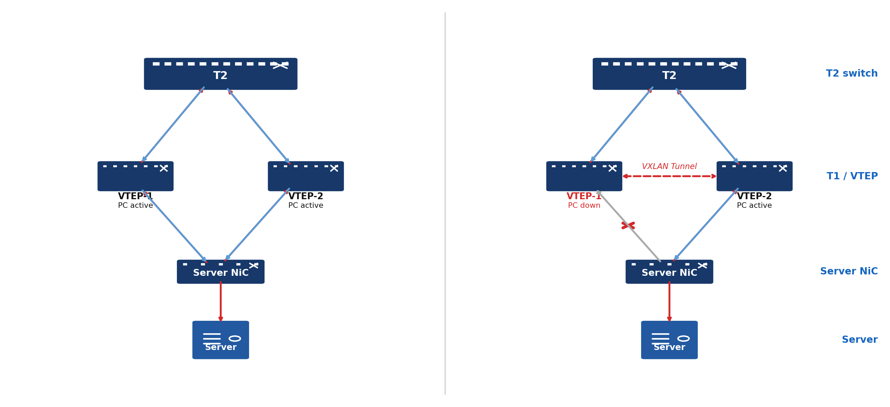
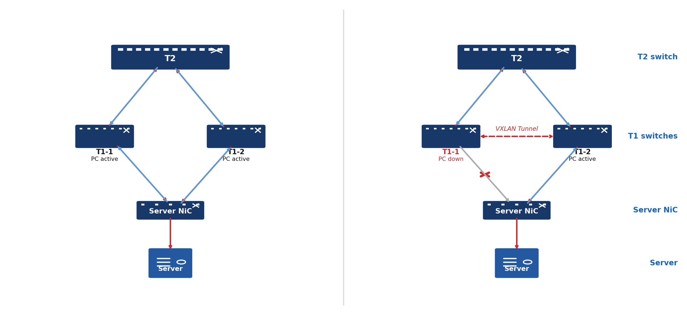
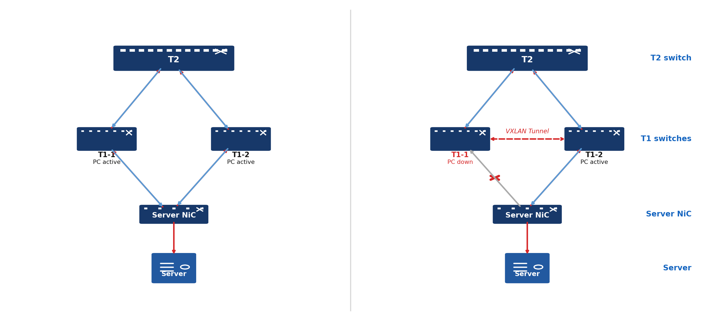
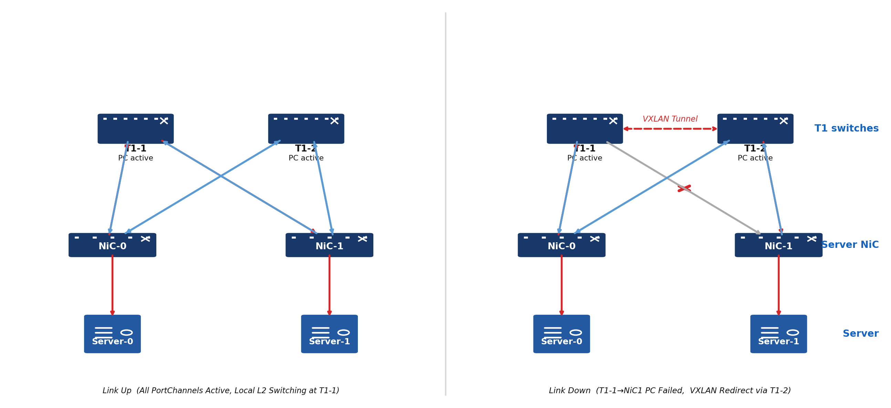

# BGP EVPN multihoming test plan

## overview
This project flattens Azure's data center network by removing Top-of-Rack (ToR) switches and directly connecting server NICs to middle-of-row dT0 switches. Each server NIC connects via max 8 independent links to 8 different dT0s, all running in active mode. BGP EVPN Multihoming (per RFC 7432 and RFC 8365) is the control-plane mechanism that provides high availability, loop-free forwarding, and fast failover across this topology. It simplifies the network topology, reduces the network latency (2 less hops from NIC to NIC), improves the network resiliency.

This test plan will primarily focus on two active-active links. It covers end-to-end verification of EVPN Multihoming correctness on SONiC switches.

## Scope

**In scope:**
The scope of the test plan is to verify correct end-to-end operation of a running active-active two dT0s setup with fully functioning configuration:
* control plane verification: the correctness of the dT0s' state and the state transitions.
* EVPN Type-1 (AD-per-ES and AD-per-EVI) route advertisement/withdrawal, including mass-withdrawal-driven convergence and aliasing-based load balancing
* EVPN Type-2 (MAC/IP) route advertisement, withdrawal, and re-advertisement driven by LACP link events
* Data plane: the correctness of traffic flow including both upstream and downstream.

The following are out of scope for this test plan:
* the server NiC operation
* Individual component behavior(i.e. the CLI commands)
* Split horizon — not applicable in this design
* linkmgrd / mux simulator / NIC simulator — replaced by LACP
* Inter-EVI failures (T2-layer redundancy is assumed sufficient)

## testbed setup
The 2 dT0s active-active testbed setup is similar to dualtor testbed setup.

* The NiC on server will be connected to both dT0s.
    * Both dT0s are active, the server NiC will send/receive traffic via all uplinks.
    * If either of the dT0 goes standby, the server NiC will send/receive the traffic via uplink to the other dT0s.
    * In dT0, all ports connecting to server live within a single /24 IPv4 VLAN and /64 IPv6 VLAN. The VLAN IP ranges will be advertised into the network by the dT0s directly.
* For a server, if one of the dT0s' forwarding state goes standby, there will be a Vxlan tunnel from the standby dT0 to any of the active dT0 to redirect all the downstream traffic to the server from standby dT0 to the active dT0, then the active dT0 will forward those traffic to the server.
## Server NiC
The testcases defined here are under the assumptions that the server NiC is functioning correctly:
- The server NiC could send/receive traffic via uplinks to the active ToRs.

As the testing of a server NiC device operation is out of the scope of this test plan, the testcases described here needs a server NiC simulator to operate with those functional requirements listed above. In order to validate those functionalities, there should be a pretest sanity check to verify the server NiC could operates properly.

**Key topology details:**
- **2 dT0 SONiC switches** (VTEPs), each running EVPN in the same EVI
- **Shared across dT0 set**: same anycast gateway IP/MAC, same eBGP ASN, same system-mac (for ESI auto-derivation)
- **LACP**: each dT0 has a Port-Channel (`PortChannel1`) toward the Server NIC; LACP PDUs exchanged per link
- **ESI**: auto-derived from system-mac + port-channel ID, or statically configured; same ESI across all dT0s for a given Server NIC
- **CE simulator**: cEOS node or PTF simulating a Server NIC with 2 port-channels (one per dT0), LACP enabled
- **T2 simulators**: cEOS nodes acting as upstream eBGP peers
- **Traffic generator**: PTF / scapy

### Testbed Assumptions
- Both dT0 VTEPs reachable to each other and to T2 via underlay (eBGP loopback peering)
- CE simulator supports LACP (active or passive mode) on both port-channels
- All EVPN control-plane daemons (`bgpd`, `fdborch`, `neighorch`) running
- LACP timers (90s) used unless stated otherwise

---

## testcases
These testcases are to verify the traffic flow behaviors as expected following the configuration changes or dT0 state changes.
For all testcases in the packet flow scenario:
* Both dT0s are active initially.

## 1. Downstream Traffic Verification

| #     | Case                                             | Goal                                                 | Test Steps                                                       | Action During I/O                           | Expected Control Plane                                                                                                                                                                                        | Expected Data Plane                                                                 |
|-------|--------------------------------------------------|------------------------------------------------------|------------------------------------------------------------------|---------------------------------------------|---------------------------------------------------------------------------------------------------------------------------------------------------------------------------------------------------------------|-------------------------------------------------------------------------------------|
| DS-01 | Baseline — both dT0s (01dT0 and 02dT0) active                        | Verify normal active-active operation                | Start downstream I/O                                             | None                                        | Both dT0s active. dT0s share identical ESI to shared segment. Both dT0s advertise Type-1 AD-per-ES/AD-per-EVI and Type-2 (MAC+IP). Proxy ARP populated from Type-2.                                                                                | Both dT0s receive packet. dT0s receive no VXLAN tunnel packets.         |
| DS-02 | LAG down on 01dT0                                 | Verify packet flow after PortChannel down            | Start downstream I/O | 1. Bring down PortChannel on 01dT0 and save config 2. Config reload                                         | 01dT0 becomes standby/unhealthy after config reload. 01dT0 withdraws its Type-1 AD-per-ES for the shared ESI (mass withdrawal of all behind it) and its Type-2 MAC/IP; 02dT0 removes proxy ARP/ND 01dT0 entry and stops aliasing to it.                                                                                            | T2 receives VXLAN tunnel packet (01dT0→02dT0); server receives packet. No stale ARP reply |
| DS-03 | LAG up on 01dT0 after LAG down                    | Verify packet flow when PortChannel up after down    | 1. Start downstream I/O 2. Bring down PortChannel on 01dT0 and save config 3. Config reload  | Admin up PortChannel (01dT0 ↔ server NIC)    | 01dT0 standby after reload; becomes active after PortChannel up. 01dT0 re-advertises  BGP Type-1 AD-per-ES and Type-2; remote 02dT0 add 01dT0 back to NHG and re-installs proxy entries from re-advertised Type-2.                                                                                   | Post-reload: T2 receives VXLAN packet (01dT0→02dT0); server receives packet. Post-PortChannel up: no VXLAN tunnel packet; traffic load-balances across both dT0s. |
| DS-04 | LAG member down — LAG goes down                  | Verify packet flow after member port down            | Start downstream I/O | 1. Bring down member port of PortChannel on 01dT0 and save config 2. Config reload                                         | 01dT0 becomes standby/unhealthy after config reload. 01dT0 withdraws its Type-1 AD-per-ES for the shared ESI (mass withdrawal of all behind it) and its Type-2 MAC/IP; 02dT0 removes proxy ARP/ND 01dT0 entry and stops aliasing to it.                                                                                                                                                | T2 receives VXLAN tunnel packet (01dT0→02dT0); server receives packet. No stale ARP reply. |
| DS-05 | LACP timeout(90s) on 01dT0 — server stops sending PDUs | Verify 01dT0 detects peer timeout and brings LAG down | Start downstream I/O                                                             | Stop LACP PDUs from server NIC to 01dT0                                        | 01dT0 transitions PortChannel to Down. 01dT0 withdraws Type-1 AD-per-ES (mass withdrawal) and Type-2 MAC/IP                                                                                                                                            | Traffic rerouted to 02dT0.                                                      |
| DS-06 | 01dT0 BGP graceful shutdown / startup                      | Verify packet flow on admin BGP shutdown/startup     | Start downstream I/O                                             | Admin shutdown/startup BGP sessions on 01dT0 | Shutdown: 01dT0 becomes standby; sends BGP NOTIFICATION; Type-1 & Type-2 routes withdrawn.Proxy entries for 01dT0-learned MACs withdrawn on peer Startup: 01dT0 becomes active; re-establishes sessions; re-advertises Type-1 & Type-2.                            | After re-establish: T2 receives no VXLAN tunnel packet; server receives packet.     |
| DS-07 | 01dT0 kill BGP process                            | Verify packet flow after ungraceful BGP kill         | Start downstream I/O                                             | Kill BGP process on 01dT0                    | 01dT0 down without BGP NOTIFICATION. Peers detect loss after hold timer (90 s); withdraw 01dT0 Type-1 & Type-2. On recovery: 01dT0 re-establishes LACP, BGP; re-advertises Type-1 & Type-2.                      | During outage: traffic redistributed to other 02dT0; 01dT0 not used. After recovery: 01dT0 re-added to NHG; load-balances across both VTEPs. |
| DS-08 | 01dT0 power shutdown                                      | Verify packet flow during/after 01dT0 power shutdown          | Start downstream I/O                                             | Reboot 01dT0                                 | 01dT0 becomes standby; goes down without BGP NOTIFICATION. Peers detect loss after 90 s; withdraw 01dT0 Type-1 & Type-2. On reboot: 01dT0 active again; re-establishes LACP, BGP; re-advertises Type-1 & Type-2. | After reboot: T2 receives no VXLAN tunnel packet; server receives packet.           |
| DS-09 | 01dT0 config reload                               | Verify packet flow during/after config reload        | Start downstream I/O                                             | Issue config reload on 01dT0                 | During reload: 01dT0 becomes standby; sends BGP NOTIFICATION; PortChannel briefly down; Type-1 & Type-2 withdrawn. After reload: 01dT0 active; LACP + BGP restored; Type-1 & Type-2 re-advertised.           | After reload: dT0 receives no VXLAN tunnel packet; server receives packet.           |
| DS-10 | 01dT0 ARP time out                                 | Verify packet flow after ARP time out                 | Start downstream I/O                                             | Configure ARP time out to 60 seconds                | VTEP-1 withdraws own Type-2 for server MAC within age-out timer. Re-installs with tunnel NH from peer Type-2.                                                                                 | Traffic to server at 01dT0 tunneled to 02dT0; server receives packet.                 |
| DS-11 | Core isolation - 01dT0 loses uplinks to T2, LAG to server stays up | Verify 01dT0 does not attract downstream traffic it cannot forward when its path to core is lost | Start downstream I/O |  Shut down all 01dT0 ↔ T2 uplinks while the server-facing LAG remains up | 01dT0 detects loss of upstream reachability via BGP session amd withdraws its Type-1 and Type -2 adverstisemnts | No downstream traffic is black-holed at 01dT0; all downstream traffic is forwarded via 02dT0. |
| DS-12 | MAC mobility — same MAC re-advertised via 02dT0 without a prior Type-1/Type-2 withdrawal from 01dT0 | Verify RFC 7432 MAC mobility sequence-number reconciliation when the same MAC is advertised via a new path while the old advertisement is still active | Start downstream I/O to a known server MAC learned via 01dT0 | Inject/advertise the same MAC on 02dT0 via an independent path so both dT0s hold conflicting Type-2 routes for it simultaneously | 02dT0's Type-2 for the MAC carries a higher MAC Mobility sequence number (per RFC 7432) than 01dT0's; all VTEPs select 02dT0's route based on sequence number alone and 01dT0 withdraws/ages out its now-stale Type-2. | Downstream traffic converges to be forwarded via 02dT0. |
## 2. Upstream Traffic Verification

| #     | Case                                     | Goal                                                 | Test Steps                                                           | Action During I/O                           | Expected Control Plane                                                                                                                                                             | Expected Data Plane                                                       |
|-------|------------------------------------------|------------------------------------------------------|----------------------------------------------------------------------|---------------------------------------------|------------------------------------------------------------------------------------------------------------------------------------------------------------------------------------|---------------------------------------------------------------------------|
| US-01 | Baseline — both dT0s  (01dT0 and 02dT0) active                | Verify normal active-active operation                | Start upstream I/O                                                   | None                                        |  Both dT0s active. dT0s share identical ESI to shared segment. Both dT0s advertise Type-1 AD-per-ES/AD-per-EVI and Type-2 (MAC+IP). Proxy ARP populated from Type-2. |Both dT0s receive packet. dT0s receive no VXLAN tunnel packets.                                          |
| US-02 | LAG down on 01dT0                         | Verify PortChannel down causes Type-2 withdrawal     | Start upstream I/O | 1. Admin down PortChannel (01dT0 ↔ server NIC) and save config 2. Config reload   | 01dT0 becomes standby/unhealthy after config reload. 01dT0 withdraws its Type-1 AD-per-ES for the shared ESI (mass withdrawal of all behind it) and its Type-2 MAC/IP; 02dT0 removes proxy ARP/ND 01dT0 entry and stops aliasing to it.                                                                                            | T2 receives VXLAN tunnel packet (01dT0→02dT0); server receives packet. No stale ARP reply |
| US-03 | LAG up on 01dT0 after LAG down            | Verify PortChannel up causes Type-2 re-advertisement | Start upstream I/O | 1. Admin up PortChannel (01dT0 ↔ server NIC) and save config 2. Config reload       | 01dT0 standby after reload; becomes active after PortChannel up. 01dT0 re-advertises  BGP Type-1 AD-per-ES and Type-2; remote 02dT0 add 01dT0 back to NHG and re-installs proxy entries from re-advertised Type-2.                                                                                   | Post-reload: T2 receives VXLAN packet (01dT0→02dT0); server receives packet. Post-PortChannel up: no VXLAN tunnel packet; traffic load-balances across both dT0s.   |
| US-04 | LAG member down — LAG goes down          | Verify Type-2 withdrawn when LAG goes down           | Start upstream I/O | 1. Bring down one member port of PortChannel on 01dT0 and save config 2. Config reload                                         | 01dT0 becomes standby/unhealthy after config reload. 01dT0 withdraws its Type-1 AD-per-ES for the shared ESI (mass withdrawal of all behind it) and its Type-2 MAC/IP; 02dT0 removes proxy ARP/ND 01dT0 entry and stops aliasing to it.                                                                                                                                                | T2 receives VXLAN tunnel packet (01dT0→02dT0); server receives packet. No stale ARP reply. |                   |
| US-05 | LACP timeout (90s) on 01dT0 — server stops sending PDUs | Verify dT0 detects peer timeout and brings LAG down   | Start upstream I/O                                                                 |  Stop LACP PDUs from server NIC to 01dT0                                        | 01dT0 transitions PortChannel to Down.01dT0 withdraws Type-1 AD-per-ES (mass withdrawal) and Type-2 MAC/IP routes.                                                                                                                   | Traffic rerouted to other 02dT0.                                     |
| US-06 | 01dT0 BGP graceful shutdown / startup              | Verify packet flow on admin BGP shutdown/startup     | Start upstream I/O                                                   | Admin shutdown/startup BGP sessions on 01dT0 | Shutdown: 01dT0 sends BGP NOTIFICATION; Type-1 & Type-2 routes withdrawn. Startup: 01dT0 re-establishes sessions; re-advertises Type-1 & Type-2.                                  | During shutdown: traffic redistributed; 01dT0 not used. After startup: 01dT0 re-added to NHG; load-balances across both VTEPs. |
| US-07 | 01dT0 kill BGP process                    | Verify packet flow after ungraceful BGP kill         | Start upstream I/O                                                   | Kill BGP process on 01dT0                    | 01dT0 down without BGP NOTIFICATION. T2 detects loss after hold timer (90 s); withdraws 01dT0 Type-1 & Type-2. On recovery: re-establishes LACP, BGP; re-advertises Type-1 & Type-2. | During outage: traffic redistributed to 02dT0; 01dT0 not used. After recovery: 01dT0 re-added to NHG; load-balances across both VTEPs. |
| US-08 | 01dT0 power shutdown                              | Verify packet flow during/after 01dT0 power shutdown          | Start upstream I/O                                                   | Reboot 01dT0                                 | 01dT0 down without BGP NOTIFICATION. T2 detects loss after hold timer (90 s); withdraws 01dT0 Type-1 & Type-2. On reboot: re-establishes LACP, BGP; re-advertises Type-1 & Type-2.   | After reboot: T2 receives no VXLAN tunnel packet; server receives packet. |
| US-09 | 01dT0 config reload                       | Verify packet flow during/after config reload        | Start upstream I/O                                                   | Issue config reload on 01dT0                 | During reload: 01dT0 sends BGP NOTIFICATION; PortChannel briefly down; Type-1 & Type-2 withdrawn. After reload: 01dT0 active; LACP + BGP restored; Type-1 & Type-2 re-advertised. | After reload: dT0 receives no VXLAN tunnel packet; server receives packet. |
| US-10 | 01dT0 ARP time out                                 | Verify packet flow after ARP time out                 | Start upstream I/O                                             | Configure ARP time out to 60 seconds                | VTEP-1 withdraws own Type-2 for server MAC within age-out timer. Re-installs with tunnel NH from peer Type-2.                                                                                 | Traffic to server at 01dT0 tunneled to 02dT0; server receives packet.                 |
| US-11 | MAC mobility — same MAC re-advertised via 02dT0 without a prior Type-1/Type-2 withdrawal from 01dT0 | Verify RFC 7432 MAC mobility sequence-number reconciliation when the same MAC is advertised via a new path while the old advertisement is still active | Start upstream I/O to a known server MAC learned via 01dT0 | Inject/advertise the same MAC on 02dT0 via an independent path so both dT0s hold conflicting Type-2 routes for it simultaneously | 02dT0's Type-2 for the MAC carries a higher MAC Mobility sequence number (per RFC 7432) than 01dT0's; all VTEPs select 02dT0's route based on sequence number alone and 01dT0 withdraws/ages out its now-stale Type-2. | Upstream traffic converges to be forwarded via 02dT0. |

## 3. Server-to-Server Traffic Verification

| #     | Case                            | Goal                                              | Test Steps                                                       | Action During I/O                        | Expected Control Plane                                                                                                      | Expected Data Plane                                                                                   |
|-------|---------------------------------|---------------------------------------------------|------------------------------------------------------------------|------------------------------------------|-----------------------------------------------------------------------------------------------------------------------------|-------------------------------------------------------------------------------------------------------|
| SS-01 | Baseline — both dT0s (01dT0 and 02dT0) active       | Verify normal active-active operation             | Start server-to-server I/O (Server-0 → Server-1)                 | None                                     | both dT0s active. dT0s share identical ESI. both dT0s advertise Type-1 and Type-2 (MAC+IP). Proxy ARP populated from Type-2.                | Both dT0s receive packet.  T2 receives no VXLAN tunnel packets. Server-1 receives packet. |
| SS-02 | LAG down on 01dT0                | Verify packet flow after PortChannel down         | 1. Start server-to-server I/O (Server-0 → Server-1) | Bring down PortChannel on 01dT0 and save config 2. Config reload                                      | 01dT0 becomes standby/unhealthy after config reload. 01dT0 withdraws Type-1 and Type-2 MAC/IP; remote 02dT0 remove 01dT0 from NHG.          | T2 receives VXLAN tunnel packet (01dT0→dT0s); server-1 receives packet.                    |
| SS-03 | LAG up on 01dT0 after LAG down   | Verify packet flow when PortChannel up after down |  Start server-to-server I/O (Server-0 → Server-1) | Admin up PortChannel (01dT0 ↔ server NIC) and save config 2. Config reload  | 01dT0 standby after reload; becomes active after PortChannel up. 01dT0 re-advertises Type-1 and Type-2; remote 02dT0 add 01dT0 back to NHG. | Post-reload: T2 receives VXLAN packet (01dT0→dT0s); server-1 receives packet. Post-PortChannel up: T2 receives no VXLAN; traffic load-balances across both dT0s. |
| SS-04 | LAG member down — LAG goes down | Verify packet flow after member port down         | 1. Start server-to-server I/O (Server-0 → Server-1) | Bring down member port of PortChannel on 01dT0 and save config 2. Config reload                                       | 01dT0 withdraws Type-1 and Type-2 MAC/IP; remote 02dT0 remove 01dT0 from NHG.                                                              | T2 receives VXLAN tunnel packet (01dT0→dT0s); server-1 receives packet.                   |
| SS-05 | LACP timeout(90s) on 01dT0 — server stops sending PDUs | Verify 01dT0 detects peer timeout and brings LAG down | Start server-to-server I/O (Server-0 → Server-1)                                                             | Stop LACP PDUs from server NIC to 01dT0                                        | 01dT0 transitions PortChannel to Down. 01dT0 withdraws Type-1 AD-per-ES (mass withdrawal) and Type-2 MAC/IP                                                                                                                                            | Traffic rerouted to 02dT0.                                                      |
| SS-06 | 01dT0 BGP graceful shutdown / startup                      | Verify packet flow on admin BGP shutdown/startup     | Start server-to-server I/O (Server-0 → Server-1)                                             | Admin shutdown/startup BGP sessions on 01dT0 | Shutdown: 01dT0 becomes standby; sends BGP NOTIFICATION; Type-1 & Type-2 routes withdrawn.Proxy entries for 01dT0-learned MACs withdrawn on peer Startup: 01dT0 becomes active; re-establishes sessions; re-advertises Type-1 & Type-2.                            | After re-establish: T2 receives no VXLAN tunnel packet; server-1 receives packet.     |
| SS-07 | 01dT0 kill BGP process                            | Verify packet flow after ungraceful BGP kill         | Start server-to-server I/O (Server-0 → Server-1)                                             | Kill BGP process on 01dT0                    | 01dT0 down without BGP NOTIFICATION. Peers detect loss after hold timer (90 s); withdraw 01dT0 Type-1 & Type-2. On recovery: 01dT0 re-establishes LACP, BGP; re-advertises Type-1 & Type-2.                      | During outage: traffic redistributed to other 02dT0; 01dT0 not used. After recovery: 01dT0 re-added to NHG; load-balances across both VTEPs. |
| SS-08 | 01dT0 power shutdown                                      | Verify packet flow during/after 01dT0 power shutdown          | Start server-to-server I/O (Server-0 → Server-1)                                             | Reboot 01dT0                                 | 01dT0 becomes standby; goes down without BGP NOTIFICATION. Peers detect loss after 90 s; withdraw 01dT0 Type-1 & Type-2. On reboot: 01dT0 active again; re-establishes LACP, BGP; re-advertises Type-1 & Type-2. | After reboot: T2 receives no VXLAN tunnel packet; server-1 receives packet.           |
| SS-09 | 01dT0 config reload                               | Verify packet flow during/after config reload        | Start server-to-server I/O (Server-0 → Server-1)                                             | Issue config reload on 01dT0                 | During reload: 01dT0 becomes standby; sends BGP NOTIFICATION; PortChannel briefly down; Type-1 & Type-2 withdrawn. After reload: 01dT0 active; LACP + BGP restored; Type-1 & Type-2 re-advertised.           | After reload: dT0 receives no VXLAN tunnel packet; server-1 receives packet.           |
| SS-10 | 01dT0 ARP time out                                 | Verify packet flow after ARP time out                 | Start server-to-server I/O (Server-0 → Server-1)                                             | Configure ARP time out to 60 seconds                | VTEP-1 withdraws own Type-2 for server MAC within age-out timer. Re-installs with tunnel NH from peer Type-2.                                                                                 | Traffic to server at 01dT0 tunneled to 02dT0; server-1 receives packet.                 |
