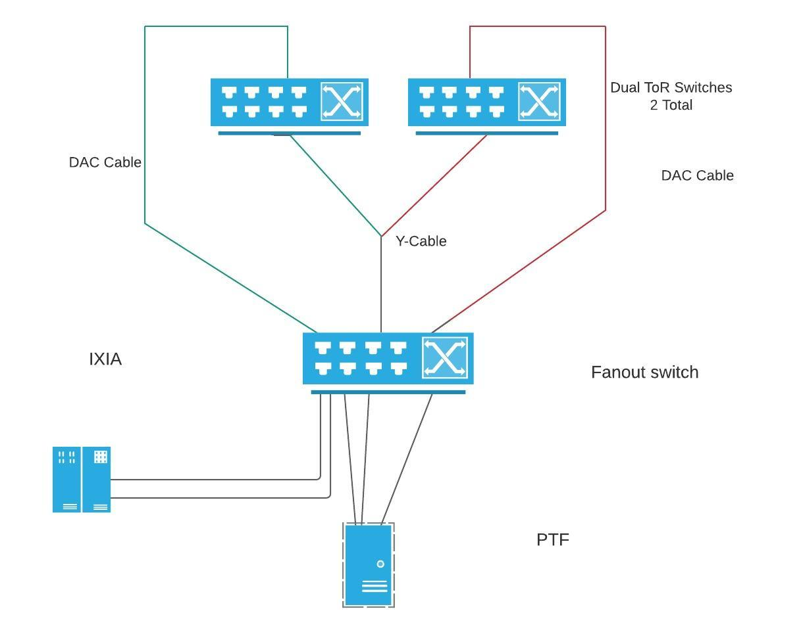

# Dual ToR MuxCable Test Plan

### Scope

The scope of this test plan is to verify correct hardware behavior of the Muxcable(Y-Cable). This is a continuation to dual_tor_test_hld.md and please refer this document for more details on topology etc.

The below hardware features/properties of the Y-Cable are to be tested in this test plan. The focus is going to be on the following capabilities of the Y-Cable.

- Checking the read side of the Cable and establishing the read side is one of the valid values by reading the eeprom/register spec.
- Toggling the MUX to both the sides and ensure the mux-direction/active link side matches with the side mux is toggled to by reading the eeprom/register spec.
- Verify that the mux-direction/active link side also complies with traffic behavior. In particular the side mux is toggled to should be the only side TOR traffic reaches the NIC side. The traffic from NIC side to TOR should be braodcasted.
- Verify that during toggle/failover number of frames dropped is minimal or zero or whatever the vendor expectation is from Y-Cable for drop count
- Verify that number of frames received is equal to number of frames sent in both northbound/southbound traffic flows for a predefined set period of time.
- Verify that the manual switch counter is incremented once the MUX is toggled.
- Verify the Vendor name is correct (one of the expected values) by reading the register spec
- Verify part number is correct by reading the register spec. The part number should be qualified by regex match of the value returned to the value vendor provides.
- Verify with vendor name and model value, the appropriate model's import module can be imported using y_cable_vendor_mapping.py mapping logic
- Check the fimware version is returned correctly and is one of the acceptable values suggested by vendor. The major and minor number can be qualified by a regex match with a predefined pattern
- Ensure firmware download, upgrade and rollback works fine.
- Check LOS/LOL fields in the cable spec and check if they are correct
- Check Cli show muxcable status and show muxcable hwmode muxdirection are in sync

These are some of the vendor specific hardware capabilities which should be tested if available.

- Ensure auto-switch gets enabled by reading the register spec once auto-switch is enabled.
- Ensure auto-switch counter is incremented in case of link down which causes an automatic switchover
- Ensure all the link are active and up for ToR A, ToR B and NIC.
- Ensure BER values are in accepatble range for normal traffic mode and diagnostic mode like PRBS, Loopback.
- Ensure EYE values are in acceptable range for normal traffic mode and diagnostic mode like PRBS, Loopback
- Ensure Voltages and Temperatures of all the MCU's vendor provides the capability to read are within accepatble range.


### Testbed Setup

The test can be executed on a single Tor testbed with proposed configurations that has a muxcable put in a port with driver code. For Tests that require some traffic validation will need to run on a testbed which can send trafic from NIC to ToR and vice-versa.

The full testbed setup is shown below:



### CLI commands:

Example mux cable checking the read_side
```
show muxcable readside <port>
```

The following command can be used to toggle the mux port to active/standby

```
config muxcable hwmode state active <port>
```

The following command can be used to verify the mux port is active/standby

```
show muxcable hwmode muxdirection
```

The following command can be used to get the counters of the cable manual/auto

```
show muxcable hwmode counters <port>
```

The following command can be used to get the vednor/partnumber

```
show muxcable cableinfo <port>
```

The following command can be used to get the firmware version

```
show muxcable firmware version <port>
```

The following command can be used to download the firmware of the muxcable

```
config muxcable firmware download <fwfile> <port>
```

The following command can be used to activate the firmware of the muxcable

```
config muxcable firmware activate <port>
```

The following command can be used to rollback the firmware of the muxcable

```
config muxcable firmware rollback <port>
```

The following command can be used to check the switchmode of the muxcable auto/manual

```
show muxcable hwmode switchmode
```

The following command can be used to configure the switchmode of the muxcable

```
sudo config muxcable hwmode setswitchmode auto <port>
```

The following command can be used to check BER/EYE info the muxcable

```
sudo show muxcable eyeinfo <physical_port> <target>
sudo show muxcable berinfo <physical_port> <target>
```

## Test Cases

1.  Without Traffic Tests

    These tests dont require any traffic to be  sent to/from the ToR and are standalone tests which can run on a DUT which has a muxcable
    
    | Step | Goal | Expected results |
    |-|-|-|
    | Run Cli Command to get read_side of the muxcable | Read Side validation | Ensure the read side is one of the values which is expected from read side Cli command |
    ||||
    | Toggle the MUX to active/standby | MUX toggle validation | Verify the toggle MUX functioning is happening correctly; Verify the toggle MUX register read is pointing to correct value |
    ||||
    | Verify the manual switch counter value is incremented once a toggle MUX is issued | manual switch counter validation | Verify the value is incremented once there is toggle issued |
    ||||
    | Verify with vendor name and model value, the appropriate model's import module can be imported | import module validation | Verify the module can be correctly imported using vendor name and model name using y_cable_vendor_mapping.py file  |
    ||||
    | Check the fimware version is returned correctly and is one of the acceptable values suggested by vendor | firmware version validation | Verify the firmware version is in inexpected regex format |
    ||||
    | Verify firmware download, activate, rollback execute correctly | firmware upgrade validation | Verify the firmware download executes correctly and return code is correct; firmware activate/download returns correct return code and firmware version command correctly reflect the change |
    ||||
    | Verify that show mux status matches with show mux hwmode muxdirection | linkmgr/cable sanity | Verify both the directions match with each other |
    ||||

2. Upstream: Server -> ToR -> T1


   Downstream: T1 -> ToR -> Server

    On the upstream side, traffic needs to be validated to be broadcasted on both the 2 ends of the Y-Cable. On the downstream side the traffic needs to be only forwarded by the active link.
    
    | Step | Goal | Expected results |
    |-|-|-|
    | traffic validation from NIC to ToR | Traffic validation | Verify traffic is broadcasted from Server to both ToR; Traffic to be sent from fanout switch to ToR;Both the T1's should receive the packet from the server |
    ||||
    | traffic validation from ToR to NIC | Traffic validation | Verify traffic from only active ToR reaches the server; Traffic from standby ToR should not reach the server; Server receives the packet only from active port |
    ||||
    | Mux toggle traffic validation from ToR to NIC | MUX correctly toggles | Verify traffic from only active ToR reaches the server; Server receives packet from active port; Perform a toggle from Cli; Traffic from standby ToR should not reach the server; Server receives the packet from active port after toggle |
    ||||
    | traffic quantity validation from server to NIC | packet count to remain same or no packet loss | Verify number of frames sent from server to ToR and vice-versa on active link remain same; |
    ||||
    | During toggle record number of frames dropped | Verify no/minimalistic packet loss during toggle/failover | Verify number of frames sent during a failover are equal to the frmaes received from ToR to server |
    ||||
    | Normal traffic test | traffic validation of Y-Cable | Verify the BER/EYE/SnR are read correctly and in accepatble range |
    
3. Diagnostic Tests

    Send traffic to server under active mux.
    
    | Step | Goal | Expected results |
    |-|-|-|
    | PRBS test | PRBS functioning of Y-Cable | Verify the BER/EYE/SnR are read correctly and in accepatble range |
    ||||
    | Loopback test | PRBS functioning of Y-Cable | Verify the BER/EYE/SnR are read correctly and in accepatble range |
    ||||
    | Verify the auto switch counter value is incremented once auto is enabled and link goes down | auto switch counter validation | Verify the value is incremented once the link goes down |
    ||||
    | Verify the voltages and temperatures are in accepatable range | voltage and temperature validation | Verify the voltages and temperatures are in acceptable ranges of the MCUs available |
