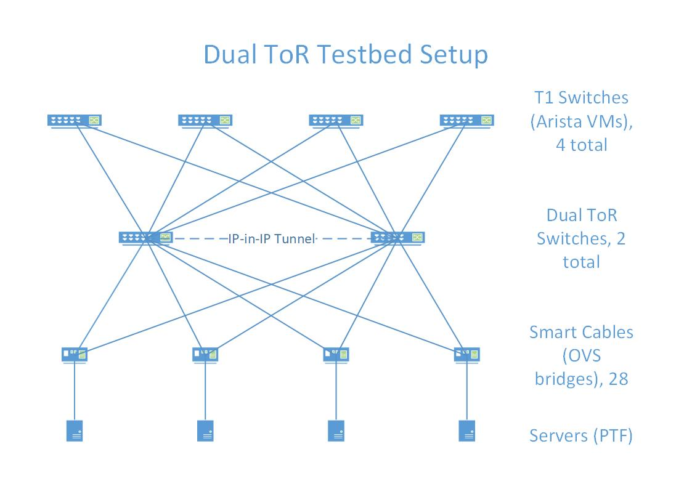
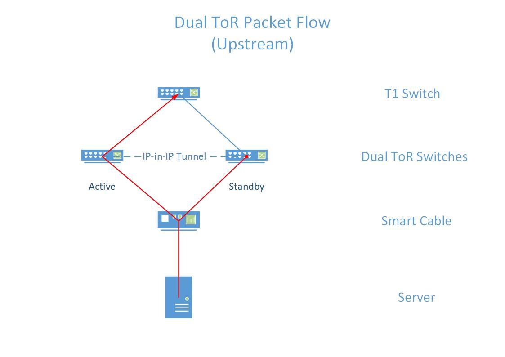
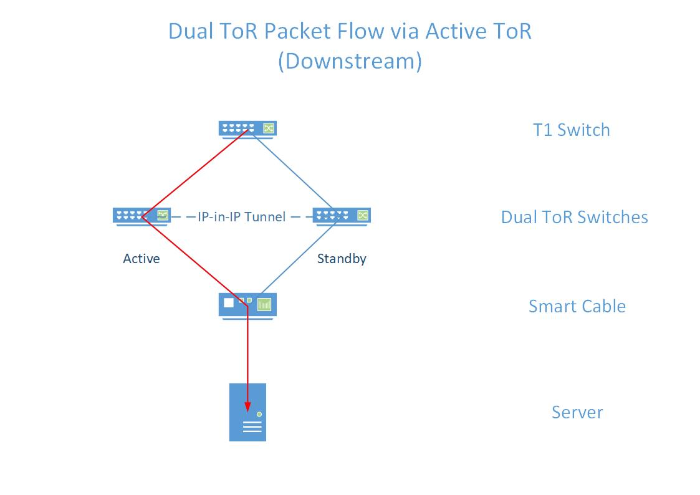
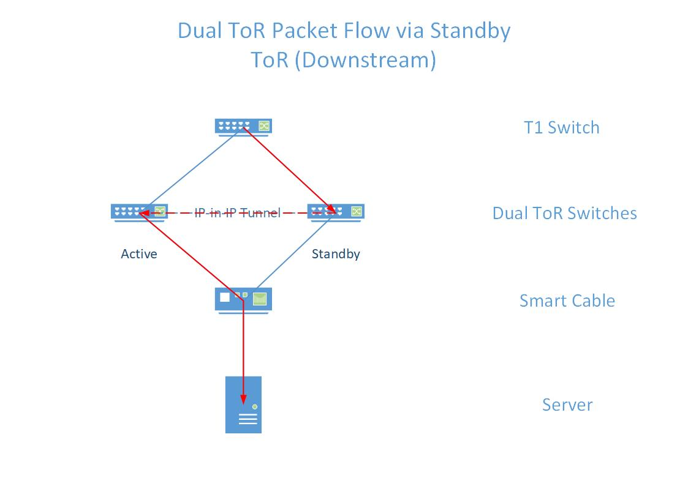

# Dual ToR Test Plan

## Background

This project introduces the concept of dual top of rack (ToR) switches to provide increased network redundancy for servers. Instead of the standard single ToR switch connecting a rack of servers to a datacenter network, dual ToR setups have two redundant ToR switches. In a rack utilizing a dual ToR setup, every server is connected to both ToRs via a special cable. This cable (known as a mux cable or smart cable) has three ends; two ends are connected to the ToR switches, and the third end connects to the server. The cable also contains a built in mux chip, which is able to select from which ToR the server receives incoming traffic. In the event of a link failure on a single ToR (or failure of an entire ToR), dual ToR setups will enable normal operation to continue via the remaining ToR.

### Scope

The scope of this test plan is to verify correct end-to-end operation of a dual ToR configuration. This includes control plane testing to verify correct state on the devices under test (DUTs) and data plane testing to verify correct packet flow between T1 switches, the ToRs, and the servers.

The following are out of scope for this test plane:

* Mux cable operation
* Individual component behavior (i.e. verifying that CLI commands write to config DB properly)

### Testbed Setup

The dual ToR testbed setup is similar to the regular SONiC testbed setup in many ways. Arista VMs will still be used to emulate T1 switches, and PTF docker containers will be used to emulate servers.

Both ToRs will be connected to all 4 T1 VMs similar to existing testbeds. However, the downstream ports of the ToR will be connected to smart cables, which are in turn connected to the PTF container. The corresponding ports on each ToR will be connected to the same cable, e.g. port A on both switches is connected to cable A, which is connected to some server A.

The ToR switches will also be connected by an IP-in-IP tunnel, which facilitates forwarding of traffic from the standby ToR to the active ToR

Since the physical smart cables that will eventually be used when dual ToR setups enter production are not yet available, Open vSwitch (OVS) will be used to emulate the mux cable behavior. One OVS bridge will be used to emulate a single mux cable, which will allow for full emulation of cable behavior.

The full testbed setup is shown below:

### OVS Bridge Verification

Since testing of the mux cable is out of scope of this test plan, the test cases described here are written under the assumption that the mux cable is operating correctly. In order to validate this assumption in the dual ToR testbed, a pre-test check is needed to verify the correct operation of the bridge. This check can be included as a setup method for the test classes, or as part of the pre-test sanity check. The check involves the following steps:

1. Attempt to ping (ICMP echo request) the server from both ToRs
2. Verify that the server received only the request from the active ToR
3. Send an ICMP echo reply from the server
4. Verify that both ToRs received the reply

## Test Cases

These tests verify that packet flow behaves as expected following configuration changes or changes to the cable state (e.g. link failure)

The three main traffic scenarios (and the expected packet flows) are as follows:

1. Server -> ToR -> T1

    In this scenario, a server sends traffic to a T1 switch. The traffic should pass through the mux cable, which should forward the packets to both ToRs. The standby ToR is expected to drop the packets, and the active ToR is expected to forward these packets to the T1 switch:

    

    For all test cases in this packet flow scenario, the main step of the test will involve sending traffic from a server to a T1 switch. Let ToR A be the active ToR at the start of each case, and ToR B be the standby ToR. The test cases, setup steps, and expected results are described below:

    | Case | Goal | Test Setup | Expected Control Plane | Expected Data Plane |
    |-|-|-|-|-|
    | Healthy | Verify normal operation | None | ToR A DBs indicate active, ToR B DBs indicate standby | T1 switch receives packet from the active ToR (A), and not the standby ToR (B) |
    | Active Config Reload | Verify normal operation after performing config reload on the active ToR| Change some dual ToR feature configurations, then `config reload` active ToR | ToR A DBs indicate standby, ToR B DBs indicate active | T1 switch receives packet from the new active ToR (B), and not the standby ToR (A) |
    | Standby Config Reload | Verify normal operation after performing config reload on the standby ToR | Change some dual ToR feature configurations, then `config reload` standby ToR | ToR A DBs indicate active, ToR B DBs indicate standby | T1 switch receives packet from the active ToR (A), and not the standby ToR (B) |
    | Active ToR Switch | Verify packet flow after manually changing the active ToR | Set the standby ToR to active via CLI commands | ToR A DBs indicate standby, ToR B DBs indicate active | T1 switch receives packet from the new active ToR (B) and not the new standby ToR (A); verify traffic interruption < 1 second |
    | Active Link Down | Verify packet flow after the link from the server to the active ToR (A) goes down | Take down the link between the active ToR and the server | ToR A DBs indicate standby and unhealthy link, ToR B DBs indicate active | T1 switch receives packet from the new active ToR (B) and not the new standby ToR (A); verify traffic interruption < 1 second |
    | Standby Link Down | Verify packet flow after the link from the server to the standby ToR (B) goes down | Take down the link between the standby ToR and the server | ToR A DBs indicate active, ToR B DBs indicate standby (no changes) | T1 switch receives packet from the active ToR (A) and not the standby ToR (B) |
    | Active Link Drop | Verify packet flow if the link from the server to the active ToR (A) starts dropping packets, but stays up | Configure the OVS bridge to drop packets destined for the active ToR | ToR A DBs indicate standby and unhealthy link, ToR B DBs indicate active | T1 switch receives packet from the new active ToR (B) and not the new standby ToR (A); verify traffic interruption < 1 second |
    | Standby Link Drop | Verify packet flow if the link from the server to the standby ToR (B) starts dropping packets, but stays up | Configure the OVS bridge to drop packets destined for the standby ToR | ToR A DBs indicate active, ToR B DBs indicate standby and unhealthy link | T1 switch receives packet from the active ToR (A) and not the standby ToR (B) |
    | Active ToR BGP Down | Verify packet flow after the active ToR (A) loses BGP sessions | Shutdown all BGP sessions on the active ToR | ToR A DBs indicate standby, ToR B DBs indicate active | T1 switch receives packet from the new active ToR (B) and not the new standby ToR (A); verify traffic interruption < 1 second |
    | Standby ToR BGP Down | Verify packet flow after the standby ToR (B) loses BGP sessions | Shutdown all BGP sessions on the standby ToR | ToR A DBs indicate active, ToR B DBs indicate standby | T1 switch receives packet from the active ToR (A), and not the standby ToR (B) |
    | Active ToR Heartbeat Loss | Verify packet flow after the active ToR (A)stops sending a heartbeat | Stop the LinkProber submodule on the active ToR | ToR A DBs indicate standby and unhealthy link, ToR B DBs indicate active | T1 switch receives packet from the new active ToR (B) and not the new standby ToR (A); verify traffic interruption < 1 second |
    | Standby ToR Heartbeat Loss | Verify packet flow after the standby ToR (B) stops sending a heartbeat | Stop the LinkProber submodule on the standby ToR | ToR A DBs indicate active, ToR B DBs indicate standby and unhealthy link | T1 switch receives packet from the active ToR (A) and not the standby ToR (B) |
    | Active ToR Failure | Verify packet flow after a simulated failure of the active ToR (A) | Configure active ToR to blackhole all traffic | ToR A DBs indicate standby and unhealthy link, ToR B DBs indicate active | T1 switch receives packet from the new active ToR (B) and not the new standby ToR (A); verify traffic interruption < 1 second |
    | Standby ToR Failure | Verify packet flow after a simulated failure of the standby ToR (B) | Configure standby ToR to blackhole all traffic | ToR A DBs indicate active, ToR B DBs indicate standby and unhealthy Link | T1 switch receives packet from the active ToR (A) and not the standby ToR (B) |
    | Active ToR Reboot | Verify packet flow after the active ToR (A) reboots | Reboot the active ToR | ToR A DBs indicate standby, ToR B DBs indicate active | T1 switch receives packet from the new active ToR (B) and not the new standby ToR (A); verify traffic interruption < 1 second |
    | Standby ToR Reboot | Verify packet flow after the standby ToR (B) reboots | Reboot the standby ToR | ToR A DBs indicate active, ToR B DBs indicate standby | T1 switch receive packet from the active ToR (A) and not the standby ToR (B) |

2. T1 -> Active ToR -> Server

    In this scenario, a T1 switch sends traffic to the server via the active ToR. During normal operation, the T1 can send server-bound traffic to either ToR due to ECMP routing. However for the purposes of the test, the T1 switch will explicitly send traffic to only the active ToR (by sending packets from the port connected to the active ToR), which will then forward it to the server:

    

     Let ToR A be the active ToR at the start of each case, and ToR B be the standby ToR. For all test cases in this packet flow scenario, the main step of the test will involve sending traffic from a T1 switch to the server via ToR A. In addition, every test case must also check that no IP-in-IP packet was received on the T1 switch to verify that the active ToR is not duplicating packets and sending them to the standby ToR. The test cases, setup steps, and expected results are described below:

    | Case | Goal | Test Setup | Expected Control Plane | Expected Data Plane |
    |-|-|-|-|-|
    | Healthy | Verify normal operation | None | ToR A DBs indicate active, ToR B DBs indicate standby | T1 switch receives no IP-in-IP packet; server receives packet |
    | Active Config Reload | Out of scope: since config reload disrupts BGP sessions, T1 switch will never send traffic to this ToR | None | None | None |
    | Standby Config Reload | Verify normal operation after performing config reload on the standby ToR | Change some dual ToR feature configurations, then `config reload` standby ToR | ToR A DBs indicate active, ToR B DBs indicate standby | T1 switch receives no IP-in-IP packet; server receives packet|
    | Active ToR Switch | Verify packet flow after manually changing the active ToR | Set the standby ToR to active via CLI commands | ToR A DBs indicate standby, ToR B DBs indicate active | T1 switch receives IP-in-IP packet with correct attributes (from ToR A to ToR B); server receives packet; verify traffic interruption < 1 second |
    | Active Link Down | Verify packet flow after the link from the server to the active ToR (A) goes down | Take down the link between the active ToR (A) and the server | ToR A DBs indicate standby and unhealthy link, ToR B DBs indicate active | T1 switch receives IP-in-IP packet with correct attributes (from ToR A to ToR B); server receives packet; verify traffic interruption < 1 second |
    | Standby Link Down | Verify packet flow after the link from the server to the standby ToR (B) goes down | Take down the link between the standby ToR and the server | ToR A DBs indicate active, ToR B DBs indicate standby (no changes) | T1 switch receives no IP-in-IP packet; server receives packet |
    | Active Link Drop | Verify packet flow if the link from the server to the active ToR (A) starts dropping packets, but stays up | Configure the OVS bridge to drop packets originating from the active ToR | ToR A DBs indicate standby and unhealthy link, ToR B DBs indicate active | T1 switch receives IP-in-IP packet with correct attributes (from ToR A to ToR B); server receives packet; verify traffic interruption < 1 second |
    | Standby Link Drop | Verify packet flow if the link from the server to the standby ToR (B) starts dropping packets, but stays up | Configure the OVS bridge to drop packets originating from the standby ToR | ToR A DBs indicate active, ToR B DBs indicate standby and unhealthy link | T1 switch receives no IP-in-IP packet; server receives packet |
    | Active ToR BGP Down | Out of scope: taking down the active ToR's (A) BGP sessions means the T1 will never send traffic to that ToR | None | None | None |
    | Standby ToR BGP Down | Verify packet flow after the standby ToR (B) loses BGP sessions | Shutdown all BGP sessions on the standby ToR | ToR A DBs indicate active, ToR B DBs indicate standby | T1 switch receives no IP-in-IP packet; server receives packet |
    | Active ToR Heartbeat Loss | Verify packet flow after the active ToR (A) stops sending a heartbeat | Stop the LinkProber submodule on the active ToR | ToR A DBs indicate standby and unhealthy link, ToR B DBs indicate active | T1 switch receives IP-in-IP packet with correct attributes (from ToR A to ToR B); server receives packet; verify traffic interruption < 1 second |
    | Standby ToR Heartbeat Loss | Verify packet flow after the standby ToR (B) stops sending a heartbeat | Stop the LinkProber submodule on the standby ToR | ToR A DBs indicate active, ToR B DBs indicate standby and unhealthy link | T1 switch receives no IP-in-IP packet; server receives packet |
    | Active ToR Failure | Out of scope: taking down the active ToR's (A) BGP sessions means the T1 will never send traffic to that ToR | None | None | None |
    | Standby ToR Failure | Verify packet flow after a simulated failure of the standby ToR (B) | Configure standby ToR to blackhole all traffic | ToR A DBs indicate active, ToR B DBs indicate standby and unhealthy link | T1 switch receives no IP-in-IP packet; server receives packet |
    | Active ToR Reboot | Out of scope: rebooting the active ToR means the T1 never sends traffic to the ToR | None | None | None |
    | Standby ToR Reboot | Verify packet flow after the standby ToR (B) reboots | Reboot the standby ToR | ToR A DBs indicate active, ToR B DBs indicate standby | T1 switch receives no IP-in-IP packet; server receives packet; verify traffic interruption < 1 second |

3. T1 -> Standby ToR -> Server

    In this scenario, a T1 switch sends traffic to a server via the standby ToR. The standby ToR should forward the traffic to the active ToR through the IP-in-IP tunnel. The active ToR then fowards the traffic to the server. Similar to the `T1 -> Active ToR -> Server` scenario, the T1 will explicitly send traffic only to the standby ToR:

    

    For all test cases in this packet flow scenario, the main step of the test will involve sending traffic from a T1 switch to the server via the standby ToR. In addition, all test cases need to check that T1 switch receives an IP-in-IP packet with the correct attributes which indicates the standby ToR is forwarding southbound packets to the active ToR. The test cases, setup steps, and expected results are described below:

    | Case | Goal | Test Setup | Expected Control Plane | Expected Data Plane |
    |-|-|-|-|-|
    | Healthy | Verify normal operation | None | Tor A DBs indicate active, ToR B DBs indicate standby | T1 Switch receives IP-in-IP packet with correct attributes (from ToR B to ToR A); server receives packet |
    | Active Config Reload | Verify normal operation after performing config reload on the active ToR | Change some dual ToR feature configurations, then `config reload` active ToR | ToR A DBs indicate standby, ToR B DBs indicate active | T1 switch receives no IP-in-IP packet; server receives packet|
    | Standby Config Reload | Out of scope: since config reload disrupts BGP sessions, T1 switch will never send traffic to this ToR | None | None | None |
    | Active ToR Switch | Verify packet flow after manually changing the active ToR | Set the standby ToR to active via CLI commands | Tor A DBs indicate standby, ToR B DBs indicate active | T1 switch receives no IP-in-IP packet; server receives packet; verify traffic interruption is < 1 second |
    | Active Link Down | Verify packet flow after the link from the server to the active ToR (A) goes down | Take down the link between the active ToR and the server | Tor A DBs indicate standby and unhealthy link, ToR B DBs indicate active | T1 switch receives no IP-in-IP packet; server receives packet; verify traffic interruption is < 1 second |
    | Standby Link Down | Verify packet flow after the link from the server to the standby ToR (B) goes down | Take down the link between the standby ToR and the server | Tor A DBs indicate active, ToR B DBs indicate standby (no changes) | T1 switch receives IP-in-IP packet with correct attributes (from ToR B to ToR A); server receives packet |
    | Active Link Drop | Verify packet flow if the link from the server to the active ToR (A) starts dropping packets, but stays up | Configure the OVS bridge to drop packets originating from the active ToR | Tor A DBs indicate standby and unhealthy link, ToR B DBs indicate active | T1 switch receives no IP-in-IP packet; server receives packet; verify traffic interruption is < 1 second |
    | Standby Link Drop | Verify packet flow if the link from the server to the standby ToR (B) starts dropping packets, but stays up | Configure the OVS bridge to drop packets originating from the standby ToR | Tor A DBs indicate active, ToR B DBs indicate standby and unhealthy link | T1 switch receives IP-in-IP packet with correct attributes (from ToR B to ToR A); server receives packet |
    | Active ToR BGP Down | Verify packet flow after the active ToR (A) loses BGP sessions | Shutdown all BGP sessions on the active ToR | Tor A DBs indicate standby, ToR B DBs indicate active | T1 switch receives no IP-in-IP packet; server receives packet; verify traffic interruption is < 1 second |
    | Standby ToR BGP Down | Out of scope: taking down the standby ToR's (B) BGP sessions means the T1 will never send traffic to that ToR | None | None | None |
    | Active ToR Heartbeat Loss | Verify packet flow after the active ToR (A) stops sending a heartbeat | Stop the LinkProber submodule on the active ToR | Tor A DBs indicate standby and unhealthy link, ToR B DBs indicate active | T1 switch receives no IP-in-IP packet; server receives packet; verify traffic interruption is < 1 second |
    | Standby ToR Heartbeat Loss | Verify packet flow after the standby ToR (B) stops sending a heartbeat | Stop the LinkProber submodule on the standby ToR | Tor A DBs indicate active, ToR B DBs indicate standby and unhealthy link | T1 switch receives IP-in-IP packet with correct attributes (from ToR B to ToR A); server receives packet |
    | Active ToR Failure | Verify packet flow after a simulated failure of the active ToR (A) | Configure active ToR to blackhole all traffic | Tor A DBs indicate standby and unhealthy link, ToR B DBs indicate active | T1 switch receives no IP-in-IP packet; server receives packet; verify traffic interruption is < 1 second |
    | Standby ToR Failure | Out of scope: taking down the standby ToR's (B) BGP sessions means the T1 will never send traffic to that ToR | None | None | None |
    | Active ToR Reboot | Verify packet flow after the active ToR (A) reboots | Reboot the active ToR | ToR A DBs indicate standby, ToR B DBs indicate active | T1 switch receives no IP-in-IP packet; server receives packet; verify traffic interruption < 1 second |
    | Standby ToR Reboot | Out of scope: rebooting the standby ToR means the T1 never sends traffic to the ToR | None | None | None |

In addition to the three scenarios above, additional tests are necessary to verify correct operation in specific edge cases:

| Case | Goal | Test Steps | Expected Control Plane | Expected Data Plane |
|-|-|-|-|-|
| Gratuitous ARP | Verify the standby ToR can learn ARP entries when the server sends an ARP reply to the active ToR | Send an ARP request from the active ToR to the server | Both ToRs learn the ARP reply sent by server | None |
| Proxy ARP | Verify each ToR can send proxy ARP replies for the other | For servers A and B, with server A having active ToR A and server B having active ToR B, send an ARP request from server A for server B's IP. Then send a packet from server A to server B. | Server A learns ToR A's MAC for server B's IP | T1 switch receives IP-in-IP packet with correct attributes (from ToR A to ToR B); server B receives packet |
| Server Down | Verify the active and standby ToRs do not flap if the server becomes unresponsive | Stop sending all traffic from the server | ToR states do not flap between active and standby (both should indicate unhealthy mux cables) | None
| Tunnel Operation | Verify correct behavior of the IP-in-IP tunnel between the ToRs | Encapsulate a packet on ToR A and send through the tunnel to ToR B; do the same for ToR B to ToR A | For both cases, verify that T1 switch sees the correct IP-in-IP packet, and that the destination ToR receives the packet |
