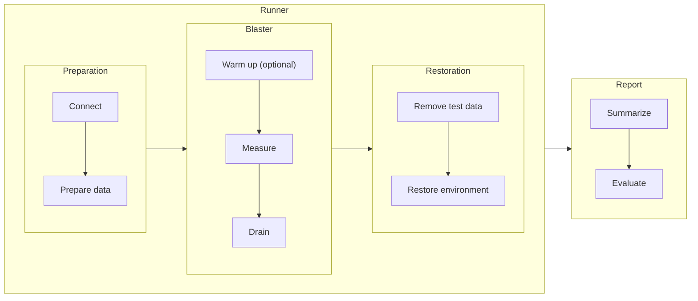
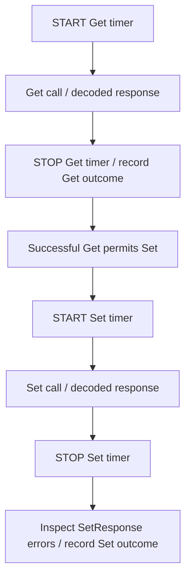

# gNMI benchmark

## Purpose

Measure how SONiC gNMI request latency and throughput change with request size
and offered load. The framework separates test lifecycle, traffic generation
and reporting so different workloads can use the same measurement approach.

A **request** is an individual RPC; an **iteration** is one execution of a
workload and may contain multiple requests. Latency is measured per request,
while scheduling controls iterations. The scenario included in this PR is
described in [Example workload: VNET routes](#example-workload-vnet-routes).

## Workflow

| Part | Responsibility |
|---|---|
| Runner | Coordinate phases and ensure resources are released, including on failure. |
| Preparation | Establish the connection and prepare workload-specific data and requests. |
| Blaster | Execute optional warmup and measured traffic; stop admission at the configured limit and drain outstanding work. |
| Restoration | Remove test resources and restore the environment before reporting. |
| Report | Turn completed measurements into statistics and a pass/fail result. |

Warmup and measurement use the same workload, but warmup samples are excluded
from results. The Runner decides whether warmup succeeded before starting
measurement. The Report consumes measurements without controlling execution.
A preparation or restoration failure prevents a completed benchmark report.

## Load model

| Load model | Behavior | Question it answers |
|---|---|---|
| Closed loop | Each worker starts another iteration after its previous one finishes. | How does performance change with concurrency? |
| Open loop | Iterations are offered at a fixed rate, with bounded outstanding work. Unadmitted arrivals are dropped. | How much offered load can the system sustain? |

Experiments control workers, duration or iteration count, and optional warmup.
Open loop additionally sets the arrival rate in **iterations/s**. The workload
defines request types and sizes; iterations/s is not interchangeable with RPC/s.

Requests are prepared before load and share a persistent connection, keeping
setup work out of the measured workload. Open loop drops arrivals it cannot
admit rather than building an unbounded queue or sending catch-up bursts.

## Measurement and interpretation

Each request is timed independently around its client call. An iteration with
multiple requests produces separate latency samples, not a combined latency.
The current two-request workload illustrates the timing boundaries:

Latency includes serialization, transport, server work and response decoding.
Preparation, warmup and restoration are outside the timer. Failed calls are
counted as errors rather than included in successful-request latency statistics.

| Result | Interpretation |
|---|---|
| Request latency | Client-observed distributions grouped by request type and size. |
| Throughput | Completed work per second, with the unit and interval stated: RPC/s per request type, or iterations/s for the workload. |
| Errors and drops | RPC failures and unsent arrivals are counted separately from successful-call latency. |
| Drain time | Time spent finishing admitted work after the load window ends. |

Per-request rates use the full measurement interval, including drain. For
duration runs, the report also records successful iterations completed within
the admission window. Workload-specific units such as entries/s must be derived
from the actual work completed, rather than assumed from the offered rate.

The current pass criterion is **every measured request ≤1,000 ms**, with no
RPC/response errors or dropped arrivals. A mean or P95 below 1,000 ms does not
establish a pass.

Interpret results with these boundaries:

- Read open-loop latency together with its drop rate. Fast admitted requests do
  not show that the full offered rate was sustained.
- Keep admission-window throughput separate from full-run averages that include
  drain. Long-drain runs do not establish steady-state capacity.
- RPC success establishes response-level success, not application correctness
  or completion of downstream effects.
- Compare versions using the same data, load, transport and repeated runs.
  One run demonstrates observed behavior, not an internal cause or reliable speedup.

For CLI examples, defaults and extension details, see the
[benchmark README](../../tests/gnmi_benchmark/README.md).

## Example workload: VNET routes

This PR provides [RouteTableBlaster](../../tests/gnmi_benchmark/blaster.py), a
bulk configuration workload. Each iteration performs **Get → Set** for existing
VNET routes in CONFIG_DB: one Get reads explicit keys, and one table-level Set
rewrites that batch with validation bypass requested. Set uses prepared values,
not the Get response; a failed Get skips Set. Other workloads can supply a
different request sequence while reusing the framework.

The default inventory contains **256,000 routes across 13 VNETs**: 12 × 20,000
measured routes plus 16,000 background routes. Requests cycle through disjoint
batches across measured VNETs. Batch size divides the measured VNET size so every
request carries the same number of routes. Varying batch size preserves inventory
and eligible keys, separating request-size effects from database-size effects.
Short runs may not visit every batch.

The scenario requires a single-ASIC DUT with TLS, GCU and Loopback0 IPv4 support.
Preparation checks route capacity, backs up configuration and preloads routes;
restoration removes test resources and restores the backup. Runs need exclusive
configuration access. Client drain does not prove timed-out server writes have
stopped, so restoration must be checked before device reuse.

Get and Set have separate latency distributions. A successful iteration contains
two RPCs; its batch size converts iteration throughput to route entries/s per
direction. The benchmark does not check readback or forwarding convergence, or
assert that bypass was used. Get may read a CONFIG_DB checkpoint.

## References

- [gRPC benchmarking](https://grpc.io/docs/guides/benchmarking/): a compact overview
  organized around test design, scenarios and infrastructure.
- [k6 test lifecycle](https://grafana.com/docs/k6/latest/using-k6/test-lifecycle/):
  separate preparation, repeated workload and teardown.
- [k6 open and closed models](https://grafana.com/docs/k6/latest/using-k6/scenarios/concepts/open-vs-closed/):
  distinguish fixed concurrency from independent arrival rates.
- [arc42 architecture canvas](https://arc42.org/canvas/): communicate goals,
  structure and key constraints as a concise design overview.
