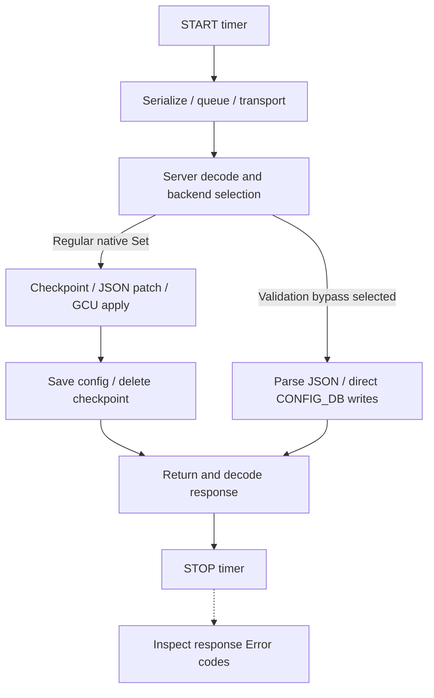

# gNMI benchmark

A configurable grpcio load generator for **client-observed latency, throughput
and request outcomes**, using the existing SONiC TLS test fixture.

## What does the measured RTT consist of?

The retained metric is **client-call duration**, not pure network RTT. The timer
starts before call bookkeeping and stops when the decoded response or RPC error
returns. Explicit SetResponse error inspection follows the timer.



The diagram describes native CONFIG_DB Set processing. Get has a separate read
path. Bypass selection depends on the server's supported header, SKU and table
conditions; requesting it does not prove that it executed. See the public
[bypass implementation](https://github.com/sonic-net/sonic-gnmi/blob/master/pkg/bypass/bypass.go).

## Timing summary and estimation limits

| Work | Included in per-RPC duration? |
|---|---|
| Call bookkeeping, protobuf serialization, transport, server work and response decoding | Yes |
| Channel handshake or reconnect during a call | Yes; explicit readiness before warmup is excluded |
| Payload generation, fixture setup/teardown, warmup and resource/report collection | No |
| Explicit response-error inspection | No; it still affects closed-loop throughput |
| Post-response forwarding convergence | Not awaited or measured |

Do not subtract estimated network or encoding cost. Internal stage durations and
HTTP/2 waiting are not isolated. The histogram uses gRFC A66 boundaries converted
to milliseconds; this is not native A66/OTel instrumentation.

## Verification rules

| Check | Rule |
|---|---|
| RPC success | gRPC `OK`; Set also requires no nonzero Error code in SetResponse or UpdateResult entries |
| Latency population | Successful calls only; failures remain in status/error counts |
| Combined workflow | Empty Get followed by Set after Get success; failed Get skips Set and fails the group |
| Scope | No configuration readback, forwarding verification or bypass execution assertion |

No successful samples produces null latency statistics, not zero latency. The
test fails when any planned measured request/group fails or remains unfinished.
Warmup errors prevent measurement; cleanup is assessed separately.

## Report and evidence

One `<cid>-report.json` is written to the configured directory and emitted through
the existing log/CustomMsg mechanisms. Schema 3 describes Get-only or Set-only;
schema 4 describes Get→Set workflows.

| Section | Contents |
|---|---|
| `device`, `benchmark`, `load` | Device identity, operation, timing boundary and effective workload parameters |
| `metrics` | Counts/statuses, successful latency mean/P50/P95/P99/max and 42 histogram buckets, throughput |
| `execution` | Readiness, warmup, admission/drain and peak client in-flight work |
| `resources`, `sampling` | Two boundary snapshots, not continuous measurements or a measured peak |

Schema 4 top-level counts/latency describe groups. `metrics.operations.get` and
`.set` describe individual RPCs, with throughput over the common measurement
window. `set_skipped_after_get_failure` explains missing Set calls. A group timer
includes inter-RPC bookkeeping; each RPC has its own timer and timeout.

Percentiles use nearest rank on successful samples; do not average per-run P95s
and call the result a pooled P95. Throughput includes measured drain. Raw samples
remain in memory for aggregation and are not another published report.

Templates: [report](../../tests/gnmi_benchmark/templates/report.json.j2),
[latency](../../tests/gnmi_benchmark/templates/latency.json.j2),
[A66 boundaries](../../tests/gnmi_benchmark/templates/grpc_a66_latency_ms_bounds.json.j2).

## Load generator and supported parameters

Invoke `gnmi_benchmark/test_gnmi_benchmark.py` using the normal sonic-mgmt runner
and an appropriate inventory/testbed. Example additional pytest arguments:

```text
--run-stress-tests --benchmark-operation get-set --benchmark-workload vnet-route-tunnel
--benchmark-workload-params '{"entry_count":10,"prepare":true}'
--benchmark-concurrency 2 --benchmark-logical-requests 1000
--benchmark-duration 0 --benchmark-warmup 60 --benchmark-timeout 120
```

This executes 1,000 measured groups, or 2,000 RPCs if all succeed. Change operation
to `set` for 1,000 Set RPCs. A default `get` sends an empty request; it is not a
configured subtree retrieval. Match all workload settings for comparisons and
add `--benchmark-bypass` only to the bypass-requested run.

| Parameter | Default | Meaning |
|---|---|---|
| `--benchmark-operation` | `get` | `get`, `set`, `get-set` |
| `--benchmark-workload` | Operation-dependent | `empty` for Get; `port-description` for writes; explicit `vnet-route-tunnel` for batches |
| `--benchmark-workload-params` | `{}` | Workload-specific typed JSON; unknown keys rejected |
| `--benchmark-concurrency` | 4 | 1–500 workers sharing one TLS channel/stub |
| `--benchmark-logical-requests` | 100 | 1–1,000,000 RPCs or groups; count mode caps workers to this count |
| `--benchmark-duration` | 0 | Positive seconds overrides count; stop admission and drain admitted work |
| `--benchmark-warmup` | 0 | Same-channel time-based warmup, excluded from measurement |
| `--benchmark-timeout` | 120 | Positive integer seconds per RPC |
| `--benchmark-bypass` | Off | Request validation bypass for VNET Set; not authentication bypass |
| `--benchmark-output-dir` | `/tmp/gnmi-benchmark` | JSON report destination |

VNET parameters: `entry_count` (integer 1–20,000), `prepare` (boolean, default
false), or `payload_file` (JSON entry/field map, instead of `entry_count`).
Generated entries require single-ASIC and either preparation or bypass requested.
`prepare:true` creates isolated VNET/VXLAN prerequisites through GCU; it is not
supported for external payload files. File payload configuration and cleanup are
externally managed.

Generated-workload cleanup removes its unique route namespace and, when prepared,
VNET/tunnel keys; it restores the persistent config backup before the existing TLS
fixture rolls back. Do not overlap other configuration writers. Timed-out server
writes may outlive the client; inspect cleanup before reusing the device.

## Prerequisites and limits

- Use a sonic-mgmt environment with grpcio, pygnmi-generated protocol modules and
  Jinja2, and a DUT supporting the required native gNMI operations.
- Reuse the existing `gnmi_tls` fixture; this benchmark does not modify shared
  fixture behavior. The client environment must reach the DUT TLS endpoint.
- Generated prepared VNET traffic requires GCU support and a Loopback0 IPv4 address.
  Bypass eligibility is reported separately from verified execution.
- 500 workers and 20k entries are client configuration limits, not demonstrated
  server capacity. Shared repeated writes are not distinct new routes each time.

References: [gRPC performance](https://grpc.io/docs/guides/performance/),
[gNMI specification](https://github.com/openconfig/reference/blob/master/rpc/gnmi/gnmi-specification.md),
[gRFC A66](https://github.com/grpc/proposal/blob/master/A66-otel-stats.md).
