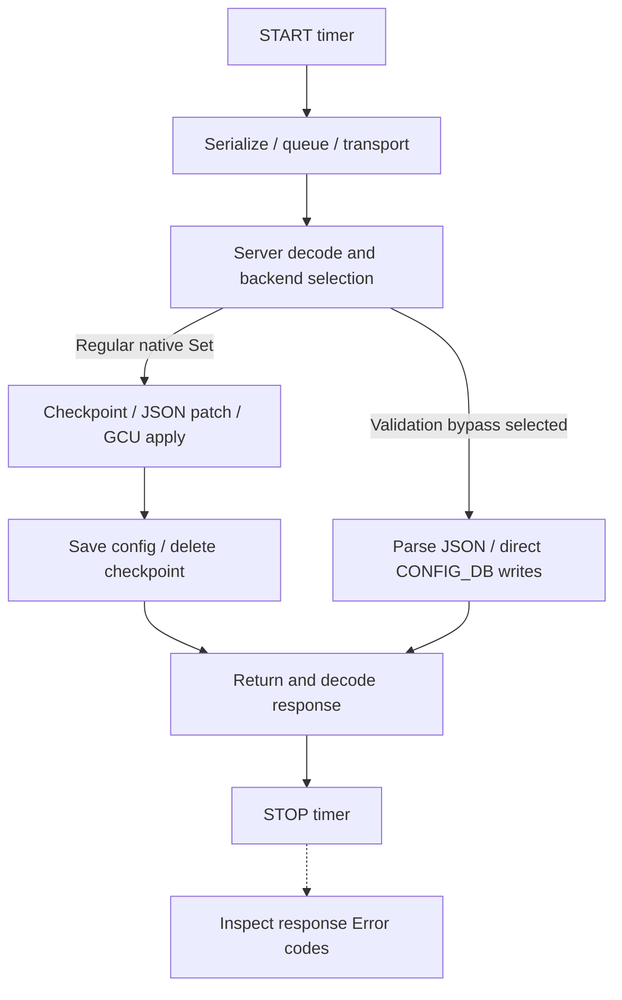
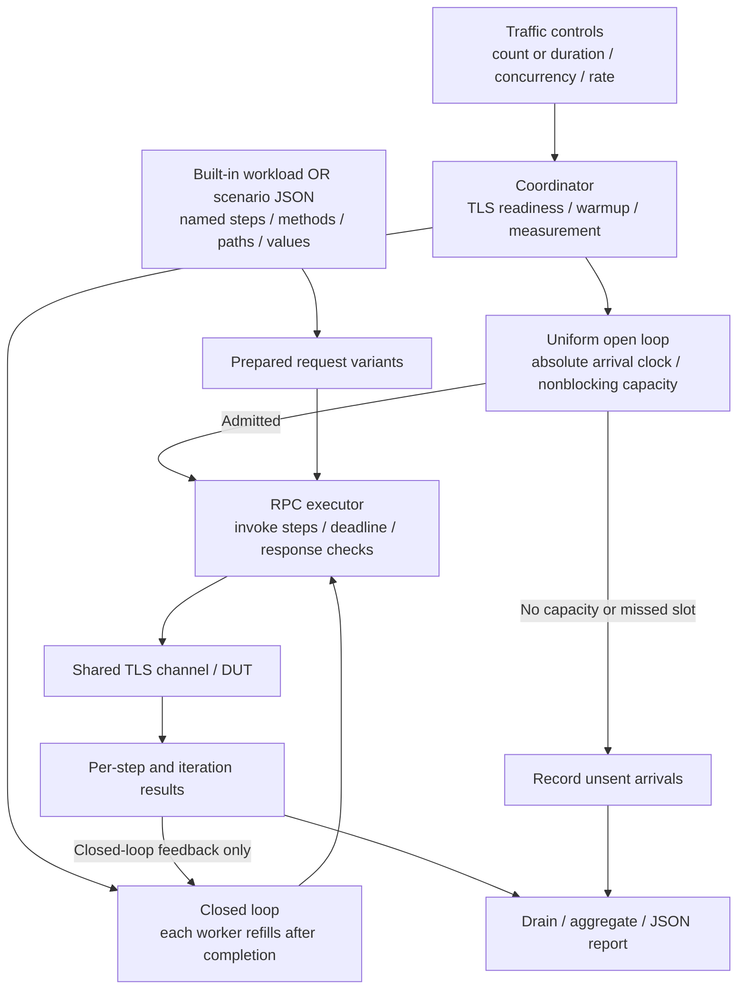

# gNMI benchmark

A configurable grpcio load generator for **client-observed latency, throughput
and request outcomes**, using the existing SONiC TLS test fixture.

## What does the measured RTT consist of?

The retained metric is **client-call duration**, not pure network RTT. The timer
starts before call bookkeeping and stops when the decoded response or RPC error
returns. Explicit SetResponse error inspection follows the timer.



The diagram describes native CONFIG_DB Set processing. Get has a separate read
path. Bypass selection depends on the server's supported header, SKU and table
conditions; requesting it does not prove that it executed. See the public
[bypass implementation](https://github.com/sonic-net/sonic-gnmi/blob/master/pkg/bypass/bypass.go).

## Timing summary and estimation limits

| Work | Included in per-RPC duration? |
|---|---|
| Call bookkeeping, protobuf serialization, transport, server work and response decoding | Yes |
| Channel handshake or reconnect during a call | Yes; explicit readiness before warmup/open-loop load is excluded |
| Payload generation, fixture setup/teardown, warmup and resource/report collection | No |
| Explicit response-error inspection | No; it still affects closed-loop throughput |
| Post-response forwarding convergence | Not awaited or measured |

Do not subtract estimated network or encoding cost. Internal stage durations and
HTTP/2 waiting are not isolated. The histogram uses gRFC A66 boundaries converted
to milliseconds; this is not native A66/OTel instrumentation.

## Verification rules

| Check | Rule |
|---|---|
| RPC success | gRPC `OK`; Set also requires no nonzero Error code in SetResponse or UpdateResult entries |
| Latency population | Successful calls only; failures remain in status/error counts |
| Combined workflow | Empty Get followed by Set after Get success; failed Get skips Set and fails the group |
| Scope | No configuration readback, forwarding verification or bypass execution assertion |

No successful samples produces null latency statistics, not zero latency. The
test fails when any planned measured request/group fails or remains unfinished.
Warmup errors prevent measurement; cleanup is assessed separately.

## Report and evidence

One `<cid>-report.json` is written to the configured directory and emitted through
the existing log/CustomMsg mechanisms. Schema 3 describes Get-only or Set-only;
schema 4 describes Get→Set workflows.

Schema 5 describes open-loop runs or configured scenarios. Existing closed-loop
built-in operations retain schemas 3/4. `metrics.counts` always counts started
RPCs/groups/iterations, not unsent arrivals; open-loop `execution.scheduling`
separately accounts for every scheduled arrival.

| Open-loop field | Meaning |
|---|---|
| `scheduled`, `started` | Total intended iterations and actual started iterations |
| `dropped_capacity`, `dropped_late` | Unsent arrivals due to in-flight capacity or missed clock slots; not fabricated RPC errors |
| `target_rate`, `actual_start_rate` | Intended iterations/s and starts within the admission window divided by actual admission elapsed time |
| `start_delay_ms` | Distribution from scheduled arrival to actual executor start for started iterations |
| `max_inflight_iterations` | Bound on admitted queued-plus-running iterations |

`scheduled = started + dropped_capacity + dropped_late`. Client drops make the
test fail even if all sent RPCs succeed. RPC/group latency excludes scheduling
delay; neither metric includes synthetic samples for unsent arrivals. Throughput
still uses elapsed time including drain. Warmup uses the chosen pattern, drains,
then resets; warmup RPC failures or dropped arrivals prevent measurement.
For open-loop reports, `load.logical_requests` counts started iterations and
`load.scheduled_iterations` records intended arrivals, including drops.

An actual start is entry into the client executor, not a wire-send timestamp.
Subsequent gRPC/HTTP2 queueing remains inside client-call duration. The reported
`max_inflight_iterations` is the configured admission limit; observed executing
concurrency is reported separately as `execution.peak_client_inflight`.

Configured scenario reports identify `benchmark.scenario.name`, request-definition
digest and step names/methods. Top-level metrics count `scenario_iteration` and
`metrics.operations.<step>` records each step's RPC metrics and skipped count.
All-success iterations run all steps; first failure skips remaining steps. Step
RPC timers exclude explicit response checks; iteration time includes intermediate
checks/bookkeeping but excludes the final check. This is not an atomic Get/Set transaction.

| Section | Contents |
|---|---|
| `device`, `benchmark`, `load` | Device identity, operation, timing boundary and effective workload parameters |
| `metrics` | Counts/statuses, successful latency mean/P50/P95/P99/max and 42 histogram buckets, throughput |
| `execution` | Readiness, warmup, admission/drain and peak client in-flight work |
| `resources`, `sampling` | Two boundary snapshots, not continuous measurements or a measured peak |

Schema 4 top-level counts/latency describe groups. `metrics.operations.get` and
`.set` describe individual RPCs, with throughput over the common measurement
window. `set_skipped_after_get_failure` explains missing Set calls. A group timer
includes inter-RPC bookkeeping; each RPC has its own timer and timeout.

Percentiles use nearest rank on successful samples; do not average per-run P95s
and call the result a pooled P95. Throughput includes measured drain. Raw samples
remain in memory for aggregation and are not another published report.

Templates: [report](../../tests/gnmi_benchmark/templates/report.json.j2),
[latency](../../tests/gnmi_benchmark/templates/latency.json.j2),
[A66 boundaries](../../tests/gnmi_benchmark/templates/grpc_a66_latency_ms_bounds.json.j2).

## Load generator and supported parameters

### Traffic generation design



Each worker permits one outstanding RPC at a time. In `get-set`, it issues Set
only after Get succeeds and starts the next group after the current group ends.
Workers are independent: a worker waits for its own call, not for the whole
server queue to drain. Count mode assigns each worker a fixed share; duration
mode shares an admission deadline and then drains admitted work.

**The offered load is self-throttling.** If server processing or queueing slows
responses, workers issue fewer new requests per second. Concurrency is controlled;
arrival rate is an outcome. This measures a bounded population of sequential
clients, not what happens when new traffic keeps arriving faster than the server
can handle. Increasing concurrency changes that population; it does not turn this
runner into a fixed-rate generator.

Implementation: [coordinator](../../tests/gnmi_benchmark/benchmark_runner.py),
[traffic policies](../../tests/gnmi_benchmark/traffic.py),
[scenario/RPC executor](../../tests/gnmi_benchmark/scenarios.py),
[workload preparation](../../tests/gnmi_benchmark/test_gnmi_benchmark.py).

### Uniform open-loop runner

Use `--benchmark-traffic open-loop --benchmark-rate 500` to schedule one iteration
every 2 ms, independently of responses. Rate means RPC/s only for single-step
workloads; a Get-Set scenario at 500 iterations/s intends up to 1,000 RPC/s.
`--benchmark-concurrency` bounds admitted iterations, not the arrival clock.

**Overload policy: drop, never wait or catch up.** No free capacity drops that
arrival; a delayed scheduler skips expired slots rather than sending a burst.
The bounded executor may add start delay, which is measured separately. No
unbounded pending queue is created. At the end, admitted work drains under
per-RPC deadlines; a multi-step iteration can exceed one RPC timeout in total.

Count mode schedules N slots over N/rate seconds. Duration mode schedules slots
whose planned times are before the deadline. TLS readiness always precedes
open-loop admission, including when warmup is zero. Timing accuracy and achieved
rate are observed outcomes, not a hard real-time guarantee. Closed-loop results
must not be relabeled as open-loop capacity.

References: [gRPC load models](https://github.com/grpc/grpc/blob/master/src/proto/grpc/testing/control.proto)
and [open versus closed load models](https://grafana.com/docs/k6/latest/using-k6/scenarios/concepts/open-vs-closed/).

### Common execution versus workload-specific traffic

| Layer | Responsibility | Current support |
|---|---|---|
| Traffic policy | When to admit an iteration; capacity and stopping | Closed-loop workers or uniform open-loop clock |
| Common gNMI execution | TLS channel, per-step deadlines, timing and response checks | Get/Set sequences independent of traffic policy |
| Request workload | Choose paths/values and any prerequisite lifecycle | Built-in workloads or named protobuf-JSON scenario steps |
| VNET-specific settings | Route count, VNET/VXLAN preparation, file payload and eligible validation bypass | Applied only to `vnet-route-tunnel`, not generic gNMI requirements |

For supported Get/Set methods, add scenario configuration to change paths, values
or sequencing, then choose either traffic policy. Specialized prerequisite/cleanup
logic still requires a workload helper. The VNET `payload_file` remains a table
payload, separate from a generic scenario file.

### Named scenarios and path variants

Use `--benchmark-scenario <file.json>` instead of operation/workload/bypass flags.
The scenario name is its report marker; no customer-specific pytest marker is
needed. Example [interface-status scenario](../../tests/gnmi_benchmark/scenarios/interface-status.json):

```text
--run-stress-tests --benchmark-scenario gnmi_benchmark/scenarios/interface-status.json
--benchmark-traffic open-loop --benchmark-rate 500 --benchmark-concurrency 20
--benchmark-logical-requests 1000 --benchmark-timeout 120
```

The same file with `--benchmark-traffic closed-loop` and no rate runs up to 20
outstanding iterations as fast as responses permit. The interface name and model
must be supported by the DUT; edit example paths to match the environment.

Each JSON document has `name` and 1–20 `steps`. Each step specifies a unique
`name`, `method` (`get` or `set`), a nonempty `requests` list in standard gNMI
protobuf JSON, and optional text `metadata`. Paths support origin/target and keyed
PathElem structures. The request for iteration i is `requests[i % len(requests)]`;
all steps use that same scheduled iteration index. Warmup and measurement each
restart their index at zero. No executable templates or hidden random generation.

See [interface Get→Set](../../tests/gnmi_benchmark/scenarios/interface-get-set.json)
for method composition. Add request variants to target other interfaces/values.
A final Get step is a read, not an automatic value assertion. Scenarios fail fast
on a step error and do not retry. Scenario writes must be repeatable and run on a
reserved disposable test configuration: callers manage scenario-specific setup
and persistence restoration; the generic loader does not infer cleanup commands.

Metadata applies only to its step; the public examples contain no credentials.
Reports expose metadata keys, not values. The request digest excludes metadata
values, so it is not a complete execution-config identity: retain a non-secret
scenario version and distinguish different metadata configurations externally.

### Common options

Invoke `gnmi_benchmark/test_gnmi_benchmark.py` using the normal sonic-mgmt runner
and an appropriate inventory/testbed. A basic Get example:

```text
--run-stress-tests --benchmark-operation get --benchmark-workload empty
--benchmark-concurrency 2 --benchmark-logical-requests 1000
--benchmark-duration 0 --benchmark-warmup 60 --benchmark-timeout 120
```

This executes 1,000 measured empty Get RPCs; it is not a configured subtree
retrieval. For `get-set`, logical request count means groups rather than RPCs.

| Parameter | Default | Meaning |
|---|---|---|
| `--benchmark-operation` | `get` | `get`, `set`, `get-set` |
| `--benchmark-scenario` | None | Named Get/Set sequence file; replaces built-in operation/workload configuration |
| `--benchmark-traffic` | `closed-loop` | `closed-loop` or `open-loop` |
| `--benchmark-rate` | 0 | Required for open-loop: finite iterations/s in (0, 1,000,000]; forbidden for closed-loop |
| `--benchmark-workload` | Operation-dependent | `empty` for Get; `port-description` for writes; explicit `vnet-route-tunnel` for batches |
| `--benchmark-workload-params` | `{}` | Workload-specific typed JSON; unknown keys rejected |
| `--benchmark-concurrency` | 4 | 1–500 workers sharing one channel; open-loop bounds admitted iterations |
| `--benchmark-logical-requests` | 100 | 1–1,000,000 iterations (single RPC, Get-Set group or scenario); open-loop counts scheduled arrivals including drops |
| `--benchmark-duration` | 0 | Positive seconds overrides count; stop admission and drain admitted work |
| `--benchmark-warmup` | 0 | Same-channel time-based warmup, excluded from measurement |
| `--benchmark-timeout` | 120 | Positive integer seconds per RPC |
| `--benchmark-output-dir` | `/tmp/gnmi-benchmark` | JSON report destination |

### VNET-specific workload

```text
--run-stress-tests --benchmark-operation get-set --benchmark-workload vnet-route-tunnel
--benchmark-workload-params '{"entry_count":10,"prepare":true}'
--benchmark-concurrency 2 --benchmark-logical-requests 1000
--benchmark-duration 0 --benchmark-warmup 60 --benchmark-timeout 120
```

This produces 1,000 Get-Set groups (2,000 RPCs if all succeed), with 10 entries in
each Set. Use `set` for Set-only traffic. Match workload and load settings between
Regular/bypass runs; add `--benchmark-bypass` only to request VNET Set validation
bypass. It is off by default and is not authentication bypass.

VNET parameters: `entry_count` (integer 1–20,000), `prepare` (boolean, default
false), or `payload_file` (JSON entry/field map, instead of `entry_count`).
Generated entries require single-ASIC and either preparation or bypass requested.
`prepare:true` creates isolated VNET/VXLAN prerequisites through GCU; it is not
supported for external payload files. File payload configuration and cleanup are
externally managed.

Generated-workload cleanup removes its unique route namespace and, when prepared,
VNET/tunnel keys; it restores the persistent config backup before the existing TLS
fixture rolls back. Do not overlap other configuration writers. Timed-out server
writes may outlive the client; inspect cleanup before reusing the device.

## Prerequisites and limits

- Use a sonic-mgmt environment with grpcio, pygnmi-generated protocol modules and
  Jinja2, and a DUT supporting the required native gNMI operations.
- Reuse the existing `gnmi_tls` fixture; this benchmark does not modify shared
  fixture behavior. The client environment must reach the DUT TLS endpoint.
- Generated prepared VNET traffic requires GCU support and a Loopback0 IPv4 address.
  Bypass eligibility is reported separately from verified execution.
- 500 workers and 20k entries are client configuration limits, not demonstrated
  server capacity. Shared repeated writes are not distinct new routes each time.

References: [gRPC performance](https://grpc.io/docs/guides/performance/),
[gNMI specification](https://github.com/openconfig/reference/blob/master/rpc/gnmi/gnmi-specification.md),
[gRFC A66](https://github.com/grpc/proposal/blob/master/A66-otel-stats.md).
