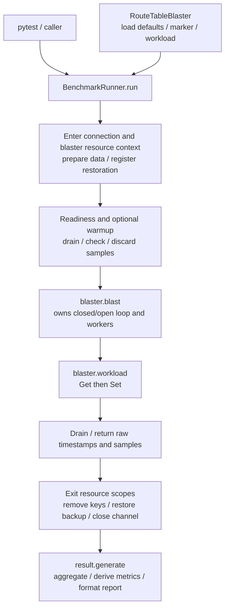
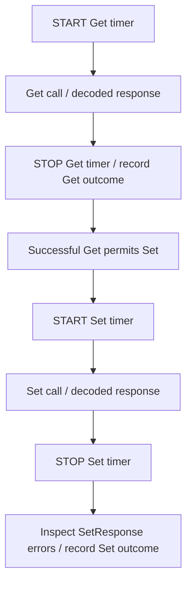
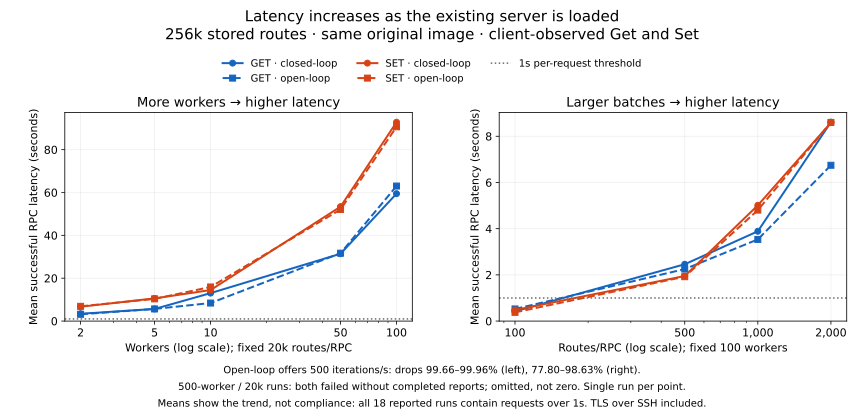

# gNMI benchmark

## Three main components

1. [BenchmarkRunner](../../tests/gnmi_benchmark/benchmark_runner.py) manages the
   connection, resource scopes, phase lifecycle and measurement handoff.
2. [Blaster](../../tests/gnmi_benchmark/blaster.py) owns default load parameters,
   open/closed-loop scheduling, thread pools, RPC execution, scenario identity and
   `workload(session, prepared)`. RouteTableBlaster is the
   VNET Get→Set scenario. It contains no device deletion/backup commands.
3. [BenchmarkReport](../../tests/gnmi_benchmark/benchmark_report.py) generates the report from
   completed measurement data; another object with `generate(**data)` can replace it.

[helpers.py](../../tests/gnmi_benchmark/helpers.py) contains resource context
managers, backup/restoration and request construction. Pytest calls the runner;
there are no separate public scheduler, client, environment or workload layers.

## Blaster contract

The abstract `Blaster` holds concurrency, count/duration, warmup, per-RPC timeout,
traffic pattern, rate and marker. Subclasses provide `name` and implement one
iteration in `workload(session, prepared)`. `resources(host, stub)` returns a context
manager; its default supplies no extra resources. Runner enters/exits it, including
on errors. Resource-specific commands live in helpers rather than business actions.

`Blaster.blast(stub, prepared, duration=None)` runs one complete phase. Its base
implementation selects the open/closed-loop policy and owns worker startup, RPC
execution, admission accounting and drain. It returns a raw phase dictionary:
per-worker statuses/latencies/timestamps plus observed admission counters and clock
boundaries. It does not format measurement/execution report sections or calculate
rates. No private phase object escapes to Runner. Warmup supplies
an explicit duration; measurement uses the blaster's configured count/duration.
The two phases have independent pools/counters and the same channel/requests.
Runner retains readiness, warmup validation, boundary snapshots and cleanup.

Scheduling uses a small inheritance hierarchy inside the same `blaster.py`:
abstract `LoadLoop` provides `run()` (pool ownership and drain), `_start()` (clock)
and `invoke()` (in-flight accounting and sample completion). `ClosedLoop` and
`OpenLoop` override only `_schedule()`: worker refill versus uniform arrival slots.
This keeps shared lifecycle/error cleanup in one place without adding files or
putting open/closed branches in the business workload.

`RouteTableBlaster` separates stored inventory (`route_distribution`) from request
batch size (`routes_per_request`). It reads explicit keys in one Get, then issues
one native Set for the same batch with validation bypass requested.
The default inventory is 12 VNETs × 20,000 + 1 × 16,000 =
**13 VNETs / 256,000 total routes**. This is a test profile, not a measured customer
distribution. A 1,000-iteration successful run performs 1,000 Gets and 1,000 Sets,
in addition to the excluded preload Sets. The same keys/values are rewritten;
iterations do not add new routes. Only largest-size VNETs are measured: 240,000
routes across 12 VNETs; the remaining 16,000 are background inventory. Request size
must divide the largest VNET size exactly. Requests cycle through those VNETs,
then advance to the next disjoint batch within each VNET. Consequently every batch
size accesses the same eligible key set while total inventory and VNET structure
remain fixed. Concurrency is global across selected VNETs.
Short duration/count or dropped slots can leave some VNETs unvisited in measurement.
Get failure skips Set and fails the iteration. This is not a read-modify-write
transaction or value comparison. Get→Set is fixed in its `workload()`; there is
no method/mode parameter or Set-only branch. Another scenario would define its own
logical request in its own workload implementation.

Prepared requests are built before load and shared read-only. The session provides
Get/Set calls and the scheduled iteration `index` for variant selection. RPC errors
and nonzero SetResponse/UpdateResult errors terminate the iteration. Unexpected
Python errors fail execution and still drain workers and clean up resources.
Each iteration must issue at least one RPC. Do not catch the internal RPC failure
signal in a workload.

Marker is a label, not a code selector. It defaults to the blaster name and is
published in start/warmup logs and reports. Request contents/metadata values are
not published. A marker is not a complete payload fingerprint.

## Environment and resource management

Runner enters a shared TLS channel, then the blaster's resource context. Workers
finish before those scopes exit. Resource restoration completes before report
generation. No report is presented as a completed run if cleanup fails.

Generated VNET resources require single-ASIC, GCU and Loopback0 IPv4. The helper
checks existing route count plus requested total against **256,000**, backs up
persistent CONFIG_DB, registers removal/restoration and creates all VNETs with
unique VNIs sharing one test VXLAN tunnel. It preloads each VNET with one bypass Set
and builds immutable measurement request pairs for its disjoint route batches.
Preload transport or response errors prevent measurement. Preload RPCs are not
warmup or measured RPCs. The full-capacity default requires zero existing routes.
On exit it removes only this run's unique route/VNET namespace and tunnel and restores the backup. ExitStack
attempts restoration even if key removal fails. Partial preparation failure also
runs registered rollback, including after partial preload. No arbitrary payload
file or Regular/bypass selector remains in this workload.

Get requests contain one native path per compound `VNET|prefix` key belonging to
the selected batch, with origin `sonic-db`, request type ALL and JSON_IETF encoding.
SONiC's Get handler rejects type CONFIG; explicit paths still restrict reads to CONFIG_DB. The path
shape is `/CONFIG_DB/localhost/VNET_ROUTE_TUNNEL/<VNET|prefix>`; the compound key is
one PathElem. This follows `MixedDbClient.getDbtablePath` / `Get` in the public
[native DB client](https://github.com/sonic-net/sonic-gnmi/blob/master/sonic_data_client/mixed_db_client.go).
No wildcard or pseudo per-VNET table node is assumed. A 20k-route batch uses one
Get containing 20k paths, which requires physical validation for size/performance.
The native client may consult an existing CONFIG_DB checkpoint before live Redis;
this benchmark does not claim read freshness or compare values for correctness.

These are configuration-backup operations, not a new SONiC checkpoint API. Regular
native Set may use checkpoints internally on the server. Shared `gnmi_tls` fixture
behavior is unchanged; its rollback runs after the benchmark's scopes. Do not
overlap configuration writers. Client drain does not prove timed-out server writes
are quiescent; inspect restoration before device reuse.

## Timing and success

**Individual RPC requests** are measured. Get→Set remains the business sequence,
but no combined latency is recorded or evaluated. Each timer surrounds its stub
call; the end is captured before explicit SetResponse error inspection.
The report publishes independent bodies such as `requests["get:20000"]` and
`requests["set:20000"]`, grouped by method and route count.
These include successful
calls of each method independently: a Get can succeed in an iteration whose Set
fails, while a failed Get prevents Set from being sent. RPC failures have counts
but no successful-latency sample. Zero calls produces null latency statistics.
Only request types actually executed appear. The requirement is **≤1,000 ms per
request**, not an average/P95 threshold and not the sum of a Get/Set pair. Each body
records successful requests within/exceeding the limit; transport/response failures
are counted separately. Either RPC failures, over-limit successful requests or
dropped arrivals fail the test after report emission. Per-RPC timeouts are separate
from this latency requirement. No invented duration is assigned to an unsent RPC.

RPC success requires gRPC OK and no explicit SetResponse/UpdateResult error.
Failed RPCs have no successful latency sample; zero successes produces null
statistics. No post-Set readback comparison, forwarding convergence or bypass fast-path
assertion is performed. `backend_path` remains `unverified`.

Payload construction, setup, explicit readiness, warmup, resource collection and
cleanup are outside measurement. Serialization, gRPC/HTTP2 waiting, transport,
server work and decoding are included. Handshake/reconnect inside a call remains
included. Do not subtract estimated costs or call this pure network RTT.

## Load controls

Closed loop refills a worker when its iteration completes. Slow responses reduce
arrival rate. Count mode retains fixed worker quotas, so concurrency can fall at
the tail. Duration mode stops admission at a shared deadline and drains.

Uniform open loop uses absolute slots independent of responses. At 500 iterations/s,
slots are 2 ms apart; Get→Set intends up to 1,000 RPCs/s. Queued-plus-running work
is bounded by concurrency. Capacity-full slots drop immediately; expired clock
slots are late drops, never catch-up bursts. N-count runs span N/rate seconds;
duration runs schedule slots before the deadline. Admitted work drains under
per-RPC deadlines, so a sequence can exceed one timeout in total.

Readiness precedes all warmup and open-loop admission. Warmup uses the same model,
drains and resets measurement state. Warmup error, zero success or drop prevents
measurement. Executor start time is not a wire-send timestamp; rate precision is
an observed outcome, not a real-time guarantee.

## Configuration

Use `gnmi_benchmark/test_gnmi_benchmark.py` with normal sonic-mgmt inventory/testbed
arguments. Select `--benchmark-blaster route-table` and optionally
`--benchmark-blaster-params '{"route_distribution":{"16000":1,"20000":12},"routes_per_request":20000}'`.
Defaults live on Blaster,
not in a second options class. Explicit CLI flags override JSON constructor values;
omitted flags retain subclass defaults.

| CLI option | Base default | Meaning |
|---|---|---|
| `--benchmark-concurrency` | 4 | 1–500 outstanding iterations |
| `--benchmark-logical-requests` | 1,000 for RouteTableBlaster | 1–1,000,000 iterations / open-loop slots |
| `--benchmark-duration` | 0 | Positive seconds overrides count |
| `--benchmark-warmup` | 0 | Warmup admission seconds |
| `--benchmark-timeout` | 120 | Positive seconds per RPC |
| `--benchmark-traffic` | `closed-loop` | Closed or uniform open loop |
| `--benchmark-rate` | 0 | Open-loop iterations/s, finite (0, 1,000,000] |
| `--benchmark-marker` | Blaster name | Non-secret result label |
| `--benchmark-output-dir` | `/tmp/gnmi-benchmark` | JSON destination |

`blaster.py` contains the abstract Blaster contract and one concrete scenario:

| Blaster / CLI name | Business parameters |
|---|---|
| RouteTableBlaster / `route-table` | `route_distribution={16000:1, 20000:12}`, `routes_per_request=20000`; Get→bypass Set for a batch |

Distribution maps routes per VNET (1–20,000) to a positive VNET count. JSON string
keys are normalized to integers. The weighted sum cannot exceed 256,000, and setup
includes existing DUT routes in that limit. Batch size must be a positive divisor
of the largest VNET size. Every preload/measured Set carries
the validation bypass header; this is not authentication bypass or proof of execution.
There are no PORT, generic-request or empty-Get smoke-test blasters. CLI defaults
to route-table; no choice of unrelated scenarios is required.

## Result handoff

Runner calls only `result.generate(samples, warmup, connection_ready_seconds,
resources, marker, blaster, profile)` using keyword arguments and returns its value unchanged.
Samples and optional warmup data contain plain timestamps, statuses, explicit
response-error counts, successful per-RPC latencies and scheduler counters.
BenchmarkReport owns worker aggregation, timestamp formatting, elapsed/drain
calculation, throughput, histogram construction and the measurement/execution
report fields. Result never accesses a DUT or live worker/scheduler object.
Runner checks raw warmup success/errors/drops to decide whether to proceed; report
generation does not control the lifecycle. The raw dictionaries are not mutated,
so different reports can consume the same captured phase.
Custom reports can return a different format without changing runner or blaster.
`benchmark.profile` records normalized distribution, VNET count, total routes,
platform limit, measured/background route counts, measured VNET count, batch size,
preload and selection policy, and bypass-requested status. Marker
alone is not a substitute for this profile when comparing runs.

The standard BenchmarkReport exposes `to_dict()`, `write()` and `failed`. Schema
**10** uses `requests`, containing one body per executed method/route-count pair.
Each body owns counts, statuses, per-request timing and 1,000-ms
requirement accounting. Top-level marker and benchmark.blaster
identify the test. Warmup, readiness, resource boundary snapshots and scheduling
evidence remain explicit. Offline runs without a DUT use sampling.method=none.

`scheduled = started + dropped_capacity + dropped_late`. Drops fail the test but
are not RPC errors or invented latency samples. `load.iterations` counts started
iterations; load.scheduled_iterations includes drops. Start-delay histograms describe
started iterations. The configured bound is max_inflight_iterations; observed
executing concurrency is peak_client_inflight. Histograms retain the gRFC A66
millisecond bounds; this is not native OpenTelemetry instrumentation.

Input limits are not server capacity claims. Final local checks use controlled clocks,
mocked RPCs and DUT lifecycle; physical results are documented separately below.

References: [gRPC performance](https://grpc.io/docs/guides/performance/),
[gNMI specification](https://github.com/openconfig/reference/blob/master/rpc/gnmi/gnmi-specification.md),
[gRFC A66](https://github.com/grpc/proposal/blob/master/A66-otel-stats.md).

## Observed baseline (2026-09-17–18)

**The existing server's client-observed latency increases with concurrency and
request size. Additional workers do not preserve response time under this load.**
One figure summarizes both controlled sweeps; Get and Set remain separate RPCs.

### What the results show

1. **More concurrent work → slower requests.** At 20k routes/RPC, increasing closed-loop
   workers from 2 to 100 raises mean Get latency **3.43→59.45s** and Set **6.70→92.80s**.
   Open-loop admitted requests show the same overall trend.
2. **Larger batches → fewer completed iterations.** At 100 workers, increasing batches
   from 100 to 2,000 routes raises closed-loop mean Get **0.42→8.61s** and Set
   **0.48→8.59s**. Window completions fall **110→5.2 Get→Set iterations/s**;
   multiplying by batch size gives roughly 10k–11.5k route entries/s per direction
   across both modes, consistent with a route-processing throughput limit.
3. **Lower means do not establish compliance.** All 18 reported runs contain RPCs
   exceeding the benchmark's 1s threshold, even the 100-route cases whose means
   are below it. The threshold applies to every request, not the plotted mean.

Open loop offers **500 iterations/s**, irrespective of responses, and drops work
when the client cannot admit it. Drops are **99.66–99.96%** in the worker sweep
and **77.80–98.63%** in the batch sweep. The graph includes only successful, sent
RPCs: similar open/closed latency does **not** mean open loop sustains 500/s.
This is an overload probe; the final required arrival pattern remains to be agreed.

### Conditions and evidence

| Fixed conditions | Sweep |
|---|---|
|256k stored routes: 12×20k measured + 16k background; 20k routes/RPC|Workers: 2, 5, 10, 50, 100, 500; both modes|
|Same inventory and measured VNETs; 100 workers|Routes/RPC: 100, 500, 1k, 2k; both modes|
|60s admission, no warmup, 120s timeout per RPC, one persistent TLS channel|Open: 500 Get→Set iterations/s; closed: refill after completion|

Single-ASIC Cisco-8102-C64, original SONiC `20260510.14` binary, without server
timing instrumentation. The benchmark was overlaid on public sonic-mgmt `202605`
at `72ffcc20e210411f54c7b500ef9a9f96267876ed`; the public-master fixture stack was
not physically validated. Latency includes client processing and TLS-over-SSH
transport, not just server execution. Each point is one run; the batch sweep
resumed in a later device session. These data demonstrate load sensitivity, not
a proven internal cause or a speedup between server versions.

**18/20 attempted points produced reports with zero RPC errors.** Both 20k/500-worker
runs lost management connectivity after load, preventing final sampling/cleanup
and report emission. They have no plotted values; the cause is not established.
At 20k and 50/100 workers, most or all iterations finish after the 60s admission
window, so these runs do not estimate steady-state high-concurrency throughput.

The unchanged [results CSV](gnmi-benchmark-results/results.csv) is the single source
for all 18 points: sample counts, mean/P95, within-limit percentages, errors, drops,
start delay, elapsed and drain. P95 and throughput details remain there rather than
adding more plots. Raw logs remain local; no public physical-run URL is available.

### Design references

- [k6 lifecycle](https://grafana.com/docs/k6/latest/using-k6/test-lifecycle/): separate setup,
  repeated scenario execution and teardown. Our ExitStack additionally handles partial setup failure.
- [k6 open/closed models](https://grafana.com/docs/k6/latest/using-k6/scenarios/concepts/open-vs-closed/):
  scheduling policy is independent of the business iteration. Housing both policies in Blaster is our file-layout choice.
- [k6 custom summaries](https://grafana.com/docs/k6/latest/results-output/end-of-test/custom-summary/):
  reporting transforms captured test data rather than executing workloads. We hand off raw phase data so reports own aggregation.
- [Locust tasks](https://docs.locust.io/en/stable/writing-a-locustfile.html): one ordinary Python task can execute sequential
  requests; small tests do not require many modules.
- [JMeter Transaction Controller](https://jmeter.apache.org/usermanual/component_reference.html#Transaction_Controller):
  multiple requests can form one measured unit that succeeds only if its subrequests succeed.
  Our final-RPC-return timing boundary is explicit and is not identical to every framework's full-function timing.
