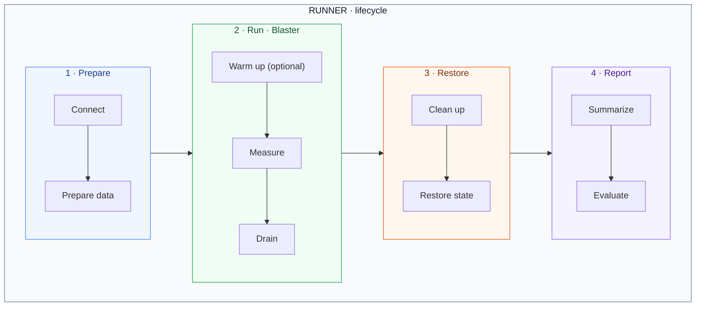
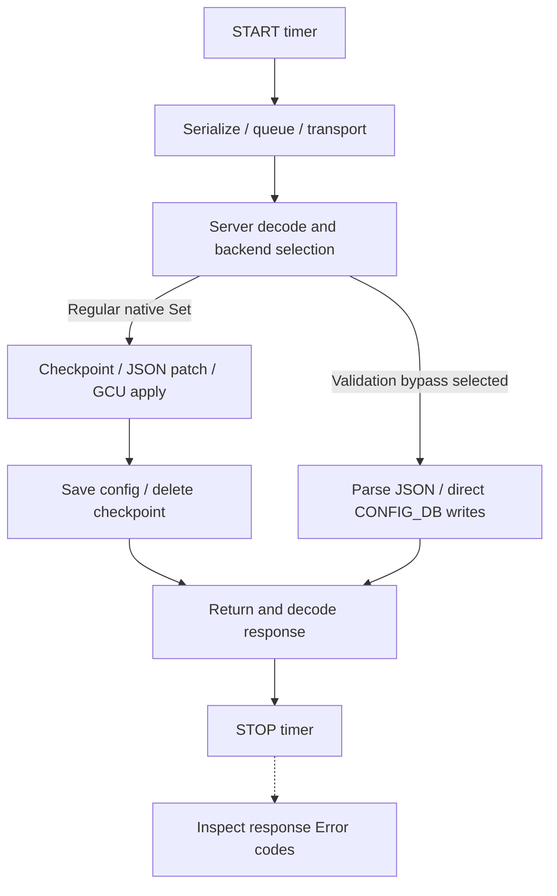

# gNMI benchmark

## Purpose

Measure how SONiC gNMI request latency and throughput change with request size
and offered load. The framework separates test lifecycle, traffic generation
and reporting so different workloads can use the same measurement approach.

A **request** is an individual RPC; an **iteration** is one execution of a
workload and may contain multiple requests. Latency is measured per request,
while scheduling controls iterations. The components below separate orchestration
([Runner](#workflow)), interpretation ([Report](#report)) and execution ([Blaster](#blaster)).

## Workflow

The Runner coordinates preparation, traffic, restoration and report generation.
It passes the collected measurements to its supplied Report after restoration.
Arrows between groups show phase order.



### Component responsibilities

| Component | Responsibility |
|---|---|
| [Runner](../../tests/gnmi_benchmark/benchmark_runner.py) | Prepare the environment, coordinate phases and restore resources. |
| [Blaster](../../tests/gnmi_benchmark/blaster.py) | Define the workload, generate traffic and collect request measurements. |
| [Report](../../tests/gnmi_benchmark/benchmark_report.py) | Summarize measurements and evaluate the result. |

`BenchmarkRunner.run(host, fixture, blaster, result)` connects to the DUT, enters
the blaster's resource scope and coordinates warmup and measurement. It collects
resource snapshots before and after measurement, releases resources, then calls
`result.generate(...)` and returns its result.

Warmup and measurement use the same workload, but warmup samples are excluded
from results. The Runner decides whether warmup succeeded before starting
measurement. The Report consumes measurements without controlling execution.
A preparation or restoration failure prevents a completed benchmark report.

---

## Measurement

Each request is timed independently, from the client call to its completion.
The diagram illustrates this boundary using native Set's two backend paths:



- **Included:** client, transport and server work performed during the call,
  including applicable auth and validation/bypass processing. This is one
  end-to-end measurement, not a breakdown of internal stages.
- **Excluded:** preparation, warmup, restoration and post-call response checks.
  Failed requests are counted separately from successful-request latency.
- **Interpretation:** read latency together with errors, drops and drain time.
  Compare runs under matching conditions; RPC success alone does not establish
  application correctness.

---

## Report

### Sample JSON

Abbreviated, **illustrative values only**; this is not a device result. The
`requests` excerpt shows only Get; a Get→Set run also has a separate Set entry.

```json
{
  "schema_version": 10,
  "marker": "example",
  "benchmark": {
    "blaster": "route-table",
    "workload_model": "closed",
    "histogram_profile": "grpc_a66_latency_ms_v1"
  },
  "load": {"iterations": 100, "concurrency": 2, "duration_seconds": 10},
  "requests": {
    "get:1000": {
      "request_type": "get",
      "entry_count": 1000,
      "counts": {"completed": 100, "successful": 100, "failed": 0},
      "measurement_elapsed_seconds": 10.5,
      "rates_per_second": {"successful": 9.5238},
      "latency_ms": {
        "samples": 100,
        "sum": 8000,
        "average": 80,
        "p50": 80,
        "p95": 80,
        "p99": 80,
        "max": 80,
        "percentile_method": "nearest_rank",
        "bucket_semantics": "lower_exclusive_upper_inclusive",
        "bucket_counts": [
          0, 0, 0, 0, 0, 0, 0, 0, 0, 0,
          0, 0, 0, 0, 0, 0, 0, 0, 0, 0,
          0, 0, 0, 100, 0, 0, 0, 0, 0, 0,
          0, 0, 0, 0, 0, 0, 0, 0, 0, 0,
          0, 0
        ]
      },
      "latency_requirement": {"limit_ms": 1000, "within_limit": 100, "exceeded": 0, "passed": true}
    }
  },
  "execution": {
    "admission_seconds": 10,
    "drain_seconds": 0.5,
    "successful_in_window": 98,
    "successful_window_rps": 9.8
  },
  "sampling": {"method": "boundary_snapshots", "measurement_window_sampled": false}
}
```

### Reading the report

| Area | Units and interpretation |
|---|---|
| `requests` | Counts are **RPCs**, latency is **ms**, rates are **RPC/s** over the full measurement interval, including drain. `get:1000` means 1,000 entries per request, not 1,000 RPCs. |
| `latency_requirement` | Threshold in **ms**; within/over-limit counts include successful requests. Latency distributions exclude failed calls. |
| `load` / `execution` | Counts are **iterations**, durations are **s**. `successful_window_rps` is **iterations/s** inside the admission window, despite its name; it is null in count mode. |
| Open-loop `execution.scheduling` | Scheduled/started/dropped **iterations**, arrival rates in **iterations/s**, start delay in **ms**. Drops are unsent work, not failed RPCs. |
| `resources` / `sampling` | CPU in **%**, memory in **MiB**. Before/after snapshots do not establish the true resource peak during load. |

Passing requires every measured request to complete within **1,000 ms**, with no
RPC/response errors or dropped arrivals; an average or P95 below the limit is not sufficient.

### Histogram buckets

`latency_ms.bucket_counts` contains **42 non-cumulative counts**, using the 41
upper bounds in the fixed `grpc_a66_latency_ms_v1` profile. Bounds are in **ms**;
each count is the number of successful RPCs in that interval.

| Bucket (zero-based) | Interval | Example count |
|---|---|---|
| `0` | Exactly 0 ms | 0 |
| `1` through `40` | `(previous bound, current bound]` | All zero except bucket `23` |
| `23` | `(65, 80]` ms | 100 |
| `41` | Greater than 100,000 ms | 0 |

The example deliberately assigns all 100 successful requests a latency of 80 ms:
bucket `23` contains 100 and the counts sum to `samples`. To plot the histogram,
use latency intervals on the horizontal axis and counts (or `count / samples × 100`
percent) on the vertical axis. The report supplies these data, not a rendered chart.
Percentiles are computed from original samples, not estimated from buckets.

Run identity, transport details and workload profile are omitted from the
excerpt. Compare rates only with the same unit and time window.

The [report template](../../tests/gnmi_benchmark/templates/report.json.j2) and
[latency template](../../tests/gnmi_benchmark/templates/latency.json.j2) describe
the schema; the [bucket bounds](../../tests/gnmi_benchmark/templates/grpc_a66_latency_ms_bounds.json.j2)
define every histogram interval.

---

## Blaster

### Load modes

| Load model | Behavior | Question it answers |
|---|---|---|
| Closed loop | Each worker starts another iteration after its previous one finishes. | How does performance change with concurrency? |
| Open loop | Iterations are offered at a fixed rate, with bounded outstanding work. Unadmitted arrivals are dropped. | How much offered load can the system sustain? |

### Parameters

| Control | Meaning |
|---|---|
| Warmup | Optional duration before measurement; uses the same workload but discards its latency samples. |
| Load mode and rate | Closed or open loop; open-loop rate is in **iterations/s**, not RPC/s. |
| Concurrency | Bound on outstanding workload iterations and the size of the worker pool. |
| Duration or count | Stop admitting work after a time window or an iteration count; in open loop the count represents offered arrival slots. |
| Request timeout | Deadline for each RPC, independent of the latency pass criterion. |

### Threads and sessions

| Area | Behavior |
|---|---|
| Workers | Bounded pool per phase; warmup drains before measurement, and measurement drains before restoration. |
| Connection | One persistent gRPC channel shared by workers and reused across phases. |
| Session | Per-iteration request timing and outcome tracking; no new connection per iteration. |
| Failures | A failed request ends the iteration; earlier successful requests retain their samples. |

### Workloads

| Blaster | One iteration | Main parameters | Prerequisites |
|---|---|---|---|
| [RouteTableBlaster](../../tests/gnmi_benchmark/blaster.py) (`route-table`) | Read explicit CONFIG_DB route keys, then rewrite the batch with prepared values and validation bypass requested. | Route distribution and routes per request; default inventory: 256k routes across 13 VNETs. | Single-ASIC DUT, TLS, GCU, Loopback0 IPv4 and exclusive configuration access. |

For CLI examples and extension details, see the
[benchmark README](../../tests/gnmi_benchmark/README.md).

## References

- [gRPC benchmarking](https://grpc.io/docs/guides/benchmarking/): a compact overview
  organized around test design, scenarios and infrastructure.
- [k6 test lifecycle](https://grafana.com/docs/k6/latest/using-k6/test-lifecycle/):
  separate preparation, repeated workload and teardown.
- [k6 open and closed models](https://grafana.com/docs/k6/latest/using-k6/scenarios/concepts/open-vs-closed/):
  distinguish fixed concurrency from independent arrival rates.
- [arc42 architecture canvas](https://arc42.org/canvas/): communicate goals,
  structure and key constraints as a concise design overview.
