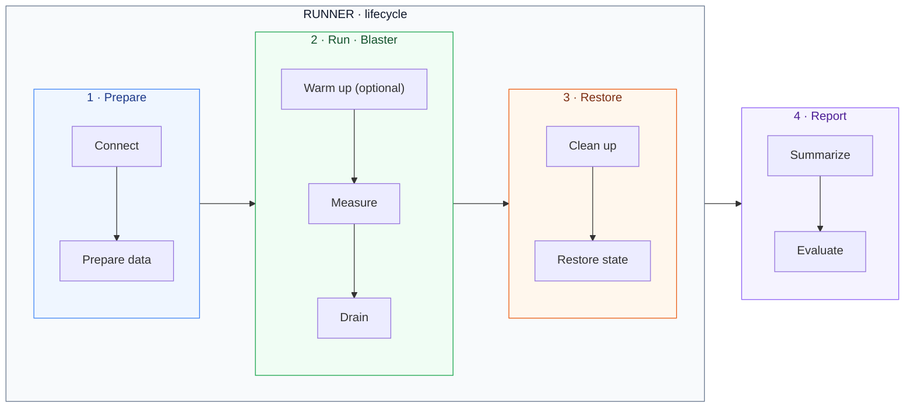
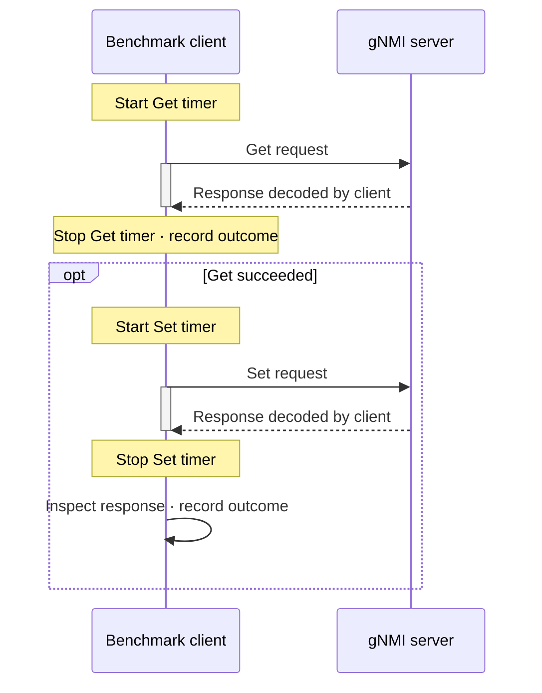

# gNMI benchmark

## Purpose

Measure how SONiC gNMI request latency and throughput change with request size
and offered load. The framework separates test lifecycle, traffic generation
and reporting so different workloads can use the same measurement approach.

A **request** is an individual RPC; an **iteration** is one execution of a
workload and may contain multiple requests. Latency is measured per request,
while scheduling controls iterations. The components below separate orchestration
([Runner](#workflow)), interpretation ([Report](#report)) and execution ([Blaster](#blaster)).

## Workflow

The Runner coordinates three phases; the Report consumes their measurements
after restoration. Arrows between groups show phase order.



### Component responsibilities

| Component | Responsibility |
|---|---|
| [Runner](../../tests/gnmi_benchmark/benchmark_runner.py) | Prepare the environment, coordinate phases and restore resources. |
| [Blaster](../../tests/gnmi_benchmark/blaster.py) | Define the workload, generate traffic and collect request measurements. |
| [Report](../../tests/gnmi_benchmark/benchmark_report.py) | Summarize measurements and evaluate the result. |

`BenchmarkRunner.run(host, fixture, blaster, result)` connects to the DUT, enters
the blaster's resource scope and coordinates warmup and measurement. It collects
resource snapshots before and after measurement, releases resources, then calls
`result.generate(...)` and returns its result.

Warmup and measurement use the same workload, but warmup samples are excluded
from results. The Runner decides whether warmup succeeded before starting
measurement. The Report consumes measurements without controlling execution.
A preparation or restoration failure prevents a completed benchmark report.

---

## Measurement

Each request is timed independently around its client call. An iteration with
multiple requests produces separate latency samples, not a combined latency.
The current two-request workload illustrates the timing boundaries:



Latency includes serialization, transport, server work and response decoding.
Preparation, warmup and restoration are outside the timer. Failed calls are
counted as errors rather than included in successful-request latency statistics.

Interpret results with these boundaries:

- Read open-loop latency together with its drop rate. Fast admitted requests do
  not show that the full offered rate was sustained.
- Keep admission-window throughput separate from full-run averages that include
  drain. Long-drain runs do not establish steady-state capacity.
- RPC success establishes response-level success, not application correctness
  or completion of downstream effects.
- Compare versions using the same data, load, transport and repeated runs.
  One run demonstrates observed behavior, not an internal cause or reliable speedup.

---

## Report

`BenchmarkReport` converts raw measurements into a JSON report. It does not issue
requests or manage the DUT. A different report implementation can consume the
same measurements without changing the workload or Runner.

The current pass criterion is **every measured request ≤1,000 ms**, with no
RPC/response errors or dropped arrivals. The pytest entry point writes the report
before applying the verdict. A mean or P95 below 1,000 ms does not establish a pass.

### Sample JSON

Abbreviated, **illustrative values only**; this is not a device result. The
`requests` excerpt shows only Get; a Get→Set run also has a separate Set entry.

```json
{
  "schema_version": 10,
  "marker": "example",
  "benchmark": {"blaster": "route-table", "workload_model": "closed"},
  "load": {"iterations": 100, "concurrency": 2, "duration_seconds": 10},
  "requests": {
    "get:1000": {
      "request_type": "get",
      "entry_count": 1000,
      "counts": {"completed": 100, "successful": 100, "failed": 0},
      "measurement_elapsed_seconds": 10.5,
      "rates_per_second": {"successful": 9.5238},
      "latency_ms": {"samples": 100, "average": 80, "p95": 120, "max": 150},
      "latency_requirement": {"limit_ms": 1000, "within_limit": 100, "exceeded": 0, "passed": true}
    }
  },
  "execution": {
    "admission_seconds": 10,
    "drain_seconds": 0.5,
    "successful_in_window": 98,
    "successful_window_rps": 9.8
  },
  "sampling": {"method": "boundary_snapshots", "measurement_window_sampled": false}
}
```

### Reading the report

| Area | Units and interpretation |
|---|---|
| `requests` | Counts are **RPCs**, latency is **ms**, rates are **RPC/s** over the full measurement interval, including drain. `get:1000` means 1,000 entries per request, not 1,000 RPCs. |
| `latency_requirement` | Threshold in **ms**; within/over-limit counts include successful requests. Latency distributions exclude failed calls. |
| `load` / `execution` | Counts are **iterations**, durations are **s**. `successful_window_rps` is **iterations/s** inside the admission window, despite its name; it is null in count mode. |
| Open-loop `execution.scheduling` | Scheduled/started/dropped **iterations**, arrival rates in **iterations/s**, start delay in **ms**. Drops are unsent work, not failed RPCs. |
| `resources` / `sampling` | CPU in **%**, memory in **MiB**. Before/after snapshots do not establish the true resource peak during load. |

Run identity, transport details, workload profile and histogram buckets are
omitted from the excerpt. Compare rates only with the same unit and time window.

The [report template](../../tests/gnmi_benchmark/templates/report.json.j2) and
[latency template](../../tests/gnmi_benchmark/templates/latency.json.j2) contain
the complete schema and histogram definitions.

---

## Blaster

The abstract `Blaster` defines one workload iteration and supplies reusable load
generation. It supports closed/open loop, count/duration runs, optional warmup,
per-RPC timeouts and a label for identifying the run. Subclasses define the
request sequence and any preparation, rather than implementing scheduling again.

### Load modes

| Load model | Behavior | Question it answers |
|---|---|---|
| Closed loop | Each worker starts another iteration after its previous one finishes. | How does performance change with concurrency? |
| Open loop | Iterations are offered at a fixed rate, with bounded outstanding work. Unadmitted arrivals are dropped. | How much offered load can the system sustain? |

### Parameters

| Control | Meaning |
|---|---|
| Warmup | Optional duration before measurement; uses the same workload but discards its latency samples. |
| Load mode and rate | Closed or open loop; open-loop rate is in **iterations/s**, not RPC/s. |
| Concurrency | Bound on outstanding workload iterations and the size of the worker pool. |
| Duration or count | Stop admitting work after a time window or an iteration count; in open loop the count represents offered arrival slots. |
| Request timeout | Deadline for each RPC, independent of the latency pass criterion. |

### Threads and sessions

Each phase uses a bounded thread pool. Warmup drains before measurement begins,
and measured work drains before resource restoration. Open loop drops arrivals
it cannot admit instead of building an unbounded queue or sending catch-up bursts.

Workers share one persistent gRPC channel and prepared requests. Each iteration
gets its own lightweight session for request timing and outcome tracking; it does
not open a new connection. The current session supports Get and Set. A failed
request ends that iteration, while successful requests retain their own samples.
Warmup and measurement use separate pools and samples but reuse the connection.

### Included implementation: RouteTableBlaster

This PR provides [RouteTableBlaster](../../tests/gnmi_benchmark/blaster.py), a
bulk configuration workload. Each iteration performs **Get → Set** for existing
VNET routes in CONFIG_DB: one Get reads explicit keys, and one table-level Set
rewrites that batch with validation bypass requested. Set uses prepared values,
not the Get response; a failed Get skips Set. Other workloads can supply a
different request sequence while reusing the framework.

The default inventory contains **256,000 routes across 13 VNETs**: 12 × 20,000
measured routes plus 16,000 background routes. Requests cycle through disjoint
batches across measured VNETs. Batch size divides the measured VNET size so every
request carries the same number of routes. Varying batch size preserves inventory
and eligible keys, separating request-size effects from database-size effects.
Short runs may not visit every batch.

The scenario requires a single-ASIC DUT with TLS, GCU and Loopback0 IPv4 support.
Preparation checks route capacity, backs up configuration and preloads routes;
restoration removes test resources and restores the backup. Runs need exclusive
configuration access. Client drain does not prove timed-out server writes have
stopped, so restoration must be checked before device reuse.

Get and Set have separate latency distributions. A successful iteration contains
two RPCs; its batch size converts iteration throughput to route entries/s per
direction. The benchmark does not check readback or forwarding convergence, or
assert that bypass was used. Get may read a CONFIG_DB checkpoint.

For CLI examples and extension details, see the
[benchmark README](../../tests/gnmi_benchmark/README.md).

## References

- [gRPC benchmarking](https://grpc.io/docs/guides/benchmarking/): a compact overview
  organized around test design, scenarios and infrastructure.
- [k6 test lifecycle](https://grafana.com/docs/k6/latest/using-k6/test-lifecycle/):
  separate preparation, repeated workload and teardown.
- [k6 open and closed models](https://grafana.com/docs/k6/latest/using-k6/scenarios/concepts/open-vs-closed/):
  distinguish fixed concurrency from independent arrival rates.
- [arc42 architecture canvas](https://arc42.org/canvas/): communicate goals,
  structure and key constraints as a concise design overview.
