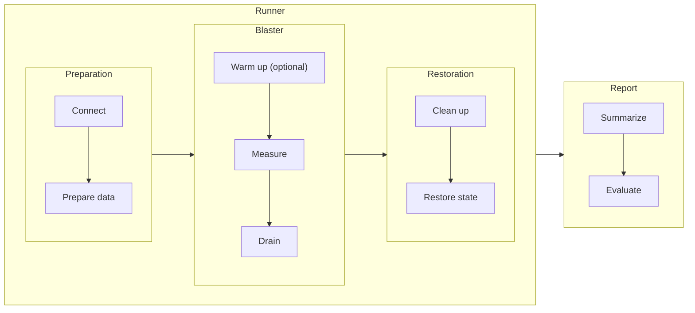
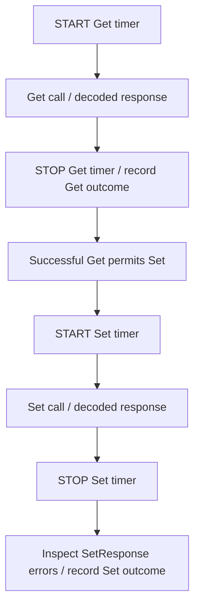
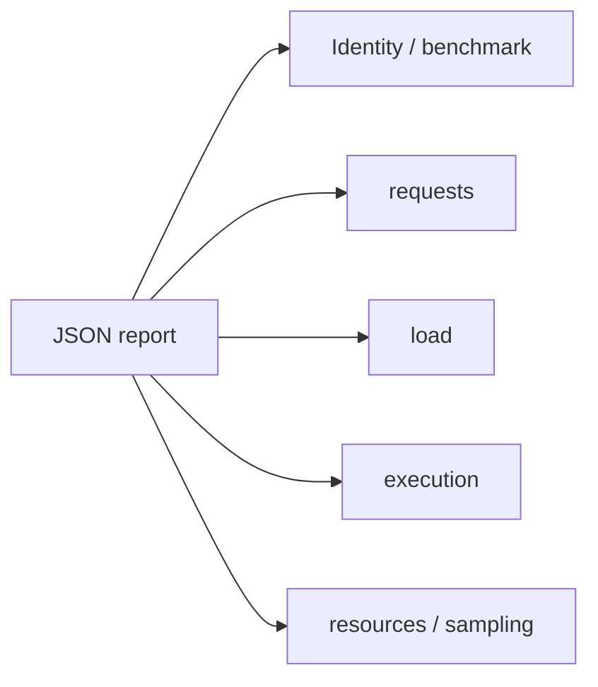

# gNMI benchmark

## Purpose

Measure how SONiC gNMI request latency and throughput change with request size
and offered load. The framework separates test lifecycle, traffic generation
and reporting so different workloads can use the same measurement approach.

A **request** is an individual RPC; an **iteration** is one execution of a
workload and may contain multiple requests. Latency is measured per request,
while scheduling controls iterations. The components below separate orchestration
([Runner](#runner)), interpretation ([Report](#report)) and execution ([Blaster](#blaster)).

## Workflow

The Runner coordinates three phases; the Report consumes their measurements
after restoration. Arrows between groups show phase order.

| Component | Owns | Interface |
|---|---|---|
| [BenchmarkRunner](../../tests/gnmi_benchmark/benchmark_runner.py) | Connection, resource lifecycle and phase coordination | `run(host, fixture, blaster, result)` |
| [BenchmarkReport](../../tests/gnmi_benchmark/benchmark_report.py) | Statistics, pass/fail evaluation and JSON output | `generate(...)`, `to_dict()`, `write(...)` |
| [Blaster](../../tests/gnmi_benchmark/blaster.py) | Workload, load generation and request measurements | `workload(...)`, `blast(...)`, `resources(...)`, `profile()` |

## Runner

`BenchmarkRunner.run(host, fixture, blaster, result)` connects to the DUT, enters
the blaster's resource scope and coordinates warmup and measurement. It collects
resource snapshots before and after measurement, releases resources, then calls
`result.generate(...)` and returns its result.

Warmup and measurement use the same workload, but warmup samples are excluded
from results. The Runner decides whether warmup succeeded before starting
measurement. The Report consumes measurements without controlling execution.
A preparation or restoration failure prevents a completed benchmark report.

## Measurement and interpretation

Each request is timed independently around its client call. An iteration with
multiple requests produces separate latency samples, not a combined latency.
The current two-request workload illustrates the timing boundaries:

Latency includes serialization, transport, server work and response decoding.
Preparation, warmup and restoration are outside the timer. Failed calls are
counted as errors rather than included in successful-request latency statistics.

Interpret results with these boundaries:

- Read open-loop latency together with its drop rate. Fast admitted requests do
  not show that the full offered rate was sustained.
- Keep admission-window throughput separate from full-run averages that include
  drain. Long-drain runs do not establish steady-state capacity.
- RPC success establishes response-level success, not application correctness
  or completion of downstream effects.
- Compare versions using the same data, load, transport and repeated runs.
  One run demonstrates observed behavior, not an internal cause or reliable speedup.

## Report

`BenchmarkReport` converts raw measurements into a JSON report. It does not issue
requests or manage the DUT. A different report implementation can consume the
same measurements without changing the workload or Runner.

### API

| API | Purpose |
|---|---|
| `generate(...)` | Accept measured/warmup samples, connection readiness, resource snapshots and workload identity/profile; compute results and return the report object. |
| `to_dict()` | Return the structured report after generation. |
| `write(output_dir)` | Write the JSON report and return its file path. |
| `counts` / `failed` | Expose aggregate RPC outcomes and the overall failure verdict. |

The current pass criterion is **every measured request ≤1,000 ms**, with no
RPC/response errors or dropped arrivals. The pytest entry point writes the report
before applying the verdict. A mean or P95 below 1,000 ms does not establish a pass.

### Report structure

The report separates request performance from workload execution:

For example,
`requests["get:1000"]` describes one request type carrying 1,000 entries; the key
does not mean that 1,000 RPCs ran. These are schema examples, not experiment results.

| Section | Contents |
|---|---|
| Identity and `benchmark` | Run ID, timestamps, device/transport context and workload profile. |
| `requests` | Independent counts, rates, latency distributions and threshold results for each request type/size. |
| `load` | Workload iterations, concurrency and configured duration/warmup. |
| `execution` | Admission, drain, warmup and open-loop scheduling outcomes. |
| `resources` / `sampling` | CPU/memory summaries and where snapshots were taken. |

### Request metrics and units

Paths below are relative to one entry in `requests`.

| Field | Unit | Meaning |
|---|---|---|
| `counts.completed`, `.successful`, `.failed` | RPCs | Observed request outcomes; unsent work is not an RPC failure. |
| `latency_ms.average`, `.p50`, `.p95`, `.p99`, `.max` | ms | Successful-request latency; no successful samples produces null statistics. |
| `latency_ms.samples`, `.bucket_counts` | RPCs | Sample count and non-cumulative histogram counts; bucket bounds are in ms. |
| `latency_requirement` | ms and RPC counts | `limit_ms` is the threshold; `within_limit` and `exceeded` count successful requests on either side. |
| `measurement_elapsed_seconds`, `rates_per_second` | s; RPC/s | Full measurement time including drain; each rate is its corresponding request count divided by this time. |

Percentiles use the original samples rather than histogram buckets. `latency_ms.sum`
is accumulated request time in ms, not elapsed wall time under concurrency.

### Execution and resource units

| Field | Unit | Meaning |
|---|---|---|
| `load.iterations`, `execution.successful_in_window` | Iterations | Started workload executions, and successful executions completed inside a duration run's admission window. |
| `execution.admission_seconds`, `.drain_seconds` | s | New-work admission window, and time spent finishing admitted work afterward. |
| `execution.successful_window_rps` | Iterations/s | Successful window completions divided by admission duration; despite its name, this is not RPC/s. It is null in count mode. |
| `execution.scheduling` | Iterations, iterations/s, ms | Open-loop scheduled/started/dropped counts, target/actual start rates and start-delay distribution. |
| `resources.*_cpu_percent`, `resources.*_memory_mib` | %; MiB | CPU and memory at the sampling boundaries, not continuous in-run measurements. |

Open-loop counts reconcile as `scheduled = started + dropped_capacity + dropped_late`.
Resource `max`/`peak_used` values are maxima of the collected snapshots, not proof
of the true peak during load. Compare rates only with the same unit and time
window; workload-specific entries/s must be derived from completed work.

The [report template](../../tests/gnmi_benchmark/templates/report.json.j2) and
[latency template](../../tests/gnmi_benchmark/templates/latency.json.j2) contain
the complete schema and histogram definitions.

## Blaster

The abstract `Blaster` defines one workload iteration and supplies reusable load
generation. It supports closed/open loop, count/duration runs, optional warmup,
per-RPC timeouts and a label for identifying the run. Subclasses define the
request sequence and any preparation, rather than implementing scheduling again.

### API

| API | Subclass responsibility |
|---|---|
| `name` | Provide a workload identifier. |
| `workload(session, prepared)` | Implement one iteration; issue at least one timed request through the session. |
| `resources(host, stub)` | Optionally provide a context manager that prepares data/requests and restores resources; the Runner owns its lifetime. |
| `profile()` | Optionally describe workload parameters for reproducibility. |
| `blast(stub, prepared, duration=None)` | Inherit phase execution: schedule iterations, drain them and return raw measurements to the Runner. |

The current session provides `get(...)` and `set(...)` calls with per-RPC timing
and failure handling, plus an iteration index for selecting prepared requests.
New combinations of these calls can reuse it; another RPC method would require
adding corresponding session support.

### Load models and controls

| Load model | Behavior | Question it answers |
|---|---|---|
| Closed loop | Each worker starts another iteration after its previous one finishes. | How does performance change with concurrency? |
| Open loop | Iterations are offered at a fixed rate, with bounded outstanding work. Unadmitted arrivals are dropped. | How much offered load can the system sustain? |

`concurrency` controls outstanding iterations. `logical_requests` sets the
iteration count (arrival slots in open loop); a positive `duration_seconds`
instead sets an admission window. `warmup_seconds` selects an excluded warmup
phase, `timeout_seconds` applies to each RPC, and open-loop `rate` is in
**iterations/s**, not RPC/s.

Warmup and measurement have separate samples while sharing the connection and
prepared requests. Open loop drops arrivals it cannot admit instead of building
an unbounded queue or sending catch-up bursts. `blast` returns raw measurements;
the Report derives statistics and output fields.

### Included implementation: RouteTableBlaster

This PR provides [RouteTableBlaster](../../tests/gnmi_benchmark/blaster.py), a
bulk configuration workload. Each iteration performs **Get → Set** for existing
VNET routes in CONFIG_DB: one Get reads explicit keys, and one table-level Set
rewrites that batch with validation bypass requested. Set uses prepared values,
not the Get response; a failed Get skips Set. Other workloads can supply a
different request sequence while reusing the framework.

The default inventory contains **256,000 routes across 13 VNETs**: 12 × 20,000
measured routes plus 16,000 background routes. Requests cycle through disjoint
batches across measured VNETs. Batch size divides the measured VNET size so every
request carries the same number of routes. Varying batch size preserves inventory
and eligible keys, separating request-size effects from database-size effects.
Short runs may not visit every batch.

The scenario requires a single-ASIC DUT with TLS, GCU and Loopback0 IPv4 support.
Preparation checks route capacity, backs up configuration and preloads routes;
restoration removes test resources and restores the backup. Runs need exclusive
configuration access. Client drain does not prove timed-out server writes have
stopped, so restoration must be checked before device reuse.

Get and Set have separate latency distributions. A successful iteration contains
two RPCs; its batch size converts iteration throughput to route entries/s per
direction. The benchmark does not check readback or forwarding convergence, or
assert that bypass was used. Get may read a CONFIG_DB checkpoint.

For CLI examples and extension details, see the
[benchmark README](../../tests/gnmi_benchmark/README.md).

## References

- [gRPC benchmarking](https://grpc.io/docs/guides/benchmarking/): a compact overview
  organized around test design, scenarios and infrastructure.
- [k6 test lifecycle](https://grafana.com/docs/k6/latest/using-k6/test-lifecycle/):
  separate preparation, repeated workload and teardown.
- [k6 open and closed models](https://grafana.com/docs/k6/latest/using-k6/scenarios/concepts/open-vs-closed/):
  distinguish fixed concurrency from independent arrival rates.
- [arc42 architecture canvas](https://arc42.org/canvas/): communicate goals,
  structure and key constraints as a concise design overview.
