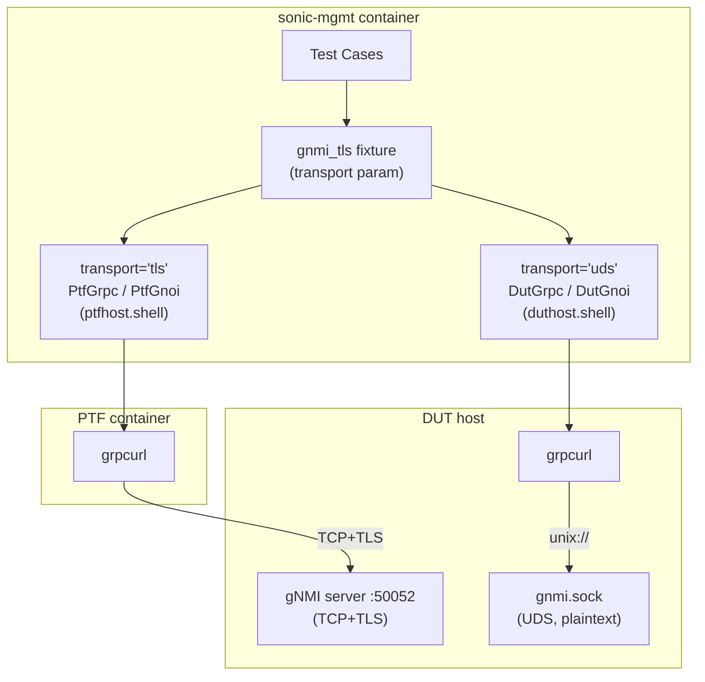

# gNMI UDS Transport Support for Test Fixtures

## Purpose

Add Unix Domain Socket (UDS) transport support to the `gnmi_tls` test fixture, enabling
gNMI/gNOI tests to run locally on the DUT via grpcurl over `/var/run/gnmi/gnmi.sock`
instead of requiring TCP+TLS from the PTF container.

## High Level Design

| Rev   | Date       | Author      | Change Description |
|-------|------------|-------------|--------------------|
| Draft | 2026-04-13 | Dawei Huang | Initial version    |

## Motivation

The existing `gnmi_tls` fixture requires:
- TLS certificate generation and distribution (DUT + PTF)
- CONFIG_DB reconfiguration for TLS mode
- gNMI server restart
- Network connectivity from PTF to DUT management IP

UDS transport eliminates all of this overhead. The gNMI server already listens on
`/var/run/gnmi/gnmi.sock` without TLS, relying on filesystem permissions (0660) for
access control. A DUT-local client connecting over UDS exercises the same gRPC services
without the TLS setup cost.

This enables:
- Faster test execution (no cert generation, no server restart)
- Testing gNMI/gNOI services independently of TLS infrastructure
- Dual-transport testing: same test runs over both TCP+TLS and UDS

## Architecture



## Components

### 1. grpcurl Installation Fixture

**File**: `tests/common/fixtures/grpc_fixtures.py` (or a new helper module)

A session-scoped fixture that ensures grpcurl is available on the DUT host.

**Behavior**:
1. Check if grpcurl exists: `duthost.shell("which grpcurl")`
2. If present, return early (idempotent)
3. Detect DUT architecture: `duthost.shell("dpkg --print-architecture")` → amd64, arm64, armhf
4. Download the matching grpcurl static binary from GitHub releases to the sonic-mgmt
   container (which has internet access)
5. Copy to DUT via `duthost.copy()` → `/usr/local/bin/grpcurl`
6. Verify: `duthost.shell("grpcurl --version")`

**Architecture mapping** (grpcurl release naming, e.g. v1.9.1):
- `amd64` → `grpcurl_1.9.1_linux_amd64.tar.gz`
- `arm64` → `grpcurl_1.9.1_linux_arm64.tar.gz`
- `armhf` → `grpcurl_1.9.1_linux_armv6.tar.gz`

The version is defined as a constant (e.g. `GRPCURL_VERSION = "1.9.1"`) in the
fixture module, making it easy to bump.

**Teardown**: None. grpcurl is left installed — it's idempotent and harmless.

**Error handling**: If download or copy fails, the fixture calls `pytest.skip()`
with a descriptive reason. This allows other tests in the session to proceed while
UDS-transport tests are cleanly skipped.

### 2. DutGrpc Client

**File**: `tests/common/dut_grpc.py`

A lightweight grpcurl-based gRPC client that runs on the DUT host via `duthost.shell()`.

```python
class DutGrpc:
    """DUT-local gRPC client using grpcurl over Unix domain socket."""

    def __init__(self, duthost, socket_path="/var/run/gnmi/gnmi.sock"):
        self.duthost = duthost
        self.target = f"unix:///{socket_path}"

    def call_unary(self, service, method, request=None, timeout=10):
        """Make a unary gRPC call. Returns parsed JSON dict."""

    def call_server_streaming(self, service, method, request=None, timeout=30):
        """Make a server-streaming gRPC call. Returns list of parsed JSON dicts."""

    def list_services(self):
        """List available gRPC services via reflection. Returns list of strings."""

    def describe(self, symbol):
        """Describe a gRPC service or method. Returns string description."""
```

**Key differences from PtfGrpc**:
- Always plaintext (`-plaintext` flag)
- Always UDS target (`unix:///path`)
- Uses `duthost.shell()` instead of `ptfhost.shell()`
- No TLS certificate configuration
- No SmartSwitch routing headers
- No GNMIEnvironment auto-configuration

**Command construction example**:
```
grpcurl -plaintext -format json unix:///var/run/gnmi/gnmi.sock gnoi.system.System/Time
```

**~60 lines estimated**. Intentionally thin — shares no base class with PtfGrpc for now.

### 3. DutGnoi Wrapper

**File**: `tests/common/dut_gnoi.py`

gNOI-specific wrapper around DutGrpc, mirroring PtfGnoi's interface.

```python
class DutGnoi:
    """DUT-local gNOI client wrapping DutGrpc."""

    def __init__(self, grpc_client):
        self.grpc = grpc_client

    def system_time(self):
        """Get system time. Returns dict with 'time' key (nanoseconds)."""

    def file_stat(self, path):
        """Get file stats. Returns dict with 'stats' key."""
```

Same pattern as PtfGnoi: translates gNOI-specific method names into
`call_unary("gnoi.system.System", "Time")` calls.

### 4. gnmi_tls Fixture Modification

**File**: `tests/common/fixtures/grpc_fixtures.py`

The existing `gnmi_tls` fixture gains transport selection via `request.param`.

```python
@pytest.fixture(scope="module")
def gnmi_tls(request, duthost, ptfhost):
    transport = getattr(request, 'param', 'tls')

    if transport == 'uds':
        yield from _gnmi_uds_flow(duthost)
    else:
        yield from _gnmi_tls_flow(duthost, ptfhost)
```

**UDS flow** (`_gnmi_uds_flow`):
1. Install grpcurl on DUT if needed (calls the installation helper inline —
   not a separate fixture, to avoid complicating fixture dependency chains)
2. Validate UDS socket exists: `duthost.shell("test -S /var/run/gnmi/gnmi.sock")`
3. Create `DutGrpc` → `DutGnoi`
4. Yield `GnmiFixture(host='localhost', port=0, tls=False, cert_paths=None,
   grpc=dut_grpc, gnoi=dut_gnoi, gnmic=None)`
5. No teardown needed (no CONFIG_DB changes, no certs)

**TLS flow** (`_gnmi_tls_flow`): Existing behavior, unchanged.

### 5. GnmiFixture Dataclass Update

```python
@dataclass
class GnmiFixture:
    host: str
    port: int
    tls: bool
    cert_paths: Optional[CertPaths]
    grpc: Union[PtfGrpc, DutGrpc]    # was: PtfGrpc
    gnoi: Union[PtfGnoi, DutGnoi]    # was: PtfGnoi
    gnmic: Optional[PtfGnmic]        # None for UDS transport
    transport: str = 'tls'           # new field: 'tls' or 'uds'
```

The `transport` field lets tests that need transport-specific behavior branch on it.
The `gnmic` field is `None` for UDS since gnmic isn't installed on the DUT.

### 6. Test Opt-In Pattern

Tests opt into dual-transport testing via indirect parametrize:

```python
# Runs once with TLS, once with UDS:
@pytest.mark.parametrize("gnmi_tls", ["tls", "uds"], indirect=True)
def test_system_time(gnmi_tls):
    result = gnmi_tls.gnoi.system_time()
    assert isinstance(result["time"], int)

# Runs with TLS only (backward compatible, no change needed):
def test_cert_validation(gnmi_tls):
    assert gnmi_tls.tls is True
    assert gnmi_tls.cert_paths is not None
```

Tests that use `gnmic` should either:
- Skip UDS: `if gnmi_tls.gnmic is None: pytest.skip("gnmic not available on UDS")`
- Or not parametrize with UDS

## Directory Structure

```
tests/common/
├── dut_grpc.py              # NEW: DUT-local grpcurl client
├── dut_gnoi.py              # NEW: DUT-local gNOI wrapper
├── ptf_grpc.py              # Existing: PTF grpcurl client (unchanged)
├── ptf_gnoi.py              # Existing: PTF gNOI wrapper (unchanged)
├── ptf_gnmic.py             # Existing: PTF gnmic wrapper (unchanged)
└── fixtures/
    └── grpc_fixtures.py     # Modified: transport param + grpcurl install
```

## Constraints and Edge Cases

### Multi-Architecture DUTs
The grpcurl download must match the DUT's architecture (amd64, arm64, armhf).
Architecture is detected at runtime via `dpkg --print-architecture`. The fixture
maps this to the correct grpcurl release artifact.

### No Internet on DUT
The DUT has no internet access. grpcurl is downloaded to the sonic-mgmt container
(which typically has internet) and then copied to the DUT via `duthost.copy()`.
If the sonic-mgmt container also lacks internet, the test should fail gracefully
with a message explaining the dependency.

### UDS Socket Availability
The UDS socket at `/var/run/gnmi/gnmi.sock` is created by the telemetry process
when started with `--unix_socket` (default: `/var/run/gnmi/gnmi.sock`). If the
socket doesn't exist, the fixture raises with a clear error.

### UDS Authentication
The UDS server skips all authentication (no TLS, no JWT, no PAM, no client certs).
Security relies on filesystem permissions (0660, root:root). Tests running over UDS
exercise gRPC service logic but NOT authentication paths.

### gnmic Not Available
`GnmiFixture.gnmic` is `None` for UDS transport. Tests using gnmic must handle this
(skip or don't parametrize with UDS).

### Module-Scoped Fixture with Parametrize
When a test uses `@pytest.mark.parametrize("gnmi_tls", ["tls", "uds"], indirect=True)`,
pytest creates separate module-scoped fixture instances for each transport. This means
the TLS setup/teardown cycle runs independently of the UDS path.

## Future Work

### DutGrpc / PtfGrpc Unification
Both classes wrap grpcurl with similar command construction and JSON parsing logic.
If DutGrpc grows beyond its current thin scope, extract a `GrpcurlClient` base class:

```python
class GrpcurlClient:
    """Base: grpcurl command building + JSON parsing."""
    def __init__(self, host, target, plaintext=False): ...
    def call_unary(self, service, method, request=None): ...

class PtfGrpc(GrpcurlClient):
    """PTF-specific: TLS config, SmartSwitch headers, GNMIEnvironment."""

class DutGrpc(GrpcurlClient):
    """DUT-specific: always plaintext UDS."""
```

Only worth doing if DutGrpc's feature surface grows to overlap significantly with PtfGrpc.

### gnmic on DUT
If tests need gnmic over UDS, gnmic could be installed on the DUT host alongside
grpcurl using the same download-and-copy mechanism. Not in scope for this design.

### Testbed Setup Integration
The grpcurl installation could move from a session-scoped fixture to an Ansible
role in the testbed provisioning playbooks (`add-topo`), eliminating the per-session
download. This is a follow-up optimization once the approach is validated.
