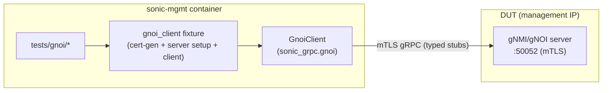

# gNOI Native-Client Test Plan — the canonical way to test gNOI in sonic-mgmt

## Purpose

This document proposes a **single, canonical way to write gNOI tests** in
[sonic-mgmt](https://github.com/sonic-net/sonic-mgmt): drive the DUT's gNOI
server with an **in-process, typed Python gRPC client** imported from a shared,
versioned wheel — no PTF hop, no shelling a CLI, no per-suite stub generation.

It doubles as the test plan for the initial `tests/gnoi/` suite that
demonstrates the approach (`System.Time`, `File.Stat`), and argues that this
suite's pattern should be the one all future gNOI tests adopt so we can stop
re-inventing the gRPC client on every new feature.

## High Level Design

| Rev   | Date       | Author      | Change Description                                   |
|-------|------------|-------------|-----------------------------------------------------|
| Draft | 2026-07-10 | Dawei Huang | Initial version — native client + canonical proposal |

## TL;DR — the recommendation

- **Test gNOI with a real gRPC client, in process, from the sonic-mgmt
  container.** Import it; don't shell it.
- **Get that client from one place** — a small, pip-installable
  `sonic-grpc` wheel (`from sonic_grpc.gnoi import GnoiClient`) that ships
  vendored, wire-faithful protobuf stubs and is baked into the
  `docker-sonic-mgmt` image.
- **Keep the harness in sonic-mgmt** — certificate generation, CONFIG_DB
  checkpoint/rollback, and server setup reuse the existing
  `tests/common/cert_utils.py` + `grpc_config.py` infrastructure.
- **Retire the ad-hoc clients over time** — grpcurl-on-PTF, the DUT-local Go
  `gnoi_client`, and per-suite generated stubs converge onto the one wheel.

Reference implementation:
[sonic-mgmt #26040](https://github.com/sonic-net/sonic-mgmt/pull/26040) (the
`tests/gnoi/` suite) on top of
[sonic-buildimage #28341](https://github.com/sonic-net/sonic-buildimage/pull/28341)
(the `sonic-grpc` wheel + image wiring); tracked by
[sonic-mgmt #26039](https://github.com/sonic-net/sonic-mgmt/issues/26039).

## Background — why gNOI testing keeps churning

gNOI/gNMI are gRPC services, but sonic-mgmt has never settled on **one** way to
call them from a test. Four distinct client mechanisms exist in the tree today,
each introduced to solve a local problem:

| # | Mechanism | Where the client runs | How a response comes back |
|---|-----------|-----------------------|---------------------------|
| 1 | `grpcurl` via `PtfGrpc`/`PtfGnoi` (`tests/common/ptf_grpc.py`, `ptf_gnoi.py`) — the current "modern" gNOI tests | PTF container | grpcurl stdout → `json.loads` → `dict` |
| 2 | `gnoi_client` Go binary via `docker exec` (`tests/gnmi/helper.py:gnoi_request`) | gNMI container **on the DUT** | stdout `"Module RPC:\n{json}"`, split on `\n`, `json.loads(line[1])` |
| 3 | `py_gnmicli.py` (gnxi) via `ptfhost.shell` (`tests/gnmi/helper.py`) — legacy gNMI | PTF container | CLI stdout text, regex/substring scraped |
| 4 | Generated protobuf stubs via `create_gnmi_stub()` (`tests/common/sai_validation/gnmi_client.py`, stubs from `tests/build-gnmi-stubs.sh`) | sonic-mgmt container | typed protobuf objects |

Every row is a different answer to the same question — "how do I make a gRPC
call to the DUT?" — with its own transport assumptions, its own error handling,
its own certificate plumbing, and its own place to break. New gNOI features tend
to add a *fifth* variant rather than reuse a fourth. That is the churn this
proposal wants to end.

Notably, mechanism #4 (sai_validation) already proves that a **native, typed
stub** works well inside the sonic-mgmt container. The gap is only that its
stubs are generated per-suite and scoped to SAI qualification. The proposal here
is to **generalize #4 into a shared, owned client** so every suite benefits.

## Problems with shelling a CLI for gRPC

The first three mechanisms above shell out to a command-line tool and parse its
text output. That is convenient to start, but structurally weak for a test
suite that is supposed to be an oracle:

1. **Stringly-typed results.** A gNOI response is a protobuf message with a
   schema. Round-tripping it through CLI stdout throws that schema away and
   forces every test to re-parse text. The DUT-local path literally does
   `output.split('\n')[1]` then `json.loads` (`helper.py:extract_gnoi_response`)
   — one stray log line on stdout and the test misreads or crashes.

2. **No real status codes.** gRPC's contract is a typed `StatusCode`
   (`UNAUTHENTICATED`, `PERMISSION_DENIED`, `NOT_FOUND`, …). Shelling a CLI
   collapses that into an exit code plus free-form stderr, so tests assert on
   substrings of error text instead of on the status code the server actually
   returned. Negative and authz tests — exactly where gNOI correctness matters —
   become brittle.

3. **An extra container in the failure surface.** The grpcurl and py_gnmicli
   paths run the client on **PTF**, so every gNOI assertion depends on PTF being
   up, reachable, and carrying the right certs — even though gNOI has nothing to
   do with data-plane packet testing. The DUT-local Go path avoids PTF but
   instead depends on a binary baked into the DUT image and on `docker exec`.

4. **Certificate/setup logic duplicated per mechanism.** Each client re-derives
   where certs live and how the server is configured. A single cert-path change
   ripples across files (the predecessor design doc,
   [`gnoi_client_library_design.md`](./gnoi_client_library_design.md),
   documents 14+ files carrying hardcoded cert paths).

5. **Nothing is shared or versioned.** There is no one artifact a new test can
   depend on. So a new gNOI need copies the nearest mechanism and diverges.

## Proposed approach — native in-process gRPC client

Drive gNOI the "API way": construct a real gRPC channel **inside the sonic-mgmt
container**, dial the DUT management IP over mTLS, and call typed stubs.

```python
from sonic_grpc.gnoi import GnoiClient, system_pb2

def test_gnoi_system_time(gnoi_client):          # gnoi_client is a fixture
    resp = gnoi_client.system.Time(system_pb2.TimeRequest(), timeout=10)
    assert resp.time > 0                          # resp.time is an int, not a parsed string
```

The client is **not** built or generated inside sonic-mgmt. It is imported from
a standalone, pip-installable **`sonic-grpc`** wheel that is baked into the
`docker-sonic-mgmt` image. The wheel:

- exposes `GnoiClient` — a context-managed, service-agnostic client
  (`client.system.Time(...)`, `client.file.Stat(...)`, and `client.channel` for
  any service not yet wrapped);
- supports three transports — insecure TCP, `unix://` UDS, and **mTLS**
  (`grpc.ssl_channel_credentials` + `grpc.ssl_target_name_override`, so a
  DNS-only server-cert SAN is dialable without hardcoding an IP);
- **vendors flat protobuf stubs** (`system_pb2`, `file_pb2`, `types_pb2`,
  `common_pb2`, and their `_grpc` peers) — so there is nothing to generate at
  test time and no `types`/`os` stdlib import collision;
- ships `FakeGnoiServer` (`sonic_grpc.gnoi.testing`) for offline unit tests;
- depends only on `grpcio` + `protobuf`, so it `pip install`s anywhere,
  including `pip install "git+https://github.com/sonic-net/sonic-buildimage@<sha>#subdirectory=src/sonic-grpc"`.

Adding a new gNOI service to a test is a stub import plus a call on
`client.channel` — no new client, no PTF change, no build script.

### Architecture



No PTF. The only hop is sonic-mgmt container → DUT management IP, over the same
mTLS the production gNOI consumers use.

### Components

1. **`sonic-grpc` wheel** (built in sonic-buildimage `src/sonic-grpc/`, wired
   into `docker-sonic-mgmt`). The client + vendored stubs + `FakeGnoiServer` +
   unit tests. Owned by this effort; versioned; the single source of the client.

2. **`gnoi_client` fixture** (`tests/gnoi/conftest.py`). A coupled,
   self-cleaning fixture modeled on the existing `gnmi_tls` fixture:
   checkpoint CONFIG_DB → generate a CA/server/client cert chain and push the
   server cert to the DUT → configure CONFIG_DB TLS mode and register the client
   CN in `GNMI_CLIENT_CERT` → restart `gnmi-native` → verify readiness with a
   native `System.Time` retry loop → **yield** an mTLS `GnoiClient` → rollback +
   `wait_critical_processes` + cert cleanup. It reuses the DUT-side setup helpers
   `_configure_gnoi_tls_server` / `_restart_gnoi_server` from
   `tests/common/fixtures/grpc_fixtures.py` — no logic is forked.

3. **Certificate management** (reused, unchanged). `tests/common/cert_utils.py`
   (`TlsCertificateGenerator` / `create_gnmi_cert_generator`) generates a
   pure-Python `cryptography` chain — backdated, SAN-bearing — and
   `tests/common/grpc_config.py` centralizes paths, ports, and CONFIG_DB cert
   settings. The client cert/key/CA stay in the container (the native client
   reads them locally); only the server cert/key + CA go to the DUT.

## Certificate model

The mTLS setup is deliberately identical to what the gNMI/gNOI server already
expects in production, so tests exercise the real authentication path:

- Server cert carries a **SAN** (Go rejects CN-only certs); the client verifies
  it against the generated CA.
- The client cert **CN is registered in `GNMI_CLIENT_CERT`** with gNOI roles
  (e.g. `gnoi_readwrite`), so the server authorizes the call — a real authz
  path, not `-insecure`.
- All state is checkpointed and rolled back; certs are generated under a temp
  dir and removed on teardown. The suite is idempotent and self-cleaning.

Because the client holds a typed `grpc.RpcError`, an authz-failure test can
assert `err.code() == grpc.StatusCode.UNAUTHENTICATED` directly — the kind of
assertion the CLI-scraping mechanisms cannot make cleanly.

## Test cases

### v1 (implemented, VS-validated)

| Test | RPC | Asserts |
|------|-----|---------|
| `test_gnoi_system_time` | `gnoi.system.System/Time` | typed `resp.time` > 0 and within ~1 day of local clock (sane clock, not sync) |
| `test_gnoi_file_stat` | `gnoi.file.File/Stat` | `resp.stats[0].path == "/etc/hostname"` and `size > 0`, reached via `client.file` / `client.channel` (proves new services plug in without client changes) |

Both are marked `@pytest.mark.topology('any')` and
`@pytest.mark.skip_check_dut_health` (the fixture mutates `GNMI` CONFIG_DB and
rolls it back; without the marker the teardown `core_dump_and_config_check`
flags the transient change as drift and forces a config reload — there is no CLI
flag to disable that check). Both pass on a KVM (virtual switch) testbed.

### Roadmap (where the typed client pays off)

These are not implemented in v1 but are the reason the approach is worth
standardizing — each is awkward or impossible to assert cleanly by scraping CLI
text:

- **Status-code / negative tests:** unregistered client cert →
  `UNAUTHENTICATED`; unauthorized role → `PERMISSION_DENIED`; missing file →
  `NOT_FOUND`. Assert on `RpcError.code()`.
- **Streaming RPCs:** `File.Get` / `File.Put`, `System.SetPackage` — real
  server-streaming iteration instead of buffering CLI stdout.
- **Broader System/File/OS surface** and, later, SONiC-specific services, all
  as thin stub additions to `sonic-grpc`.

## CI behavior — fail loud, but scope the failure

The suite must **fail, not skip**, when the client is unavailable. An earlier
draft used `pytest.importorskip`, which turned a missing client into a *skip* —
and a skipped test counts as a green pipeline, so CI could pass without ever
exercising gNOI. A test that can silently no-op is not an oracle.

But there are two distinct failure modes, and they want different blast radii:

- **A missing *feature*** (the server doesn't implement the RPC) — the test
  should fail: that is real signal.
- **A missing *infra artifact*** (the `sonic_grpc` wheel isn't in the image
  yet) — this should fail the **gNOI suite loudly**, but must **not** red
  unrelated PRs.

The second distinction matters because sonic-mgmt runs a **tree-wide
`pytest --collect-only`** check (`.azure-pipelines/pytest-collect-only.yml`)
against the *currently published* `docker-sonic-mgmt` image on every PR. A
module-scope `from sonic_grpc.gnoi import ...` executes at **collection** time,
so if the published image lags the wheel, that import raises a collection error
and reds the collect-only job for **every** sonic-mgmt PR — not just gNOI runs.
"Red not skip" is right; reding the whole tree is collateral damage.

**Canonical pattern:** put the hard dependency in the suite's fixture, not at
module scope. Import `sonic_grpc.gnoi` (and assert a minimum
`sonic_grpc.__version__`) inside the `gnoi_client` fixture / a session-scoped
conftest guard, and `pytest.fail()` with a message naming the required wheel
version and the buildimage PR. This keeps the failure **hard** and **red** when
the gNOI suite actually runs, while leaving tree-wide `--collect-only`
unaffected. (The reference suite's imports should live behind this guard for the
same reason.)

**Sequencing:**
1. Merge the `sonic-grpc` wheel + `docker-sonic-mgmt` wiring
   (sonic-buildimage) **first**; let the test image roll.
2. Then merge `tests/gnoi/` (sonic-mgmt). It must **not** merge before the image
   ships `sonic_grpc`, or the gNOI suite is red by construction.

The wheel wiring and the tests live in the same coordinated pair of PRs, with
the dependency called out explicitly, precisely so a reviewer cannot merge them
out of order by accident.

### Steady-state compatibility policy

The cross-repo coupling is not just a one-time merge ordering — it is permanent,
and there is **no cross-repo CI** to catch a wheel/tests mismatch pre-merge. So
it needs an explicit policy, not just good intentions:

- **Pin.** The suite asserts a minimum `sonic_grpc.__version__`; the wheel uses
  semver. A backward-incompatible client change is a major bump plus a
  coordinated tests update.
- **Who bumps.** `src/sonic-grpc` carries an `OWNERS`/maintainers list (see
  Governance). Proto-pin bumps and new service stubs go through those owners,
  who are also responsible for the paired sonic-mgmt update.
- **When the image lags.** The documented recovery is to install the wheel from
  source in the container —
  `pip install "git+https://github.com/sonic-net/sonic-buildimage@<sha>#subdirectory=src/sonic-grpc"`
  — so development and local validation never block on an image roll.

## Why this should be the canonical approach

| Property | grpcurl on PTF | Go `gnoi_client` on DUT | py_gnmicli on PTF | native stub (sai_validation) | **native `sonic-grpc` (proposed)** |
|----------|:---:|:---:|:---:|:---:|:---:|
| Typed responses (schema preserved) | ✗ | ✗ | ✗ | ✓ | ✓ |
| Real gRPC status codes | ✗ | ✗ | ✗ | ✓ | ✓ |
| No PTF dependency | ✗ | ✓ | ✗ | ✓ | ✓ |
| No DUT-baked client binary | ✓ | ✗ | ✓ | ✓ | ✓ |
| One shared, versioned artifact | ✗ | ✗ | ✗ | per-suite | ✓ (one wheel) |
| Reusable across repos / suites | ✗ | ✗ | ✗ | partial | ✓ |
| Exercises real mTLS authz path | partial | ✓ | partial | depends | ✓ |

The native stub approach already wins on correctness; the only thing missing was
a *shared* home for it. `sonic-grpc` supplies that home. Standardizing on it
means:

- **One client contract to learn and maintain.** New gNOI tests import a wheel
  instead of copying the nearest CLI wrapper. The churn stops because there is a
  single obvious thing to reuse.
- **Tests assert on the protocol, not on prose.** Typed messages and status
  codes make negative/authz/streaming tests tractable — the cases that matter
  most for a management API.
- **The client is owned and versioned.** Bumping the gNOI proto pin is a wheel
  version bump with unit tests (`FakeGnoiServer`), not a scavenger hunt across
  vendored stubs and shell wrappers.
- **The harness stays where it belongs.** Cert generation and CONFIG_DB
  lifecycle remain sonic-mgmt fixtures reusing existing infra; the wheel carries
  only the protocol client. Clean separation, minimal consumed surface
  (`GnoiClient`, the pb2 message types, `.channel`).

**On "why Python, when the gNOI server and consumers are Go":** sonic-mgmt is a
pytest harness — a Python client is the only in-process option, and there is no
maintained upstream Python gNOI client to adopt instead. The wheel is wire-level
gRPC/protobuf, so it stays faithful to the same `openconfig/gnoi` contract the
Go server and consumers use; language is a client-side detail, not a divergence.

## Trade-offs and objections

- **"grpcurl needs no wheel — this adds a cross-repo dependency."** True, and
  it is the main cost. We accept it because the payoff (typed, status-coded,
  shared, versioned) is exactly what a settled standard needs, and the ordering
  is managed by explicit sequencing + a scoped hard failure + a version pin (see
  CI behavior) rather than being papered over by a silent skip.
- **"Why a cross-repo wheel instead of one vendored stub package in
  `tests/common/`?"** Vendoring in sonic-mgmt would be shared *within* sonic-mgmt,
  but the real driver is **cross-repo reuse**: sonic-buildimage has its own
  in-flight gNOI Python client
  ([sonic-buildimage #27760](https://github.com/sonic-net/sonic-buildimage/pull/27760))
  that will be rerouted to consume this same `sonic-grpc` wheel. One wheel in
  buildimage is consumable by both the test harness and the on-box/tooling
  consumers; a copy vendored under `tests/common/` is not. (If the wheel ever
  stalls, vendoring the flat stubs into sonic-mgmt is the named fallback — but it
  is a fallback, not the goal.) The wheel also installs from source, so
  development never blocks on a merge.
- **"UDS/local transport is simpler for some suites."** The client already
  supports `unix://`; the DUT-local UDS ergonomics explored in
  [`gnmi-uds-transport-design.md`](./gnmi-uds-transport-design.md) compose with
  this client rather than competing with it.

## Attribution and provenance

`sonic-grpc`'s client and stubs are **not new code invented here**. They are
factored out of the in-flight gNOI Python client
([sonic-buildimage #27760](https://github.com/sonic-net/sonic-buildimage/pull/27760));
this effort packages that work as a standalone, installable distribution so both
the test harness and #27760 itself can share one implementation. Credit for the
client belongs to that original work; `sonic-grpc` is the shared home, not a
fork. Reviewers diffing the PRs will see the shared lineage — it is intentional
and disclosed.

## Governance

For a package that claims to be *canonical*, ownership must be explicit, not an
afterthought:

- `src/sonic-grpc/` carries an `OWNERS`/maintainers list, named at introduction.
- Those owners are accountable for proto-pin bumps, new service stubs, semver
  discipline, and the paired sonic-mgmt update when the client surface changes.
- New service stubs land in `sonic-grpc` (with `FakeGnoiServer`-backed unit
  tests) rather than being generated ad hoc per suite — one generated-stub source
  in the ecosystem.

## Adoption & migration roadmap

1. **Land the reference suite** (`tests/gnoi/` + `sonic-grpc`) as the canonical
   pattern. ✅ implemented, VS-validated.
2. **Grow `sonic-grpc`'s stub surface** (OS, streaming File, negative-path
   helpers) as new gNOI tests need them.
3. **Write all new gNOI tests against `GnoiClient`.** No new CLI wrappers.
4. **Migrate existing `tests/gnmi/test_gnoi_*.py`** off grpcurl/Go-`gnoi_client`
   onto the wheel, suite by suite, keeping behavior identical.
5. **Fold the sai_validation stubs** into `sonic-grpc` so there is exactly one
   generated-stub source in the tree.

No existing test is deleted or changed by v1; migration is incremental and
behavior-preserving.

## Scope / non-goals (v1)

- **In scope:** the `tests/gnoi/` suite (`System.Time`, `File.Stat`), the
  `gnoi_client` fixture, the `sonic-grpc` wheel + image wiring, and this
  canonical recommendation.
- **Out of scope (later increments):** the full gNOI surface (OS,
  factory_reset, healthz, containerz), SONiC-specific services, SmartSwitch DPU
  routing, reboot/upgrade flows, and migrating the existing
  `tests/gnmi/test_gnoi_*.py` tests.

## Open questions

- Confirm the vendored stubs stay wire-compatible with the sonic-gnmi server's
  `openconfig/gnoi` pin as it advances (low risk for Time/Stat; re-verify on
  bumps via `FakeGnoiServer`).
- Final home of the fixture harness: keep it in `tests/gnoi/` or promote the
  reusable parts to `tests/common/` once a second suite consumes the client.
- Initial `sonic-grpc` maintainer set and review cadence for proto-pin bumps
  (the Governance section names the mechanism; the specific owners are TBD at
  introduction).
