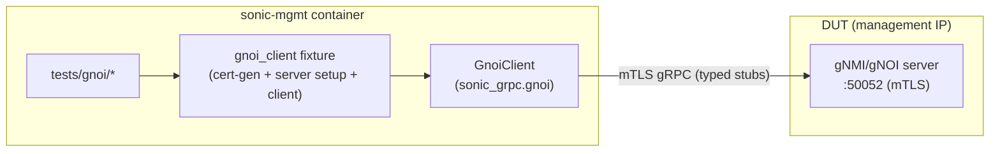

# gNOI test plan: a native gRPC client as the standard approach

## Purpose

This document describes a small new gNOI test suite (`tests/gnoi/`) and, more
importantly, proposes the pattern it uses as the standard way to write gNOI
tests in [sonic-mgmt](https://github.com/sonic-net/sonic-mgmt) from now on.

The suite talks to the DUT's gNOI server with an ordinary in-process Python
gRPC client instead of shelling out to a command-line tool and parsing its
output. The client comes from a shared, versioned wheel (`sonic-grpc`) rather
than being re-created inside each test area. The goal is to stop the recurring
pattern where every new gNOI need grows its own bespoke client, and to give the
community one obvious thing to reuse.

## High Level Design

| Rev   | Date       | Author      | Change Description                                          |
|-------|------------|-------------|------------------------------------------------------------|
| Draft | 2026-07-10 | Dawei Huang | Initial version — native client + canonical proposal       |
| v2    | 2026-07-13 | Dawei Huang | Rewrite for clarity; add a concrete before/after example   |
| v3    | 2026-07-13 | Dawei Huang | Scope to test concerns: reframe PTF as the wrong plane, drop cross-repo-reuse rationale, remove CI/PR-tracking material |

## Summary

The recommendation is:

- Test gNOI with a real gRPC client, in process, running in the sonic-mgmt
  container and dialing the DUT management IP directly — no PTF hop.
- Take that client from one place: a small, pip-installable `sonic-grpc` wheel
  (`from sonic_grpc.gnoi import GnoiClient`) that ships vendored, wire-faithful
  protobuf stubs and is baked into the `docker-sonic-mgmt` image.
- Keep the test harness in sonic-mgmt. Certificate generation, CONFIG_DB
  checkpoint/rollback, and server setup all reuse the existing
  `tests/common/cert_utils.py` and `grpc_config.py` infrastructure.
- Migrate the older ad-hoc clients onto this one over time, rather than in a
  single disruptive change.

The reference implementation is
[sonic-mgmt #26040](https://github.com/sonic-net/sonic-mgmt/pull/26040) (the
`tests/gnoi/` suite), which sits on top of
[sonic-buildimage #28341](https://github.com/sonic-net/sonic-buildimage/pull/28341)
(the `sonic-grpc` wheel and its image wiring). Both are tracked by
[sonic-mgmt #26039](https://github.com/sonic-net/sonic-mgmt/issues/26039).

## Background: how gNOI tests reach the DUT today

gNOI and gNMI are gRPC services, but sonic-mgmt has never settled on a single
way to call them from a test. Over time, four different client mechanisms have
accumulated in the tree, each added to solve a particular problem at the time:

| # | Mechanism | Where the client runs | How a response comes back |
|---|-----------|-----------------------|---------------------------|
| 1 | `grpcurl` via `PtfGrpc`/`PtfGnoi` (`tests/common/ptf_grpc.py`, `ptf_gnoi.py`) — the current "modern" gNOI tests | PTF container | grpcurl stdout parsed with `json.loads` into a `dict` |
| 2 | `gnoi_client` Go binary via `docker exec` (`tests/gnmi/helper.py`) | gNMI container on the DUT | stdout `"Module RPC:\n{json}"`, split on `\n`, then `json.loads` of the second line |
| 3 | `py_gnmicli.py` (gnxi) via `ptfhost.shell` (`tests/gnmi/helper.py`) — legacy gNMI | PTF container | CLI stdout scraped with string/substring matching |
| 4 | Generated protobuf stubs via `create_gnmi_stub()` (`tests/common/sai_validation/gnmi_client.py`, stubs from `tests/build-gnmi-stubs.sh`) | sonic-mgmt container | typed protobuf objects |

Each row is a different answer to the same question — how does a test make a
gRPC call to the DUT? — and each brings its own transport assumptions, its own
error handling, and its own certificate plumbing. When a new gNOI feature needs
testing, the path of least resistance is usually to copy whichever of these is
nearest and adjust it, which is how the tree ended up with four in the first
place.

It is worth noting that mechanism #4, used by SAI qualification, already shows
that a native typed stub works well inside the sonic-mgmt container. The only
thing keeping it from being reused everywhere is that its stubs are generated
per-suite and scoped to that one area. Much of this proposal is simply about
giving that approach a proper shared home.

## A concrete example

Consider a small, real task: check whether a gNOI reboot is currently in
progress. Today, using the DUT-local Go client (mechanism #2), the code looks
like this (condensed from `tests/gnmi/helper.py`):

```python
def gnoi_request(duthost, localhost, module, rpc, request_json_data):
    env = GNMIEnvironment(duthost, GNMIEnvironment.GNMI_MODE)
    ip = duthost.mgmt_ip
    port = env.gnmi_port
    cmd = "docker exec %s gnoi_client -target %s:%s " % (env.gnmi_container, ip, port)
    cmd += "-cert /etc/sonic/telemetry/gnmiclient.crt "
    cmd += "-key /etc/sonic/telemetry/gnmiclient.key "
    cmd += "-ca /etc/sonic/telemetry/gnmiCA.pem "
    cmd += "-logtostderr -module {} -rpc {} ".format(module, rpc)
    cmd += f"-jsonin '{request_json_data}'"
    output = duthost.shell(cmd, module_ignore_errors=True)
    if output['stderr']:
        return -1, output['stderr']
    return 0, output['stdout']


def extract_gnoi_response(output):
    # output looks like "System RebootStatus\n{"active": false, ...}"
    response_line = output.split('\n')[1]
    return json.loads(response_line)


def is_reboot_inactive(duthost, localhost):
    ret, msg = gnoi_request(duthost, localhost, "System", "RebootStatus", "")
    if ret != 0:
        return False
    status = extract_gnoi_response(msg)
    return status and not status.get("active", True)
```

Several things are happening here that have nothing to do with reboot status.
The request is assembled as a shell command string; certificate paths are
hardcoded; success or failure is inferred by sniffing `stderr`; and the response
is recovered by splitting stdout on newlines and hoping the JSON is on the
second line. A stray log line, a changed flag name, or an error printed to
stdout instead of stderr will quietly break the parse.

With the native client, the same check is just a method call on a typed stub:

```python
resp = gnoi_client.system.RebootStatus(system_pb2.RebootStatusRequest())
reboot_inactive = not resp.active
```

`resp` is a protobuf message, so `resp.active` is a real boolean field rather
than a value fished out of parsed text. If the call fails, it raises
`grpc.RpcError` carrying the actual gRPC status code, so a test can distinguish
`UNAUTHENTICATED` from `NOT_FOUND` instead of matching on error strings. The
transport, credentials, and target are set up once by a fixture rather than
being rebuilt inside every helper.

The same contrast holds for the grpcurl path (mechanism #1). Fetching the
system time there returns a plain dictionary that the test has to probe
(`result["time"]`); with the native client it is `resp.time`, an `int64` field
on a `TimeResponse` message.

## Why the CLI-shelling approach is hard to build on

The example above illustrates the general problem. Shelling out to a CLI and
parsing its text output is quick to get started with, but it is a weak
foundation for a test suite whose job is to be an oracle:

- **The response schema is thrown away.** A gNOI response is a structured
  protobuf message, and routing it through CLI stdout discards that structure and
  forces each test to re-derive it from text.
- **Real gRPC status codes are lost.** gRPC reports failures as typed status
  codes such as `UNAUTHENTICATED`, `PERMISSION_DENIED`, and `NOT_FOUND`. A CLI
  collapses these into an exit code and free-form stderr, so negative and
  authorization tests — exactly the cases where gNOI correctness matters most —
  end up asserting on error substrings.
- **A management-plane API is reached over the dataplane path.** gNOI is a
  management interface, and the natural way to exercise it is over the DUT's
  management interface. PTF is the dataplane packet-test framework; there is
  nothing inherently wrong with it, but a management-plane RPC has no real reason
  to travel across the PTF dataplane network. The grpcurl and py_gnmicli paths
  nonetheless run the client on PTF and depend on it being up, reachable, and
  holding the right certificates. (The DUT-local Go path avoids PTF, but only by
  running the client on the DUT itself via `docker exec` against a binary baked
  into the DUT image.)
- **Certificate and setup logic is duplicated.** Each mechanism re-derives where
  certificates live and how the server is configured. The predecessor design
  note, [`gnoi_client_library_design.md`](./gnoi_client_library_design.md),
  records that certificate paths were hardcoded across more than a dozen files.
- **There is nothing shared to depend on.** No single artifact exists for a new
  test to reuse, so each new need diverges from the last.

## Proposed approach: a native in-process gRPC client

The suite constructs a real gRPC channel inside the sonic-mgmt container, dials
the DUT management IP over mTLS, and calls typed stubs. A test reads as plainly
as any other pytest test:

```python
from sonic_grpc.gnoi import GnoiClient, system_pb2

def test_gnoi_system_time(gnoi_client):          # gnoi_client is a fixture
    resp = gnoi_client.system.Time(system_pb2.TimeRequest(), timeout=10)
    assert resp.time > 0                          # resp.time is a typed int64 field
```

The client is not built or generated inside sonic-mgmt. It is imported from a
standalone, pip-installable `sonic-grpc` wheel that is baked into the
`docker-sonic-mgmt` image. The wheel provides:

- `GnoiClient`, a context-managed, service-agnostic client. Service stubs are
  reachable both as convenience properties (`client.system.Time(...)`,
  `client.file.Stat(...)`) and, for any service not yet wrapped, through
  `client.channel`.
- Three transports: insecure TCP, `unix://` UDS, and mTLS. The mTLS path uses
  `grpc.ssl_channel_credentials` together with `grpc.ssl_target_name_override`,
  so a server certificate whose SAN is a DNS name can be verified without
  hardcoding an IP address.
- Vendored, flat protobuf stubs (`system_pb2`, `file_pb2`, `types_pb2`,
  `common_pb2`, and their `_grpc` peers). Because the stubs ship with the wheel,
  there is nothing to generate at test time, and the flat layout avoids the
  `types`/`os` directory names that would otherwise collide with the Python
  standard library.
- `FakeGnoiServer` (`sonic_grpc.gnoi.testing`) for offline unit tests.
- A small dependency footprint of just `grpcio` and `protobuf`, so the wheel is
  easy to install into the test image and to unit-test in isolation.

Adding a new gNOI service to a test amounts to importing its stub and calling it
on `client.channel`; it does not require a new client, a PTF change, or a build
script.

### Architecture



The only network hop is from the sonic-mgmt container to the DUT management IP,
over the same mTLS a production gNOI consumer would use. Since gNOI is a
management-plane API, exercising it over the management interface is the natural
fit; the dataplane network and PTF are not involved.

### Components

1. **The `sonic-grpc` wheel**, built in sonic-buildimage under `src/sonic-grpc/`
   and wired into `docker-sonic-mgmt`. It contains the client, the vendored
   stubs, `FakeGnoiServer`, and unit tests. It is versioned and owned as the
   single source of the client (see Governance).
2. **The `gnoi_client` fixture** (`tests/gnoi/conftest.py`), a coupled,
   self-cleaning fixture modeled on the existing `gnmi_tls` fixture. It
   checkpoints CONFIG_DB, generates a CA/server/client certificate chain and
   pushes the server certificate to the DUT, configures CONFIG_DB for TLS mode
   and registers the client CN in `GNMI_CLIENT_CERT`, restarts `gnmi-native`,
   confirms readiness with a `System.Time` retry loop, and yields an mTLS
   `GnoiClient`. On teardown it rolls back, waits for critical processes, and
   removes the certificates. It reuses the DUT-side helpers
   `_configure_gnoi_tls_server` and `_restart_gnoi_server` from
   `tests/common/fixtures/grpc_fixtures.py` rather than forking that logic.
3. **Certificate management**, reused unchanged. `tests/common/cert_utils.py`
   (`TlsCertificateGenerator` / `create_gnmi_cert_generator`) generates a
   pure-Python `cryptography` chain — backdated and SAN-bearing — and
   `tests/common/grpc_config.py` centralizes the paths, ports, and CONFIG_DB
   certificate settings. The client certificate, key, and CA stay in the
   container where the native client reads them; only the server certificate,
   key, and CA are copied to the DUT.

## Certificate model

The mTLS setup deliberately mirrors what the gNMI/gNOI server already expects in
production, so the tests exercise the real authentication path rather than a
relaxed one:

- The server certificate carries a SAN, since Go rejects certificates that rely
  on the legacy Common Name field, and the client verifies it against the
  generated CA.
- The client certificate's CN is registered in `GNMI_CLIENT_CERT` with the
  appropriate gNOI roles (for example `gnoi_readwrite`), so the server
  authorizes the call. This is a genuine authorization path, not an `-insecure`
  bypass.
- All CONFIG_DB state is checkpointed and rolled back, and certificates are
  generated under a temporary directory and removed on teardown, so the suite is
  idempotent and self-cleaning.

Because the client surfaces a typed `grpc.RpcError`, an authorization-failure
test can assert `err.code() == grpc.StatusCode.UNAUTHENTICATED` directly — the
kind of assertion that the text-scraping mechanisms cannot make cleanly.

## Test cases

### v1 (implemented and VS-validated)

| Test | RPC | What it asserts |
|------|-----|-----------------|
| `test_gnoi_system_time` | `gnoi.system.System/Time` | `resp.time` is positive and within roughly a day of the local clock (a sanity check on the clock, not on synchronization) |
| `test_gnoi_file_stat` | `gnoi.file.File/Stat` | `resp.stats[0].path == "/etc/hostname"` and `size > 0`, reached through `client.file` / `client.channel`, demonstrating that a new service plugs in without any client change |

Both tests are marked `@pytest.mark.topology('any')` and
`@pytest.mark.skip_check_dut_health`. The health-check marker is necessary
because the fixture mutates `GNMI` CONFIG_DB and rolls it back; without it, the
teardown `core_dump_and_config_check` would flag the transient change as
configuration drift and force a reload, and there is no CLI flag to disable that
check. Both tests pass on a KVM (virtual switch) testbed.

### Roadmap

The following are not part of v1, but they are much of the reason the approach
is worth standardizing, since each is awkward or impossible to assert cleanly by
scraping CLI text:

- **Negative and status-code tests**, for example an unregistered client
  certificate returning `UNAUTHENTICATED`, an unauthorized role returning
  `PERMISSION_DENIED`, or a missing file returning `NOT_FOUND`, all asserted on
  `RpcError.code()`.
- **Streaming RPCs** such as `File.Get`/`File.Put` and `System.SetPackage`,
  iterated as real server streams rather than buffered CLI output.
- **A broader System/File/OS surface**, and later SONiC-specific services, added
  as small stub additions to `sonic-grpc`.

## Why this should be the standard approach

| Property | grpcurl on PTF | Go `gnoi_client` on DUT | py_gnmicli on PTF | native stub (sai_validation) | native `sonic-grpc` (proposed) |
|----------|:---:|:---:|:---:|:---:|:---:|
| Typed responses (schema preserved) | ✗ | ✗ | ✗ | ✓ | ✓ |
| Real gRPC status codes | ✗ | ✗ | ✗ | ✓ | ✓ |
| No PTF dependency | ✗ | ✓ | ✗ | ✓ | ✓ |
| No DUT-baked client binary | ✓ | ✗ | ✓ | ✓ | ✓ |
| One shared, versioned artifact | ✗ | ✗ | ✗ | per-suite | ✓ (one wheel) |
| Reusable across test suites | ✗ | ✗ | ✗ | partial | ✓ |
| Exercises the real mTLS authz path | partial | ✓ | partial | depends | ✓ |

The native stub approach already comes out ahead on correctness; the piece that
was missing was a shared home for it, which `sonic-grpc` provides. Standardizing
on it has a few consequences worth stating plainly:

- There is a single client contract to learn and maintain. A new gNOI test
  imports a wheel instead of copying the nearest CLI wrapper, so the divergence
  that produced four mechanisms has an obvious alternative.
- Tests assert on the protocol rather than on prose. Typed messages and status
  codes make negative, authorization, and streaming tests tractable — the cases
  that matter most for a management API.
- The client is owned and versioned. Advancing the gNOI proto pin becomes a
  wheel version bump backed by unit tests (`FakeGnoiServer`), rather than a hunt
  across vendored stubs and shell wrappers.
- The harness stays where it belongs. Certificate generation and the CONFIG_DB
  lifecycle remain sonic-mgmt fixtures that reuse existing infrastructure, while
  the wheel carries only the protocol client. The consumed surface is kept small
  and stable: `GnoiClient`, the message types, and `.channel`.

On the question of why a Python client when the gNOI server and several
consumers are written in Go: sonic-mgmt is a pytest harness, so a Python client
is the only in-process option, and there is no maintained upstream Python gNOI
client to adopt instead. The wheel is wire-level gRPC and protobuf, so it stays
faithful to the same `openconfig/gnoi` contract the Go server and consumers use.
The implementation language is a client-side detail, not a divergence from the
standard.

## Trade-offs and objections

- **This adds a dependency on a wheel built in sonic-buildimage.** grpcurl needs
  no such dependency. The cost is accepted for the payoff — typed responses, real
  status codes, and a single owned client in place of four ad-hoc ones. The wheel
  is delivered in the `docker-sonic-mgmt` image and can be installed from source
  during development.
- **Why a wheel rather than vendoring stubs under `tests/common/`?** A wheel
  keeps the client versioned and unit-tested (`FakeGnoiServer`) as one artifact
  delivered through the test image, rather than a static copy that each area is
  tempted to regenerate — which is how sai_validation ended up with its own
  stubs. Vendoring the flat stubs into sonic-mgmt remains the fallback if the
  wheel is ever unavailable.
- **UDS or local transport is simpler for some suites.** The client already
  supports `unix://`, and the DUT-local UDS ergonomics explored in
  [`gnmi-uds-transport-design.md`](./gnmi-uds-transport-design.md) compose with
  this client rather than competing with it.

## Attribution and provenance

The client and stubs in `sonic-grpc` are not new code written for this effort.
They are factored out of an in-flight gNOI Python client in
[sonic-buildimage #27760](https://github.com/sonic-net/sonic-buildimage/pull/27760);
credit for the client belongs to that original work. `sonic-grpc` packages it as
an installable, versioned distribution rather than forking it, and reviewers
comparing the PRs will see the shared lineage, which is intentional and disclosed
here.

## Governance

Because `sonic-grpc` is proposed as shared test infrastructure, `src/sonic-grpc/`
should carry a named maintainers list responsible for proto-pin bumps, new
service stubs, and versioning. New service stubs land there, with
`FakeGnoiServer`-backed unit tests, rather than being regenerated per suite, so
that the tree keeps a single stub source.

## Adoption and migration

No existing test is deleted or changed by v1, so migration can be incremental
and behavior-preserving:

1. Land the reference suite (`tests/gnoi/` plus `sonic-grpc`) as the standard
   pattern. This is implemented and VS-validated.
2. Grow the stub surface in `sonic-grpc` (OS, streaming File, negative-path
   helpers) as new gNOI tests need it.
3. Write new gNOI tests against `GnoiClient` rather than adding new CLI wrappers.
4. Migrate the existing `tests/gnmi/test_gnoi_*.py` tests off grpcurl and the Go
   `gnoi_client`, one suite at a time, keeping behavior identical.
5. Fold the sai_validation stubs into `sonic-grpc` so that there is exactly one
   generated-stub source in the tree.

## Scope and non-goals (v1)

In scope: the `tests/gnoi/` suite (`System.Time` and `File.Stat`), the
`gnoi_client` fixture, the `sonic-grpc` wheel and its image wiring, and this
recommendation.

Out of scope, deferred to later increments: the full gNOI surface (OS,
factory_reset, healthz, containerz), SONiC-specific services, SmartSwitch DPU
routing, reboot and upgrade flows, and migrating the existing
`tests/gnmi/test_gnoi_*.py` tests.

## Open questions

- Whether the vendored stubs stay wire-compatible with the sonic-gnmi server's
  `openconfig/gnoi` pin as it advances. The risk is low for Time and Stat, and
  it can be re-verified on bumps with `FakeGnoiServer`.
- Where the fixture harness should ultimately live — in `tests/gnoi/`, or with
  the reusable parts promoted to `tests/common/` once a second suite consumes the
  client.
- The initial `sonic-grpc` maintainer set and the review cadence for proto-pin
  bumps. The Governance section names the mechanism; the specific owners are to
  be decided when the package is introduced.
