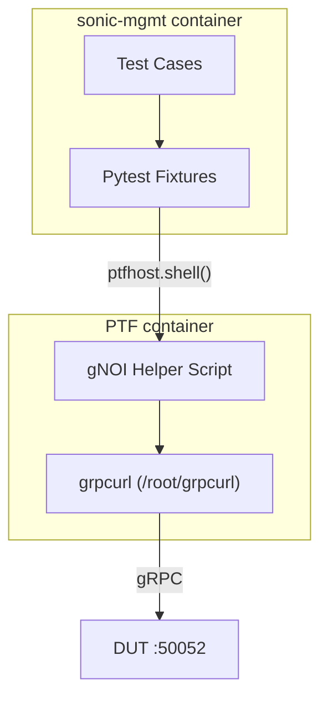

# gNOI Client Library for SONiC Test Framework

## Purpose

The purpose of this document is to describe the design of a common, reusable gNOI (gRPC Network Operations Interface) client library for sonic-mgmt test cases. This library leverages the existing grpcurl tool in the PTF container to provide a simple interface for gNOI operations without the complexity of protocol buffer compilation or Python gRPC dependencies.

## High Level Design Document

| Rev      | Date        | Author                   | Change Description                  |
|----------|-------------|--------------------------|-------------------------------------|
| Draft    | 03-12-2024  | Dawei Huang <daweihuang@microsoft.com> | Initial version for gNOI client     |
| v2       | 05-12-2024  | Dawei Huang <daweihuang@microsoft.com> | Simplified to use grpcurl           |

## Introduction

SONiC tests in the [sonic-mgmt](https://github.com/sonic-net/sonic-mgmt) repository currently lack a unified approach for testing gNOI operations. Existing implementations in `tests/gnmi/` are fragmented, mix different authentication patterns, and hide the actual gRPC interfaces from users. This design proposes a lightweight infrastructure that:

1. **Leverages grpcurl** - Uses the existing grpcurl tool in PTF container
2. **Handles infrastructure concerns** - Certificate management and PTF integration
3. **Maintains simplicity** - No proto compilation or Python gRPC dependencies
4. **Follows sonic-mgmt patterns** - Uses pytest fixtures and PTF container patterns

The gNOI protocol defines various service modules including System, File, Certificate, and Diagnostic operations. This design focuses initially on System operations while providing an extensible framework for additional services.

## Design Philosophy

### Simple JSON Interface
This design provides a clean JSON interface while handling all gRPC complexity internally:

```python
def test_system_time(gnoi_ptf):
    """Simple JSON interface - no gRPC complexity exposed"""
    # Clean function call returns JSON data
    result = gnoi_ptf.system_time()
    
    # Work with simple JSON response
    assert 'timestamp' in result
    assert result['timestamp'] > 0
```

### Infrastructure as Utilities
The library handles setup concerns while providing a simple test interface:
- grpcurl command construction and execution
- Certificate setup for secure connections
- Connection management between PTF and DUT
- Error handling and logging

This approach handles all gRPC complexity through grpcurl while exposing a clean JSON interface to test authors. The grpcurl tool handles all protocol buffer parsing and serialization automatically.

### Process Boundary Awareness
The design respects sonic-mgmt's process architecture:
- Tests run in **sonic-mgmt container** (can use `duthost.shell` safely)
- gRPC clients run in **PTF container** (isolated from SSH forking)
- Clean communication between containers via shell commands and fixtures

## Current State Analysis

### Problems with Existing Approach

| Issue | Current State | Impact |
|-------|---------------|---------|
| Mixed abstractions | Some tests use CLI tools, others direct gRPC | Inconsistent interfaces |
| Complex setup | Protocol buffer compilation, Python gRPC dependencies | High maintenance burden |
| Authentication chaos | Certificates in multiple locations | Unreliable connections |
| Limited reusability | gNMI-specific implementations | Cannot reuse for gNOI, gNSI |
| Process boundary issues | gRPC clients in sonic-mgmt container | Fork safety concerns |

## Proposed Architecture

### High-Level Design



### Directory Structure

Following sonic-mgmt's automatic PTF deployment pattern:

```
tests/ptftests/
├── py3/                    # Python 3 PTF tests (modern)
│   ├── gnoi_operations.py  # Main gNOI operations script  
│   ├── gnoi_client.py      # gNOI client implementation
│   └── gnoi/               # Compiled proto stubs (local)
│       ├── system/
│       │   ├── system_pb2.py
│       │   └── system_pb2_grpc.py
│       └── file/
│           ├── file_pb2.py
│           └── file_pb2_grpc.py
└── gnoi_operations.py      # Python 2 fallback (legacy)

tests/common/
├── fixtures/
│   └── gnoi_fixtures.py    # Simple fixtures (no deployment)
└── ptf_gnoi.py            # Helper class for sonic-mgmt integration

tests/common/grpc_protos/   # Source proto files
├── gnoi/
│   ├── system/system.proto
│   └── file/file.proto
└── compile_protos.py       # Proto compilation utility
```

**Key Insight**: sonic-mgmt automatically copies `tests/ptftests/` to `/root/ptftests/` in PTF container via the `copy_ptftests_directory` fixture. This means no custom deployment code needed!

## Detailed Design

### 1. grpcurl-based Architecture

#### Leveraging Existing grpcurl Tool

The PTF container already includes grpcurl at `/root/grpcurl`, which provides:
- Automatic proto discovery via server reflection
- JSON input/output for easy parsing
- No need for proto compilation or Python gRPC dependencies

**Key Benefits**:
- No protocol buffer files or compilation needed
- Uses server reflection to discover available services automatically
- Clean JSON interface for input and output

### 2. PTF Helper Script

#### Simple grpcurl Wrapper

```python
# tests/ptftests/py3/gnoi_helper.py
import sys
import json
import subprocess

def call_grpcurl(target, service, method, data=None, plaintext=True):
    """Call grpcurl and return parsed JSON response"""
    cmd = ["/root/grpcurl"]
    
    if plaintext:
        cmd.append("-plaintext")
    
    if data:
        cmd.extend(["-d", json.dumps(data)])
    
    cmd.extend([target, f"{service}/{method}"])
    
    try:
        result = subprocess.run(cmd, capture_output=True, text=True, check=True)
        return json.loads(result.stdout) if result.stdout else {}
    except subprocess.CalledProcessError as e:
        error_msg = e.stderr if e.stderr else f"grpcurl failed with code {e.returncode}"
        return {"error": error_msg}
    except json.JSONDecodeError:
        return {"error": f"Invalid JSON response: {result.stdout}"}

def main():
    if len(sys.argv) < 3:
        print(json.dumps({"error": "Usage: gnoi_helper.py <operation> <target> [args...]"}))
        sys.exit(1)
        
    operation = sys.argv[1]
    target = sys.argv[2]
    
    if operation == "system_time":
        result = call_grpcurl(target, "gnoi.system.System", "Time", {})
    elif operation == "system_reboot":
        data = {
            "method": int(sys.argv[3]) if len(sys.argv) > 3 else 0,
            "delay": int(sys.argv[4]) if len(sys.argv) > 4 else 0,
            "message": sys.argv[5] if len(sys.argv) > 5 else ""
        }
        result = call_grpcurl(target, "gnoi.system.System", "Reboot", data)
    elif operation == "file_put":
        data = {
            "destination": sys.argv[3],
            "content": sys.argv[4] if len(sys.argv) > 4 else ""
        }
        result = call_grpcurl(target, "gnoi.file.File", "Put", data)
    elif operation == "list_services":
        # Special operation to list available services
        cmd = ["/root/grpcurl", "-plaintext", target, "list"]
        try:
            result = subprocess.run(cmd, capture_output=True, text=True, check=True)
            services = result.stdout.strip().split('\n')
            result = {"services": services}
        except subprocess.CalledProcessError as e:
            result = {"error": e.stderr}
    else:
        result = {"error": f"Unknown operation: {operation}"}
        
    print(json.dumps(result))

if __name__ == "__main__":
    main()
```

### 3. Test Integration Helper

#### Clean Python Interface for Tests

```python
# tests/common/ptf_gnoi.py
import json

class GnoiError(Exception):
    """gNOI operation errors"""
    pass

class PtfGnoiHelper:
    """Helper for calling gNOI operations from PTF container using grpcurl"""
    
    def __init__(self, ptfhost, target):
        self.ptfhost = ptfhost
        self.target = target
        
    def _call_operation(self, operation, *args):
        """Call gNOI operation via grpcurl helper and parse JSON response"""
        args_str = " ".join(str(arg) for arg in args)
        cmd = f"python3 /root/ptftests/py3/gnoi_helper.py {operation} {self.target} {args_str}"
        
        result = self.ptfhost.shell(cmd, module_ignore_errors=True)
        
        if result['rc'] != 0:
            raise GnoiError(f"gNOI operation failed: {result['stderr']}")
            
        try:
            response = json.loads(result['stdout'])
        except json.JSONDecodeError:
            raise GnoiError(f"Invalid JSON response: {result['stdout']}")
            
        if 'error' in response:
            raise GnoiError(f"gNOI error: {response['error']}")
            
        return response
        
    def system_time(self):
        """Get system time"""
        return self._call_operation('system_time')
        
    def system_reboot(self, method=0, delay=0, message=""):
        """Reboot system"""
        return self._call_operation('system_reboot', method, delay, message)
        
    def file_put(self, destination, content=""):
        """Put file content"""
        return self._call_operation('file_put', destination, content)
        
    def list_services(self):
        """List available gRPC services"""
        return self._call_operation('list_services')
```

### 4. Pytest Fixtures

#### Simplified Fixtures (No Dependencies Needed)

```python
# tests/common/fixtures/gnoi_fixtures.py
import pytest
from ..ptf_gnoi import PtfGnoiHelper

@pytest.fixture 
def gnoi_ptf(ptfhost, duthosts, rand_one_dut_hostname):
    """Provide gNOI helper for tests - no setup needed since grpcurl is pre-installed"""
    duthost = duthosts[rand_one_dut_hostname]
    target = f"{duthost.mgmt_ip}:8080"  # Updated to use discovered port
    
    return PtfGnoiHelper(ptfhost, target)

# Optional: Add pytest command line options
def pytest_addoption(parser):
    parser.addoption(
        "--gnoi_port",
        type=int,
        default=8080,
        help="gNOI server port (default: 8080)"
    )
    
    parser.addoption(
        "--gnoi_secure",
        action="store_true", 
        default=False,
        help="Use secure gNOI connections (default: plaintext)"
    )
```

### 5. Certificate Management (Optional)

#### Simple Certificate Handling for Secure Connections

When secure connections are needed, certificates can be passed to grpcurl via command line options. This would be implemented in the helper script by modifying the grpcurl command construction:

```python
def call_grpcurl(target, service, method, data=None, secure=False, cert_dir=None):
    """Call grpcurl with optional certificate support"""
    cmd = ["/root/grpcurl"]
    
    if not secure:
        cmd.append("-plaintext")
    else:
        if cert_dir:
            cmd.extend(["-cacert", f"{cert_dir}/ca.pem"])
            cmd.extend(["-cert", f"{cert_dir}/client.crt"])
            cmd.extend(["-key", f"{cert_dir}/client.key"])
    
    # ... rest of the function
```

## Usage Examples

### Basic Test Case

```python
def test_system_operations(gnoi_ptf):
    """Test basic gNOI system operations using grpcurl"""
    
    # List available services first
    services_result = gnoi_ptf.list_services()
    assert 'services' in services_result
    assert 'gnoi.system.System' in services_result['services']
    
    # Get system time
    time_result = gnoi_ptf.system_time()
    assert 'time' in time_result  # grpcurl returns the actual proto field names
    
    # Test reboot (with delay so it doesn't actually reboot)
    reboot_result = gnoi_ptf.system_reboot(method=0, delay=300, message="Test reboot")
    # Response format depends on actual service implementation
    assert 'error' not in reboot_result
```

### Integration with DUT Configuration

```python
def test_reboot_after_config_change(duthost, gnoi_ptf):
    """Test gNOI reboot after configuration changes"""
    
    # Make configuration changes via SSH (safe)
    duthost.shell("config save")
    duthost.shell("config interface shutdown Ethernet0")
    
    # Verify time before reboot
    time_before = gnoi_ptf.system_time()
    
    # Schedule reboot via gNOI
    result = gnoi_ptf.system_reboot(method=0, delay=60, message="Config change reboot")
    assert result['status'] == 'success'
    
    # Additional verification could go here
```

### Advanced Usage - Direct Stub Access

```python
def test_direct_grpc_access(deploy_gnoi_to_ptf, ptfhost, duthosts, rand_one_dut_hostname):
    """For advanced users who need direct gRPC access"""
    
    duthost = duthosts[rand_one_dut_hostname]
    target = f"{duthost.mgmt_ip}:50052"
    
    # Call PTF script directly for custom operations
    result = ptfhost.shell(f"""
        python3 -c "
        import sys
        sys.path.insert(0, '/root/grpc_clients')
        from gnoi_client import GnoiClient
        
        with GnoiClient('{target}', secure=False) as client:
            # Direct access to gRPC stubs
            request = client.system_stub.__class__.__module__.TimeRequest()
            response = client.system_stub.Time(request)
            print(f'Raw time: {{response.time}}')
        "
    """)
    
    assert result['rc'] == 0
    assert 'Raw time:' in result['stdout']
```

## Implementation Plan

### Phase 1: Initial Implementation (1 Day)
**Goal**: Working grpcurl-based gNOI helper

**Core Implementation**:
1. Create grpcurl helper script in PTF directory
2. Implement System.Time, System.Reboot, and File.Put operations
3. Create Python integration helper class  
4. Basic pytest fixtures

**Deliverables**:
```
tests/ptftests/
└── py3/
    └── gnoi_helper.py           # grpcurl wrapper script

tests/common/
├── fixtures/
│   └── gnoi_fixtures.py         # Simple pytest fixtures
└── ptf_gnoi.py                 # PtfGnoiHelper integration class
```

**Test Examples**:
```python
def test_system_time_basic(gnoi_ptf):
    """Basic system time test - proves grpcurl integration works"""
    result = gnoi_ptf.system_time()
    assert 'time' in result  # Actual proto field name

def test_list_services(gnoi_ptf):
    """Test service discovery via server reflection"""
    result = gnoi_ptf.list_services()
    assert 'services' in result
    assert 'gnoi.system.System' in result['services']
```

### Phase 2: Integration and Testing (1 Day)  
1. Test with real testbed using discovered endpoint (10.250.0.101:8080)
2. Add error handling for grpcurl failures
3. Validate actual service responses
4. Documentation and usage examples

### Phase 3: Extension and Security (1 Day)
1. Add certificate support for secure connections
2. Add more gNOI service operations (File.Get, OS operations, etc.)
3. Implement logging and debugging utilities
4. Integration with existing test patterns

**Phase 1 Success Criteria**:
- ✅ grpcurl-based System.Time operation working
- ✅ Service discovery via server reflection working
- ✅ Simple pytest integration functioning
- ✅ Clear pattern for adding new gNOI operations

## Benefits

### For Test Authors
- **Simple JSON Interface**: Clean function calls like `gnoi_ptf.system_time()` and `gnoi_ptf.file_put()`
- **Zero Setup**: No dependencies to install - grpcurl is pre-available
- **Familiar Patterns**: Uses standard pytest fixtures and sonic-mgmt patterns
- **No gRPC Complexity**: grpcurl handles all protocol buffer and connection management

### For Test Maintenance
- **Ultra Simple**: Single Python script leveraging existing grpcurl tool
- **Easy Extension**: Just add new operation handlers to the helper script
- **No Dependencies**: No Python gRPC libraries or proto compilation needed
- **Fork Safe**: Clean separation between sonic-mgmt and PTF processes

### For CI/CD
- **Reliable**: No dependency installation or proto compilation failures
- **Fast**: Minimal overhead - just shell command execution
- **Observable**: grpcurl provides clear error messages
- **Scalable**: PTF container isolation allows parallel testing

## Security Considerations

### Default Security
- Support both secure (TLS) and insecure connections
- Secure by default when certificates are available
- Proper certificate validation and cleanup

### Test Isolation
- Each test session gets clean certificate setup
- PTF container isolation prevents cross-test interference
- No persistent credentials or connections

## Performance Considerations

### Minimal Overhead
- No compilation or dependency installation needed
- Direct grpcurl execution with minimal Python wrapper
- JSON-based communication between containers (lightweight)
- No persistent services or background processes

### Deployment Simplification
- Zero deployment time - grpcurl pre-installed in PTF container
- No proto files to manage or copy
- Uses server reflection for automatic service discovery

## Conclusion

This simplified design provides an extremely lightweight foundation for gNOI testing in sonic-mgmt by leveraging the existing grpcurl tool. The grpcurl-based approach eliminates the complexity of protocol buffer compilation, dependency management, and gRPC library integration while maintaining a clean JSON interface for test authors.

Key advantages of the grpcurl approach:
- **Zero setup complexity**: No proto files, no dependencies, no compilation
- **Server reflection**: Automatic service and method discovery
- **Proven tool**: grpcurl is a mature, widely-used gRPC client
- **JSON native**: Perfect match for Python test framework integration

The implementation is dramatically simpler than the original Python gRPC approach while providing the same functionality. This makes it easier to maintain, extend, and debug while reducing the likelihood of environment-specific issues.