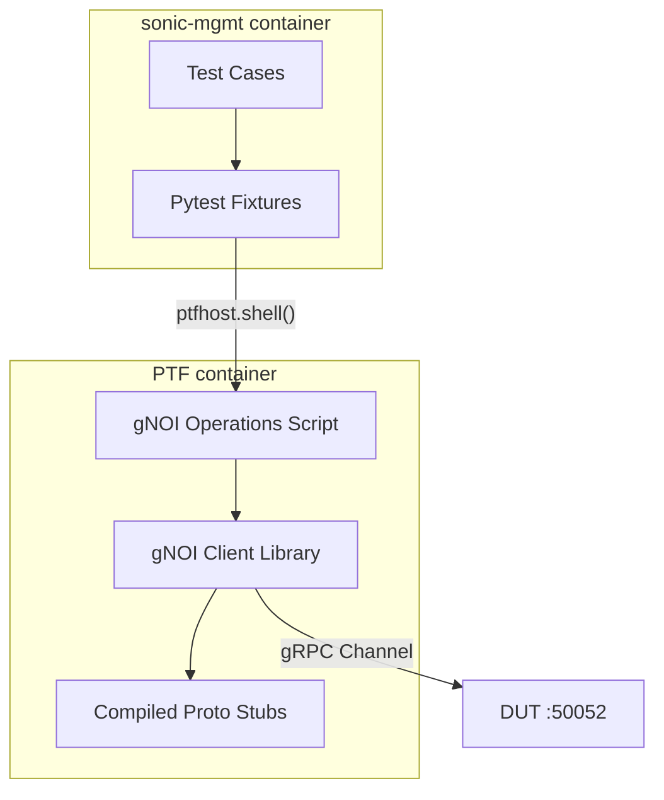

# gNOI Client Library for SONiC Test Framework

## Purpose

The purpose of this document is to describe the design of a common, reusable gNOI (gRPC Network Operations Interface) client library for sonic-mgmt test cases. This library provides test cases with direct access to gRPC stubs and channels while handling the infrastructure concerns of protocol buffer compilation, certificate management, and PTF container deployment.

## High Level Design Document

| Rev      | Date        | Author                   | Change Description                  |
|----------|-------------|--------------------------|-------------------------------------|
| Draft    | 03-12-2024  | Dawei Huang <daweihuang@microsoft.com> | Initial version for gNOI client     |

## Introduction

SONiC tests in the [sonic-mgmt](https://github.com/sonic-net/sonic-mgmt) repository currently lack a unified approach for testing gNOI operations. Existing implementations in `tests/gnmi/` are fragmented, mix different authentication patterns, and hide the actual gRPC interfaces from users. This design proposes a lightweight infrastructure that:

1. **Provides compiled gRPC stubs** - Users work directly with protocol buffer generated code
2. **Handles infrastructure concerns** - Certificate management, PTF deployment, proto compilation
3. **Maintains transparency** - No wrapper classes that hide the actual gRPC interfaces
4. **Follows sonic-mgmt patterns** - Uses pytest fixtures and PTF container patterns

The gNOI protocol defines various service modules including System, File, Certificate, and Diagnostic operations. This design focuses initially on System operations while providing an extensible framework for additional services.

## Design Philosophy

### Simple JSON Interface
This design provides a clean JSON interface while handling all gRPC complexity internally:

```python
def test_system_time(gnoi_ptf):
    """Simple JSON interface - no gRPC complexity exposed"""
    # Clean function call returns JSON data
    result = gnoi_ptf.system_time()
    
    # Work with simple JSON response
    assert 'timestamp' in result
    assert result['timestamp'] > 0
```

### Infrastructure as Utilities
The library handles setup concerns while providing a simple test interface:
- Proto compilation and import management  
- Certificate setup and PTF deployment
- Connection management between PTF and DUT
- Error handling and logging

This approach handles all gRPC complexity internally while exposing a clean JSON interface to test authors. The underlying implementation uses native protocol buffers for correctness, but tests work with simple Python dictionaries.

### Process Boundary Awareness
The design respects sonic-mgmt's process architecture:
- Tests run in **sonic-mgmt container** (can use `duthost.shell` safely)
- gRPC clients run in **PTF container** (isolated from SSH forking)
- Clean communication between containers via shell commands and fixtures

## Current State Analysis

### Problems with Existing Approach

| Issue | Current State | Impact |
|-------|---------------|---------|
| Mixed abstractions | Some tests use CLI tools, others direct gRPC | Inconsistent interfaces |
| Complex setup | Protocol buffer compilation, Python dependencies | High maintenance burden |
| Authentication chaos | Certificates in multiple locations | Unreliable connections |
| Limited reusability | gNMI-specific implementations | Cannot reuse for gNOI, gNSI |
| Process boundary issues | gRPC clients in sonic-mgmt container | Fork safety concerns |

## Proposed Architecture

### High-Level Design



### Directory Structure

Following sonic-mgmt's automatic PTF deployment pattern:

```
tests/ptftests/
├── py3/                    # Python 3 PTF tests (modern)
│   ├── gnoi_operations.py  # Main gNOI operations script  
│   ├── gnoi_client.py      # gNOI client implementation
│   └── gnoi/               # Compiled proto stubs (local)
│       ├── system/
│       │   ├── system_pb2.py
│       │   └── system_pb2_grpc.py
│       └── file/
│           ├── file_pb2.py
│           └── file_pb2_grpc.py
└── gnoi_operations.py      # Python 2 fallback (legacy)

tests/common/
├── fixtures/
│   └── gnoi_fixtures.py    # Simple fixtures (no deployment)
└── ptf_gnoi.py            # Helper class for sonic-mgmt integration

tests/common/grpc_protos/   # Source proto files
├── gnoi/
│   ├── system/system.proto
│   └── file/file.proto
└── compile_protos.py       # Proto compilation utility
```

**Key Insight**: sonic-mgmt automatically copies `tests/ptftests/` to `/root/ptftests/` in PTF container via the `copy_ptftests_directory` fixture. This means no custom deployment code needed!

## Detailed Design

### 1. Protocol Buffer Management

#### Automatic PTF Deployment Pattern

```python
# tests/common/grpc_protos/compile_protos.py  
import subprocess
from pathlib import Path

def compile_gnoi_protos_for_ptf():
    """Compile gNOI proto files directly into PTF directory"""
    proto_root = Path(__file__).parent
    ptf_output = Path(__file__).parent.parent.parent / "ptftests" / "py3"
    
    proto_files = [
        "gnoi/system/system.proto",
        "gnoi/file/file.proto"
    ]
    
    # Create output directory
    ptf_output.mkdir(parents=True, exist_ok=True)
    
    for proto_file in proto_files:
        cmd = [
            "python", "-m", "grpc_tools.protoc",
            f"--proto_path={proto_root}",
            f"--python_out={ptf_output}",      # Output to PTF directory
            f"--grpc_python_out={ptf_output}",  # Output to PTF directory
            str(proto_root / proto_file)
        ]
        
        result = subprocess.run(cmd, capture_output=True, text=True)
        if result.returncode != 0:
            raise Exception(f"Failed to compile {proto_file}: {result.stderr}")

if __name__ == "__main__":
    compile_gnoi_protos_for_ptf()
```

**Key Change**: Compile protos directly into `tests/ptftests/py3/` so they're automatically deployed by sonic-mgmt's PTF deployment system.

### 2. PTF-Side gNOI Client (Self-Contained)

#### Local Client Implementation in PTF

```python
# tests/ptftests/py3/gnoi_client.py  
import grpc
import sys
import os

# Local imports - proto stubs are in same directory
from gnoi.system import system_pb2, system_pb2_grpc
from gnoi.file import file_pb2, file_pb2_grpc

class GnoiError(Exception):
    """gNOI operation errors"""
    pass

class GnoiClient:
    """Lightweight gNOI client - exposes native gRPC stubs and proto objects"""
    
    def __init__(self, target, secure=True, cert_dir=None):
        self.target = target
        self.channel = None
        self.system_stub = None
        
        self._connect(secure, cert_dir)
        
    def _connect(self, secure, cert_dir):
        """Create gRPC channel and stubs"""
        if secure and cert_dir:
            credentials = create_credentials(cert_dir)
            self.channel = grpc.secure_channel(self.target, credentials)
        else:
            self.channel = grpc.insecure_channel(self.target)
            
        # Create stubs - users can access these directly
        self.system_stub = system_pb2_grpc.SystemStub(self.channel)
        
    def system_time(self):
        """Get system time - direct gRPC call"""
        request = system_pb2.TimeRequest()
        try:
            response = self.system_stub.Time(request)
            return {
                'time_ns': response.time,
                'timestamp': response.time // 1000000000
            }
        except grpc.RpcError as e:
            raise GnoiError(f"system_time failed: {e.details()}")
            
    def system_reboot(self, method=0, delay=0, message=""):
        """Reboot system - direct gRPC call"""
        request = system_pb2.RebootRequest(
            method=method,
            delay=delay, 
            message=message
        )
        try:
            response = self.system_stub.Reboot(request)
            return {'status': 'success', 'response': str(response)}
        except grpc.RpcError as e:
            raise GnoiError(f"system_reboot failed: {e.details()}")
            
    def close(self):
        if self.channel:
            self.channel.close()
            
    def __enter__(self):
        return self
        
    def __exit__(self, exc_type, exc_val, exc_tb):
        self.close()
```

### 3. PTF Operations Script

#### Self-Contained PTF Script

```python
# tests/ptftests/py3/gnoi_operations.py
import sys
import json

# Local import - client is in same directory
from gnoi_client import GnoiClient

def main():
    if len(sys.argv) < 3:
        print(json.dumps({"error": "Usage: gnoi_operations.py <operation> <target> [args...]"}))
        sys.exit(1)
        
    operation = sys.argv[1]
    target = sys.argv[2]
    args = sys.argv[3:] if len(sys.argv) > 3 else []
    
    try:
        with GnoiClient(target, secure=False) as client:
            if operation == "time":
                result = client.system_time()
            elif operation == "reboot":
                method = int(args[0]) if args else 0
                delay = int(args[1]) if len(args) > 1 else 0
                message = args[2] if len(args) > 2 else ""
                result = client.system_reboot(method, delay, message)
            else:
                result = {"error": f"Unknown operation: {operation}"}
                
        print(json.dumps(result))
        
    except Exception as e:
        print(json.dumps({"error": str(e)}))
        sys.exit(1)

if __name__ == "__main__":
    main()
```

### 4. Test Integration Helper

#### Clean Python Interface for Tests

```python
# tests/common/ptf_gnoi.py
import json
from .grpc_clients.exceptions import GnoiError

class PtfGnoiHelper:
    """Helper for calling gNOI operations from PTF container"""
    
    def __init__(self, ptfhost, target):
        self.ptfhost = ptfhost
        self.target = target
        
    def _call_operation(self, operation, *args):
        """Call gNOI operation and parse JSON response"""
        args_str = " ".join(str(arg) for arg in args)
        cmd = f"python3 /root/ptftests/py3/gnoi_operations.py {operation} {self.target} {args_str}"
        
        result = self.ptfhost.shell(cmd, module_ignore_errors=True)
        
        if result['rc'] != 0:
            raise GnoiError(f"gNOI operation failed: {result['stderr']}")
            
        try:
            response = json.loads(result['stdout'])
        except json.JSONDecodeError:
            raise GnoiError(f"Invalid JSON response: {result['stdout']}")
            
        if 'error' in response:
            raise GnoiError(f"gNOI error: {response['error']}")
            
        return response
        
    def system_time(self):
        """Get system time"""
        return self._call_operation('time')
        
    def system_reboot(self, method=0, delay=0, message=""):
        """Reboot system"""
        return self._call_operation('reboot', method, delay, f"'{message}'")
```

### 5. Pytest Fixtures

#### Simplified Fixtures (No Custom Deployment)

```python
# tests/common/fixtures/gnoi_fixtures.py
import pytest
from ..ptf_gnoi import PtfGnoiHelper

# No deployment fixture needed! PTF files are auto-deployed by sonic-mgmt

@pytest.fixture(scope="session")
def ensure_gnoi_dependencies(ptfhost):
    """Ensure gRPC dependencies are available in PTF container"""
    result = ptfhost.shell("python3 -c 'import grpc'", module_ignore_errors=True)
    if result['rc'] != 0:
        ptfhost.shell("pip3 install grpcio grpcio-tools protobuf")
    return True

@pytest.fixture 
def gnoi_ptf(ensure_gnoi_dependencies, ptfhost, duthosts, rand_one_dut_hostname):
    """Provide gNOI helper for tests"""
    duthost = duthosts[rand_one_dut_hostname]
    target = f"{duthost.mgmt_ip}:50052"
    
    return PtfGnoiHelper(ptfhost, target)

# Optional: Add pytest command line options
def pytest_addoption(parser):
    parser.addoption(
        "--gnoi_port",
        type=int,
        default=50052,
        help="gNOI server port (default: 50052)"
    )
    
    parser.addoption(
        "--gnoi_insecure",
        action="store_true", 
        default=False,
        help="Use insecure gNOI connections"
    )
```

### 6. Certificate Management

#### Simple Certificate Handling

```python
# tests/common/grpc_clients/credentials.py
import grpc
from pathlib import Path

def create_credentials(cert_dir):
    """Create gRPC SSL credentials from certificate directory"""
    cert_path = Path(cert_dir)
    
    with open(cert_path / "ca.pem", "rb") as f:
        root_cert = f.read()
    with open(cert_path / "client.crt", "rb") as f:
        client_cert = f.read()
    with open(cert_path / "client.key", "rb") as f:
        client_key = f.read()
        
    return grpc.ssl_channel_credentials(
        root_certificates=root_cert,
        private_key=client_key,
        certificate_chain=client_cert
    )

def setup_certificates(duthost, localhost):
    """Set up certificates for secure gNOI connection"""
    # This would implement certificate generation and deployment
    # Similar to existing gnmi certificate setup but cleaner
    pass
```

## Usage Examples

### Basic Test Case

```python
def test_system_operations(gnoi_ptf):
    """Test basic gNOI system operations"""
    
    # Get system time
    time_result = gnoi_ptf.system_time()
    assert 'timestamp' in time_result
    assert time_result['timestamp'] > 0
    
    # Test reboot (with delay so it doesn't actually reboot)
    reboot_result = gnoi_ptf.system_reboot(method=0, delay=300, message="Test reboot")
    assert reboot_result['status'] == 'success'
```

### Integration with DUT Configuration

```python
def test_reboot_after_config_change(duthost, gnoi_ptf):
    """Test gNOI reboot after configuration changes"""
    
    # Make configuration changes via SSH (safe)
    duthost.shell("config save")
    duthost.shell("config interface shutdown Ethernet0")
    
    # Verify time before reboot
    time_before = gnoi_ptf.system_time()
    
    # Schedule reboot via gNOI
    result = gnoi_ptf.system_reboot(method=0, delay=60, message="Config change reboot")
    assert result['status'] == 'success'
    
    # Additional verification could go here
```

### Advanced Usage - Direct Stub Access

```python
def test_direct_grpc_access(deploy_gnoi_to_ptf, ptfhost, duthosts, rand_one_dut_hostname):
    """For advanced users who need direct gRPC access"""
    
    duthost = duthosts[rand_one_dut_hostname]
    target = f"{duthost.mgmt_ip}:50052"
    
    # Call PTF script directly for custom operations
    result = ptfhost.shell(f"""
        python3 -c "
        import sys
        sys.path.insert(0, '/root/grpc_clients')
        from gnoi_client import GnoiClient
        
        with GnoiClient('{target}', secure=False) as client:
            # Direct access to gRPC stubs
            request = client.system_stub.__class__.__module__.TimeRequest()
            response = client.system_stub.Time(request)
            print(f'Raw time: {{response.time}}')
        "
    """)
    
    assert result['rc'] == 0
    assert 'Raw time:' in result['stdout']
```

## Implementation Plan

### Phase 1: Initial Implementation (Week 1)
**Goal**: Minimal working implementation with extension example

**Core Infrastructure + System Time**:
1. Create minimal directory structure
2. Implement basic proto compilation for System and File services
3. Create gNOI client with System.Time and File.Put operations only
4. Implement PTF operations script with 'time' and 'file_put' handlers
5. Basic pytest fixtures for PTF deployment

**Deliverables**:
```
tests/ptftests/
├── py3/                         # Modern Python 3 implementation
│   ├── gnoi_operations.py       # Main operations script
│   ├── gnoi_client.py          # gNOI client (self-contained)
│   └── gnoi/                   # Compiled proto stubs (auto-deployed)
│       ├── system/
│       │   ├── system_pb2.py
│       │   └── system_pb2_grpc.py
│       └── file/
│           ├── file_pb2.py  
│           └── file_pb2_grpc.py
└── gnoi_operations.py           # Python 2 fallback

tests/common/grpc_protos/        # Source proto files
├── gnoi/
│   ├── system/system.proto      # System service
│   └── file/file.proto          # File service
└── compile_protos.py            # Compilation to PTF directory

tests/common/fixtures/
└── gnoi_fixtures.py             # Simple fixtures (no deployment)

tests/common/
└── ptf_gnoi.py                  # PtfGnoiHelper integration class
```

**Test Examples**:
```python
def test_system_time_basic(gnoi_ptf):
    """Basic system time test - proves infrastructure works"""
    result = gnoi_ptf.system_time()
    assert 'timestamp' in result
    assert result['timestamp'] > 0

def test_file_put_example(gnoi_ptf):
    """Example showing file operations - demonstrates extension pattern"""
    content = "test config data"
    result = gnoi_ptf.file_put("/tmp/test_file", content)
    assert result['status'] == 'success'
```

### Phase 2: Integration and Testing (Week 2)  
1. Test deployment to PTF container with real testbed
2. Add error handling and retry logic
3. Create comprehensive test cases
4. Documentation and usage examples
5. Performance validation

### Phase 3: Extension Framework (Week 3)
1. Add certificate management for secure connections
2. Document extension patterns for new gNOI services
3. Add more File operations (Get, Remove) as examples
4. Implement logging and debugging utilities
5. Integration with existing test patterns

### Phase 4: Production Ready (Week 4)
1. Code review and hardening
2. Add monitoring and observability
3. Migration guide for existing tests
4. CI/CD integration
5. Final documentation and training materials

**Phase 1 Success Criteria**:
- ✅ System.Time operation working end-to-end
- ✅ File.Put operation working as extension example  
- ✅ PTF deployment functioning correctly
- ✅ Clear path for adding new gNOI services
- ✅ Basic test cases passing

## Benefits

### For Test Authors
- **Simple JSON Interface**: Clean function calls like `gnoi_ptf.system_time()` and `gnoi_ptf.file_put()`
- **Easy Extension**: Clear pattern for adding new gNOI services following File.Put example
- **Familiar Patterns**: Uses standard pytest fixtures and sonic-mgmt patterns
- **No gRPC Complexity**: Infrastructure handles proto compilation and connection management

### For Test Maintenance
- **Centralized**: Single location for gNOI client logic
- **Modular**: Easy to add new gNOI services
- **Testable**: Library components can be unit tested
- **Fork Safe**: Clean separation between sonic-mgmt and PTF processes

### For CI/CD
- **Reliable**: No certificate/authentication confusion
- **Fast**: Session-level deployment, minimal overhead
- **Observable**: Clear error messages and logging
- **Scalable**: PTF container isolation allows parallel testing

## Security Considerations

### Default Security
- Support both secure (TLS) and insecure connections
- Secure by default when certificates are available
- Proper certificate validation and cleanup

### Test Isolation
- Each test session gets clean certificate setup
- PTF container isolation prevents cross-test interference
- No persistent credentials or connections

## Performance Considerations

### Deployment Optimization
- Session-scoped deployment to PTF (one-time cost)
- Proto compilation cached between test runs
- Connection reuse within PTF container

### Minimal Overhead
- Direct gRPC calls with minimal wrapping
- JSON-based communication between containers (lightweight)
- No persistent services or background processes

## Conclusion

This design provides a clean foundation for gNOI testing in sonic-mgmt through a simple JSON interface while managing all gRPC infrastructure concerns. The initial implementation focuses on System.Time operations with File.Put as an extension example, proving the concept while keeping complexity minimal.

The infrastructure-as-utilities approach handles complex setup (proto compilation, certificates, PTF deployment) while exposing a clean, testable interface. The PTF container deployment strategy ensures fork safety while maintaining familiar sonic-mgmt test patterns.

Phase 1 delivers a working foundation with clear extension patterns, making it easy to add new gNOI services incrementally. The JSON interface abstracts gRPC complexity while the underlying implementation uses native protocol buffers for type safety and correctness.