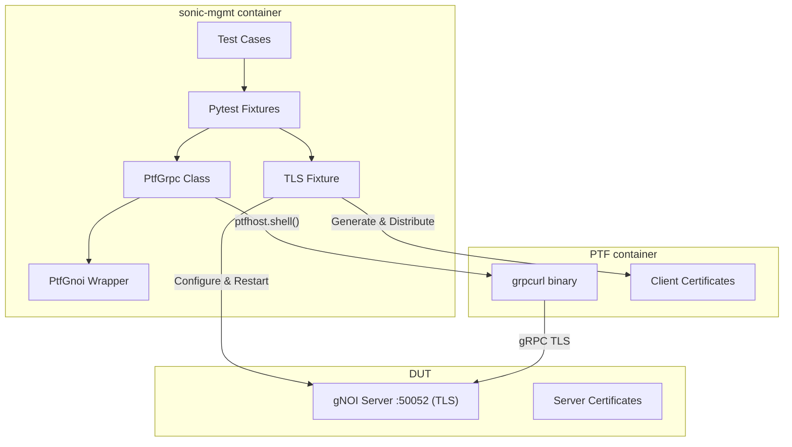

# gNOI Client Library for SONiC Test Framework

## Purpose

The purpose of this document is to describe the design of a common, reusable gNOI (gRPC Network Operations Interface) client library for sonic-mgmt test cases. This library leverages the existing grpcurl tool in the PTF container to provide a simple interface for gNOI operations without the complexity of protocol buffer compilation or Python gRPC dependencies.

## High Level Design Document

| Rev      | Date        | Author                   | Change Description                  |
|----------|-------------|--------------------------|-------------------------------------|
| Draft    | 03-12-2024  | Dawei Huang <daweihuang@microsoft.com> | Initial version for gNOI client     |
| v2       | 05-12-2024  | Dawei Huang <daweihuang@microsoft.com> | Simplified to use grpcurl           |
| v3       | 08-12-2024  | Dawei Huang <daweihuang@microsoft.com> | Updated with TLS certificate management |

## Introduction

SONiC tests in the [sonic-mgmt](https://github.com/sonic-net/sonic-mgmt) repository currently lack a unified approach for testing gNOI operations. While the existing `tests/gnmi` directory provides gNMI testing capabilities, it suffers from significant complexity and maintenance issues that make it unsuitable as a foundation for gRPC testing.

This design proposes a lightweight gNOI infrastructure that addresses the limitations of existing gRPC testing approaches:

1. **Leverages grpcurl** - Uses the existing grpcurl tool in PTF container
2. **Handles infrastructure concerns** - Certificate management and PTF integration
3. **Maintains simplicity** - No proto compilation or Python gRPC dependencies
4. **Follows sonic-mgmt patterns** - Uses pytest fixtures and PTF container patterns
5. **Automatic TLS setup** - All gNOI tests use TLS by default without manual configuration

The gNOI protocol defines various service modules including System, File, Certificate, and Diagnostic operations. This design focuses initially on System operations while providing an extensible framework for additional services.

## Problems with Existing gNMI Test Infrastructure

The existing `tests/gnmi` directory demonstrates critical architectural issues that make it unsuitable for reliable test automation:

### 1. Wide Configuration Surface Area
**Problem**: When you change server configuration (certificate or key files), you must update numerous files across the codebase.

**Evidence:**
- Certificate paths hardcoded in **14+ files**: `conftest.py`, `gnmi_utils.py`, `gnmi_setup.py`, `helper.py`, and individual test files
- Port configuration (8080/50052) scattered across: `GNMIEnvironment` class, helper functions, test files
- Command-line arguments duplicated: The same `nohup` command with `--server_crt`, `--server_key`, `--ca_crt` flags constructed identically in multiple places

```python
# Typical duplication - same config in multiple files
dut_command += "--server_crt /etc/sonic/telemetry/gnmiserver.crt --server_key /etc/sonic/telemetry/gnmiserver.key"
```

**Impact:** A single certificate path change requires updates across the entire test suite, creating massive maintenance burden.

### 2. Ad Hoc Server Process Management
**Critical Problem**: The gNMI server uses `nohup` commands instead of proper service integration, causing complete failure during device operations.

```python
# From helper.py - problematic ad hoc process management
dut_command += "\"/usr/bin/nohup /usr/sbin/%s -logtostderr --port %s " % (env.gnmi_process, env.gnmi_port)
dut_command += "--server_crt /etc/sonic/telemetry/gnmiserver.crt ... >/root/gnmi.log 2>&1 &\""
```

**Critical Issues:**
- **Lost run flags**: When you issue `gnoi reboot`, the `nohup` process is completely lost
- **Manual process control**: Tests use `pkill`/`pgrep` instead of proper service management
- **No service integration**: Bypasses systemd/supervisor, creating unreliable process state
- **State inconsistency**: Mix of manually-managed and supervisor-managed processes

### 3. Server Lifecycle Fragility During Reboots
**Problem**: The infrastructure completely breaks down during device reboots, requiring manual recovery.

```python
# Explicit workaround comments in test code
# This is an adhoc workaround because the cert config is cleared after reboot.
# We should refactor the test to always use the default config.
apply_cert_config(duthost)
```

**Critical Issues:**
- **Configuration loss**: Certificate configuration cleared after every reboot
- **Manual restart required**: Tests must manually call `apply_cert_config()` after reboots
- **Process state loss**: The `nohup` approach loses all process state during device operations
- **No proper dependency management**: Server doesn't automatically restart with correct configuration

### 4. Systemic Architecture Problems
**Problem**: The infrastructure bypasses SONiC's proper service management, creating fundamental reliability issues.

**Issues:**
- **Service management bypass**: Code manually stops supervisor-controlled services and starts ad hoc processes
- **Resource leaks**: Manual `pkill` commands may not clean up properly
- **Health check complexity**: Custom process checking instead of using standard service status
- **Cascading failures**: When any component changes, multiple layers break

```python
# Example of bypassing proper service management
dut_command = "docker exec %s supervisorctl stop %s" % (env.gnmi_container, program)
dut_command = "docker exec %s pkill %s" % (env.gnmi_container, env.gnmi_process)
```


## Design Philosophy

### Simple JSON Interface
This design provides a clean JSON interface while handling all gRPC complexity internally:

```python
def test_system_time(ptf_gnoi):
    """Simple test - TLS automatically configured"""
    # Clean function call returns JSON data
    result = ptf_gnoi.system_time()

    # Work with simple JSON response from gNOI protocol
    assert 'time' in result
    assert isinstance(result['time'], int)
```

### Infrastructure as Utilities
The library handles setup concerns while providing a simple test interface:
- grpcurl command construction and execution
- Automatic TLS certificate generation and distribution
- Connection management between PTF and DUT
- Error handling and logging

This approach handles all gRPC complexity through grpcurl while exposing a clean JSON interface to test authors.

### Process Boundary Awareness
The design respects sonic-mgmt's process architecture:
- Tests run in **sonic-mgmt container** (can use `duthost.shell` safely)
- gRPC clients run in **PTF container** (isolated from SSH forking)
- Clean communication between containers via shell commands and fixtures

## Architecture

### High-Level Design



### Directory Structure

```
tests/common/
├── ptf_grpc.py             # Generic gRPC client using grpcurl
├── ptf_gnoi.py             # gNOI-specific wrapper
└── fixtures/
    └── grpc_fixtures.py    # Pytest fixtures and TLS setup

tests/gnxi/
├── test_gnoi_system.py     # gNOI System service tests
└── test_gnoi_file.py       # gNOI File service tests
```

## Components

### 1. Generic gRPC Client (PtfGrpc)

The `PtfGrpc` class provides a generic interface for making gRPC calls using grpcurl:

**Key Features:**
- Auto-configuration from GNMIEnvironment with TLS certificate detection
- Support for unary and streaming RPC patterns
- Automatic JSON serialization/deserialization
- Service discovery via gRPC reflection
- TLS certificate management

**Core Methods:**
- `call_unary(service, method, request)` - Single request/response
- `call_server_streaming(service, method, request)` - Stream of responses
- `list_services()` - Discover available services
- `describe(symbol)` - Get service/method details

### 2. gNOI-Specific Wrapper (PtfGnoi)

The `PtfGnoi` class provides gNOI-specific operations using the generic `PtfGrpc` client:

**System Operations:**
- `system_time()` - Get device time in nanoseconds since epoch

**File Operations:**
- `file_stat(remote_file)` - Get file statistics

**Key Benefits:**
- Clean method signatures hiding gRPC complexity
- Protocol-specific data transformations
- Automatic error handling for known issues

### 3. TLS Infrastructure Fixture

The `setup_gnoi_tls_server` fixture provides automatic TLS certificate management:

**Features:**
- Automatic certificate generation with proper SAN for DUT IP
- CONFIG_DB configuration for TLS mode (port 50052)
- Server restart and connectivity verification
- Clean rollback and certificate cleanup
- Certificates generated in `/tmp` to avoid polluting working directory

### 4. Pytest Fixtures

Fixtures provide easy access to gRPC clients with automatic configuration:

**Core Fixtures:**
- `ptf_grpc` - Generic gRPC client with auto-configuration
- `ptf_gnoi` - gNOI-specific client using auto-configured gRPC client
- `ptf_grpc_custom` - Factory for custom client configuration
- `setup_gnoi_tls_server` - TLS infrastructure (used automatically)

## Usage Examples

### Basic gNOI Operations (Automatic TLS)

```python
def test_system_time(ptf_gnoi):
    """Test runs with TLS automatically configured"""
    result = ptf_gnoi.system_time()
    assert 'time' in result
    logger.info(f"Device time: {result['time']} nanoseconds since epoch")

def test_file_operations(ptf_gnoi):
    """File operations with automatic TLS"""
    try:
        stats = ptf_gnoi.file_stat("/etc/hostname")
        assert "stats" in stats
    except Exception as e:
        logger.warning(f"Expected limitation: {e}")
```

### Direct gRPC Usage

```python
def test_custom_grpc(ptf_grpc):
    """Use generic gRPC client for custom services"""
    # List available services
    services = ptf_grpc.list_services()
    assert 'gnoi.system.System' in services

    # Make custom RPC call
    response = ptf_grpc.call_unary("gnoi.system.System", "Time")
    assert 'time' in response
```

### Custom Configuration

```python
def test_custom_timeout(ptf_grpc_custom):
    """Configure custom timeout"""
    client = ptf_grpc_custom(timeout=30.0)
    services = client.list_services()
    assert 'gnoi.system.System' in services
```

## TLS Certificate Management

### Automatic Certificate Generation

The TLS infrastructure fixture automatically:

1. **Creates certificates in `/tmp/gnoi_certs/`** using OpenSSL:
   - CA certificate (`gnmiCA.cer`)
   - Server certificate with SAN for DUT IP (`gnmiserver.cer`)
   - Client certificate (`gnmiclient.cer`)

2. **Distributes certificates**:
   - Server certificates → DUT `/etc/sonic/telemetry/`
   - Client certificates → PTF container `/etc/sonic/telemetry/`

3. **Configures server**:
   - Updates CONFIG_DB with TLS settings (port 50052)
   - Registers client certificate with appropriate roles
   - Restarts gNOI server to pick up configuration

4. **Verifies connectivity**:
   - Tests service discovery with TLS
   - Validates basic gNOI calls work

5. **Cleanup**:
   - Automatic rollback of CONFIG_DB changes
   - Certificate cleanup from `/tmp`

### Certificate Workflow

```python
# Certificates generated in /tmp to avoid polluting working directory
cert_dir = "/tmp/gnoi_certs"
localhost.shell(f"cd {cert_dir} && openssl genrsa -out gnmiCA.key 2048")
# ... OpenSSL certificate generation

# Distribution to containers
duthost.copy(src=f'{cert_dir}/gnmiCA.cer', dest='/etc/sonic/telemetry/')
ptfhost.copy(src=f'{cert_dir}/gnmiCA.cer', dest='/etc/sonic/telemetry/gnmiCA.cer')

# Cleanup
localhost.shell(f"rm -rf {cert_dir}", module_ignore_errors=True)
```

## Configuration Discovery Integration

### Leveraging GNMIEnvironment

The gNOI framework integrates with `GNMIEnvironment` class for automatic server configuration discovery. Since gNOI services run on the same gRPC endpoint as gNMI services, we reuse existing configuration infrastructure.

**Automatic Configuration:**
```python
def test_gnoi_auto_config(ptf_gnoi):
    """Automatic configuration - TLS enabled by default"""
    # Client automatically configured with:
    # - Correct host:port (50052 for TLS, 8080 for plaintext)
    # - TLS settings from fixture/CONFIG_DB
    # - Certificate paths in PTF container
    result = ptf_gnoi.system_time()
    assert 'time' in result
```

## Key Benefits

**Simplicity**
- No protocol buffer compilation required
- Uses pre-installed grpcurl in PTF container
- Clean JSON interface for all operations
- Automatic TLS certificate management

**Flexibility**
- Generic `PtfGrpc` works with any gRPC service
- Easy to add new protocols (gNMI, gNSI, etc.)
- Configurable connection options per test
- Supports both TLS and plaintext modes

**Reliability**
- Leverages mature, well-tested grpcurl tool
- Process isolation prevents fork issues
- Automatic certificate generation and cleanup
- Clear error messages from grpcurl

**Developer Experience**
- Tests use TLS by default without setup
- Simple pytest fixtures for immediate use
- Comprehensive error handling
- Minimal code to maintain

## Conclusion

This design provides a simple, maintainable solution for gRPC testing in sonic-mgmt by leveraging the existing grpcurl tool. The approach eliminates protocol buffer complexity while providing a clean interface for test authors.

The automatic TLS certificate management ensures tests work securely out of the box, while the generic `PtfGrpc` class can be easily extended for any gRPC-based protocol, making this a future-proof solution for SONiC's evolving management interfaces.
