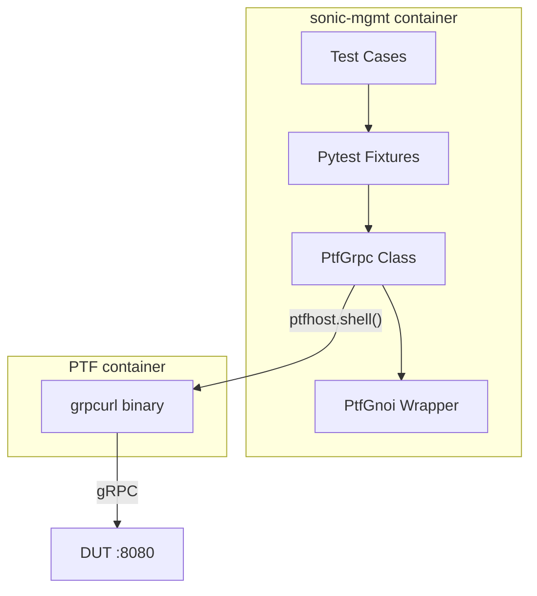

# gNOI Client Library for SONiC Test Framework

## Purpose

The purpose of this document is to describe the design of a common, reusable gNOI (gRPC Network Operations Interface) client library for sonic-mgmt test cases. This library leverages the existing grpcurl tool in the PTF container to provide a simple interface for gNOI operations without the complexity of protocol buffer compilation or Python gRPC dependencies.

## High Level Design Document

| Rev      | Date        | Author                   | Change Description                  |
|----------|-------------|--------------------------|-------------------------------------|
| Draft    | 03-12-2024  | Dawei Huang <daweihuang@microsoft.com> | Initial version for gNOI client     |
| v2       | 05-12-2024  | Dawei Huang <daweihuang@microsoft.com> | Simplified to use grpcurl           |

## Introduction

SONiC tests in the [sonic-mgmt](https://github.com/sonic-net/sonic-mgmt) repository currently lack a unified approach for testing gNOI operations. Existing implementations in `tests/gnmi/` are fragmented, mix different authentication patterns, and hide the actual gRPC interfaces from users. This design proposes a lightweight infrastructure that:

1. **Leverages grpcurl** - Uses the existing grpcurl tool in PTF container
2. **Handles infrastructure concerns** - Certificate management and PTF integration
3. **Maintains simplicity** - No proto compilation or Python gRPC dependencies
4. **Follows sonic-mgmt patterns** - Uses pytest fixtures and PTF container patterns

The gNOI protocol defines various service modules including System, File, Certificate, and Diagnostic operations. This design focuses initially on System operations while providing an extensible framework for additional services.

## Design Philosophy

### Simple JSON Interface
This design provides a clean JSON interface while handling all gRPC complexity internally:

```python
def test_system_time(gnoi_ptf):
    """Simple JSON interface - no gRPC complexity exposed"""
    # Clean function call returns JSON data
    result = gnoi_ptf.system_time()
    
    # Work with simple JSON response
    assert 'timestamp' in result
    assert result['timestamp'] > 0
```

### Infrastructure as Utilities
The library handles setup concerns while providing a simple test interface:
- grpcurl command construction and execution
- Certificate setup for secure connections
- Connection management between PTF and DUT
- Error handling and logging

This approach handles all gRPC complexity through grpcurl while exposing a clean JSON interface to test authors. The grpcurl tool handles all protocol buffer parsing and serialization automatically.

### Process Boundary Awareness
The design respects sonic-mgmt's process architecture:
- Tests run in **sonic-mgmt container** (can use `duthost.shell` safely)
- gRPC clients run in **PTF container** (isolated from SSH forking)
- Clean communication between containers via shell commands and fixtures

## Current State Analysis

### Problems with Existing Approach

| Issue | Current State | Impact |
|-------|---------------|---------|
| Mixed abstractions | Some tests use CLI tools, others direct gRPC | Inconsistent interfaces |
| Complex setup | Protocol buffer compilation, Python gRPC dependencies | High maintenance burden |
| Authentication chaos | Certificates in multiple locations | Unreliable connections |
| Limited reusability | gNMI-specific implementations | Cannot reuse for gNOI, gNSI |
| Process boundary issues | gRPC clients in sonic-mgmt container | Fork safety concerns |

## Proposed Architecture

### High-Level Design



### Directory Structure

Simplified structure using grpcurl (no proto compilation needed):

```
tests/common/
├── ptf_grpc.py             # Generic gRPC client using grpcurl
├── ptf_gnoi.py             # gNOI-specific wrapper
├── ptf_gnmi.py             # gNMI-specific wrapper (future)
└── fixtures/
    └── grpc_fixtures.py    # Pytest fixtures for gRPC clients

# No PTF-specific files needed - grpcurl is already available
# No proto compilation needed - grpcurl uses reflection
```

**Key Insight**: By using grpcurl, we eliminate the need for:
- Protocol buffer files and compilation
- Python gRPC dependencies in PTF
- Complex deployment mechanisms
- PTF-specific Python scripts

## Detailed Design

### 1. Generic gRPC Client (PtfGrpc)

The `PtfGrpc` class provides a generic interface for making gRPC calls using grpcurl:

**Key Features:**
- Configurable connection options (plaintext/TLS, timeouts, headers)
- Support for all RPC patterns (unary, server/client/bidirectional streaming)
- Automatic JSON serialization/deserialization
- Service discovery via gRPC reflection

**Core Methods:**
- `call_unary(service, method, request)` - Single request/response
- `call_server_streaming(service, method, request)` - Stream of responses
- `call_client_streaming(service, method, requests)` - Stream of requests
- `list_services()` - Discover available services
- `describe(symbol)` - Get service/method details

### 2. gNOI-Specific Wrapper (PtfGnoi)

The `PtfGnoi` class provides gNOI-specific operations using the generic `PtfGrpc` client:

**System Operations:**
- `system_time()` - Get device time
- `system_reboot(method, delay, message)` - Initiate reboot
- `system_ping(destination, ...)` - Execute ping test

**File Operations:**
- `file_get(remote_file)` - Download file (handles streaming)
- `file_put(remote_file, data)` - Upload file (handles chunking)
- `file_remove(remote_file)` - Delete remote file

**Key Benefits:**
- Clean method signatures hiding gRPC complexity
- Automatic handling of streaming responses
- Protocol-specific data transformations (e.g., base64 for binary)
### 3. Pytest Fixtures

Simple fixtures provide easy access to gRPC clients in tests:

- `ptf_grpc` - Generic gRPC client fixture
- `ptf_gnoi` - gNOI-specific client fixture  
- `ptf_grpc_custom` - Configurable client with pytest options

**Configuration Options:**
- `--grpc-port` - Target port (default: 8080)
- `--grpc-secure` - Enable TLS (default: plaintext)
- `--grpc-timeout` - Call timeout (default: 30s)

## Usage Examples

### Basic gNOI Operations

```python
def test_gnoi_system(ptf_gnoi):
    """Test basic gNOI system operations"""
    # Get system time
    time_response = ptf_gnoi.system_time()
    assert 'time' in time_response
    
    # Execute ping test
    ping_responses = ptf_gnoi.system_ping("8.8.8.8", count=3)
    assert len(ping_responses) == 3
```

### Direct gRPC Usage

```python
def test_custom_grpc(ptf_grpc):
    """Use generic gRPC client for custom services"""
    # List available services
    services = ptf_grpc.list_services()
    assert 'gnoi.system.System' in services
    
    # Make custom RPC call
    response = ptf_grpc.call_unary("myapp.Service", "Method", {"key": "value"})
    assert response['status'] == 'ok'
```

### Advanced Configuration

```python
def test_secure_grpc(ptfhost, duthost):
    """Configure secure gRPC with certificates"""
    client = PtfGrpc(ptfhost, f"{duthost.mgmt_ip}:8080")
    client.plaintext = False
    client.cert = "/path/to/cert.pem"
    client.key = "/path/to/key.pem"
    client.timeout = "60s"
    
    response = client.call_unary("gnoi.system.System", "Time")
```

## Configuration Discovery Integration

### Leveraging Existing GNMIEnvironment

The gNOI framework will integrate with the existing `GNMIEnvironment` class in `tests/common/helpers/gnmi_utils.py` for automatic server configuration discovery. Since gNOI services run on the same gRPC endpoint as gNMI services (confirmed by testing), we can reuse the existing configuration discovery infrastructure.

### Integration Pattern

**Automatic Configuration:**
```python
def test_gnoi_with_auto_config(ptfhost, duthost):
    """Automatic configuration using GNMIEnvironment"""
    from tests.common.helpers.gnmi_utils import GNMIEnvironment
    
    env = GNMIEnvironment(duthost, GNMIEnvironment.GNMI_MODE)
    client = PtfGrpc(ptfhost, env)  # Auto-configured from environment
    
    # Client automatically configured with:
    # - Correct host:port from env.gnmi_port
    # - TLS settings from CONFIG_DB
    # - Authentication parameters
    response = client.call_unary("gnoi.system.System", "Time")
```

**Manual Override:**
```python
def test_gnoi_manual_config(ptfhost, duthost):
    """Manual configuration for custom setups"""
    client = PtfGrpc(ptfhost, f"{duthost.mgmt_ip}:8080")
    client.plaintext = False
    response = client.call_unary("gnoi.system.System", "Time")
```

### Required GNMIEnvironment Improvements

The current `GNMIEnvironment` class has several issues that need to be addressed:

**Current Issues:**
1. **Incorrect default ports** - Uses 50051/50052 instead of actual default 8080
2. **Missing CONFIG_DB integration** - Claims to read CONFIG_DB but uses hard-coded values
3. **Hard failure modes** - Uses `pytest.fail()` instead of graceful degradation

**Planned Fixes:**
1. **Fix default port detection** - Use port 8080 as default (matches gnmi-native.sh)
2. **Implement proper CONFIG_DB reading** - Use existing `duthost.config_facts()` API to read `GNMI` table configuration
3. **Add graceful fallbacks** - Implement proper fallback chain: CONFIG_DB → container detection → defaults
4. **Support all configuration options** - Read port, client_auth, TLS settings from CONFIG_DB

**Configuration Reading Strategy:**
```python
# Use existing sonic-mgmt patterns
cfg_facts = duthost.config_facts(host=duthost.hostname, source="running")['ansible_facts']
gnmi_config = cfg_facts.get('GNMI', {})
port = gnmi_config.get('gnmi', {}).get('port', 8080)  # Default to 8080
client_auth = gnmi_config.get('gnmi', {}).get('client_auth', 'false')
```

### Integration Benefits

1. **Automatic configuration** - No manual port/TLS setup required for standard deployments
2. **Reuse proven patterns** - Leverages existing `duthost.config_facts()` infrastructure
3. **Unified gRPC endpoint** - Same configuration works for both gNMI and gNOI
4. **Backward compatibility** - Existing gNMI tests continue to work unchanged
5. **Flexible deployment** - Supports both auto-discovery and manual configuration

## Key Benefits

**Simplicity**
- No protocol buffer compilation required
- Uses pre-installed grpcurl in PTF container
- Clean JSON interface for all operations
- Minimal code to maintain

**Flexibility**
- Generic `PtfGrpc` works with any gRPC service
- Easy to add new protocols (gNMI, gNSI, etc.)
- Configurable connection options per test
- Supports all gRPC streaming patterns

**Reliability**
- Leverages mature, well-tested grpcurl tool
- Process isolation prevents fork issues
- Clear error messages from grpcurl
- No complex dependency management

## Conclusion

This design provides a simple, maintainable solution for gRPC testing in sonic-mgmt by leveraging the existing grpcurl tool. The approach eliminates protocol buffer complexity while providing a clean interface for test authors.

The generic `PtfGrpc` class can be easily extended for any gRPC-based protocol, making this a future-proof solution for SONiC's evolving management interfaces.