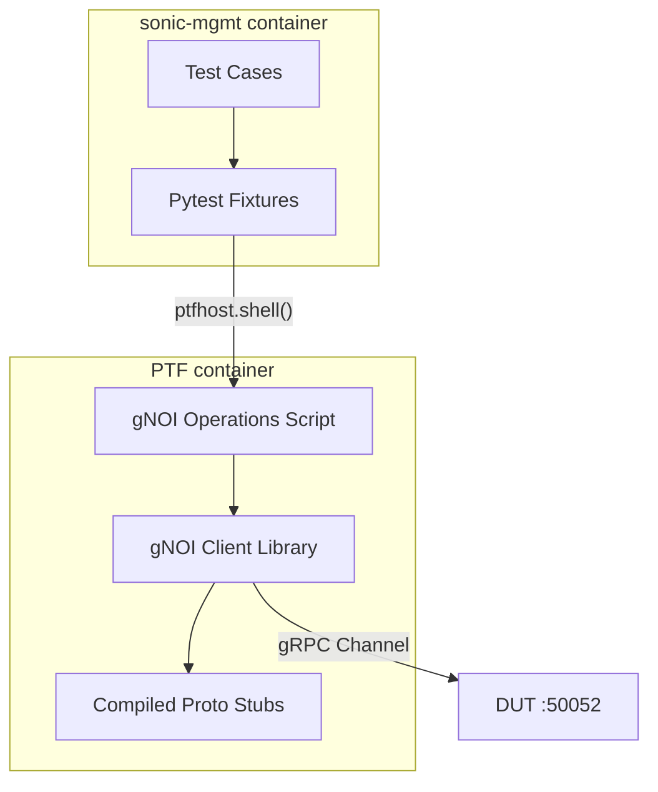

# gNOI Client Library for SONiC Test Framework

## Purpose

The purpose of this document is to describe the design of a common, reusable gNOI (gRPC Network Operations Interface) client library for sonic-mgmt test cases. This library provides test cases with direct access to gRPC stubs and channels while handling the infrastructure concerns of protocol buffer compilation, certificate management, and PTF container deployment.

## High Level Design Document

| Rev      | Date        | Author                   | Change Description                  |
|----------|-------------|--------------------------|-------------------------------------|
| Draft    | 03-12-2024  | Dawei Huang <daweihuang@microsoft.com> | Initial version for gNOI client     |

## Introduction

SONiC tests in the [sonic-mgmt](https://github.com/sonic-net/sonic-mgmt) repository currently lack a unified approach for testing gNOI operations. Existing implementations in `tests/gnmi/` are fragmented, mix different authentication patterns, and hide the actual gRPC interfaces from users. This design proposes a lightweight infrastructure that:

1. **Provides compiled gRPC stubs** - Users work directly with protocol buffer generated code
2. **Handles infrastructure concerns** - Certificate management, PTF deployment, proto compilation
3. **Maintains transparency** - No wrapper classes that hide the actual gRPC interfaces
4. **Follows sonic-mgmt patterns** - Uses pytest fixtures and PTF container patterns

The gNOI protocol defines various service modules including System, File, Certificate, and Diagnostic operations. This design focuses initially on System operations while providing an extensible framework for additional services.

## Design Philosophy

### Expose Native gRPC Objects
This design exposes native gRPC Python library objects (stubs and request/response messages) to give users maximum flexibility:

```python
def test_system_time(gnoi_ptf):
    """Users get direct access to gRPC stubs and proto objects"""
    # Access to native gRPC stub
    stub = gnoi_ptf.get_system_stub()
    
    # Access to native proto request objects
    from gnoi.system import system_pb2
    request = system_pb2.TimeRequest()
    
    # Direct gRPC call
    response = stub.Time(request)
    assert response.time > 0
```

### Infrastructure as Utilities
The library handles setup concerns while keeping the native gRPC interface accessible:
- Proto compilation and import management  
- Certificate setup and PTF deployment
- Connection management between PTF and DUT
- Error handling and logging

This approach avoids abstraction layers that hide the underlying gRPC calls, giving test authors full access to the protocol buffer objects and gRPC stubs they need.

### Process Boundary Awareness
The design respects sonic-mgmt's process architecture:
- Tests run in **sonic-mgmt container** (can use `duthost.shell` safely)
- gRPC clients run in **PTF container** (isolated from SSH forking)
- Clean communication between containers via shell commands and fixtures

## Current State Analysis

### Problems with Existing Approach

| Issue | Current State | Impact |
|-------|---------------|---------|
| Mixed abstractions | Some tests use CLI tools, others direct gRPC | Inconsistent interfaces |
| No access to native gRPC objects | Helper functions hide proto stubs and request objects | Users can't access full gRPC flexibility |
| Authentication chaos | Certificates in multiple locations | Unreliable connections |
| Manual proto management | Hand-rolled compilation in conftest.py | Fragile setup |
| No PTF integration | gRPC clients run in wrong container | Fork safety issues |

## Proposed Architecture

### High-Level Design



### Directory Structure

```
tests/common/grpc_clients/
├── __init__.py
├── gnoi_client.py          # Main gNOI client implementation
├── credentials.py          # Certificate management
└── exceptions.py          # Custom exceptions

tests/common/grpc_protos/
├── gnoi/
│   ├── __init__.py
│   ├── common/
│   │   ├── __init__.py
│   │   └── common.proto
│   ├── system/
│   │   ├── __init__.py
│   │   └── system.proto
│   └── types/
│       ├── __init__.py
│       └── types.proto
├── __init__.py
└── compile_protos.py

tests/common/fixtures/
├── gnoi_fixtures.py        # Pytest fixtures for gNOI
└── __init__.py

tests/ptftests/
└── gnoi_operations.py      # PTF-side gNOI operations

tests/common/
└── ptf_gnoi.py            # Helper class for test integration
```

## Detailed Design

### 1. Protocol Buffer Management

#### Simple Proto Compilation

```python
# tests/common/grpc_protos/compile_protos.py
import subprocess
from pathlib import Path

def compile_gnoi_protos():
    """Compile gNOI proto files - simple and reliable"""
    proto_root = Path(__file__).parent
    
    proto_files = [
        "gnoi/types/types.proto",
        "gnoi/common/common.proto", 
        "gnoi/system/system.proto"
    ]
    
    for proto_file in proto_files:
        cmd = [
            "python", "-m", "grpc_tools.protoc",
            f"--proto_path={proto_root}",
            f"--python_out={proto_root}",
            f"--grpc_python_out={proto_root}",
            str(proto_root / proto_file)
        ]
        
        result = subprocess.run(cmd, capture_output=True, text=True)
        if result.returncode != 0:
            raise Exception(f"Failed to compile {proto_file}: {result.stderr}")

if __name__ == "__main__":
    compile_gnoi_protos()
```

### 2. PTF-Side gNOI Client

#### Expose Native gRPC Stubs and Proto Objects

```python
# tests/common/grpc_clients/gnoi_client.py
import grpc
import sys
from pathlib import Path

# Add proto path
sys.path.insert(0, str(Path(__file__).parent.parent / "grpc_protos"))

from gnoi.system import system_pb2, system_pb2_grpc
from .credentials import create_credentials
from .exceptions import GnoiError

class GnoiClient:
    """Lightweight gNOI client - exposes native gRPC stubs and proto objects"""
    
    def __init__(self, target, secure=True, cert_dir=None):
        self.target = target
        self.channel = None
        self.system_stub = None
        
        self._connect(secure, cert_dir)
        
    def _connect(self, secure, cert_dir):
        """Create gRPC channel and stubs"""
        if secure and cert_dir:
            credentials = create_credentials(cert_dir)
            self.channel = grpc.secure_channel(self.target, credentials)
        else:
            self.channel = grpc.insecure_channel(self.target)
            
        # Create stubs - users can access these directly
        self.system_stub = system_pb2_grpc.SystemStub(self.channel)
        
    def system_time(self):
        """Get system time - direct gRPC call"""
        request = system_pb2.TimeRequest()
        try:
            response = self.system_stub.Time(request)
            return {
                'time_ns': response.time,
                'timestamp': response.time // 1000000000
            }
        except grpc.RpcError as e:
            raise GnoiError(f"system_time failed: {e.details()}")
            
    def system_reboot(self, method=0, delay=0, message=""):
        """Reboot system - direct gRPC call"""
        request = system_pb2.RebootRequest(
            method=method,
            delay=delay, 
            message=message
        )
        try:
            response = self.system_stub.Reboot(request)
            return {'status': 'success', 'response': str(response)}
        except grpc.RpcError as e:
            raise GnoiError(f"system_reboot failed: {e.details()}")
            
    def close(self):
        if self.channel:
            self.channel.close()
            
    def __enter__(self):
        return self
        
    def __exit__(self, exc_type, exc_val, exc_tb):
        self.close()
```

### 3. PTF Operations Script

#### Clean Interface Between Containers

```python
# tests/ptftests/gnoi_operations.py
import sys
import json
sys.path.insert(0, '/root/grpc_clients')

from gnoi_client import GnoiClient

def main():
    if len(sys.argv) < 3:
        print(json.dumps({"error": "Usage: gnoi_operations.py <operation> <target> [args...]"}))
        sys.exit(1)
        
    operation = sys.argv[1]
    target = sys.argv[2]
    args = sys.argv[3:] if len(sys.argv) > 3 else []
    
    try:
        with GnoiClient(target, secure=False) as client:
            if operation == "time":
                result = client.system_time()
            elif operation == "reboot":
                method = int(args[0]) if args else 0
                delay = int(args[1]) if len(args) > 1 else 0
                message = args[2] if len(args) > 2 else ""
                result = client.system_reboot(method, delay, message)
            else:
                result = {"error": f"Unknown operation: {operation}"}
                
        print(json.dumps(result))
        
    except Exception as e:
        print(json.dumps({"error": str(e)}))
        sys.exit(1)

if __name__ == "__main__":
    main()
```

### 4. Test Integration Helper

#### Clean Python Interface for Tests

```python
# tests/common/ptf_gnoi.py
import json
from .grpc_clients.exceptions import GnoiError

class PtfGnoiHelper:
    """Helper for calling gNOI operations from PTF container"""
    
    def __init__(self, ptfhost, target):
        self.ptfhost = ptfhost
        self.target = target
        
    def get_system_stub(self):
        """Get native gRPC SystemStub for direct access"""
        result = self._call_operation('get_stub', 'system')
        # This would return a way to access the stub, but for now
        # we'll provide helper methods that expose the native interface
        
    def _call_operation(self, operation, *args):
        """Call gNOI operation and parse JSON response"""
        args_str = " ".join(str(arg) for arg in args)
        cmd = f"python3 /root/ptftests/gnoi_operations.py {operation} {self.target} {args_str}"
        
        result = self.ptfhost.shell(cmd, module_ignore_errors=True)
        
        if result['rc'] != 0:
            raise GnoiError(f"gNOI operation failed: {result['stderr']}")
            
        try:
            response = json.loads(result['stdout'])
        except json.JSONDecodeError:
            raise GnoiError(f"Invalid JSON response: {result['stdout']}")
            
        if 'error' in response:
            raise GnoiError(f"gNOI error: {response['error']}")
            
        return response
        
    def system_time(self):
        """Get system time"""
        return self._call_operation('time')
        
    def system_reboot(self, method=0, delay=0, message=""):
        """Reboot system"""
        return self._call_operation('reboot', method, delay, f"'{message}'")
```

### 5. Pytest Fixtures

#### Session-Level Setup and Deployment

```python
# tests/common/fixtures/gnoi_fixtures.py
import pytest
from pathlib import Path
from ..ptf_gnoi import PtfGnoiHelper

@pytest.fixture(scope="session")
def deploy_gnoi_to_ptf(ptfhost):
    """Deploy gNOI library and scripts to PTF container"""
    
    # Compile protos first
    from ..grpc_protos.compile_protos import compile_gnoi_protos
    compile_gnoi_protos()
    
    # Copy library files to PTF
    grpc_clients_path = Path(__file__).parent.parent / "grpc_clients"
    grpc_protos_path = Path(__file__).parent.parent / "grpc_protos"
    gnoi_ops_path = Path(__file__).parent.parent.parent / "ptftests" / "gnoi_operations.py"
    
    # Deploy to PTF container
    ptfhost.shell("mkdir -p /root/grpc_clients /root/grpc_protos /root/ptftests")
    ptfhost.copy(src=str(grpc_clients_path), dest="/root/", is_directory=True)
    ptfhost.copy(src=str(grpc_protos_path), dest="/root/", is_directory=True) 
    ptfhost.copy(src=str(gnoi_ops_path), dest="/root/ptftests/")
    
    # Install dependencies if needed
    result = ptfhost.shell("python3 -c 'import grpc'", module_ignore_errors=True)
    if result['rc'] != 0:
        ptfhost.shell("pip3 install grpcio grpcio-tools protobuf")
    
    return True

@pytest.fixture
def gnoi_ptf(deploy_gnoi_to_ptf, ptfhost, duthosts, rand_one_dut_hostname):
    """Provide gNOI helper for tests"""
    duthost = duthosts[rand_one_dut_hostname]
    target = f"{duthost.mgmt_ip}:50052"
    
    return PtfGnoiHelper(ptfhost, target)

# Optional: Add pytest command line options
def pytest_addoption(parser):
    parser.addoption(
        "--gnoi_port",
        type=int,
        default=50052,
        help="gNOI server port (default: 50052)"
    )
    
    parser.addoption(
        "--gnoi_insecure",
        action="store_true", 
        default=False,
        help="Use insecure gNOI connections"
    )
```

### 6. Certificate Management

#### Simple Certificate Handling

```python
# tests/common/grpc_clients/credentials.py
import grpc
from pathlib import Path

def create_credentials(cert_dir):
    """Create gRPC SSL credentials from certificate directory"""
    cert_path = Path(cert_dir)
    
    with open(cert_path / "ca.pem", "rb") as f:
        root_cert = f.read()
    with open(cert_path / "client.crt", "rb") as f:
        client_cert = f.read()
    with open(cert_path / "client.key", "rb") as f:
        client_key = f.read()
        
    return grpc.ssl_channel_credentials(
        root_certificates=root_cert,
        private_key=client_key,
        certificate_chain=client_cert
    )

def setup_certificates(duthost, localhost):
    """Set up certificates for secure gNOI connection"""
    # This would implement certificate generation and deployment
    # Similar to existing gnmi certificate setup but cleaner
    pass
```

## Usage Examples

### Basic Test Case

```python
def test_system_operations(gnoi_ptf):
    """Test basic gNOI system operations"""
    
    # Get system time
    time_result = gnoi_ptf.system_time()
    assert 'timestamp' in time_result
    assert time_result['timestamp'] > 0
    
    # Test reboot (with delay so it doesn't actually reboot)
    reboot_result = gnoi_ptf.system_reboot(method=0, delay=300, message="Test reboot")
    assert reboot_result['status'] == 'success'
```

### Integration with DUT Configuration

```python
def test_reboot_after_config_change(duthost, gnoi_ptf):
    """Test gNOI reboot after configuration changes"""
    
    # Make configuration changes via SSH (safe)
    duthost.shell("config save")
    duthost.shell("config interface shutdown Ethernet0")
    
    # Verify time before reboot
    time_before = gnoi_ptf.system_time()
    
    # Schedule reboot via gNOI
    result = gnoi_ptf.system_reboot(method=0, delay=60, message="Config change reboot")
    assert result['status'] == 'success'
    
    # Additional verification could go here
```

### Advanced Usage - Direct Stub Access

```python
def test_direct_grpc_access(deploy_gnoi_to_ptf, ptfhost, duthosts, rand_one_dut_hostname):
    """For advanced users who need direct gRPC access"""
    
    duthost = duthosts[rand_one_dut_hostname]
    target = f"{duthost.mgmt_ip}:50052"
    
    # Call PTF script directly for custom operations
    result = ptfhost.shell(f"""
        python3 -c "
        import sys
        sys.path.insert(0, '/root/grpc_clients')
        from gnoi_client import GnoiClient
        
        with GnoiClient('{target}', secure=False) as client:
            # Direct access to gRPC stubs
            request = client.system_stub.__class__.__module__.TimeRequest()
            response = client.system_stub.Time(request)
            print(f'Raw time: {{response.time}}')
        "
    """)
    
    assert result['rc'] == 0
    assert 'Raw time:' in result['stdout']
```

## Implementation Plan

### Phase 1: Core Infrastructure (Week 1)
1. Create directory structure
2. Implement proto compilation utility
3. Create basic gNOI client with System operations
4. Implement PTF operations script
5. Basic pytest fixture

### Phase 2: Integration and Testing (Week 2)  
1. Implement PtfGnoiHelper class
2. Create comprehensive fixtures
3. Write example test cases
4. Test deployment to PTF container
5. Documentation and examples

### Phase 3: Extension and Hardening (Week 3)
1. Add certificate management for secure connections
2. Implement error handling and retry logic
3. Add support for additional gNOI services
4. Performance testing and optimization
5. Integration with existing test suites

### Phase 4: Migration and Documentation (Week 4)
1. Migrate existing gNOI tests to new library
2. Create comprehensive documentation
3. Add monitoring and logging
4. Code review and testing
5. Deployment to CI/CD pipeline

## Benefits

### For Test Authors
- **Native gRPC Access**: Direct access to gRPC stubs and proto request/response objects
- **Transparency**: Can see exactly what gRPC calls are being made
- **Familiar Patterns**: Uses standard pytest fixtures and sonic-mgmt patterns
- **Maximum Flexibility**: Full access to all proto fields and gRPC features

### For Test Maintenance
- **Centralized**: Single location for gNOI client logic
- **Modular**: Easy to add new gNOI services
- **Testable**: Library components can be unit tested
- **Fork Safe**: Clean separation between sonic-mgmt and PTF processes

### For CI/CD
- **Reliable**: No certificate/authentication confusion
- **Fast**: Session-level deployment, minimal overhead
- **Observable**: Clear error messages and logging
- **Scalable**: PTF container isolation allows parallel testing

## Security Considerations

### Default Security
- Support both secure (TLS) and insecure connections
- Secure by default when certificates are available
- Proper certificate validation and cleanup

### Test Isolation
- Each test session gets clean certificate setup
- PTF container isolation prevents cross-test interference
- No persistent credentials or connections

## Performance Considerations

### Deployment Optimization
- Session-scoped deployment to PTF (one-time cost)
- Proto compilation cached between test runs
- Connection reuse within PTF container

### Minimal Overhead
- Direct gRPC calls with minimal wrapping
- JSON-based communication between containers (lightweight)
- No persistent services or background processes

## Conclusion

This design provides a clean foundation for gNOI testing in sonic-mgmt by exposing native gRPC Python objects while managing infrastructure setup. Test authors get direct access to gRPC stubs and protocol buffer request/response objects, providing maximum flexibility to use all gRPC features and proto fields.

The infrastructure-as-utilities approach handles the complex setup (proto compilation, certificates, PTF deployment) while keeping the native gRPC interface fully accessible. The PTF container deployment strategy ensures fork safety while maintaining familiar sonic-mgmt test patterns.

This approach makes it easy to adopt incrementally, extend with new gNOI services, and maintain over time while giving developers the full power of the native gRPC Python library.