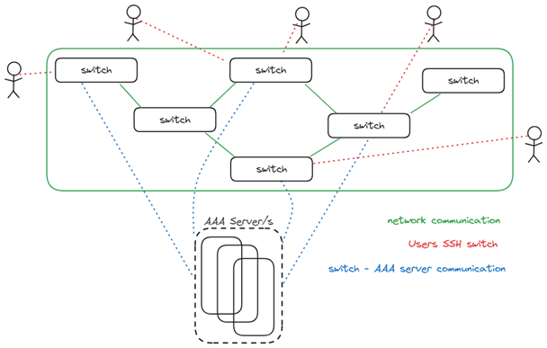

# LDAP Test Plan

## Related documents

| **Document Name** | **Link** |
|-------------------|----------|
| LDAP HLD | [HLD](https://github.com/sonic-net/SONiC/tree/master/doc/aaa/ldap/hld_ldap.md)|

## Overview

### Description

LDAP (Lightweight Directory Access Protocol) provides Authentication, Authorization and Accounting (AAA) services, used
most commonly for administration/monitoring access to devices.

For network devices, such as switches, LDAP is an AAA method that is used for authenticating/authorizing users through a
centralized server/DB, rather than against local linux files of each device.

Also, management and maintenance of users/group along the network in a centralized server is better practice and much
more scalable, than doing it on every device in the network.

Authentication through LDAP is supported for both SSH and serial connection (configuration and process are the same as
with SSH).



### Flow

#### 1. Configure LDAP as an auth method for the device

* LDAP should be configured as an active method to authenticate/authorize users
* The configuration involves specifying the LDAP server address, port, binding secret, etc. (discussed later).

#### 2. Binding the device to the LDAP server

* After configuring LDAP, the device is setting up a connection/binding with the LDAP server, where the device itself is
  noted as the client of the LDAP server.

#### 3. User authentication/authorization to a device

* When a user attempts to log into a device with LDAP configured, the device queries the LDAP server with the given user
  credentials, and asking the server to authenticate and decide the privileges for the user.
* The server seeks for the given user against it's DB, and responds dis/approval of the user, along with other info such
  as groups.
* The client (device) grants/denies access to the end user, according to the response from the server.

### Scope

* The purpose is to test functionality of LDAP authentication on the SONIC switch DUT.
* The test assumes that there is an LDAP server that is reachable by the DUT, and that DUT is installed with version
  that supports LDAP.

### Scale / Performance

No scale/performance test involved in this test plan.

### CLI commands

| **Command**                                                           | **Comment**  |
|-----------------------------------------------------------------------|-------------|
| **Configuration commands**                                            |
| config aaa authentication login { local / ldap }                      | Authentication login policy |
| config ldap-server <add/delete/update> <ADDRESS> [--priority <1 - 8>] | Configure LDAP server with priority (optional)   |
| config ldap global port <1-65535>                                     | Port of LDAP server   |
| config ldap global bind-dn <TEXT>                                     | LDAP binding dn |
| config ldap global bind-password <TEXT>                               | LDAP binding password/secret   |
| config ldap global bind-timeout <0 – 120>                             | LDAP binding timeout  |
| config ldap global version <1 - 3>                                    | LDAP version |
| config ldap global base-dn <TEXT>                                     | LDAP base-dn |
| config ldap global timeout <1-60>                                     | LDAP timeout |
| **Show commands**                                                     |
| show aaa                                                              | Show AAA configuration   |
| show ldap global                                                      | Show global LDAP configuration  |
| show ldap-server                                                      | Show LDAP servers configuration  |

### Examples

#### Configure LDAP

Configure LDAP and LDAP server:

```
sudo config ldap-server add 1.2.3.4 --priority 1
sudo config ldap global port 389
sudo config ldap global bind-dn bind-dn
sudo config ldap global bind-password secret
sudo config ldap global bind-timeout 5
sudo config ldap global version 3
sudo config ldap global base-dn base-dn
sudo config ldap global timeout 5
```

Enable LDAP authentication:

```
sudo config aaa authentication login ldap
```

#### Show LDAP Configuration

Show LDAP configurations:

```
show ldap global
show ldap-server
```

Show LDAP configured as authentication policy:

```
show aaa
```

### Related DUT configuration files

Relevant existing/new tables config_db.json (with default values):

```
LDAP_TABLE:{
   global:{
      "bind_dn": {{ (emtpy) }}
      "bind_password": {{ empty with starts **** }}
      "bind_timeout": {{ (5 (duration_sec)) }}
      "version": {{3}}
      "base_dn": {{ou=users,dc=example,dc=com (string)}}
      "port": {{389}}
      "timeout": {{5 (duration_sec)}}
   }
}

LDAP_SERVER:{
   <Sever-ip>:{
      priority: {{1}}
   }
}

AAA:{
   Authentication:{
      failthought: {{“True”}}
      login :{{“local}}
   }
}
```

### Supported topology

The test will be supported on any topology.

## Test cases

### 1. LDAP configuration Test

#### Objective

Verify LDAP configuration and show commands work.

#### Steps

1. Set LDAP configuration.
2. Show LDAP configuration.
3. Verify configuration against show output.

### 2. LDAP authentication Test

#### Objective

Verify LDAP authentication via ssh works.

#### Steps

1. Configure LDAP server.
2. Verify LDAP user login via ssh is successful, and login username is equal with LDAP username (using whoami).
3. Verify non-LDAP user (local user) cannot login.
