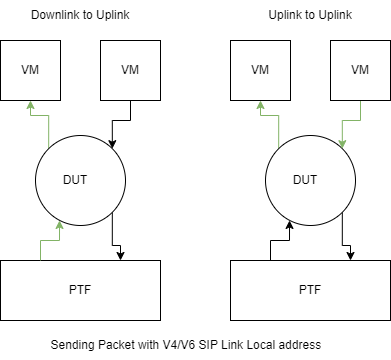
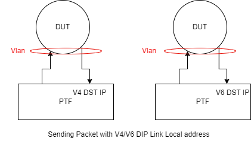
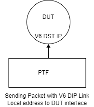

- [Overview](#overview)
  - [Scope](#scope)
  - [Testbed](#testbed)
- [Setup configuration](#setup-configuration)
- [Test cases](#test-cases)

# Test for Forwarding Link-local Traffic

## Overview

The goal of these tests is to verify that systems that support forwarding Link-local traffic allow packets with link-local source/destination IP to be forwarded by the dut.

## Link-Local Address

In computer networking, a link-local address is the IP address that is to be used for communication within a logical division of the network or in the broadcast domain to which the host is connected.

The uniqueness in addresses is not assured in another network segment. Therefore, do not forward by routers.
The other devices connected to the same physical (or logical) link can communicate using IPv4 Link-Local addresses. IPv4 Connection-Local communication isn’t appropriate for communication with gadgets that are not genuinely associated with a similar connection. The IP address to be utilized for these addresses lies in the scope of 169.254.1.0 to 169.254.254.255.
The total addresses some others out to be 65,023 in the range given in the above point.
IPv4 Link-Local addresses should only be used in controlled conditions, such as when reliable, routable addresses are unavailable (such, on ad hoc or isolated networks). Moreover, it is not preferable to configure IPv4 Link-Local addresses and routable addresses on the same interface simultaneously.
Assignment of link-local addresses is usually carried out in two ways- one is manually through an administrator and the other one is automatic. Mostly, they are preferred to be assigned with autoconfiguration.
The link-local address performs a useful function of automatic address configuration in IPv4 when DHCP (Dynamic Host Configuration Protocol)server like no external address method available and failure of other methods as well, knowledge discovery, or at that time also when routers are not available. The management of various internal protocol components is required in IPv6 so these addresses are mandatory in version 6.
It is used for communication among nodes that are present on the same link.

## IPv6 Link-Local Address

An IPv6 link-local address enables a device to communicate with other IPv6-enabled devices on the same link and only on that link (subnet). Packets with a source or destination link-local address cannot be routed beyond the link from where the packet originated.

Unlike IPv4 linK-local addresses, IPv6 link-local addresses have a significant role in various aspects of the network. The global unicast address is not a requirement; however, every IPv6-enabled network interface is required to have a link-local address.

If a link-local address is not configured manually on an interface, the device will automatically create its own without communicating with a DHCP server. IPv6-enabled hosts create an IPv6 link-local address even if the device has not been assigned a global unicast IPv6 address. This allows IPv6-enabled devices to communicate with other IPv6-enabled devices on the same subnet. This includes communication with the default gateway (router).

IPv6 link-local addresses are in the FE80::/10 range. The /10 indicates that the first 10 bits are 1111 1110 10xx xxxx. The first hextet has a range of 1111 1110 1000 0000 (FE80) to 1111 1110 1011 1111 (FEBF).

### Scope

The tests is targeting a running SONIC system with fully functioning configuration.
The purpose of the tests is to check that traffic with link-local source/destination IP is recived and routed by the dut.

### Related DUT CLI commands

| Configuration Command   | Comment                                   |
| ----------------------- | ----------------------------------------- |
| config interface ip add | To add link local addres to DUT interface |

| Show Command             | Comment                         |
| ------------------------ | ------------------------------- |
| show interfaces counters | Display the interfaces counters |
| show ip route            | Dispaly rounting on DUT         |

### Related DUT configuration files

N/A

### Related SAI APIs

N/A

## Test structure

### Setup configuration

This test requires a running SONIC system with fully functioning configuration.
This capability is only supported on systems that have SAI_NOT_DROP_SIP_DIP_LINK_LOCAL=1 in sai.profile.
the tests are supported on all topologies and are covering router portes, port channel and ports in vlan.

### Configuration scripts

N/A

## Test cases

### Test case #1 and #2 - IPv4 and IPv6 Link-Local Source IP Traffic

#### Test objective

Verify that traffic sent from PTF with IPv4/IPv6 source IP is being forwaded.

1. send packets via scapy from PTF with Link local source ip address
2. Verify packets are routed
3. Verify Counters have increased for both links.

### Test case #3 - IPv4 Link-Local Destination IP Traffic

#### Test objective

Verify that traffic sent from PTF with IPv4 destination IP is being forwarded by DUT.

1. Add an Ipv4 Link-local address to PTF interfaces.
2. Add dut interfaces to Vlan.
3. Send traffic via scapy from PTF with Link local destination ip address
4. Verify packets are switched
5. Verify Counters have increased for both links.

### Test case #4 - IPv6 Link-Local Destination IP Traffic

#### Test objective

Verify that traffic sent from PTF with IPv6 destination IP is being forwarded by DUT.

1. Add dut interfaces to Vlan.
2. Send traffic via scapy from PTF with Link local destination ip address
3. Verify packets are switched
4. Verify Counters have increased for both links.

### Test case #5 - IPv6 Link-Local Dut Interface Destination IP Traffic

#### Test objective

Verify that traffic sent from PTF with Dut Interface IPv6 destination IP is being traped by CPU.

1. Send traffic via scapy from PTF with dut Interface IPv6 Link local destination ip address
2. Verify packets are traped by tcpdump
3. Verify Counters have increased on the link.
