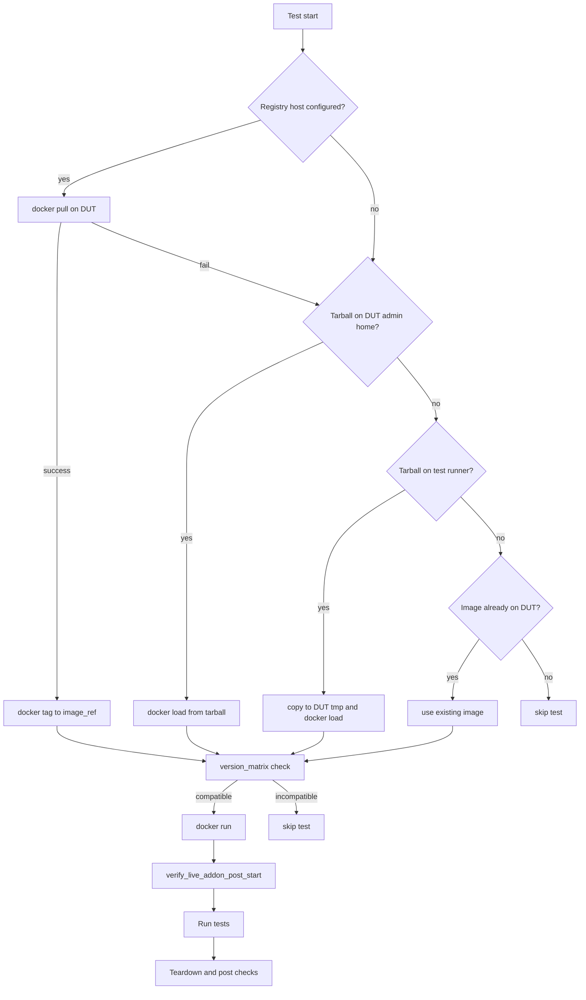
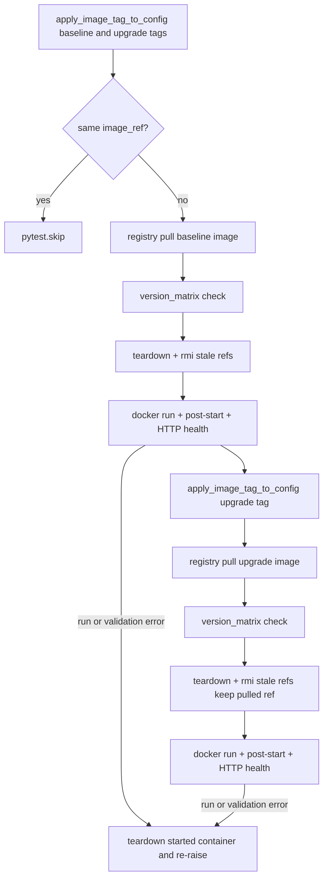

# Live-Addon Docker Test Framework Test Plan and High-Level Design

## 1. Problem statement

SONiC platforms may ship a vendor-specific **live-addon** container (diagnostics, health agent,
utility services) alongside the base image. The container is installed with `docker run`, not
`sonic-package-manager`.

The sonic-mgmt test module `tests/live_addon_docker/` automates:

- Resolving the live-addon image (registry pull, tarball, or pre-loaded image on the DUT)
- Starting the container from vendor JSON configuration
- Post-start validation after every `docker run` (single instance, logs or supervisord poll)
- HTTP health and survival across `config reload`
- Teardown checks (no new cores, container removed, syslog spot-check)

The module name is vendor-neutral. Vendor-specific names (image repo, container name, mount paths)
live in per-ASIC JSON files under `tests/live_addon_docker/files/`.

## 2. Scope

| In scope | Out of scope |
|----------|--------------|
| `docker pull` / `docker load` / `docker run` on the DUT | `sonic-package-manager` install paths |
| HTTP health endpoint probe from the DUT | Building or publishing docker images |
| Post-start checks via `verify_live_addon_post_start` (logs and/or supervisord) | Shared tarball distribution between vendors |
| Optional `version_matrix` skip for image vs SONiC compatibility | |
| Registry image upgrade test (`test_live_addon_docker_image_upgrade`) | |
| Registry override per test run (`--live_addon_docker_registry`) | |

**Platform filter:** `asic_type=cisco-8000` only (see
`tests/common/plugins/conditional_mark/tests_mark_conditions_live_addon_docker.yaml`). VS/KVM is
skipped. Additional asic types can be added when supported.

## 3. Test coverage

Post-start validation is **not** duplicated in pytest cases; it runs in the module fixture and inside
`run_config_reload_live_addon_start_reload_health` on each `docker run`.

| Test | Validates |
|------|-----------|
| `test_live_addon_docker_health_http` | HTTP `/health` returns expected status within probe timeout |
| `test_live_addon_docker_health_after_config_reload_cycle` | Stop container → `config reload` → `docker run` + full post-start → `config reload` → teardown + `docker run` + restart post-start (120s supervisord) → HTTP health |
| `test_live_addon_docker_image_upgrade` | Registry pull baseline (`--live_addon_docker_image_tag`) → post-start + health → pull upgrade (`--live_addon_docker_image_upgrade_tag`) → post-start + health (standalone; does not use module fixture) |

**Module fixture** `live_addon_docker_setup_teardown`: install once per module, `docker run`,
`verify_live_addon_post_start` (full readiness), yield `(duthost, cfg)`, then teardown and
post-teardown checks.

**Image upgrade test** (`test_live_addon_docker_image_upgrade`) is standalone: it uses
`live_addon_docker_vendor_cfg_raw`, requires both CLI image tags and registry access, and calls
`upgrade_live_addon_docker_image` twice (baseline then upgrade).

**Typical runtime (Cisco):** first start may wait up to **900s** for startup logs; config-reload
cycle adds another full post-start plus a **120s** supervisord poll on restart; upgrade test runs
two full install cycles; HTTP health polls up to **900s** when needed.

**Topology:** tests are marked `pytest.mark.topology("any")`. Use `-t any` or `-t t1,any` with
`run_tests.sh` (a bare `-t t1` skips these tests).

## 4. Repository layout

```
tests/live_addon_docker/
├── conftest.py                      # pytest options and fixtures
├── live_addon_docker_helpers.py     # DUT command assembly and validation
├── test_live_addon_docker.py        # health-focused test cases
└── files/
    └── cisco-8000_live_addon_docker.json   # Cisco 8000 default config
```

Default config path when `--live-addon-docker-config` is not set:

```
tests/live_addon_docker/files/<asic_type>_live_addon_docker.json
```

Example: `asic_type=cisco-8000` → `cisco-8000_live_addon_docker.json`.

## 5. Image and container naming

### 5.1 Docker image repository (SONiC ACR convention)

Repository name follows the same pattern as `docker-syncd-cisco` and `docker-gbsyncd-cisco`:

```
docker-live-addon-<vendor>[:tag]
```

| Field | Cisco 8000 example |
|-------|-------------------|
| `vendor` (JSON) | `cisco` |
| ACR repository | `docker-live-addon-cisco` |
| `docker_run.image_ref` | `docker-live-addon-cisco:latest` |
| Tarball filename | `docker-live-addon-cisco.gz` |

The `vendor` field drives `docker_run.image_ref` when only `image_tag` is set. An explicit
`image_ref` in JSON must use the `docker-live-addon-<vendor>` repository for registry pull to
succeed.

### 5.2 Container name (vendor-specific)

The running container name is **not** normalized across vendors. Cisco keeps the manifest label
name:

```json
"docker_run": { "container_name": "cisco-utility" }
"validation": { "docker_container_name": "cisco-utility" }
```

Other vendors set their own `container_name` in JSON (for example `acme-diagnostics`).

## 6. Image resolution flow

Registry pull is attempted first when a registry host is available. On failure, the framework
falls back to tarballs or an image already on the DUT.



**Image upgrade test** (`test_live_addon_docker_image_upgrade`) does not use tarball or
pre-loaded-image fallbacks. It always registry-pulls using explicit CLI tags:



`version_matrix` runs after pull and **before** container teardown during upgrade, so a skip leaves
the previously running live-addon container in place.

Registry host comes from Ansible `docker_registry_host` or pytest `live_addon_docker_registry`
(see §7). Tarball path on the DUT is `dut_tarball_home` plus `tarball_filename` from JSON.

**Pull tag selection (module / baseline tests):**

1. `--live_addon_docker_image_tag` if set (baseline / CI build id)
2. Else tag from `docker_run.image_ref` when not `latest`
3. Else `duthost.os_version` (same convention as syncd-rpc / `swap_syncd`)

**Image upgrade test** uses `--live_addon_docker_image_tag` for baseline and
`--live_addon_docker_image_upgrade_tag` for the upgrade pull (both required).

## 7. Pytest CLI parameters

| Option | Purpose |
|--------|---------|
| `--live-addon-docker-config` | Override path to vendor JSON |
| `--live-addon-docker-tarball` | Path to `.gz` on the test runner |
| `--live_addon_docker_registry` | Registry host for pull (overrides Ansible `docker_registry_host` for this module) |
| `--live_addon_docker_image_tag` | Baseline / module tests: image tag for registry pull and `docker_run.image_ref` |
| `--live_addon_docker_image_upgrade_tag` | Upgrade test only: target image tag after baseline |
| `--public_docker_registry` | Use `public_docker_registry_host` without login (same as `swap_syncd`) |

**Example via `run_tests.sh` (module tests):**

```bash
cd tests
./run_tests.sh \
  -n <testbed> \
  -d <dut> \
  -t any \
  -c live_addon_docker/test_live_addon_docker.py \
  -i ../ansible/veos \
  -e "--live_addon_docker_registry=myacr.azurecr.io --live_addon_docker_image_tag=baseline-build-001"
```

**Example (upgrade test):**

```bash
-e "--live_addon_docker_registry=<ucs-ip>:5000 --public_docker_registry \
    --live_addon_docker_image_tag=baseline-build-001 \
    --live_addon_docker_image_upgrade_tag=new-build-002"
```

Each vendor or MSFT can point at their own container registry without sharing tarballs.

## 8. Vendor JSON schema

Required top-level fields:

| Key | Description |
|-----|-------------|
| `vendor` | Short vendor id; drives `docker-live-addon-<vendor>` repo name |
| `docker_run` | `image_ref`, `container_name`, `cli_args` for `docker run` |
| `health` | HTTP probe: `port`, `url_path`, `bind_host`, `expect_http_code`, optional wait/probe timeouts |
| `validation` | `docker_container_name`; optional `expected_processes`, `startup_log`, `max_running_instances` |
| `tarball_filename` | `.gz` name for tarball fallback paths |

Optional:

| Key | Description |
|-----|-------------|
| `version_matrix` | Skip when live-addon `package.version` and DUT SONiC are not listed as compatible |
| `candidate_image_refs` | Extra refs for `docker image inspect` on the DUT |
| `dut_tarball_home` | DUT path for pre-staged tarball (default `/home/admin`) |

Commands executed on the DUT are built only from this JSON (`live_addon_docker_helpers.py`).
Post-teardown checks (cores, syslog grep, container absent) are fixed in code.

### Post-start validation (`verify_live_addon_post_start`)

Called after **every** `docker run` (module fixture, config-reload steps, restarts). Always runs:

1. Single-instance check (`max_running_instances`, exact container name, optional image ancestor filter)

Then readiness (both may run when configured):

| Mode | Startup logs | Processes |
|------|--------------|-----------|
| `full_readiness=True` + `startup_log` configured | Poll until patterns match | One-shot ``supervisorctl`` assert after logs pass |
| `full_readiness=True`, no `startup_log` | Skipped | Poll up to 120s |
| `full_readiness=False` (restart) | Skipped (avoids long log wait) | Poll up to 120s |

Log patterns and ``supervisorctl`` are complementary: logs prove supervisord/diagnostic startup
lines; ``supervisorctl`` confirms program state directly.

**`validation` post-start fields (Cisco example — matches `cisco-8000_live_addon_docker.json`):**

```json
"validation": {
  "docker_container_name": "cisco-utility",
  "expected_processes": ["start", "health-monitor", "health-server"],
  "startup_log": {
    "wait_seconds": 900,
    "poll_interval_seconds": 30,
    "session_start_pattern": "supervisord started with pid",
    "required_patterns": [
      "supervisord started with pid",
      "success: start entered RUNNING state",
      "success: health-monitor entered RUNNING state",
      "success: health-server entered RUNNING state",
      "diagnostic is running now"
    ],
    "forbidden_patterns": ["spawnerr", "exited too quickly", "entered FATAL state", "BACKOFF", "[FAILED]"]
  }
}
```

- `expected_processes` — supervisord program names for restart polling and vendors without
  `startup_log`. Names normalize `_` vs `-`. Omit to use code defaults; set `[]` to skip.
- `max_running_instances` — default **1**. Assert exact running count by name, at most that many
  in `docker ps -a`, and (unless `enforce_single_image_instance` is false) running count from
  `docker_run.image_ref`.
- `startup_log` — **vendor-specific**. Poll `docker logs` every `poll_interval_seconds` until all
  `required_patterns` appear. Fail on `forbidden_patterns`. Omit or use empty `required_patterns`
  to skip.
  - **Timing:** code default `wait_seconds` is **120s**. Cisco sets **900s** because online
    diagnostic waits for syncd uptime before `diagnostic is running now` can appear.
  - **Process poll (restarts):** code default **120s** / **30s** interval (`DEFAULT_PROCESS_*`);
    independent of `startup_log.wait_seconds` and `health.probe_timeout_seconds`.
  - **Poll interval:** default **30s** when omitted. Intermediate poll status is DEBUG only; log
    text prints once on success or final timeout (last 6000 chars on failure).
  - **Log scope:** ``docker logs --since <StartedAt>`` from ``docker inspect``. Optional
    ``session_start_pattern`` slices from the last matching line if ``StartedAt`` is unavailable.

## 9. Version matrix

Omit `version_matrix`, set it to `null`, or use `[]` to disable the check.

The check runs after the image is on the DUT (`docker load` or already present) and before
`docker run`. It uses `docker image inspect` and reads `package.version` from label
`com.azure.sonic.manifest` (not the Docker `:tag`).

Each row may include:

- `utility_package_version_glob` / `utility_image_version_glob` — fnmatch on `package.version`
- `compatible_sonic_globs` — fnmatch on `duthost.os_version`, `sonic_release`, or `show version` first line

**Skip conditions:**

- No row matches `package.version` (including when the manifest label is missing)
- Matching row has no `compatible_sonic_globs`
- DUT SONiC does not match any allowed glob

**Upgrade test skip conditions** (in `test_live_addon_docker_image_upgrade`):

- `pytest.skip` when `--live_addon_docker_image_tag` is omitted (before any DUT steps)
- `pytest.skip` when `--live_addon_docker_image_upgrade_tag` is omitted (before any DUT steps)
- `pytest.skip` when baseline and upgrade tags resolve to the same `docker_run.image_ref` (before
  any DUT steps; compared from config only)

**Upgrade test and `version_matrix`:** `upgrade_live_addon_docker_image` pulls from the registry,
runs `require_version_matrix_or_skip` on the pulled ref, then tears down the container. If the
matrix check skips, the prior container (if any) is left running and the test ends without applying
the incompatible upgrade image.

If `docker run`, post-start validation, or HTTP health raises after a container has been started,
`upgrade_live_addon_docker_image` tears down that started container before re-raising.

Images built without `com.azure.sonic.manifest` skip until the build pipeline adds standard SONiC
docker labels.

Example:

```json
"version_matrix": [
  {
    "utility_package_version_glob": "202405*",
    "compatible_sonic_globs": ["202411*", "202505*"]
  }
]
```

## 10. Test cases

Post-start validation is **not** duplicated in pytest cases; it runs in the fixture and inside
`run_config_reload_live_addon_start_reload_health` on each `docker run`.

| Test | Validates |
|------|-----------|
| `test_live_addon_docker_health_http` | HTTP `/health` returns expected status within probe timeout |
| `test_live_addon_docker_health_after_config_reload_cycle` | Stop container → `config reload` → `docker run` + full post-start → `config reload` → teardown + `docker run` + restart post-start (120s supervisord) → HTTP health |
| `test_live_addon_docker_image_upgrade` | Registry pull baseline (`--live_addon_docker_image_tag`) → post-start + health → pull upgrade (`--live_addon_docker_image_upgrade_tag`) → post-start + health (standalone; skips without both CLI tags) |

**Module fixture** `live_addon_docker_setup_teardown`: install once per module, `docker run`,
`verify_live_addon_post_start` (full readiness), yield `(duthost, cfg)`, then teardown and
post-teardown checks.

**Image upgrade test** uses `live_addon_docker_vendor_cfg_raw` and requires
`--live_addon_docker_image_tag`, `--live_addon_docker_image_upgrade_tag`, and registry access.
Each step calls `upgrade_live_addon_docker_image` (registry pull, `version_matrix` check,
teardown, `docker rmi` of stale refs, `docker run`, post-start, HTTP health). See §9 for skip
conditions. No `config reload` in this test; default loganalyzer is sufficient.

**Typical runtime (Cisco):** first start may wait up to **900s** for startup logs; config-reload
cycle adds another full post-start plus a **120s** supervisord poll on restart; upgrade test runs
two full install cycles; HTTP health polls up to **900s** when needed.

## 11. Adding a new vendor / ASIC

1. Add `tests/live_addon_docker/files/<asic_type>_live_addon_docker.json`.
2. Set `vendor`, `docker_run.container_name`, `health` port/path, and vendor-specific `cli_args` mounts.
3. Ensure ACR publishes `docker-live-addon-<vendor>:<tag>` with `com.azure.sonic.manifest` when using `version_matrix`.
4. Extend `tests_mark_conditions_live_addon_docker.yaml` if the ASIC should not be skipped.
5. Run with `--live_addon_docker_registry` pointing at the vendor CR.

## 12. Assumptions and constraints

- DUT has Docker and network access to the chosen registry (or a pre-staged image/tarball).
- Registry credentials come from Ansible `docker_registry_*` in testbed creds unless overridden by CLI.
