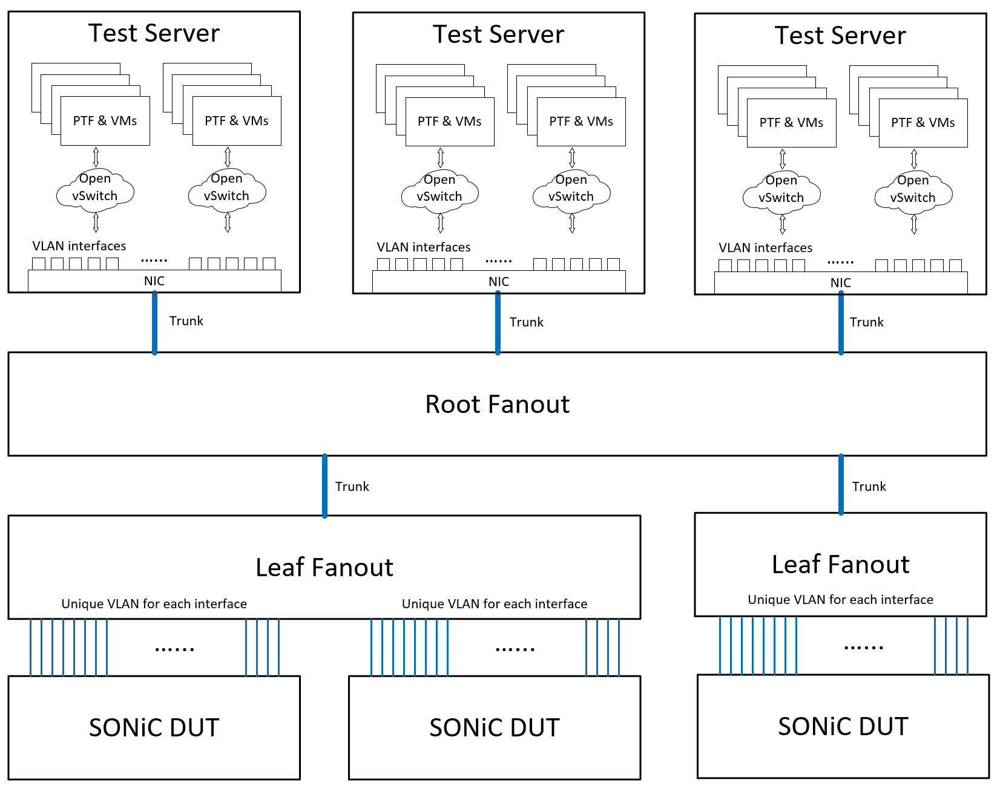

# MMU Threshold Probing Test Plan

## Background

SONiC testing faces challenges in QoS SAI test across diverse ASIC platforms.

- Mixed PI and PD code causing regressions
- Lack of unit testing and PR test support
- Difficult troubleshooting, maintenance, and extensibility
- Complex pre-calculated threshold expectations required
- Noise sensitivity and platform-specific variations affect measurement reliability

These limitations make automated testing difficult to scale and maintain across platforms.

## Scope

The background challenges identified above significantly impact the reliability and maintainability of current SONiC buffer threshold testing methods. These pain points are evident across multiple existing MMU test cases that require platform-specific implementations and suffer from noise sensitivity issues.

Current Test Methods Affected by These Challenges:

| Test Target | Current Test Method |
|----------------|-------------|
| Ingress Drop Threshold | testQosSaiPGDrop |
| PFC XOFF Threshold | testQosSaiPfcXoffLimit |
| PFC XON Threshold | testQosSaiPfcXonLimit |
| Egress Drop Threshold | testQosSaiLossyQueue |
| Headroom Pool Size | testQosSaiHeadroomPoolSize |
| Headroom Pool Watermark | testQosSaiHeadroomPoolWatermark |
| PG Share Watermark | testQosSaiPgSharedWatermark |
| Queue Share Watermark | testQosSaiQSharedWatermark |

This test plan validates a **unified threshold probing algorithm** designed to replace these individual test methods with a single, platform-independent solution that addresses all the identified pain points through innovative algorithmic design and architectural improvements.

## MMU Threshold Probing

Our solution introduces an ASIC-independent threshold probing algorithm that automatically discovers actual buffer threshold values through real-time detection rather than pre-calculated expectations. This discovery-based approach eliminates the core pain points of traditional methods by employing binary search techniques, repeated verification mechanisms, and dynamic precision control to achieve accurate threshold detection with superior noise tolerance.

### Three-Phase Detection Process

**Example Context**: The following example demonstrates PFC XOFF threshold probing. The algorithm applies to various threshold types (PFC XOFF/XON, ingress/egress drop, headroom pool size, headroom PG size, watermark thresholds) with appropriate direction adaptations.

#### Phase 1 - Upper Bound Discovery (Exponential Growth)

| Iteration | Packet Count | Threshold Reached | Next Action |
|-----------|--------------|-------------------|-------------|
| 1 | 1000 (Initial) | No | Continue (2x -> 2000) |
| 2 | 2000 | No | Continue (2x -> 4000) |
| 3 | 4000 | No | Continue (2x -> 8000) |
| 4 | 8000 | No | Continue (2x -> 16000) |
| 5 | 16000 | **Yes** | **Upper Bound Found** |

**Note**:
- Exponentially increase packet count (2x growth) from initial buffer pool size until trigger PFC. 
- Typically Phase 1 reaches threshold in one iteration since the initial value uses buffer pool size, unless the configured buffer pool size is incorrect.

#### Phase 2 - Lower Bound Detection (Logarithmic Reduction)

| Iteration | Packet Count | Threshold Reached | Next Action |
|-----------|--------------|-------------------|-------------|
| 1 | 8000 (Upper/2) | Yes | Continue (/2 -> 4000) |
| 2 | 4000 | Yes | Continue (/2 -> 2000) |
| 3 | 2000 | No | **Lower Bound Found** |

**Note**:

- Start from upper bound divided by 2, continue reducing (/2 division) until dismiss PFC. 
- Phase 2 leverages existing results from Phase 1 when available, only testing new packet counts that weren't previously evaluated.

#### Phase 3 - Threshold Range Detection

| Search Range | Packet Count | Range Size | PFC Status | Precision Check | Next Action |
|--------------|--------------|------------|------------|----------------|-------------|
| [6826, 109226] | 58026 | 102400 | Yes (Triggered) | 102400 > 58026×5% | Continue → [6826, 60074] |
| [6826, 60074] | 33450 | 53248 | Yes (Triggered) | 53248 > 33450×5% | Continue → [6826, 34514] |
| [6826, 34514] | 20670 | 27688 | Yes (Triggered) | 27688 > 20670×5% | Continue → [6826, 21223] |
| [6826, 21223] | 14024 | 14397 | Yes (Triggered) | 14397 > 14024×5% | Continue → [6826, 14311] |
| [6826, 14311] | 10568 | 7485 | No (Dismissed) | 7485 > 10568×5% | Continue → [10419, 14311] |
| [10419, 14311] | 12365 | 3892 | No (Dismissed) | 3892 > 12365×5% | Continue → [12288, 14311] |
| [12288, 14311] | 13299 | 2023 | No (Dismissed) | 2023 > 13299×5% | Continue → [13198, 14311] |
| [13198, 14311] | 13754 | 1113 | Yes (Triggered) | 1113 > 13754×5% | Continue → [13198, 13809] |
| [13198, 13809] | 13503 | 611 | No (Dismissed) | 611 > 13503×5% | Continue → [13473, 13809] |
| [13473, 13809] | 13641 | 336 | Yes (Triggered) | 336 < 13641×5% | **Precision Met** |

**Final Result**: Threshold Range [13473, 13657] with center ~13565 packets

**Process**: Dynamic precision control stops when `range_size ≤ candidate_threshold × 5%`, providing adaptive accuracy based on threshold magnitude.

### Algorithm Core Logic

The threshold probing algorithm follows a structured three-phase approach with error handling and noise resilience:

#### Pseudocode

```python
// Phase 1: Upper Bound Probing
upper_bound = buffer_pool_size
while not verify_threshold(upper_bound, attempts=1):  // Single verification for speed
    upper_bound *= 2

// Phase 2: Lower Bound Probing
lower_bound = upper_bound / 2
while verify_threshold(lower_bound, attempts=1):  // Single verification for speed
    lower_bound /= 2

// Phase 3: Threshold Range Probing
range_stack = [(lower_bound, upper_bound)]

while not converged:
    range_start, range_end = range_stack[-1]
    candidate_threshold = (range_start + range_end) >> 1

    // Check precision target
    if range_end - range_start <= candidate_threshold * precision_target_ratio:
        converged = True
        break

    // Verify threshold with noise resilience
    success, detected = verify_threshold(candidate_threshold, attempts=5)  // Multiple verification for noise resilience

    if not success:
        range_stack.pop()  // Backtrack to parent range
    else:
        if detected:
            range_end = candidate_threshold        // Search left half
        else:
            range_start = candidate_threshold + 1  // Search right half
        range_stack.append((range_start, range_end))

return (range_start, range_end)
```

**Note**:

- This simplified pseudocode omits retry count limits and exceptional corner case for clarity.

- **verify_threshold(packet_count, attempts=1)**: Send packets and detect if MMU threshold is reached
  - attempts=1: Single verification for Phase 1&2 (fast detection)
  - attempts=5: Multiple verification for Phase 3 (noise resilience with statistical validation)


#### Binary Search Algorithm Base

The algorithm employs classic binary search principles to effectively obtain threshold range results. However, there are several key differences from traditional approaches, detailed as follows:

- **Termination Condition**: Stops when precision target is achieved relative to threshold magnitude, rather than seeking exact point values
- **Noise Resilience**: Uses multiple verify_threshold attempts to eliminate interference and ensure reliable results
- **Backtracking Mechanism**: When verification fails, backtracks to previous search window and resumes search

#### Dynamic Precision Control

Search automatically terminates when the range achieves target precision relative to threshold magnitude:

```python
if range_end - range_start <= candidate_threshold * precision_target_ratio:
    detected = True
```

- **Precision Target Ratio**: `5%` relative accuracy (configurable)

#### Threshold Verification Multiple Times

Multiple verification attempts ensure reliable threshold detection despite network noise:

- **Multiple Verification**: Each threshold check performed multiple times requiring unanimous consensus (currently 5 attempts, adjustable based on empirical test statistics)
- **Noise Immunity**: Temporary fluctuations filtered out through repeated measurements

Each threshold verification performs a complete clean test cycle with port reset, baseline measurement, traffic injection, and flexible threshold detection that adapts to various threshold types:

```python
def verify_threshold(packet_count, attempts=1):
    """
    Unified threshold verification function
    - attempts=1: Phase 1&2 single verification (fast detection)
    - attempts=5: Phase 3 multiple verification (noise resilience)
    """
    results = []
    for i in range(attempts):
        # Step 1: Port preparation - ensure clean buffer state
        enable_port_tx(dst_port)           # Drain existing buffer content
        wait(port_control_delay)
        disable_port_tx(dst_port)          # Simulate congestion condition
        wait(port_control_delay)
        
        # Step 2: Baseline measurement
        baseline_counters = read_relevant_counters()
        
        # Step 3: Traffic injection
        send_traffic(src_port, dst_port, packet_count)  # 64-byte packets, 1 packet = 1 cell
        wait(counter_refresh_delay)
        
        # Step 4: Threshold detection
        current_counters = read_relevant_counters()
        threshold_triggered = detect_threshold_condition(baseline_counters, current_counters)
        
        results.append(threshold_triggered)
    
    # Single attempt: return direct result
    if attempts == 1:
        return results[0]
    
    # Multiple attempts: unanimous consensus required for reliable detection
    return all(results) or not any(results)  # All same result
```

#### Failure Backtracking

When threshold verification fails, the algorithm backtracks to parent search range:

```python
range_stack = [(lower_bound, upper_bound)]  // initial value in stack
while not converged:
    range_start, range_end = range_stack[-1]  // alway get search range from stack
    candidate_threshold = (range_start + range_end) >> 1
    ... ...
    if not success:
        range_stack.pop()  // Backtrack to parent range when fail
    else:
        ... ...
        range_stack.append((range_start, range_end))  // alway push new search range to stack
```

## Implementation Architecture

The three-phase algorithm addresses core algorithmic challenges, while remaining pain points require a well-designed implementation architecture. Our solution uses a three-layer modular design with clear separation of responsibilities.

This architecture specifically enables comprehensive unit testing by isolating algorithm logic from execution environment. The executor layer provides execution time measurement and simulation, allowing UT to achieve realistic performance characteristics without actual hardware while maintaining identical algorithm behavior across all environments.

### Core Components

- ThresholdProbingAlgorithm Class
Implements generic algorithm logic independent of platform and search target, providing platform-independent and reusable threshold detection across different scenarios.

- ThresholdProbingExecutor Class  
Handles algorithm execution for UT, simulator, and various ASIC platforms, delivering multi-environment support with platform-specific optimizations and realistic timing simulation for unit testing. The executor supports different scenarios through inheritance and override mechanisms, enabling UT support and ASIC-specific adaptations. By leveraging execution time measurement and simulation capabilities, it can function as a simulator for algorithm tuning and optimization using historical data without hardware dependencies. This design allows algorithm testing in UT environments and accommodates special ASIC behaviors through platform-specific overrides in production.

- ThresholdProbingObserver Class
Manages test report generation and result analysis, providing comprehensive reporting with standardized format across platforms and execution time analysis.

- MmuThresholdProbingOrchestrator Class
Coordinates the complete three-phase threshold probing workflow by managing algorithm, executor, and observer components, providing a unified external interface for full probing execution and phase-specific operations.

### UML Diagram

- The following class diagram illustrates the overall architecture with interfaces, implementations, and their relationships:


- The following sequence diagram shows the detailed interaction flow for Phase 3 binary search algorithm:


## Design Summary

This solution systematically addresses the core pain points of traditional SONiC buffer testing:

**Code Quality and Maintainability**: The clean separation of algorithm, executor, and observer eliminates mixed PI/PD code issues while enabling comprehensive unit testing and PR validation through executor-based simulation environments. Dynamic precision control inherently handles platform-specific behaviors without requiring special case logic.

**Discovery-Based Testing**: The probing approach fundamentally shifts from pre-calculated expectations to real-time discovery, eliminating complex threshold calculations and platform-specific configurations. This discovery model naturally adapts to hardware variations while maintaining cross-platform consistency.

**Comprehensive Observability**: The observer pattern provides detailed execution tracking and vendor-specific debugging capabilities without cluttering algorithm code. This enables precise troubleshooting by isolating issues to specific architectural layers rather than requiring system-wide investigation.

**Noise Resilience**: Multi-attempt verification with statistical consensus replaces fragile single-point measurements, transforming historically flaky tests into reliable validation. The algorithm's adaptive nature handles measurement variations that previously caused test instability.

This holistic design transforms buffer testing from a maintenance-heavy, platform-specific challenge into a unified, reliable, and maintainable testing methodology.

## Testbed

The threshold probing algorithm supports standard SONiC testbed configurations without requiring changes to existing connection topology or setup procedures.

### Supported Configurations
- **Physical DUT**: Production hardware for threshold testing (Cisco-8000, Broadcom, Mellanox)
- **KVM DUT**: Virtual environments for PR testing
- **Python UT**: Unittest/pytest environments for unit testing

### Network Topology

The test utilizes the standard SONiC testbed physical connection as shown below:



Test traffic flows from PTF through the fanout switch to the DUT, and returns from DUT through the fanout back to PTF for measurement and analysis. This standard topology supports all threshold detection scenarios without requiring specialized hardware or connection modifications.

## Setup Configuration

No special pre-configuration is required except for python-saithrift_0.9.4_amd64.deb and docker-syncd-rpc image installation, which are already included in existing test setup procedures.

## Test Cases

This test plan will systematically validate all threshold types listed in the Scope section using the unified threshold probing methodology. Each test case follows the same algorithmic approach: dynamically discovering threshold ranges through iterative packet injection and buffer monitoring, eliminating the need for platform-specific pre-calculations. The comprehensive test suite aims to refactor existing individual test methods (testQosSaiPGDrop, testQosSaiPfcXoffLimit, etc.) into a single, platform-independent solution.

Expected outcomes include: successful threshold detection for all target buffer types, zero regression compared to traditional methods, improved test execution performance, and delivery of comprehensive unit test coverage. All test cases should pass validation across supported platforms (Cisco, Broadcom, Mellanox) and environments (Physical DUT, KVM, Python UT).
