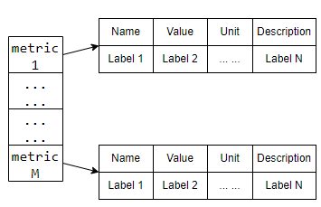

# SONiC Switch Capacity Test

## Test Objective

This test aims to assess the true capacities of SONiC switches.

## Test Setup

The test is designed to be topology-agnostic, meaning it does not assume or impose a specific setup wiring, settings, or configuration. The running script will track power usage, temperature, queue watermark, and health state of all SONiC switches in a testbed.

## Metrics to Check

- **PSU power usage**: `show platform psu`.
- **Sensor temperature**: `show platform temperature`. Among the outputs, “Cpu temp sensor” and “Switch Card temp sensor” are of interest.
- **Queue watermark**: `show queue watermark`.
- **Interface counters**: `show interface counters`. (The outputs include drop counters.)

## Test Steps

1. Run all traffic generators at full line rate, injecting traffic into SONiC devices to maximize stress. The test duration is configurable, with a default setting of 1 hour.
2. Using the switch commands above or RPC (Remote Procedure Call), collect all SONiC switches’ metrics listed in the previous section. The data sampling rate is also configurable with a default value of every 1 minute.
3. Save the sampled raw data to a database via the telemetry interface provided by the SONiC team. The metrics are stored as data points in our database. An example of how to use the interface is provided in telemetry folder.

     

## Metrics are organized with two sets of labels in the database.

- **Common labels**: These labels are shared across all metrics within one test job and must be included with every metric.

     ```python
     METRIC_LABEL_TESTBED: Final[str] = "test.testbed"
     METRIC_LABEL_TEST_BUILD: Final[str] = "test.os.version"
     METRIC_LABEL_TEST_CASE: Final[str] = "test.testcase"
     METRIC_LABEL_TEST_FILE: Final[str] = "test.file"
     METRIC_LABEL_TEST_JOBID: Final[str] = "test.job.id"
     ```

- **Metric labels**: These labels identify the specific device and component from which a metric is collected.

     For PSU metrics, the following labels are expected to be provide:

     ```python
     METRIC_LABEL_DEVICE_ID: Final[str] = "device.id"
     METRIC_LABEL_DEVICE_PSU_ID: Final[str] = "device.psu.id"
     METRIC_LABEL_DEVICE_PSU_MODEL: Final[str] = "device.psu.model"
     METRIC_LABEL_DEVICE_PSU_SERIAL: Final[str] = "device.psu.serial"
     METRIC_LABEL_DEVICE_PSU_HW_REV: Final[str] = "device.psu.hw_rev"
     ```

     For sensor temperature metrics, the following labels are expected to be provide:

     ```python
     METRIC_LABEL_DEVICE_ID: Final[str] = "device.id"
     METRIC_LABEL_DEVICE_SENSOR_ID: Final[str] = "device.sensor.id"
     ```

     For queue metrics, the following labels are expected to be provide:

     ```python
     METRIC_LABEL_DEVICE_ID: Final[str] = "device.id"
     METRIC_LABEL_DEVICE_QUEUE_ID: Final[str] = "device.queue.id"
     METRIC_LABEL_DEVICE_QUEUE_CAST: Final[str] = "device.queue.cast"
     ```

     For interface metrics, the following labels are expected to be provide:

     ```python
     METRIC_LABEL_DEVICE_ID: Final[str] = "device.id"
     METRIC_LABEL_DEVICE_PORT_ID: Final[str] = "device.port.id"
     ```
