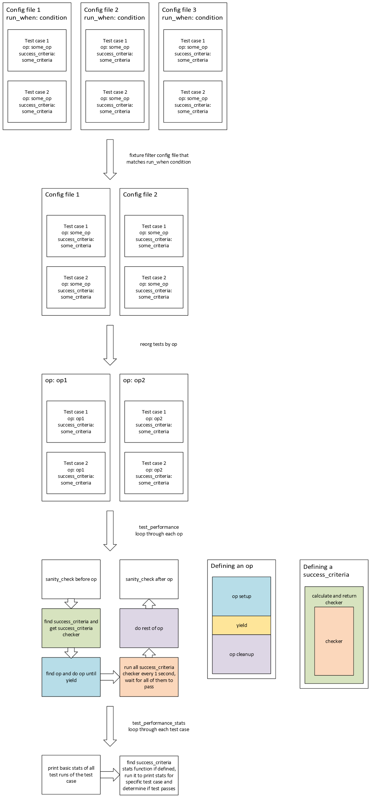

# Hardware Performance Measure Test Plan


## 1 Overview

SONiC runs on various of hardwares for many different purposes, so natually the different hardware performs differently on various tests. The purpose of this test plan is to provide a solution for understanding a particular testbed better and see what role it is capable of.

### 1.1 Scope

The test is targeting a running SONiC system will fully functioning configuration. The purpose of this test is to better understand how a SONiC device performs and verify some of the key performance meters in SONiC devices.

### 1.2 Testbed

The test can run on both physical and virtual testbeds with any topology.

### 1.3 Limitation

## 2 Test

The following sections decribe what the performance test does.

### 2.1 How test is run

A fixture will be run before hand to collect all the config file under the performance meter directory. The selection criteria will be evaluated against the testbed and we will know if the config file applies. If the config file applies to the testbed, its content will be extracted and provided to testcases. When there are multiple config files for the testbed, they will all be tested. When there are no config for the testbed, test will be skipped.

Sometimes, the same operation will be done for different testcases, like reboot. It will be a waste of time to do them for every test case, so the same operation will only be run once and used by all test case. The fixture will collect all the test cases and group the ops together and provide to tests.

Each test case will have an op and a success_criteria. An op is performed on the dut, and then success_criteria will be run every second to check if the op has been successful.

After fixtures, the test process is separated into 2 test cases. test_performance will run N times as designated by user input. test_performance_stats will run once to analyze previous run result.

Each run of test_performance is designed like below:
1. Read from config dir and pick config files that apply (fixture)
2. Loop though ops sequentially as listed in config files
3. Run sanity_check before op to make sure dut is healthy
4. Run success_criteria, finish some setup and return checker
5. Run the first part of op setup until yield is hit
6. Run success criteria check for success criteria every 1 second
7. Run the second part of op cleanup after checker returns True
8. Run sanity_check again
9. Log result and continue to next op

test_performance_stats will go through all results of previous runs and collect some statistics. Then the results will be passed to used defined stats function to check whether the results are up to standard.



### 2.2 Input parameter

Iteration: User can provide iteration input from run_tests command line as an extra argument as that is prone to change. It should have a small default value so it may be run during nightly tests.

```
parser.addoption("--performance-meter-run", action="store", default=1, type=int,
help="Number of run for performance meter")
```

### 2.3 Ops

reload, reboot, restart swss, etc.

### 2.4 Success criteria

#### BGP up

To verify bgp is up, use run_bgp_facts helper method.

#### SWSS up

Check swss container is up and its services working fine.

#### Critical process up

Use wait_critical_processes to verify the time for critical processes up.

### 2.5 User defined performance meter

User can define new ops (ops.py) and success criteria (success_criteria.py) to match the needs. Details in the configuration section.

## 3 Configuration

The following sections describes the details of configuration.

### 3.1 Config file

Depending on the benchmark needed, user might have to define their own benchmark.
User defined performance meter config file should be provided under the performance meter directory.

The performance_meter definition will be a yaml file. Each test case will match an entry in the yaml file. Under each test entry, additional performance targets (min, mac, avg) can be defined and used by each test case. They are used by each test cases separately and do not have to mean the same thing in each test.

Config files are located under config dir of tests/performance_meter.

A selection criteria with name run_when will be evaluated to determine if the config file applies to a testbed. The selection criteria understands duthost and tbinfo.

One config file can define 1 or more test cases under performance_meter section. Each test case will have an op and a success criteria, both are functions defined in the scripts (ops.py and success_criteria.py). If the provided ops and success criteria are not enough, user can add more in ops.py and success_criteria.py. Additional variables like (min, max, etc) used by op and success criteria will also be put here.

Sample config:

```
run_when: duthost.hostname == "HOSTNAME"

performance_meter:
sample_test_1:
op: noop
success_criteria: random_success_20_perc
random_success_20_perc_timeout: 10
random_success_20_perc_delay: 5
random_success_20_perc_foo: 42
random_success_20_perc_success_rate_op: 1
random_success_20_perc_success_rate: 0.7
random_success_20_perc_min: 5
random_success_20_perc_max: 10
random_success_20_perc_mean: 8
sample_test_2:
op: bad_op
success_criteria: random_success_20_perc
random_success_20_perc_timeout: 10
random_success_20_perc_delay: 5
random_success_20_perc_foo: 42
random_success_20_perc_success_rate_op: 1
random_success_20_perc_success_rate: 0.7
random_success_20_perc_min: 5
random_success_20_perc_max: 10
random_success_20_perc_mean: 8
```

### 3.2 Ops

An op is a function defined in ops.py. It defines an operation on dut, like a reboot, reload, etc.

It is seperated into 2 parts by yield, like a fixture.

>    first part setup, prepare for checking
>
>    checking for success criteria
>
>    second part cleanup, make sure nothing is leftover

The op can be async or blocking, e.g., we might want reboot to block until it is successfully done before next step, or we want reboot to not block at all to calculate how much time it takes to reboot.

Timing for checking will only start after the first part of operation is over.

The op should make sure op is started correctly and ended correctly. If either part is unsuccessful, op should yeild False and log the error, otherwise yielding True is expected. An op should not raise Exception because we don't want the test to end, we just want to log a failure and continue.

Op is also expected to be async. If no async feature is needed, simply add async before def.

Sample ops:

```
async def noop(duthost):
    yield True


async def bad_op(duthost):
    yield False


async def reboot_by_cmd(duthost):
    command = asyncio.create_task(async_command_ignore_errors(duthost, "reboot"))
    yield True
    await command
```

### 3.3 Success criteria

A success criteria is a function defined in success_criteria.py that returns a **function** that returns True or False.

It takes a duthost and all variables defined in config that starts with the name of said criteria, as keyword args. If we have "bgp_up", then it will take "bgp_up_timeout", "bgp_up_delay", "bgp_up_foo", etc, and have "timeout", "delay", "foo" etc, as kwargs. kwarg can be used to pass any additional arguments and limitations from config file to the success criteria function.

Additionally a timeout is always expected in config file because test can't hang forever. A delay is to not run the check for said time, default to 0. Note timeout starts after delay.

It is ok to raise exception as it will be handled, but wait_until logs the error, which prints to the console, which could be a lot. To avoid too much unnecessary error logs, do not raise exception.

Sample success criteria:

```
def random_success_20_perc(duthost, **kwarg):
    return lambda: random.random() < 0.2
```

### 3.4 Success criteria stats

Because each test run is separate, success criteria function cannot process results of all runs, so there could be an optional success criteria stats function, named with a "_stats" suffix, like "bgp_up_stats", taking all the same kwarg variables as its single run version.

Unlike the single test run counter part, it takes passed_op_precheck which is the test result of all test runs that passed pre op sanity_check.

The passed_op_precheck is a list of test results. Test result has the following format:

```
{
"op_precheck_success": True/False,
"op_success": True/False,
"op_postcheck_success": True/False,
"passed": True/False,
"time_to_pass": DURATION,
}
```

When one stage fails, the following stages will not have an entry.

Test results have been filtered to have op_precheck_success == True.

Sample success_criteria_stats:

```
def random_success_20_perc_stats(passed_op_precheck, **kwarg):
    finished_op = list(filter(lambda item: item["op_success"], passed_op_precheck))
    if "success_rate_op" in kwarg:
        success_rate_op = len(finished_op) / len(passed_op_precheck)
        logging.warning("Success rate of op is {}".format(success_rate_op))
        pytest_assert(success_rate_op >= kwarg["success_rate_op"],
                      "Success rate of op {} is less than expected {}".format(success_rate_op,
                                                                              kwarg["success_rate_op"]))
    passed_success_criteria = list(filter(lambda result: result["passed"], finished_op))
    if "success_rate" in kwarg:
        success_rate = len(passed_success_criteria) / len(finished_op)
        logging.warning("Success rate is {}".format(success_rate))
        pytest_assert(success_rate >= kwarg["success_rate"],
                      "Success rate {} is less than expected {}".format(success_rate, kwarg["success_rate"]))
    if "max" in kwarg:
        max_time_to_pass = max(map(lambda item: item["time_to_pass"], passed_success_criteria))
        logging.warning("Max time_to_pass is {}".format(max_time_to_pass))
        pytest_assert(max_time_to_pass <= kwarg["max"],
                      "Max time_to_pass {} is more than defined max {}".format(max_time_to_pass, kwarg["max"]))
    if "min" in kwarg:
        min_time_to_pass = min(map(lambda item: item["time_to_pass"], passed_success_criteria))
        logging.warning("Min time_to_pass is {}".format(min_time_to_pass))
        pytest_assert(min_time_to_pass >= kwarg["min"],
                      "Min time_to_pass {} is less than defined min {}".format(min_time_to_pass, kwarg["min"]))
    if "mean" in kwarg:
        mean_time_to_pass = statistics.mean(map(lambda item: item["time_to_pass"], passed_success_criteria))
        logging.warning("Mean time_to_pass is {}".format(mean_time_to_pass))
        pytest_assert(mean_time_to_pass <= kwarg["mean"],
                      "Mean time_to_pass {} is more than defined mean {}".format(mean_time_to_pass, kwarg["mean"]))
    logging.warning("Foo is {}".format(kwarg["foo"]))
```

The stats function returns a True/False indicating whether the test failed.
