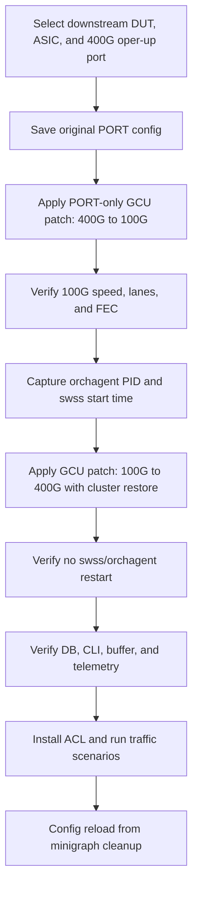

# Port Speed Cluster Upgrade Test Plan

## 1. Purpose

This document describes the pytest test that validates a **100G to 400G port speed
upgrade** on a T2 chassis-packet device using Generic Config Updater (GCU).

The test begins from the normal minigraph-derived **400G** configuration. It
temporarily downgrades **one selected external PortChannel member** to **100G**,
then applies a GCU patch to upgrade that port back to **400G** together with its
cluster-related CONFIG_DB entries.

Test module:

`tests/generic_config_updater/add_cluster/test_port_speed_upgrade.py`

## 2. Applicability

### 2.1 Supported environments

The test runs only on **T2 chassis-packet** testbeds.

Static gating:

| Mechanism | Requirement |
|-----------|-------------|
| `pytest.mark.topology("t2")` | Topology must be T2 |
| Conditional marker | `topo_type == "t2"` and `switch_type == "chassis-packet"` |

### 2.2 Supported platform data

The test uses platform-specific speed and lane maps defined in the test module
(`PORT_SPEED_UPGRADE_SUPPORTED_SPEEDS_MAP` and
`PORT_SPEED_UPGRADE_SPEED_LANES_MAP`). At present, data is defined for
`x86_64-88_lc0_36fh-r0` (100G with 4 lanes, 400G with 8 lanes).

### 2.3 Runtime port selection

At runtime, the test selects a downstream-facing frontend linecard and one port
that meets all of the following conditions:

1. The port is a member of an **external** PortChannel (backplane PortChannels are
   excluded).
2. The port is present in the `PORT` table with role `Ext` (or no role).
3. The port is configured at **400G**, **admin up**, and **oper up**.
4. A usable traffic-source DUT can be selected for upstream-to-downstream traffic.
5. The DUT platform provides the required 100G/400G speed and lane data.

If no port satisfies these conditions, the test is **skipped**.

The test modifies **one port at a time**. Other members of the same PortChannel
are not changed.

## 3. Test Objectives

The test confirms that upgrading the selected port from 100G to 400G through GCU:

1. Restores the full 400G `PORT` configuration (`speed`, `lanes`, `fec`).
2. Restores cluster-related CONFIG_DB entries for the selected port only.
3. Does not target unrelated ports in selected-port CONFIG_DB tables.
4. Updates `CONFIG_DB`, `APPL_DB`, and `show interface status` to the expected 400G
   values.
5. Returns the port to **oper up** after the upgrade.
6. Does **not** restart the `swss` container or the `orchagent` process.
7. Creates and applies the expected 400G buffer profile.
8. Preserves telemetry counter visibility and traffic forwarding after the upgrade.

## 4. GCU Patch Behavior

### 4.1 Setup patch: 400G to 100G

The setup fixture applies a **PORT-only** GCU patch.

For the selected port, the test builds a full 100G `PORT` block from the original
400G block and updates:

- `speed`
- `lanes`
- `fec`

All other fields from the original `PORT` entry are preserved. Cluster-related
tables are **not** modified during setup.

The port may be **oper down** after the downgrade. The setup step verifies speed,
lanes, and FEC through `show interface status` but does not require oper up.

### 4.2 Upgrade patch: 100G to 400G

The test body applies one GCU patch that restores the selected port to 400G.

For the selected port, the patch adds:

| CONFIG_DB table | Scope |
|-----------------|-------|
| `PORT` | Full 400G block (`speed`, `lanes`, `fec`, and preserved fields) |
| `PORTCHANNEL_MEMBER` | Selected member entry only |
| `BGP_NEIGHBOR` | Neighbor entries resolved from minigraph |
| `DEVICE_NEIGHBOR` | Selected port entry |
| `DEVICE_NEIGHBOR_METADATA` | Neighbor metadata entry |
| `INTERFACE` | Selected port entries |
| `BUFFER_PG` | Selected port entries (dynamic `pg_lossless` profiles excluded) |
| `PORT_QOS_MAP` | Selected port entry |
| `PFC_WD` | Selected port entry |
| `CABLE_LENGTH` | Selected port entry under `AZURE` |

The upgrade patch does **not** add ACL table entries. ACL rules are installed
after the upgrade for traffic and counter validation only.

Shared PortChannel objects (for example, the PortChannel base entry) are
intentionally left unchanged because they are shared by all members.

Before the patch is applied, `validate_patch_scoped_to_ports()` confirms that
operations on selected-port tables target only the chosen port.

## 5. Test Procedure

### 5.1 Select DUT, ASIC, and port

1. Identify a downstream-facing frontend DUT from minigraph neighbor data.
2. Select an upstream-facing DUT and a traffic-source DUT.
3. Scan downstream linecards and frontend ASICs (primary downstream linecard first).
4. Collect 400G external PortChannel member ports that are admin up and oper up.
5. Randomly select one qualifying ASIC and one qualifying port.
6. Save the original `PORT` configuration for the selected port.

### 5.2 Prepare 100G starting state (setup fixture)

1. Build the 100G `PORT` configuration for the selected port.
2. Register minigraph config-reload cleanup before applying any patch.
3. Apply the PORT-only GCU downgrade patch.
4. Verify 100G speed, lanes, and FEC via `show interface status`.

### 5.3 Apply 400G upgrade (test body)

1. Record `orchagent` PID and `swss` container start time.
2. Build the 400G upgrade patch with cluster restore operations.
3. Validate patch scope for the selected port.
4. Apply the GCU patch.

### 5.4 Validate control-plane and database state

1. Confirm `orchagent` PID is unchanged.
2. Confirm `swss` container start time is unchanged.
3. Confirm `orchagent` is running.
4. Verify for the selected port:
   - `CONFIG_DB` speed is 400G
   - `APPL_DB` speed is 400G
   - `show interface status` reports expected speed, lanes, and FEC
   - oper state is up
5. Confirm all admin-up ports on the DUT are operationally up.

### 5.5 Validate buffer profile and telemetry

1. Verify the expected 400G PG lossless buffer profile exists in `CONFIG_DB`.
2. Verify the same profile exists in `APPL_DB`.
3. Configure gNMI authentication and reload the gNMI supervisor process.
4. Poll gNMI until `COUNTERS_DB` data is available for the upgraded port.

### 5.6 Validate traffic and ACL counters

1. Install the test egress L3 ACL table and rules.
2. Run four traffic scenarios:
   - Upstream to downstream with ACL rule match (`RULE_100`)
   - Upstream to downstream without ACL rule match
   - Downstream to downstream with ACL rule match (`RULE_100`)
   - Downstream to downstream without ACL rule match
3. Verify forwarding succeeds for each scenario.
4. Verify ACL counters match the expected rule for each scenario.

### 5.7 Cleanup

The setup fixture registers cleanup before the first GCU patch is applied.
Cleanup runs after normal completion, assertion failure, or partial setup failure.

Cleanup steps:

1. `config reload` from minigraph with `safe_reload=True` and `wait_for_bgp=True`
2. Blanket loganalyzer ignore during reload teardown
3. Wait for critical services and BGP to stabilize (handled inside `config_reload`)

## 6. Loganalyzer Handling

During GCU apply, the test registers selective loganalyzer ignores for expected
transient errors (for example, temporary speed and lane mismatches, CMIS application
lookup failures, and invalid queue counters during port recreation).

During teardown config reload, loganalyzer uses a blanket ignore to tolerate
expected reload-time errors on unrelated services.

## 7. Pass Criteria

The test passes when:

1. A qualifying 400G external PortChannel member port is selected.
2. The setup GCU patch downgrades the selected port to 100G.
3. The upgrade GCU patch restores the selected port to 400G with cluster entries.
4. Patch scope validation confirms no unrelated port is targeted.
5. `CONFIG_DB`, `APPL_DB`, and `show interface status` report the expected 400G
   state.
6. The selected port returns to oper up.
7. `swss` and `orchagent` do not restart during the 400G upgrade.
8. The expected buffer profile and telemetry counter data are present.
9. All traffic scenarios forward successfully with correct ACL counters.
10. Cleanup completes and critical services are fully started.

## 8. Out of Scope

1. Non-T2 topologies.
2. Non-chassis-packet switch types.
3. VOQ-only behavior.
4. Internal or backplane PortChannels.
5. Changing multiple PortChannel members in one test run.
6. Mixed-speed validation within a PortChannel.
7. Exhaustive validation of all supported port speeds and FEC combinations.
8. Persistence across reboot, warm boot, or fast boot.
