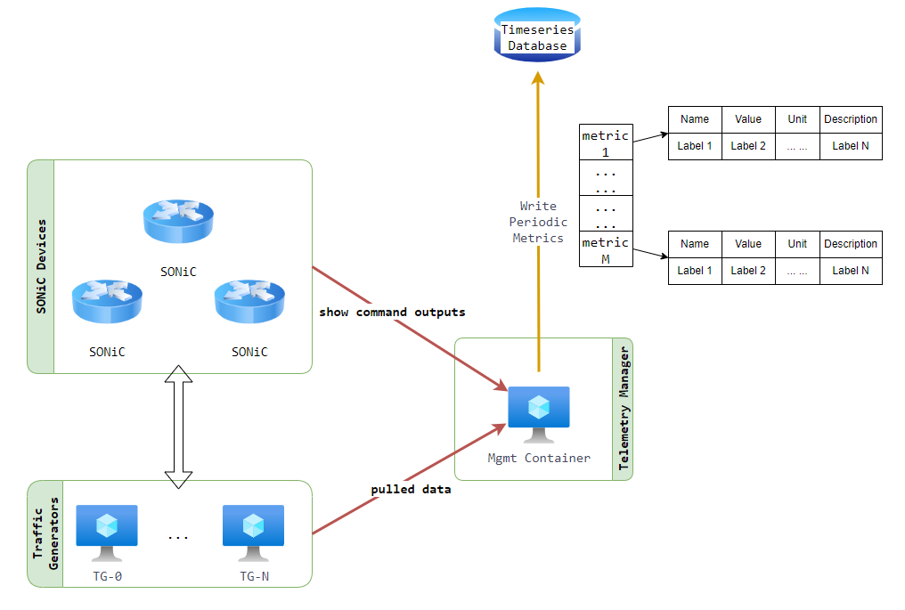

# SONiC Switch Capacity Test

- [SONiC Switch Capacity Test](#sonic-switch-capacity-test)
  - [Test Objective](#test-objective)
  - [Test Setup](#test-setup)
  - [Test Steps](#test-steps)
  - [Label Structure](#label-structure)
    - [Metric labels](#metric-labels)
      - [Interface Metrics](#interface-metrics)
      - [Queue Metrics](#queue-metrics)
      - [PSU Metrics](#psu-metrics)
      - [Sensor Temperature Metrics](#sensor-temperature-metrics)

## Test Objective

This test aims to assess the true capacities of SONiC switches.

## Test Setup

The test is designed to be topology-agnostic:

- The test does not rely on or impose a fixed topology, wiring, or device configuration.
- The devices or network under test should have BGP sessions configured.
- The traffic generator is expected to initiate BGP sessions with its directly connected devices and advertise routes to them. The devices under test should propagate these routes so traffic is properly routed.
This setup enables building multi-tier networks and shaping topologies as needed—without modifying the test case itself.

In this test,

- The first half of the ports are used as Tx (transmit) ports, and the second half as Rx (receive) ports.
- A monitoring script is used to track key metrics, including port counters, queue watermark, power usage, and sensor temperature across all SONiC switches in a testbed.
- After traffic generation begins, the script runs periodically to check and report the health status of all SONiC devices.

## Test Steps

1. Run all traffic generators at full line rate, injecting traffic into SONiC devices to maximize stress. The test duration is configurable, with a default setting of 15 minutes.
2. Using the switch commands or RPC (Remote Procedure Call), collect all SONiC switches’ metrics listed in the next section. The data sampling rate is also configurable with a default value of every 1 minute.
3. Save the sampled raw data to a database via the periodic metrics reporter interface provided by the SONiC team in `test_reporting` folder. The metrics are structured as data points in our database. An example of how to use the interface is provided in `telemetry` folder.

## Label Structure

The collected metrics are structured in the database using two sets of labels

### Metric labels

The common labels shared across all metrics within one test job are provided by stress test infra.
The metric labels that identify the specific device and component from which a metric is collected, are provided by the user.

#### Interface Metrics

The `show interface counters` is used on the switch to retrieve interface metrics. The following labels are expected to be provided:

| User Interface Label                   | Label Key in DB          | Example Value       |
| -------------------------------------- | ------------------------ | ------------------- |
| `METRIC_LABEL_DEVICE_ID`               | device.id                | switch-A            |
| `METRIC_LABEL_DEVICE_PORT_ID`          | device.port.id           | Ethernet8           |

| User Interface Metric Name             | Metric Name in DB        | Example Value       |
| -------------------------------------- | ------------------------ | ------------------- |
| `METRIC_NAME_PORT_STATE`               | port.state               | OPER_STATUS.UP      |
| `METRIC_NAME_PORT_RX_BPS`              | port.rx.bps              | 26.38               |
| `METRIC_NAME_PORT_RX_UTIL_PCT`         | port.rx.util.pct         | 0.00                |
| `METRIC_NAME_PORT_RX_PACKETS_OK`       | port.rx.packets.ok       | 5190                |
| `METRIC_NAME_PORT_RX_PACKETS_ERR`      | port.rx.packets.err      | 0                   |
| `METRIC_NAME_PORT_RX_PACKETS_DROP`     | port.rx.packets.drop     | 248                 |
| `METRIC_NAME_PORT_RX_PACKETS_OVERRUN`  | port.rx.packets.overrun  | 0                   |
| `METRIC_NAME_PORT_TX_BPS`              | port.tx.bps              | 9.76                |
| `METRIC_NAME_PORT_TX_UTIL_PCT`         | port.tx.util.pct         | 0.00                |
| `METRIC_NAME_PORT_TX_PACKETS_OK`       | port.tx.packets.ok       | 4896                |
| `METRIC_NAME_PORT_TX_PACKETS_ERR`      | port.tx.packets.err      | 0                   |
| `METRIC_NAME_PORT_TX_PACKETS_DROP`     | port.tx.packets.drop     | 10                  |
| `METRIC_NAME_PORT_TX_PACKETS_OVERRUN`  | port.tx.packets.overrun  | 0                   |

#### Queue Metrics

The `show queue watermark unicast` or  `show queue watermark multicast` is used on the switch to retrieve queue metrics. The following labels are expected to be provided:

| User Interface Label                   | Label Key in DB          | Example Value       |
| -------------------------------------- | ------------------------ | ------------------- |
| `METRIC_LABEL_DEVICE_ID`               | device.id                | switch-A            |
| `METRIC_LABEL_DEVICE_PORT_ID`          | device.port.id           | Ethernet8           |
| `METRIC_LABEL_DEVICE_QUEUE_ID`         | device.queue.id          | MC1                 |
| `METRIC_LABEL_DEVICE_QUEUE_CAST`       | device.queue.cast        | multicast           |

| User Interface Metric Name             | Metric Name in DB        | Example Value       |
| -------------------------------------- | ------------------------ | ------------------- |
| `METRIC_NAME_QUEUE_WATERMARK_BYTES`    | queue.watermark.bytes    | 7620                |

#### PSU Metrics

The `show platform psu` command is used on the switch to retrieve PSU metrics. The following labels are expected to be provided:

| User Interface Label                   | Label Key in DB          | Example Value       |
| -------------------------------------- | ------------------------ | ------------------- |
| `METRIC_LABEL_DEVICE_ID`               | device.id                | switch-A            |
| `METRIC_LABEL_DEVICE_PSU_ID`           | device.psu.id            | PSU 1               |
| `METRIC_LABEL_DEVICE_PSU_MODEL`        | device.psu.model         | PWR-ABCD            |
| `METRIC_LABEL_DEVICE_PSU_SERIAL`       | device.psu.serial        | 1Z011010112349Q     |
| `METRIC_LABEL_DEVICE_PSU_HW_REV`       | device.psu.hw_rev        | 02.00               |

| User Interface Metric Name             | Metric Name in DB        | Example Value       |
| -------------------------------------- | ------------------------ | ------------------- |
| `METRIC_NAME_PSU_VOLTAGE`              | psu.voltage              | 12.09               |
| `METRIC_NAME_PSU_CURRENT`              | psu.current              | 18.38               |
| `METRIC_NAME_PSU_POWER`                | psu.power                | 222.00              |
| `METRIC_NAME_PSU_STATUS`               | psu.status               | PSU_STATUS.OK       |
| `METRIC_NAME_PSU_LED`                  | psu.led                  | LED_STATE.GREEN     |

#### Sensor Temperature Metrics

The `show platform temperature` command is used on the switch to retrieve sensor temperatuer metrics. Among the outputs, the "CPU temp sensor" and "Switch Card temp sensor" are of particular interest. The following labels are expected to be provided:

| User Interface Label                   | Label Key in DB          | Example Value       |
| -------------------------------------- | ------------------------ | ------------------- |
| `METRIC_LABEL_DEVICE_ID`               | device.id                | switch-A            |
| `METRIC_LABEL_DEVICE_SENSOR_ID`        | device.sensor.id         | Cpu temp sensor     |

| User Interface Metric Name             | Metric Name in DB        | Example Value       |
| -------------------------------------- | ------------------------ | ------------------- |
| `METRIC_NAME_TEMPERATURE_READING`      | temperature.reading      | 29.5                |
| `METRIC_NAME_TEMPERATURE_HIGH_TH`      | temperature.high_th      | 95                  |
| `METRIC_NAME_TEMPERATURE_LOW_TH`       | temperature.low_th       | 0                   |
| `METRIC_NAME_TEMPERATURE_CRIT_HIGH_TH` | temperature.crit_high_th | 115                 |
| `METRIC_NAME_TEMPERATURE_CRIT_LOW_TH`  | temperature.crit_low_th  | -5                  |
| `METRIC_NAME_TEMPERATURE_WARNING`      | temperature.warning      | WARNING_STATUS.TRUE |
